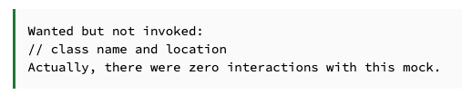

# Baeldung Examples

## Matching Null With Mockito

Bu kısa eğitimde, bir methoda argüman olarak "null" geçilip geçilmediğini kontrol etmek için Mockito'yu kullanacağız.
Null'ı doğrudan eşleştirmeyi ve ArgumentMatchers kullanarak nasıl eşleştirileceğini göreceğiz.

Helper class'i gelen 2 String değeri concat edip bana geri döndürecek, yapacağı iş basit

```
public class Helper {
    String concat(String a, String b) {
        return a + b;
    }
}
```

Main class'ı içerisinde Helper class'ının concat methodunu yaratacağım ve içerisine bir string değer bir de null
geçeceğim

```
public class Main {
    Helper helper = new Helper();

    String methodUnderTest(){
        return helper.concat("Baeldung",null);
    }
}
```

Test class'ımı create edip içerisine mock'larımı create ediyorum

```
public class MainUnitTest {
    
    /* @InjectMocks, Mockito'nun bir özelliğidir ve bir sınıfta, diğer sınıflardaki mock nesnelerini otomatik olarak
    enjekte etmek için kullanılır. Bu anotasyon, test edilecek sınıfın örneğini oluştururken diğer sınıflardaki mock
    nesnelerini otomatik olarak enjekte eder.*/
    
    @InjectMocks
    Main main;

    @Mock
    Helper helper;

    @BeforeEach
    void openMocks(){
        MockitoAnnotations.openMocks(this);
    }
}
```

@Mock kullanarak bir Helper nesnesini mock'ladık. Daha sonra, @InjectMocks kullanarak bu Helper nesnesini Main
sınıfımıza enjekte ettik. Son olarak, Mockito anotasyonlarını etkinleştirmek için MockitoAnnotations.openMocks()
yöntemini çağırdık.

```
    @Test
    void whenMethodUnderTest_thenSecondParameterNull(){
        main.methodUnderTest();
        verify(helper).concat("Baeldung",null);
    }
```

main.methodUnderTest methodu Baeldung ve null parametrelerini Helper class'ina geçmektedir.

Mockito.verify() yöntemini kullanarak concat() metoduna geçen argüman değerlerinin beklenen değerler olduğunu kontrol
edebiliriz. Eğer bir tane argümanı değiştirirsek test fail hale gelir

Şimdi Mockito'nun ArgumentMatchers'ını kullanarak iletilen değerleri kontrol edeceğiz. İlk argument örneğimizde önemsiz
olduğundan any() eşleştiriciyi kullanacağız: böylece herhangi bir giriş geçerli olacaktır. İkinci parametrenin null olup
olmadığını kontrol etmek için ise basitçe isNull() kullanabiliriz.

```
    @Test
    void whenMethodUnderTest_thenSecondParameterNullWithMatchers(){
        main.methodUnderTest();
        verify(helper).concat(any(),isNull());
    }
```

Bu örnekte, Mockito ile bir methoda iletilen argümanın null olup olmadığını nasıl doğrulayacağımızı öğrendik. Bunu hem
kesin değerleri kontrol ederek hem de ArgumentMatchers kullanarak yaptık.

## Asserting Equality on Two Classes Without an equals() Method

Bazen bir sınıfta equals() yöntemini geçersiz kılma yeteneğine sahip olamayabiliriz. Bununla birlikte, yine de bir
nesneyi başka bir nesneyle karşılaştırarak aynı olup olmadığını kontrol etmek isteyebiliriz.

Bu bölümde, equals() yöntemini kullanmadan iki nesnenin eşitliğini test etmek için birkaç yol öğreneceğiz.

Address isminde bir class create ediyorum;

```
public class Address {
    private Long id;
    private String city;
    private String street;
    private String country;
    
    public Address(Long id, String city, String street, String country) {
        this.id = id;
        this.city = city;
        this.street = street;
        this.country = country;
    }

    //Getter & Setter
}
```

Person isminde bir class create ediyorum;

```
public class Person {
    private Long id;
    private String firstName;
    private String lastName;
    private Address address;
    
    public Person(Long id, String firstName, String lastName) {
        this.id = id;
        this.firstName = firstName;
        this.lastName = lastName;
    }

    public Person(Long id, String firstName, String lastName, Address address) {
        this.id = id;
        this.firstName = firstName;
        this.lastName = lastName;
        this.address = address;
    }

    //Getter & Setter
}
```

Sınıflarda equals() methodunu override etmedik. Dolayısıyla, eşitliği belirlerken Object sınıfında verilen varsayılan
implementasyon çalıştırılır. Başka bir deyişle, Java, eşitlik kontrolünde iki referansın aynı nesneye işaret edip
etmediğini kontrol eder.

```
public class EqualityTest {
    Person expected = new Person(1L, "Jane", "Doe");
    Person actual = new Person(1L, "Jane", "Doe");

    @Test
    void shouldClassEquals() {
        assertTrue(new ReflectionEquals(expected).matches(actual));
    }
}
```

**ReflectionEquals** sınıfı 2 person'in equals olup olmadığını kontrol edecektir

```
    @Test
    void shouldClassEquals() {
        Person expected = new Person(1L,"Jane","Doe");
        Address address1 = new Address(1L,"New York","Sesame Street","United States");
        expected.setAddress(address1);

        Person actual = new Person(1L,"Jane","Doe");
        Address address2 = new Address(1L,"New York","Sesame Street","United States");
        actual.setAddress(address2);

        assertTrue(new ReflectionEquals(expected,"address").matches(actual));
        assertTrue(new ReflectionEquals(expected.getAddress()).matches(actual.getAddress()));
    }
```

Yukarıda yazdığım testte ise Person'a bir address atadım ve iki nesnede de aynı değerleri kullandım. Testim başarılı

## Resolving Mockito Exception: Wanted But Not Invoked

Bu bölümde, Mockito kullanırken karşılaşabileceğimiz yaygın bir hatayı ele alacağız. Hata mesajı şu şekildedir:



Helper class'ımı tekrar create ediyorum;

```
public class Helper {
    String getBaueldungString(){
        return "Baeldung";
    }
}
```

Şimdi Main sınıfımızı oluşturalım. Sınıf düzeyinde bir Helper instance'i bildiriyoruz. Birim test sırasında bu örneği
mocklamak isteyeceğiz: Bunun da ötesinde, bir Integer'i parametre olarak kabul eden ve şunu döndüren bir yöntem
tanımladık:

- Eğer Integer değeri 5'ten büyükse, getBaeldunString() yöntemine yapılan çağrının sonucunu döndürür.
- Eğer Integer değeri 5'ten küçük veya ona eşitse, bir sabit değeri döndürür.

```
public class Main {
    Helper helper = new Helper();

    String methodUnderTest(int i){
        if (i>5)
            return helper.getBaueldungString();
        return "Hello";
    }
}
```

Metodumuz için bir birim testi yazmaya çalışalım. @Mock anotasyonunu kullanarak bir mock Helper oluşturacağız.
MockitoAnnotations.openMocks() yöntemini çağırarak Mockito anotasyonlarını etkinleştireceğiz. Test yönteminde,
methodUnderTest() yöntemini 7 parametresiyle çağıracak ve getBaeldungString() yöntemine yönlendirilip
yönlendirilmediğini kontrol edeceğiz:

```
public class MainTest {
    @Mock
    Helper helper;
    Main main = new Main();

    @BeforeEach
    void setUp() {
        openMocks(this);
    }

    @Test
    void givenValueUpperThan5_WhenMethodUnderTest_ThenDelegatesToHelperClass() {
        main.methodUnderTest(7);
        verify(helper).getBaueldungString();
    }
}
```

Şimdi testi çalıştıralım;

```
Wanted but not invoked:
helper.getBaeldungString();
-> at com.baeldung.wantedbutnotinvocked.Helper.getBaeldungString(Helper.java:6)
Actually, there were zero interactions with this mock.
```

Sorun, bir Main nesnesi oluşturmak için constructor'ı çağırmamızdadır. Bu nedenle, Helper instance'i new() çağrısıyla
oluşturuldu. Sonuç olarak, mock yerine gerçek bir Helper nesnesi kullanıyoruz. Sorunu düzeltmek için Main nesnesi
oluşturduğumuz yerin üzerine @InjectMocks eklememiz gerekiyor: MainTest içerisinde;

```
    @InjectMocks
    Main main;
```

Ayrıca, Main class içerisinde ki methodUnderTest() methodunun herhangi bir noktasında mocklanmış örneği gerçek bir
nesneyle değiştirirsek yine aynı sorunla karşılaşacağız.

```
    String methodUnderTest(int i){
        helper = new Helper();
        if (i>5)
            return helper.getBaueldungString();
        return "Hello";
    }
```

Özetle burada dikkat etmemiz gereken iki nokta var:

- Mock'lar doğru bir şekilde oluşturulmalı ve enjekte edilmelidir.
- Mock'lar hiçbir noktada başka nesnelerle değiştirilmemelidir.

Şimdi yeni bir unit test yazacağız. methodUnderTest() yöntemine 3 argümanını geçirmenin getBaeldungString() yöntemine
bir çağrıyla sonuçlandığını kontrol edeceğiz:

```
    @Test
    void givenValueLowerThan5_WhenMethodUnderTest_ThenDelegatesToGetBaeldungString(){
        main.methodUnderTest(3);
        verify(helper).getBaueldungString();
    }
```

Testi çalıştırıyorum;

```
Wanted but not invoked:
helper.getBaeldungString();
-> at com.baeldung.wantedbutnotinvocked.Helper.getBaeldungString(Helper.java:6)
Actually, there were zero interactions with this mock.
```

Bu sefer hata mesajını dikkatlice okuyalım. Hata mesajı, mock ile etkileşime geçmediğimizi söylüyor. Şimdi metodun
spesifikasyonunu kontrol edelim: 3, 5'ten küçük olduğu için methodUnderTest() getBaeldungString() yöntemine yönlendirmek
yerine bir sabit değer döndürür. Bu nedenle, testimiz spesifikasyona aykırıdır ve fail verir

Bu bölümde, etkileşimde bulunmadan Mockito.verify() yöntemini çağırdık ve bir hata aldık. Mock'ları doğru bir şekilde
enjekte etmemiz ve kullanmamız gerektiğini belirttik. Ayrıca, bu hatanın tutarsız bir testle ortaya çıktığını gördük.

## Mock a URL Connection in Java

UrlConnection, URL'lerden veri almak ve veri göndermek gibi web üzerindeki kaynaklarla çalışmak için bir arayüz sağlayan
soyut bir sınıftır.

Unit testleri yazarken, gerçek ağ istekleri yapmadan network connectivity'i ve responses'ları taklit etmenin bir yolunu
genellikle isteyeceğiz.

Bu bölümde, Java'da bir URL Connection'ı nasıl mocklayabileceğimiz konusunda birkaç yönteme bakacağız.

```
public class UrlFetcher {
    private URL url;

    public UrlFetcher(URL url) {
        this.url = url;
    }

    public boolean isUrlAvailable() throws IOException {
        return getResponseCode() == HttpURLConnection.HTTP_OK;
    }

    private int getResponseCode() throws IOException {
        HttpURLConnection conn = (HttpURLConnection) this.url.openConnection();
        return conn.getResponseCode();
    }
}
```

Demonstrasyon amaçlı olarak, verilen adres için URL'nin kullanılabilir olup olmadığını belirten isUrlAvailable() adında
bir genel yöntemimiz bulunmaktadır. Dönüş değeri, aldığımız HTTP response iletişimindeki durum koduna dayanmaktadır.

Genellikle mock kullanmak için bir 3rd party test framework kullanmak ilk seçenektir. Ancak bazı durumlarda bu uygun
bir seçenek olmayabilir.

Neyse ki, URL sınıfı, bir bağlantı yapabilen özel bir custom handler mekanizması sunar. Bu handler'i kullanarak,
**dummy** bir bağlantı nesnesi ve response döndüren özel bir handler sağlayabiliriz.

```
public class MockHttpURLConnection extends HttpURLConnection {
    protected MockHttpURLConnection(URL url) {
        super(url);
    }

    @Override
    public int getResponseCode() throws IOException {
        return responseCode;
    }
    
    public void setResponseCode(int responseCode){
        this.responseCode = responseCode;
    }

    @Override
    public void disconnect() {
    }

    @Override
    public boolean usingProxy() {
        return false;
    }

    @Override
    public void connect() throws IOException {
    }
}
```

Gördüğümüz gibi, bu sınıf, HttpURLConnection sınıfının minimal bir implementasyonla basit bir genişletme yapmaktadır.
Burada önemli olan kısım, HTTP response kodunu ayarlamak ve almak için bir mekanizma sağlamamızdır.

Sonraki adımda, yeni oluşturduğumuz MockHttpURLConnection nesnesini döndüren bir mock stream handler'a ihtiyacımız
olacak.

```
public class MockStreamHandler extends URLStreamHandler {

    private final MockHttpURLConnection mockHttpURLConnection;

    public MockStreamHandler(MockHttpURLConnection mockHttpURLConnection) {
        this.mockHttpURLConnection = mockHttpURLConnection;
    }

    @Override
    protected URLConnection openConnection(URL url) throws IOException {
        return this.mockHttpURLConnection;
    }
}
```

Son olarak, yeni oluşturduğumuz stream handler'ı döndürecek bir handler stream factory sağlamamız gerekiyor.

```
public class MuckURLStreamHandlerFactory implements URLStreamHandlerFactory {
    private MockHttpURLConnection mockHttpURLConnection;

    public MuckURLStreamHandlerFactory(MockHttpURLConnection mockHttpURLConnection) {
        this.mockHttpURLConnection = mockHttpURLConnection;
    }

    @Override
    public URLStreamHandler createURLStreamHandler(String protocol) {
        return new MockStreamHandler(this.mockHttpURLConnection);
    }
}
```

Artık support sınıflarımız hazır olduğuna göre, ilk unit testimizi yazabiliriz:

```
public class UrlFetcherTest {
    private static MockHttpURLConnection mockHttpURLConnection;

    @BeforeAll
    static void setup(){
        mockHttpURLConnection = new MockHttpURLConnection(null);
        URL.setURLStreamHandlerFactory(new MockURLStreamHandlerFactory(mockHttpURLConnection));
    }

    @Test
    void givenMockedUrl_whenRequestSent_thenIsUrlAvailableTrue() throws IOException {
        mockHttpURLConnection.setResponseCode(HttpURLConnection.HTTP_OK);
        URL url = new URL("https://www.baeldung.com/");

        UrlFetcher urlFetcher = new UrlFetcher(url);
        assertTrue(urlFetcher.isUrlAvailable());
    }
}
```

Testimizin temel kısımlarını birlikte gözden geçirelim:

- İlk olarak, setUp() yöntemini tanımlayarak başlarız. Bu yöntemde MockHttpURLConnection'u oluşturur ve bunu
  setURLStreamHandlerFactory() statik methodu aracılığıyla URL sınıfına enjekte ederiz.
- Şimdi testin ana kısmını yazmaya başlayabiliriz. İlk olarak, mockHttpURLConnection değişkenimiz üzerinde
  setResponseCode() yöntemini kullanarak beklenen response kodunu ayarlamamız gerekiyor.
- Ardından yeni bir URL oluşturabilir ve UrlFetcher'ımızı oluşturabiliriz. Son olarak, isUrlAvailable() yöntemi üzerinde
  assert işlemi yapabiliriz.

Testi çalıştırdığımızda, web adresinin kullanılabilir olup olmamasına bağlı olmaksızın her zaman aynı davranışı elde
etmeliyiz. Bu durumu sağlamak için Wi-Fi veya ağ bağlantınızı kapatarak ve testlerin hala tamamen aynı şekilde
davrandığını kontrol etmektir.

Bu çözüm işe yarasa da ve 3rd party library'lere bağımlı olmasa da, birkaç nedenle biraz zahmetli olabilir.

İlk olarak, birkaç mock destek sınıfı oluşturmamız gerekiyor ve test ihtiyaçlarımız karmaşık hale geldikçe mock
nesnelerimiz de daha karmaşık hale gelecektir. Örneğin, farklı response body'lerini mocklamamız gerekiyorsa.

Benzer şekilde, testimizde statik yöntem çağrıları ile URL sınıfının yeni örneklerini karıştırdığımız önemli bir kurulum
aşaması var. Bu durum kafa karışıklığına yol açabilir ve ileride beklenmedik sonuçlara neden olabilir.

Şimdi testimizi tanımlayabiliriz:

```
public class UrlFetcherTest {
    @Test
    void givenMockedUrl_whenRequestSent_thenIsUrlAvailableFalse() throws IOException {
        HttpURLConnection mockHttpUrlConnection = mock(HttpURLConnection.class);
        when(mockHttpUrlConnection.getResponseCode()).thenReturn(HttpURLConnection.HTTP_NOT_FOUND);

        URL mockUrl = mock(URL.class);
        when(mockUrl.openConnection()).thenReturn(mockHttpUrlConnection);

        UrlFetcher urlFetcher = new UrlFetcher(mockUrl);
        assertFalse(urlFetcher.isUrlAvailable());
    }
}
```

Bu sefer Mockito'nun mock yöntemini kullanarak bir mock URL bağlantısı oluşturuyoruz. Daha sonra mock nesneyi
yapılandırarak, openConnection yöntemi çağrıldığında bir mock HTTP URL bağlantısı döndürmesini sağlıyoruz. Tabii ki,
mock HTTP bağlantımız zaten bir yanıt kodu içeriyor.

Bu testi çalıştırdığımızda, Mockito'nun 4.8.0 sürümünden önceki sürümlerinde muhtemelen bir hata alacağımızı belirtmek
gerekir.

## Mocking Private Fields With Mockito

Bu bölümde, Mockito ile private field'leri nasıl mocklayabileceğimizi öğreneceğiz. Mockito, genellikle Java'da mock
nesneler oluşturmak için JUnit ile birlikte kullanılan popüler bir mock framework'udur. Mockito, private field'leri
doğal olarak mocklama desteği sağlamaz.

Ancak, Mockito ile private field'leri mocklamak için farklı yaklaşımlar kullanabiliriz. Birkaç örneğe bakalım.

```
public class MockService {
    private final Person person = new Person("John Doe");

    public String getName(){
        return person.getName();
    }
}
```

MockService sınıfının Person türünde person adında bir private field'i vardır. Ayrıca, person'ın adını döndüren
getName() adında bir methodu bulunur. Gördüğümüz gibi, person alanı için bir setter yöntemi yoktur. Bu nedenle, alanı
doğrudan ayarlayamayız veya alanın değerini değiştiremeyiz.

Bir sonraki adımda Person sınıfını oluşturacağız:

```
public class Person {
    private final String name;

    public Person(String name) {
        this.name = name;
    }

    public String getName() {
        return name;
    }
}
```

Person sınıfı, private bir name field'i ve field için bir getter yöntemi içerir.

Sonrasında test'imizi yazabiliriz;

```
public class MockServiceUnitTest {
    private Person mockedPerson;

    @BeforeEach
    void setUp(){
        mockedPerson = mock(Person.class);
    }
}
```

Person sınıfının bir örneğini oluşturur ve onu Mockito kullanarak mocklarız. Sonraki bölümlerde, bu mocklanmış örneği
kullanarak MockService sınıfının private field'ini değiştirmenin yollarına bakacağız.

private field'i ayarlamak için kullanabileceğimiz yollardan biri **Java Reflection API**'sini kullanmaktır. Bu yöntem,
ek bağımlılıklar gerektirmediği için iyi bir yöntemdir. Önce alanı erişilebilir hale getirebilir ve ardından alanın
değerini mocklanmış örneğe ayarlayabiliriz.

Bunu yapmak için aşağıdaki kodu inceleyelim:

```
public class MockServiceUnitTest {
    private Person mockedPerson;

    @BeforeEach
    void setUp() {
        mockedPerson = mock(Person.class);
    }

    @Test
    void givenNameChangedWithReflection_whenGetName_thenReturnName() throws Exception {
        Class<?> mockServiceClass = Class.forName("baeldung.mockingPrivateFieldsWithMockito.MockService");
        MockService mockService = (MockService) mockServiceClass.getDeclaredConstructor().newInstance();
        Field field = mockServiceClass.getDeclaredField("person");
        field.setAccessible(true);
        field.set(mockService,mockedPerson);

        when(mockedPerson.getName()).thenReturn("Jane Doe");
        assertEquals("Jane Doe",mockService.getName());
    }
}
```

MockService sınıfının sınıf nesnesini elde etmek için Class.forName() yöntemini kullanıyoruz. Ardından,
getDeclaredConstructor() yöntemini kullanarak MockService sınıfının bir instance'ini oluşturuyoruz.

Sonraki adımda, getDeclaredField() yöntemini kullanarak MockService sınıfının person field'ini elde ediyoruz.
setAccessible() methodunu kullanarak alanı erişilebilir hale getiriyor ve set() yöntemini kullanarak field'in değerini
mocklanmış instance'a ayarlıyoruz.

Son olarak, Person sınıfının getName() methodunu mocklayabilir ve MockService sınıfının getName() methodunu mocklanmış
değeri döndürmesi için test edebiliriz.

Bir diğer yöntemde **ReflectionUtils**'i kullanmaktır

```
public class MockServiceUnitTest {
    private final Person mockedPerson = mock(Person.class);

    @Test
    void givenNameChangedWithReflectionUtils_whenGetName_thenReturnName() throws Exception {
        MockService mockService = new MockService();
        Field field = ReflectionUtils.findFields(
                        MockService.class,
                        f -> f.getName().equals("person"),
                        ReflectionUtils.HierarchyTraversalMode.TOP_DOWN).get(0);
        field.setAccessible(true);
        field.set(mockService,mockedPerson);

        when(mockedPerson.getName()).thenReturn("Jane Doe");
        assertEquals("Jane Doe",mockService.getName());
    }
}
```

ReflectionUtils.findFields() yöntemini kullanarak alanı alırız.

ReflectionUtils.findFields() methodu, MockService sınıfının sınıf nesnesini ve field'i bulmak için bir prefix alır.
Burada kullandığımız prefix, "person" adındaki alanı bulmaktır.

Ek olarak, HierarchyTraversalMode'u belirtmemiz gerekiyor. Bu, sınıf hiyerarşisi olduğunda ve hiyerarşideki field'i
bulmak istediğimizde önemlidir.

Bizim durumumuzda sadece bir sınıf olduğu için TOP_DOWN veya BOTTOM_UP modlarından herhangi birini kullanabiliriz.

SpringTest ile test edebilmek içinde gradle içerisine spring test dependency'lerini ekliyorum;

```
testImplementation("org.springframework:spring-test:6.0.10")
```

Spring-Test kullanarak yazılan test;

```
    @Test
    void givenNameChangedWithReflectionTestUtils_whenGetName_thenReturnName() {
        MockService mockService = new MockService();
        ReflectionTestUtils.setField(mockService, "person", mockedPerson);

        when(mockedPerson.getName()).thenReturn("Jane Doe");
        assertEquals("Jane Doe",mockService.getName());
    }
```

Burada, ReflectionTestUtils.setField() yöntemini kullanarak private field'i ayarlarız. İçeriden, bu da Java Reflection
API'sini kullanarak alanı ayarlar, bir sürü boilerplate code silinmiş olur

Bu makalede, Mockito kullanarak private field'leri nasıl mocklayabileceğimizi farklı yolları inceledik. Java Reflection
API'sını, JUnit 5'i ve Spring Test'i kullanarak özel alanları mocklamayı keşfettik.

## Mocking a Singleton With Mockito

Bu bölümde, Mockito kullanarak bir singleton'ı nasıl mock'layacağımızı keşfedeceğiz. Bir singleton kullanan küçük bir
proje oluşturacak ve ardından o singleton'ı kullanan sınıf için bir testin nasıl yazılacağını inceleyeceğiz.

In-memory caching yöneten bir singleton olan CacheManager'ı oluşturuyoruz;

```
public class CacheManager {
    private final HashMap<String, Object> map;

    private CacheManager() {
        map = new HashMap<>();
    }

    private static CacheManager instance;

    public static CacheManager getInstance() {
        if (instance == null) {
            instance = new CacheManager();
        }
        return instance;
    }

    public <T> T getValue(String key, Class<T> clazz) {
        return clazz.cast(map.get(key));
    }

    public Object setValue(String key, Object value) {
        return map.put(key, value);
    }
}
```

Basit tutmak için, multi-threaded senaryolarını dikkate almadan daha basit bir singleton uygulaması kullandık.

ProductService class'ını create ediyorum;

```
public class ProductService {
    private final ProductDAO productDAO;
    private final CacheManager cacheManager;

    public ProductService(ProductDAO productDAO) {
        this.productDAO = productDAO;
        this.cacheManager = CacheManager.getInstance();
    }

    public Product getProduct(String productName){
        Product product = cacheManager.getValue(productName,Product.class);
        if(product == null){
            product = productDAO.getProduct(productName);
        }
        return product;
    }
}
```

getProduct() yöntemi, önce değerin cache'te bulunup bulunmadığını kontrol eder. Bulunmuyorsa, product'ı almak için DAO'
yu çağırır.

getProduct() yöntemi için bir test yazacağız. Test, ürünün cache'de mevcut olduğunda DAO'ya çağrı olmadığından emin
olacak. Bu amaçla, cacheManager.getValue() methodu çağrıldığında bir product döndürmesini sağlamak istiyoruz.

Bir singleton instance'i, statik getInstance() yöntemi tarafından sağlandığından, mock'lanması ve farklı şekillerde
enjekte edilmesi gerekmektedir. Bunu yapmanın birkaç yoluna bakalım.

Bu class'ın ihtiyaçlarını karşılamak için Product interface'ini, ProductDAO interface'ini create ediyorum

```
public interface Product {
}

public interface ProductDAO {
    Product getProduct(String productName);
}
```

Bir çözüm yolu, ProductService'e enjekte edilmiş bir mock singleton CacheManager instance'ini kolayca eklemek için
başka bir constructor eklemektir:

```
    public ProductService(ProductDAO productDAO, CacheManager cacheManager) {
        this.productDAO = productDAO;
        this.cacheManager = cacheManager;
    }
```

Test'imi yazıyorum;

```
public class ProductServiceTest {
    @Test
    void givenValueExistsInCache_whenGetProduct_thenDAOIsNotCalled(){
        //given
        ProductDAO productDAO = mock(ProductDAO.class);
        CacheManager cacheManager = mock(CacheManager.class);
        Product product = new Product("product1","description");

        //when
        when(cacheManager.getValue(any(),any())).thenReturn(product);
        ProductService productService = new ProductService(productDAO,cacheManager);
        productService.getProduct("product1");

        verify(productDAO,times(0)).getProduct(any());
    }
}
```

Burada ki önemli noktalar;

- CacheManager'i mock'ladık ve yeni constructor'i kullanarak ProductService'e enjekte ettik.
- cacheManager.getValue() methodunu, çağrıldığında bir Product döndürmesi için mock ettik (stub).
- Son olarak, productService.getProduct() yöntemi çağrılırken productDao.getProduct() yönteminin çağrılmadığını
  doğruladık.

Burada product class'i 2 tane argüman aldığı için interface olarak yarattığım Product'i class'a çevirip argümanları
ekliyorum;

```
public class Product {
    private final String name;
    private final String description;

    public Product(String name, String description) {
        this.name = name;
        this.description = description;
    }
}
```

Bu yöntem işe yarasa da, bunu yapmanın önerilen bir yol olmadığını söyleyebiliriz. Test yazmak, sınıfımıza ek methodlar
veya constructor'lar eklememizi gerektirmemelidir. Şimdi, test edilen kodu değiştirmeden başka bir yol daha
inceleyelim.

Singleton Cachemanager'i mocking'lemenin başka bir yolu, static CacheManager.getInstance() yöntemini mocklamaktır.
Mockito-core, varsayılan olarak static methodları mock'lamayı desteklemez. Bununla birlikte, Mockito-inline uzantısını
etkinleştirerek static yöntemleri mocklayabilirsiniz.

Gradle dependency;

```
testImplementation ("org.mockito:mockito-inline:5.2.0")
```

Yeni mockito-inline test'im

```
    @Test
    void givenValueExistsInCache_whenGetProduct_thenDAOIsNotCalled_mockingStatic() {
        ProductDAO productDAO = mock(ProductDAO.class);
        CacheManager cacheManager = mock(CacheManager.class);
        Product product = new Product("product1", "description");

        try (MockedStatic<CacheManager> cacheManagerMock = mockStatic(CacheManager.class)){
            cacheManagerMock.when(CacheManager::getInstance).thenReturn(cacheManager);
            when(cacheManager.getValue(any(),any())).thenReturn(product);

            ProductService productService = new ProductService(productDAO);
            productService.getProduct("product1");

            verify(productDAO,times(0)).getProduct(any());
        }
    }
```

Bu koddaki önemli noktalar:

- mockStatic() methodunu kullanarak CacheManager sınıfının mocked bir versiyonunu oluşturduk.
- Ardından, getInstance() methodunu mocked yaptıktan sonra mocked CacheManager instance'imizi döndürdük.


