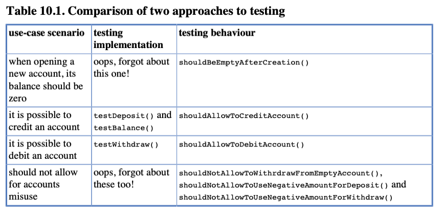

# Chapter 10 Maintainable Tests

Testler, Production kodumuzu desteklemede ve belgelemede kritik bir rol oynar. Bu bölümde, testlerin bakım
yapılabilirliğiyle ilgili çeşitli yönleri tartışacağız.

## 10.1. Test Behaviour, not Methods

Bu bölümde tartışacağımız kural çok basittir: "Metodları değil davranışı test edin!" Bu, testler yazarken SUT'yi
sorumlulukları açısından düşünmemiz gerektiği anlamına gelir - client'i ileolan sözleşme açısından düşünmemiz gerektiği
anlamına gelir. SUT'nin implementasyonundan soyutlanmalıyız, çünkü bu ikincil öneme sahiptir. Önemli olan, SUT'nin
tasarlandığı gereksinimleri karşılamasıdır. Ve bunun gerçekten olduğundan emin olmak için bu gereksinimleri test
senaryoları şeklinde yazmalıyız. Gereksinimler, gerçek uygulama hakkında hiçbir şey bilmez ve testlerimiz de
bilmemelidir.

Metodlar yerine davranışları test etme kuralının basit görünmesine rağmen, ne yazık ki sık sık bu basit kuralın ihlal
edildiğini görüyorum. Bu da bana, sonuçta tartışmaya değer olduğunu düşündürüyor.

Aşağıda, BankAccount sınıfının optimize edilmemiş bir test örneği, aşağıda sunulmaktadır. Her test methodu,
BankAccount'in genel API'sinin bir methodunu test etmeye çalışır: getBalance(), deposit() ve withdraw().
Bu bölümün ana konusunu daha iyi sunmak için, tüm testleri sınırlı sayıda test senaryosuna kırpma kararı aldım.
Gerçekte, daha fazla test senaryosu kullanır ve muhtemelen parametreli testler kullanırdım.

### One test method per one production code method

```
public class BankAccountTest {

    private final BankAccount bankAccount = new BankAccount();

    @Test
    void testBalance() { (1)
        bankAccount.deposit(200);
        assertEquals(200, bankAccount.getBalance());
    }

    @Test
    void testCredit() { (2)
        bankAccount.deposit(100);
        assertEquals(100, bankAccount.getBalance());
        bankAccount.deposit(200);
        assertEquals(300, bankAccount.getBalance());
    }

    @Test
    void testDebit() { (3)
        bankAccount.deposit(100);
        bankAccount.withdraw(30);
        assertEquals(70, bankAccount.getBalance());
        bankAccount.withdraw(20);
        assertEquals(50,bankAccount.getBalance());
    }
}
```

1 - getBalance() methodu için bir test. Dikkat edin, bu test aynı zamanda deposit() methoduni de kullanır.

2 - deposit() methodu için bir test. Ayrıca getBalance() methodunu çağırır.

3 - withdraw() methodu için bir test. Benzer şekilde getBalance() methodunu çağırır.

Yukarıda gösterdiği gibi, method düzeyinde unit testlerde izolasyon mümkün değildir. Her test methodu,
SUT'nin çeşitli methodlarını çağırır - yalnızca test etmek istedikleri methodu değil. Bunun böyle olması gerekiyor çünkü
deposit() methodunu getBalance() methodunu kullanmadan test edemezsiniz ve hesabın bakiyesini kontrol etmek
gerekmektedir.

Bu yaklaşımın diğer bazı sorunları da vardır. Bunları listeleyelim:

- Eğer test methodlarından herhangi biri başarısız olursa, o zaman bir hata mesajı ("testDeposit başarısız oldu" gibi)
  bize hemen hangi sistem altında test edilen gereksinimin karşılanmadığını anlamak için yeterli bilgi vermeyebilir (bu,
  client açısından gerçekten önemli olduğunda).
- SUT'un (Sistem Altı Testi) her bir methodu birden fazla kullanıcı hikayesinde yer aldığı için "one test method per
  production code method" modelini korumak çok zordur. Örneğin, mevcut kodlara, bir hesap oluşturulduktan sonra
  bakiyenin sıfır olduğunu doğrulayan bir test nasıl ekleyebiliriz? testBalance() methodunu ek bir doğrulama ile
  geliştirebiliriz, ancak bu durum birden fazla nedenle başarısız olma olasılığını artırır. Bu iyi bir durum değildir ve
  test başarısız olduğunda karışıklığa yol açar.
- Test methodları, SUT'un yeni gereksinimleri yansıtacak şekilde geliştirdikçe genellikle artar.
- Bazen belirli bir senaryoda hangi SUT methodlarının gerçekten test edildiğini belirlemek zor olabilir çünkü birden
  fazla method kullanılıyor olabilir.
- Test methodları birbirleriyle örtüşebilir - örneğin, testBalance(), testDeposit() ve testWithdraw() tarafından test
  edilecek olanları tekrar eder. Aslında, testBalance()'ın neden var olduğunu söylemek zor - muhtemelen bir
  geliştirici, "getBalance() methodu için bir teste sahip olmalıyım" hissine kapıldığı için eklemiştir.

Bu tür test kodlarını gördüğümde, kesin olarak SUT'nin zaten implemente edildikten sonra yazıldığını anlarım. Testin
yapısı, SUT kodunun yapısını (implementasyonu) yansıtır ve bu yaklaşımın açık bir işaretidir. Gözlemlediğim kadarıyla,
bu tür testler nadiren SUT'nin gerektirdiği her şeyi kapsar. SUT'nin implementasyonu dikkate alındığında açıkça kontrol
edilmesi gerekenleri kontrol eder, ancak daha fazlasını test etmeye çalışmaz (böylece yukarıda listelenen bazı
ikilemleri çözmekten kaçınırlar).

İlginç olan, bu testin, BankAccount sınıfının geçerli bir implementasyonunda %100 code coverage'a ulaşmak için yeterli
olmasıdır. Bu, code coverage'a güvenmemeniz için bir başka neden daha

Daha iyi bir yaklaşım var mı? Evet, ve gerçekten güzel olan şey, herhangi bir ekstra çalışma gerektirmemesidir. Tek
yapmamız gereken SUT'nin davranışına (sorumluluklarını yansıtması) odaklanmak ve bunu testler şeklinde yazmaktır.
Aşağıdaki iki örnekte bu yaklaşımın bir örneği verilmiştir. Görüldüğü gibi, bazı yöntemler önceki yaklaşımla aynıdır,
ancak test bütünüyle tamamen farklı bir zihniyetle oluşturulmuş ve SUT'nin sorumluluklarının daha geniş bir kısmını
kapsamaktadır.

```
public class BankAccountTest {
    private final BankAccount bankAccount = new BankAccount();

    @Test
    void shouldBeEmptyAfterCreation() { (1)
        assertEquals(0,bankAccount.getBalance());
    }

    @Test
    void shouldAllowToCreditAccount() { (2)
        bankAccount.deposit(100);
        assertEquals(100,bankAccount.getBalance());
        bankAccount.deposit(100);
        assertEquals(200,bankAccount.getBalance());
    }

    @Test
    void shouldAllowToDebitAccount(){ (3)
        bankAccount.deposit(100);
        bankAccount.withdraw(40);
        assertEquals(60,bankAccount.getBalance());
        bankAccount.withdraw(30);
        assertEquals(30,bankAccount.getBalance());
    }
}
```

1 - getBalance() methodu için bir test bulunmamaktadır, çünkü doğru çalışması diğer testler tarafından doğrulanmaktadır.

2 - Bu, önceki testDeposit() methoduyla aynıdır, tek farkı method adıdır ve daha bilgilendiricidir.

3 - Yukarıdaki gibi - testWithdraw() methoduyla aynıdır, ancak daha iyi bir isimlendirme yapılmıştır.

```
    @Test
    void shouldNotAllowToWithdrawFromEmptyAccount(){ (1)
        // implementation omitted
    }

    @Test
    void shouldNotAllowToUseNegativeAmountForWithdraw(){ (2)
        // implementation omitted
    }

    @Test
    void shouldNotAllowToUseNegativeAmountForDeposit() { (3)
        // implementation omitted
    }
```

Yeni methodlar eklendi. Bu mümkün oldu çünkü developer, SUT'nin sorumluluğu açısından düşünüyordu.

BankAccountTest test sınıfının iki versiyonu, test yöntemlerinin adlandırılması konusunda önemli farklılıklar
göstermektedir. İyi test methodu adları, doğruladıkları senaryo hakkında bilgi içerir. Bu konu,

Tablo 10.1, her iki yaklaşımla neyin test edildiğini ve nasıl test edildiğini karşılaştırmaktadır.



sadece uygulamayı test ederken, senaryoların yalnızca bir alt kümesi doğrulanır, test methodları birbirleriyle örtüşür
ve her test methodu için tüm olası senaryoları içerecek şekilde büyümeye meyillidir. Anahtar, test yöntemlerini mini
kullanıcı hikayeleri gibi düşünmektir: Her biri, client açısından önemli bir işlevin düzgün çalıştığından emin
olmalıdır.

Bu nedenle, genel bir kural olarak, uygulamayı unutun. Gereksinimlere odaklanın. TDD size böyle kodlama yapmayı daha
kolay hale getirebilir.

## 10.2. Complexity Leads to Bugs

Testlerinize karmaşıklık eklemeyin! If yapıları, switch ifadeleri veya karar verme süreçleri gibi herhangi bir
karmaşıklık eklemeyin. Aksi takdirde, test sonuçlarının production kodunun mantıksal kalitesi ve test kodunun mantıksal
kalitesi gibi iki faktör tarafından aynı anda etkilendiği bir durumda bulabilirsiniz kendinizi. Bu fazla karmaşıklık
demektir.

Herhangi bir test başarısız olduğunda, hatanın production kodunda mı yoksa test kodunda mı olduğunu keşfetmeniz
gerekmektedir. Daha kötüsü, testlerin hatalı production kodundaki hataları yanlışlıkla düzelterek başarılı olması
mümkündür. (Evet, bazen iki yanlış bir doğru yapar!) Bu ciddi bir tehlikedir.

Test kodunuzda mantık kullanarak yapacağınız şeyleri kaybetmeniz de bir diğer noktadır. Unutmayın, yapmanız gereken
production kodun doğruluğunu test etmektir. Gerekenden daha zor hale getirmeyin.

## 10.3. Follow the Rules or Suffer

Bu bölümdeki iki alıntı, iyi tasarım ilkelerine atıfta bulunan ve ihlal edilmesiyle tanınan iki ünlü ilkeye işaret
etmektedir: "Tell, Don’t Ask!" (Söyle, Sorma!) ve "Law of Demeter". İlk ilke, bir nesnenin istediği her şeyi başkalarına
sorması gerektiğini, veriye dayalı olarak iş yapmak yerine diğer nesnelere iş yapmalarını istemesi gerektiğini belirtir.
İkinci ilke ise nesnenin hangi nesnelerle konuşabileceğini belirler.

Bu bölüm, bu iki kuralı ihlal ettiğinizde ne olduğuna dair bir örnek vermektedir.

## 10.3.1. Real Life is Object-Oriented

Hayal edin, bir taksiye biniyorsunuz. "Havaalanına lütfen!" diyorsunuz ve şoför başını sallar. Şimdi, oraya varmak için
ne kadar süreceğini öğrenmek istiyorsunuz. Hangi soruyu sormak istersiniz:

1 - "Ne kadar süreceğini öğrenebilir miyim?"

2 - Lütfen bana söyleyin (böylece matematiği kendim yapabilirim):

    a - Havaalanı ne kadar uzakta?
    b - Buradan havalimanına giderken ortalama hızınız nedir?

İkinci yaklaşımı kullanan birini duymadım. Gerçek hayatta oldukça akıllı davranırız, bilen insanlara sorarız (ya da en
azından sormalıyız) ve sadece sonuçla ilgileniriz (yani, sıkıcı detayları onlara bırakırız). O zaman dünyada neden
ikinci yaklaşımı izleyen bir kod yazıyoruz? Ama gerçekten yapıyoruz! Bunu sürekli görüyorum.

Finans alanından bir örneğe bakarak bu iki yaklaşım arasındaki farkı açıklamak istiyorum. Örnek şu şekildedir: Bir
client'in tüm varlıklarının değerini hesaplayan bir fonksiyon vardır. Bu fonksiyon, bir fon collection'ını parametre
olarak alır ve tek bir sayıyı output olarak döndürür. Her bir fon iki kayıttan oluşur. Bir client'in her kayıtta bir
dizi varlığı bulunur.

## 10.3.2. The Non-Object-Oriented Approach

Aşağıda bir Client sınıfının olası bir implementasyonu gösterilmektedir. Bazı detaylar atlanmıştır, böylece odak
noktamız client'in varlıklarının değerini hesaplama kısmına odaklanmaktır.

```
public class Client {
    private List<Fund> funds = new ArrayList<>();

    public void addFund(Fund fund){
        funds.add(fund);
    }

    public BigDecimal getValueOfAllFunds(){
        BigDecimal value = BigDecimal.ZERO;
        for (Fund f : funds){
            value = value.add(f.getCurrentValue().getValue().multiply(
                    new BigDecimal(
                            f.getRegisterX().getNbOfUnits()
                            + f.getRegisterY().getNbOfUnits()
                    )
            ));
        }
        return value;
    }
}
```

Bu Class'in ihtiyacı olan interface'ler;

```
public interface Fund {
    CurrentValue getCurrentValue();
    Register getRegisterX();
    Register getRegisterY();
}

public interface CurrentValue {
    BigDecimal getValue();
}

public interface Register {
    int getNbOfUnits();
}
```

Yukarıda gösterildiği gibi, sonucu elde etmek için bir client'in bazı karmaşık hesaplamalar yapması gerekmektedir. Her
fon için şunları yapması gerekmektedir:

* f.getCurrentValue().getValue() şeklinde mevcut fon değerini almak için iki adımlık bir süreç yapmanız gerekmektedir.
  Fund, gerçek değeri içeren CurrentValue nesnesini döndürür.
* bu değeri her iki kayıttaki birim sayısıyla çarpın.

Ardından, tüm fonlar için elde edilen sonuçlar toplanarak nihai miktar elde edilmelidir.

Eğer nesne tabanlı programlamaya gerçekten önem veriyorsanız, bu bölümün başında bahsedilen ilkelerin her ikisini de
ihlal eden kodu yukarıda fark etmişsinizdir:

* "Tell, Dont Ask!" ilkesi ihlal edilmiştir, Client sınıfı, istenen sonuçları elde etmek için diğer nesnelere doğrudan
  veri sormak yerine, onlara gerekli işlemleri gerçekleştirmelerini söylemek yerine veri talep etmektedir.
* Gerçekten de, "Law of Demeter" kodda ihlal edilmiş gibi görünmektedir. Client sınıfı, fonların friend'leri olan
  Register ve CurrentValue ile konuşarak (erişerek), başkalarının friend'leri ile konuşmaktadır.

Bu durum bize ciddi sorunlar yaşadığımızı açıkça gösteriyor. Client, aslında sadece sahip oldukları her bir fonun
değeriyle ilgilenmesi gerekirken her şey hakkında her şeyi biliyormuş gibi görünmektedir. Fonların iç yapısının
ayrıntıları tamamen onlardan gizlenmeliyken, bu durum gerçekleşmemektedir. Bu gözlem üzerine, bu örnekte kullanılan
tiplerin bilgi gizleme konusunda ciddi bir sorunu olduğunu söyleyebiliriz: İç tasarımlarını ortaya koyuyorlar. Bu,
programlamada iyi uygulama normlarına aykırıdır ve kod değişiklikleri gerektiğinde sorunlara yol açacaktır.

...ancak bu tür bir kodun asıl sorunu... çalışıyor olmasıdır! Elde edilen sonuçlar doğrudur. Bu kod gerçekten yapması
gereken hesaplamaları gerçekleştirir. Bu durum insanları, kodun kendisinin de doğru olduğuna sonuç çıkarmaya
yönlendirir. "Çalışıyorsa, dokunma!" yaklaşımının yaygın olması, böyle bir kodun olduğu gibi bırakılmasına neden olur.
Sorunlar genellikle kod değiştirilmesi gerektiğinde ortaya çıkar. İşte o zaman sorunlar başlar.

Öyleyse, şimdi test etmeye çalışacağız. Doğrulanması gereken birçok test durumu vardır (farklı fon sayısı ve
değerlerinin kombinasyonlarıyla), ancak amacımız için sadece bir tanesini seçmek yeterli olacaktır: İki fona sahip bir
client. Bu zor bir görev gibi görünmüyor, değil mi? Peki, biraz daha yakından bakalım.

Anladım, test için ihtiyacınız olan şey şunlar: her biri bir değere sahip olan Fund türünde iki adet test dublörü; bu
nedenle iki adet CurrentValue test dublörü de gerekecektir. Her bir fonun ayrıca iki adet Register'i bulunmaktadır, bu
yüzden başka dört test dublörü daha gerekecektir (Register türünde). Ve görünüşe göre, tüm bu test dublörleri stub
olacak. Sadece belirli değerleri döndürmelerini istediğim için onlara ihtiyacım var. Başka bir şey var mı? Hayır, bunlar
ana noktalar. O zaman başlayalım.

Tabloyu iki bölüme ayırabilirim, böylece daha iyi okunabilir olur:

### Test of the non-object-oriented Client class - setup

```
public class ClientTest {
    private final int NB_OF_UNITS_AX = 5; (1)
    private final int NB_OF_UNITS_AY = 1;
    private final int NB_OF_UNITS_BX = 4;
    private final int NB_OF_UNITS_BY = 1;
    private final BigDecimal FUND_A_VALUE = new BigDecimal(3);
    private final BigDecimal FUND_B_VALUE = new BigDecimal(2);

    @Test
    void totalValueShouldBeEqualToSumOfAllFundsValues() {
        Client client = new Client(); (2)
        Fund fundA = mock(Fund.class); (3)
        Fund fundB = mock(Fund.class);
        Register regAX = mock(Register.class);
        Register regAY = mock(Register.class);
        Register regBX = mock(Register.class);
        Register regBY = mock(Register.class);
        CurrentValue currentValueA = mock(CurrentValue.class);
        CurrentValue currentValueB = mock(CurrentValue.class);
        //...
    }
}
```

1 - Bu test için gereken bazı primitive değerler.

2 - Client SUT

3 - SUT Collaborator'ları - Direct ve Indirect

Testin devamını yazalım;

```
        when(fundA.getRegisterX()).thenReturn(regAX); (1)
        when(fundA.getRegisterY()).thenReturn(regAY);
        when(fundB.getRegisterX()).thenReturn(regBX);
        when(fundB.getRegisterY()).thenReturn(regBY);
        when(regAX.getNbOfUnits()).thenReturn(NB_OF_UNITS_AX);
        when(regAY.getNbOfUnits()).thenReturn(NB_OF_UNITS_AY);
        when(regBX.getNbOfUnits()).thenReturn(NB_OF_UNITS_BX);
        when(regBY.getNbOfUnits()).thenReturn(NB_OF_UNITS_BY);


        when(fundA.getCurrentValue()).thenReturn(currentValueA); (2)
        when(fundB.getCurrentValue()).thenReturn(currentValueB);
        when(currentValueA.getValue()).thenReturn(FUND_A_VALUE);
        when(currentValueB.getValue()).thenReturn(FUND_B_VALUE);

        client.addFund(fundA); (3)
        client.addFund(fundB);

        assertEquals(BigDecimal.valueOf((5 + 1) * 3 + (4 + 1) * 2),
                client.getValueOfAllFunds()); (4)
```

1 - Stub'lara ne döndürmeleri gerektiği konusunda talimat vermek için:

2 - Hmm, ilginç - bir stub'ı bir stub döndürmesi için talimat vermek...

3 - SUT'yi (System Under Test) istenen duruma ayarlamak - SUT'nin iki fona sahip olması gerekmektedir.

4 - Verification

Bu test çok uzun ve içinde rahatsız edici ve kafa karıştırıcı bazı özellikler bulunmaktadır:

* test sınıfı Funds ve Register'in iç ayrıntıları hakkında her şeyi bilmektedir.
    * hesaplama algoritmasını da bilmektedir.
    * hesaplamalarda yer alan tüm türlerin iç ayrıntılarını
* bu test için bir dizi test dublörü gerekmektedir.
* test methodlarının çoğunlukla stub'lara hangi değerleri döndürmeleri gerektiği konusunda talimatlar içerdiği.
* stub'lar stub döndürüyor.

Tüm bunlar, testin anlaşılması ve sürdürülmesini zorlaştırır ve aynı zamanda kırılgandır (fonların değer hesaplama
algoritmasında herhangi bir değişiklik yapılması durumunda yeniden yazılması gerekir).

Ve şimdi gerçekten kötü haberler: bunun gibi birden fazla teste ihtiyacımız var. 0 fon için bir test, 1 fon için bir
test ve 7 fon için bir test (pazarlama ekibinin 6'dan fazla fona yatırım yapmış kişilere ekstra bir bonus fikriyle
gelmesi gibi), bunların hepsi çeşitli fon değerleriyle çarpılacak. Ah, bu gerçekten çok zor olurdu.

### Do We Need Mocks?

Şu ana kadar verilen örnekte, Client sınıfının tüm işbirlikçileri için test dublörleri kullandık. Aslında, bazı test
kodu satırları, sınıflar yerine gerçek nesneleri kullansaydık tasarruf edebilirdik. Doğru, ancak diğer yandan:

* 5.5 bölümünde tartışıldığı gibi, bu sadece kısa vadeli bir çözüm olurdu.
* Gerçek hayatta, fon değerleri bir dış kaynaktan alınabilir (örneğin, bir web servisi), bu da test etmeyi çok daha zor
  hale getirebilir.

Bu nedenle, tüm işbirlikçileri test dublörleri ile değiştirmek mantıklı bir seçenek gibi görünmektedir.

## 10.3.3. The Object-Oriented Approach

Client sınıfının farklı bir implementasyonunu deneyelim ve bunu test etmek için gereken çabayı önceki örnekle
karşılaştıralım. Bu sefer Client'ımızı daha nesne yönelimli hale getirelim.

### The Client class - object-oriented version

```
public class Client {
    private List<Fund> funds = new ArrayList<>();
    
    public void addFund(Fund fund){
        funds.add(fund);
    }

    public BigDecimal getValueOfAllFunds(){
        BigDecimal value = BigDecimal.ZERO;
        for (Fund f : funds){
            value = value.add(f.getValue()); (1)
        }
        return value;
    }
}
```

1 - Bu sefer fon değerinin hesaplanması, Fund türünde bir getValue() metodunun içine kapsüllenmiştir. Client ise
sadece sonuçları toplar.

Bu sınıf için bir test yazmak oldukça basittir - bunun için sadece iki adet stub'a ihtiyacımız var (client'in sahip
olduğu her bir fon için bir adet, ve önceden belirlediğimize göre ilk test için client'in iki fona sahip olacağına
karar verdik)

### Test of the object-oriented Client class

```
public class ClientTest {
    private final static BigDecimal VALUE_A = new BigDecimal(9);
    private final static BigDecimal VALUE_B = new BigDecimal(2);

    @Test
    void totalValueShouldBeEqualToSumOfAllFundsValues() {
        Client client = new Client();
        Fund fundA = mock(Fund.class);
        Fund fundB = mock(Fund.class);
        when(fundA.getValue()).thenReturn(VALUE_A);
        when(fundB.getValue()).thenReturn(VALUE_B);

        client.addFund(fundA);
        client.addFund(fundB);

        assertEquals(VALUE_A.add(VALUE_B),client.getValueOfAllFunds());
    }
}
```

Wow, gerçekten de önce gördüklerimizden önemli ölçüde farklılık gösteriyor. Test öz, fonların iç ayrıntılarını
içermiyor. Nesne yönelimli yaklaşımı daha da ileriye taşıyarak, her bir sınıf için ayrı ayrı testler yazmamız
gerekecektir (örneğin, Fund arayüzünün uygulaması için bir test ve Register arayüzü için bir test gerekecektir), ancak
hepsi gerçekten, gerçekten basit olacaktır. Bu testlerin her biri sadece SUT'ye bağımlı olacaktır. Test kodu içinde
diğer sınıflarla ilgili herhangi bir bilgi kullanılmayacaktır. Bu, daha önce gördüğümüzden çok farklıdır.
Bir önceki testin nesne yönelimli olmayan bir versiyonunu tartışırken sorduğumuz soruya geri dönersek, 0, 1 ve 7 fon
için test yazmak zor olur muydu? Bu sefer cevap hayır olacaktır. Olmazdı.

## 10.3.4. How To Deal with Procedural Code?

Gerçekten de, prosedürel kodun test süreci üzerindeki (yıkıcı) etkisine tanık olduk. Kodunuz temel nesne yönelimli
tasarım kurallarına uymuyorsa, test etmek zor olacaktır. Şimdi, böyle bir kodla nasıl başa çıkılması gerektiğini
tartışalım.

Her zamanki gibi, hasar meydana gelmeden önce harekete geçmek en iyisidir. Prosedürel kodun kod tabanınıza sızmasına
izin vermeyin! TDD, prosedürel kodu caydırmak konusunda çok etkilidir. Daha önce tartışıldığı gibi, bu tür kodlar için
test yazmak oldukça acı vericidir. Testlerle başlarsanız, kesinlikle daha nesne yönelimli (ve daha az prosedürel)
çözümler bulacaksınız.

Ancak, eğer yeni devraldığınız bir kod tabanında 100.000 satır prosedürel kod varsa, yukarıdaki tavsiye çok işe
yaramayacaktır. Bu talihsiz durumla başa çıkmaya yardımcı olabilecek teknikler vardır, ancak konu bu kitabın kapsamının
ötesindedir

## 10.3.5. Conclusions

"Masum görünen 'x nesnesine y değerini sor (x.getY()) ve y değerine dayanarak bazı kararlar al' gibi tek bir satırla
işkence başlar. 'Tell, Don’t Ask!' prensibini ihlal eden bir kodla karşılaşırsanız, onu kopyalayıp yapıştırmayın. Bunun
yerine, genellikle olması gereken yerlere metodlar ekleyerek temizleyin. Sonra, temiz, iyi tasarlanmış bir kod yazmaya
devam edin. Başkalarının düzensiz çalışmasını kopyalamayın! Bir test yazarken bir test dublörünün başka bir test
dublörüne döndürülmesi gerekiyorsa, gerçekten çok kötü bir şey yapmaya hazırlandığınızı biliniz.
Bu tür bir durum, çalıştığınız kodun 'Law of Demeter'ı ihlal ettiğini gösterir, ki bu gerçekten de çok üzücüdür. Kodu
düzeltin ve ardından test etmeye geçin.

## 10.4. Rewriting Tests when the Code Changes

Gereksinimlerde bir değişiklik olur. Geliştiriciler bunu analiz eder ve gerekli değişiklikleri uygular. Ardından testler
çalıştırılır ve bazıları başarısız olur. Geliştiriciler, "bu başarısız testleri düzeltmek için oturduklarında hayal
kırıklığının yazılı olduğunu" görebilirsiniz.

Böyle bir senaryoya şahit oldunuz mu hiç? Testlerinizin büyük bir sıkıntı olduğunu ve değişiklikleri uygulama sürecini
var olmaları nedeniyle daha uzun ve zor hale getirdiğini hissettiniz mi? Ben bu durumu birçok kez gördüm ve bazen
üzülerek, production kodunun güncellenmesinin ardından testlerle ilgilenmek zorunda kalmaktan dolayı sinirlendim

Bu durumun nedeninin iki açıklaması vardır. İlk açıklama, testlerinizin kalitesiyle ilgilidir; ikinci açıklama ise
code-first yaklaşımıyla ilgilidir.

Başlamadan önce bir konuda anlaşalım. İmplementasyonunuzun bir kısmını yeniden yazarsanız, bazı testlerinizin başarısız
olması normaldir. Aslında, çoğu durumda bu hatta tercih edilen bir durumdur: Eğer hiç bir test başarısız olmazsa, o
zaman testleriniz yeterince iyi değildi demektir! Gerçek sorunlar şu şekilde ortaya çıkar:

* testleri başarısız yapan değişiklik gerçekten bir yeniden düzenleme (refactoring) ise ve SUT'nin gözlemlenebilir dış
  davranışını etkilemiyorsa,
* başarısız olan testlerin değişiklik yapılan işlevsellikle ilgisi olmadığı gibi görünüyorsa
* bir tek değişiklik birçok testin başarısız olmasına neden oluyorsa

Yukarıdakilerin sonuncusu, testlerle ilgili bazı tekrarlamaların olduğunu ve bunun sonucunda birden fazla testin aynı
işlevselliği doğruladığını vurgulamaktadır. Bu oldukça basit bir şekilde fark edilebilir ve düzeltilebilir. Diğer iki
sorun daha ilginçtir ve aşağıda tartışılacaktır.

## 10.4.1. Avoid Overspecified Tests

Esnek testlerimizi korumak için izlediğimiz en önemli kural, tam olarak ne olmasını istediğinizi belirtmek ve fazlasını
yapmamaktır.

OverSpecified bir test nedir? Bu konuda bir fikir birliği olmadığından ve bulunan birçok örnek testlerin çok farklı
özelliklerini tarif eder, genel bir "tanım" olarak kabul edelim: bir test, test edilen senaryoya ilgisiz bazı yönleri
doğruluyorsa Over Specified'dir.

Şimdi, testlerin hangi kısımları ilgili ve hangileri değil? Test koduna bakarak bunları nasıl ayırt edebiliriz?
İyi test yöntemi adları kesinlikle bu konuda çok yardımcı olabilir. Örneğin, aşağıdaki ornekte teste analiz yaparsak,
biraz Over Specified olduğunu görürüz.

```
    @Test
    void itemsAvailableIfTheyAreInStore() {
        when(store.itemsLeft(ITEM_NAME)).thenReturn(2); (1)
        
        assertTrue(shop.isAvailable(ITEM_NAME)); (2)
        
        verify(store).itemsLeft(ITEM_NAME); (3)
    }
```

1 - Stubbing of a DOC

2 - SUT'un (System Under Test - Test Edilen Sistem) işlevselliği üzerinde doğrulama yapmak.

3 - DOC'un davranışının doğrulanması

Eğer bu test gerçekten "ürünler mağazadaysa mevcut olmalı" şeklinde iddia edileni doğrulamayı amaçlıyorsa, son doğrulama
ne yapıyor? Gerçekten testin amacına ulaşmaya yardımcı oluyor mu? Pek değil. Eğer store işbirlikçisi gerçekten SUT'un (
Test Edilen Sistem) değerli bir özelliği ise (öyle mi?), o zaman belki bunu doğrulamak için ikinci bir test daha uygun
olabilir.

```
    @Test
    void itemsAvailableIfTheyAreInStore() {
        when(store.itemsLeft(ITEM_NAME)).thenReturn(2);

        assertTrue(shop.isAvailable(ITEM_NAME));
    }

    @Test
    public void shouldCheckStoreForItems() {
        shop.isAvailable(ITEM_NAME);
     
        verify(store).itemsLeft(ITEM_NAME);
    }
```

Yukarıda ki her bir testin sadece başarısız olması için bir nedeni vardır, oysa önceki sürümde iki neden vardır. Testler
artık Over Specified değildir. Eğer SUT'un (Test Edilen Sistem) implementasyonunu yeniden düzenlersek, sadece bir
tanesinin başarısız olduğu ortaya çıkabilir, böylece hangi işlevselliğin bozulduğu açık hale gelir.

Bu örnek, iyi bir isimlendirmenin önemini göstermektedir. testShop() metodunun hangi kısmının testin asıl amacıyla
ilgisi olmadığını belirlemek çok zordur.

Başka bir test dublörü tabanlı örnek, bir şeyin daha genel olanının yeterli olabileceği durumlarda belirli parametre
değerlerinin ("my item", 7 veya new Date(x, y, z)) kullanılmasıdır (anyString(), anyInt(), anyDate() gibi). Yine,
sormamız gereken soru, bu belirli değerlerin gerçekten test durumu için önemli olup olmadığıdır. Eğer değillerse, daha
esnek değerler kullanalım.

Ayrıca, bazen çok defansif bir şekilde test yapmaya, bazı etkileşimlerin gerçekleşmediğini doğrulamaya çalışabilirsiniz.
Bazen bu mantıklı olabilir. Örneğin, 5.4.3 bölümünde, bazı işbirlikçilere hiç mesaj gönderilmediğini doğruladık. Ve
böyle bir test iyiydi - abonelikten çıkarma özelliğinin düzgün çalıştığından emin oldu. Ancak, gerekli olmadıkları
sürece böyle doğrulamalar yapmayın. SUT'un tüm işbirlikçilerini, yöntemlerinin hiçbirinin çağrılmadığını doğrulayan
doğrulamalarla korumaya çalışabilirsiniz, ancak verilen senaryoya göre önemli değillerse bunu yapmayın. Aynı şekilde,
belirli işbirlikçilere yapılan çağrıların istenen sırayla gerçekleşip gerçekleşmediğini kontrol etmek (Mockito'nun
inOrder() metodunu kullanarak) genellikle gereğinden fazla bir aşırılığa yol açar.

Interaction testi alanı dışında da Over Specified testlere dair birçok örnek bulabiliriz. Yaygın bir durum, belirli bir
metin formunu beklemektir, oysa aslında önemli olan tek şey birkaç ifade içermesidir. Yukarıda tartışılan örnekte olduğu
gibi, bu tür testleri genellikle daha küçük, daha odaklanmış iki ayrı test haline getirmek mümkündür. Örneğin, ilk test,
oluşturulan bir mesajın kullanıcının adını ve adresini içerip içermediğini kontrol edebilirken, ikinci test tam metin
eşleştirmesi yapabilir. Bu aynı zamanda test bağımlılıklarının mantıklı olduğu bir örnektir: (ikinci testin doğruladığı)
tam bir mesaj karşılaştırmasıyla uğraşmanın bir anlamı yoktur, eğer içinde herhangi bir önemli bilginin olmadığını
biliyorsanız (ilk test tarafından doğrulandı).

Bugüne kadar öğrendiklerimize dayanarak, düzgün ve odaklanmış testler yazmak için iyi bir kural şu şekildedir: Her test
metoduyla sadece asgari gereksinim setini test edin.

Testlerle ilgili sorunlar söz konusu olduğunda, gerçek sorunun production kodu olması hiç de nadir değildir. Eğer
testiniz gerçekten SUT'un (Test Edilen Sistem) küçük ayrıntılarını tekrarlamayı gerektiriyorsa (bu da Over Specified bir
teste yol açacaktır), o zaman sorun SUT'un işbirlikçileriyle nasıl çalıştığıyla ilgili olabilir. SUT, "Tell, Dont Ask!"
prensibine saygı gösteriyor mu?

## 10.4.2. Are You Really Coding Test-First?

Değişiklik talebi geldi. Bir geliştirici production kodunu güncelledi ve ardından uygulanan değişiklik nedeniyle
çalışmayan hatalı testler üzerinde çalıştı. Bekle bir dakika! Ne oldu? Production kodunda değişiklikleri önce
uygulayarak, tüm sorunlarıyla birlikte code-first geliştirme modeline geri döndük! Ödediğimiz bedel, şimdi birkaç dakika
önce yazdığımız koda bakarak bazı testleri yeniden yazmamız gerekecek. Ancak bu sıkıcıdır: böyle testler muhtemelen hata
bulamazlar ve kendileri büyük olasılıkla Production kodunun uygulamasına çok yakından bağlantılı olurlar

Daha iyi sonuçlar (ve geliştiriciler için daha az hayal kırıklığı) aşağıdaki adımların sırasını takip ederek, TDD
yaklaşımını taklit etmeye çalışarak elde edilebilir:

* Gereksinimler değişti
* Geliştiriciler, yeni gereksinimleri yansıtması için hangi testlerin güncellenmesi gerektiğini analiz ederler.
* Testler güncellenir (ve yeni gereksinimleri karşılamadığı için başarısız olur).
* Geliştiriciler, Production koduna hangi değişikliklerin yapılması gerektiğini analiz ederler.
* Kod güncellenir ve testler başarılı olur.

Bu, şimdiye kadar gözlemlediğimiz TDD yaklaşımından biraz farklıdır. Yeni bir işlev yazdığımızda, her biri başarısız
olan her bir testin hemen ele alınmasını sağlarız. Ancak, mevcut bir işlevin gereksinimleri değiştiğinde, birden çok
testi aynı anda yeniden yazmak zorunda kalabiliriz ve ardından hepsi başarısız olacak şekilde uğraşmamız gerekebilir.

Kod değişikliklerinden sonra testleri düzeltmekten kaçınmak için (ki oldukça can sıkıcıdır, kabul edelim) aşağıdaki
yöntemleri kullanabilirsiniz:

* İyi testler yazın (yani, uygulamaya loosely coupled olan testler yazın), başarısız testlerin sayısını en aza
  indirgeyin.
* Geliştirme sürecinin tüm aşamalarında, hem yeni özellikler üzerinde çalışırken hem de mevcut kod tabanında
  değişiklikler yaparken, test-first yaklaşımını kullanın.

## 10.4.3. Conclusions

Kaliteyle ilgili birçok şeyde olduğu gibi, nasıl başladığınız önemlidir. Eğer Production koduyla başlarsanız,
testlerinizde (deneyim bunu kanıtlar) çok fazla uygulama detayı bulunacak ve bu da testlerin kırılgan hale gelmesine
neden olacaktır. Production koduna her dokunduğunuzda testler başarısız olmaya başlayacaktır. Ancak diğer yönden
başlayabilirsiniz: önce testleri yazmak veya daha doğrusu Production kodunuzu testler kullanarak tasarlamak. Bunu
yaparsanız, testleriniz aslında sınıfları test etmekten ziyade içlerinde yer alan işlevleri test eder ve böylece
sınıflar değiştiğinde daha fazla yeşil kalma şansına sahip olurlar.

Elbette, testlerinizin Production kodunda yapılan herhangi bir değişikliği atlatabileceğini beklemek safdillilik olur.
Zaten birçok testimizin nesnelerin etkileşimlerine odaklandığını ve bunu yapmak için nesnelerin dahili uygulamaları
hakkında bilgi kullandığını biliyoruz, bu nedenle böyle yanlış umutlardan vazgeçilmelidir. Soru şu şekilde ortaya
çıkıyor: Production kodunuzda yapılan bir değişikliğin kaç testi zayıflatacağı ve bunları değiştirerek değişen
gereksinimleri karşılayacak şekilde güncellemenin ne kadar kolay olacağıdır.

Hatırlamamız gereken en önemli ders, sistem davranışının kendisini değil, beklenen sonucunu doğrulayan testler yazmamız
gerektiğidir. Mümkünse, sistemin düzgün çalıştığını dönen değerleri analiz ederek doğrulayalım. Sadece bu mümkün
olmadığında interaction testine başvurmalıyız. Gerard Meszaros'un dediği gibi "ön kapıyı kullanın".

Odaklanmamız gereken nokta testin amacı olmalıdır. Her test tarafından test edilen genellikle tek bir özellik vardır.
Doğrulaması için gerçekten gerekli olmayan her şeyi bir kenara koymalıyız. Örneğin, mümkün olduğunda (davranışı
doğrulanmayan) stub'ları, (doğrulanan) mock'ların yerine kullanabiliriz. Başka bir örnek, hem stublama hem de
doğrulamada daha fazla argüman matcher kullanmaktır

Ve son olarak, çok açık bir tavsiye: testleriniz sık sık çalıştırılmalıdır. Eğer sık çalıştırılmazlarsa, bir gün
hepsinin yeniden yazılması gerektiğini öğreneceksiniz. Ve o zaman yapabileceğiniz bir şey olmayacak - sadece çaresizce
inlemek kalacak!

## 10.5. Things Too Simple To Break

Geliştirici testlerinin faydalarını okuduktan sonra, her şeyi test etme isteğiyle karşı karşıya kalmanız doğaldır. Bu
doğru bir tutumdur, harika! Eğer test first yaklaşımını benimser ve kodunuzu bu şekilde geliştirirseniz, yüksek bir kod
coverage'e "bedava" sahip olursunuz. Her şey, başarısız bir testi karşılamak için methodları yazmanın bir sonucu olarak
test edilir. Ancak eğer code-first yaklaşımını takip ederseniz, her şeyi test etme fikrini sorgulamaya
başlayabilirsiniz. Bazı kod bölümleri için, unit testleri yazmak gereksiz görünebilir. Bu bölüm, tam da bu tür şüphe
veya belirsizliklere adanmıştır. Ancak, lütfen unutmayın ki, azınlıkta olan yöntemler "kırılamaz" olarak kabul edilecek
kadar basit olabilir. Yazdığınız kodun çoğu için iyi bir test gereklidir!

### Getters/Setters - too simple to break

```
public class User {
    private String name;

    public String getName() {
        return name;
    }

    public void setName(String name) {
        this.name = name;
    }
}
```

Evet, bu kod için bir test yazabilirsiniz - ancak lütfen kendinize şunu sorun: böyle bir testle hangi tür hataları,
mevcut veya gelecekteki hataları yakalamayı bekliyorsunuz?

Benim görüşüme göre, böyle bir kod için kod yazıldıktan sonra test yazmanın bir anlamı yoktur. Bunun iki nedeni vardır:

* Bu durumda test edilmeye değer bir mantık bulunmamaktadır.
* Kod büyük olasılıkla bir IDE tarafından oluşturulmuştur ve bu durumda saçma bir kopyala-yapıştır hatası tehdidi
  ortadan kalkmış olabilir.

Ancak, getter ve setter methodlarının değiştirilmesi gerekiyorsa ve bununla birlikte bazı karmaşıklıklar eklenecekse (en
basit türden olsa bile), o zaman bir test oluşturulmalıdır. Örneğin, setName() yöntemi aşağıda gösterildiği gibi gelişir
ve doğrulama işlemlerini de içerirse, bu kesinlikle test edilmelidir.

```
    public void setName(String name) {
        if (name == null || name.isEmpty()){
            throw new IllegalArgumentException();
        }
        this.name = name;
    }
```

Birçok kişi, ilk sürüm yazılırken gelecekteki kod gelişimi nedeniyle (bu gelişim tahmin edilmesi zor olabilir) bile
setName() gibi bu tür basit durumlar için bile bir test yazmanız gerektiğini savunmaktadır. Ben bu görüşe katılmıyorum
ve böyle testler yazmaktan kaçınmanızı öneririm. Bununla birlikte, işler karmaşık hale geldiğinde, test yazmanın hayati
öneme sahip olduğunu söyleyebilirim. Bu durumda bahane kabul edilemez ve testlerin yazılması gerekmektedir.

Doğru, bu basit yöntemler için bile testler eklemek, birinin refaktörasyon yaparak yöntemleri "çok basit" olmaktan
çıkarma olasılığına karşı koruma sağlar. Ancak bu durumda, refaktörasyonu yapan kişi yöntemin artık bozulabilecek kadar
karmaşık olduğunun farkında olmalı ve onun için testler yazmalıdır - tercihen refaktörasyondan önce. Bu, refaktörasyonun
daha güvenli ve sorunsuz gerçekleştirilmesine yardımcı olur.

Ancak, eğer kodu test-first yaklaşımıyla yazarsanız, her method bir testin başarısız olduğu bir durumla başlar.
Karmaşıklık önemli değildir. Eğer karmaşıklık varsa, onun için bir test olmalıdır. Bu, test kodunuzun gereksiz
getter/setter testleriyle dolu olacağı anlamına gelmez. Tam tersine, tasarımınızın testler tarafından yönlendirildiği
durumlarda, eskiden olduğundan daha az getter ve setter yazdığınızı fark edebilirsiniz. Bu, tasarımın işlevsellik
gereksinimleri (testler aracılığıyla ifade edilen) tarafından yönlendirilmesine izin vermenin faydalarından biridir.
Code-First yaklaşımına dönersek, "kırılamayacak kadar basit" kategorisine sıklıkla dahil edilen başka bir örneğe
bakalım. Aşağıda ki kod basit bir delegeyi gösterir - başka bir nesneye işi yapması için talimat veren bir methoddur.

```
public class DelegatorExample {
    private Collaborator collaborator;

    public void delegate(){
        collaborator.doSomething();
    }
}
```

Ihtiyaci olan işbirlikçi;

```
public interface Collaborator {
    void doSomething();
}
```

Gerçekten de, böyle basit bir kodun doğru bir şekilde test edilmesi biraz çaba gerektirir. Muhtemelen test dublörlerini(
test doubles) kullanmanız gerekeceğinden, test, test edilen methoddan bile daha uzun ve daha karmaşık olabilir. Bu,
özellikle faydaları açıkça görülmeyen durumlarda, bizi unit testleri yazmaktan alıkoyabilir. Böyle bir method için bir
test yazılıp yazılmaması sorusuna kolay bir cevap yoktur. Bu, aşağıdaki gibi en az üç faktöre bağlıdır:

* Collaborator sınıfının türü (yani özellikleri)
* delege edilen yöntemin karmaşıklığı,
* diğer test türlerinin varlığı.

Haydi bu üç faktöre odaklanalım ve konuyla ilgili gibi görünen bazı yorumları gözden geçirelim:

* Genellikle (her zaman değilse de) bir işbirlikçiye sadece işi yapmasını söylemekten daha karmaşık bir şey vardır. Bir
  delege yöntemi, bazı argümanları alacak ve genellikle bunları işbirlikçiye iletecek, bunu yapmadan önce bazı işlemler
  gerçekleştirecektir (parametrelerin doğrulaması, alınan parametrelere dayalı olarak bazı nesnelerin oluşturulması
  vb.).
* İşbirlikçinin doSomething() methodu, SUT tarafından çeşitli şekillerde kullanılan bazı değerler döndürebilir.
* Bir işbirlikçinin doSomething() methodu, exception fırlatabilir ve bu exception'ların SUT tarafından bir şekilde ele
  alınması gerekebilir.
* Diğer test türleri, örneğin integration testleri, bu işlevselliği kapsayabilir. Örneğin, bir integration testi,service
  katmanının bir DAO katmanı sınıfına görevleri devrettiğini kontrol edebilir. Bununla birlikte, integration testlerinin
  tüm olası senaryoları (yani işbirlikçiler tarafından fırlatılan exceptionlar) kapsaması nadirdir, bu nedenle unit
  testleri tarafından doldurulması gereken bazı boşluklar olabilir.

Benim demek istediğim, bu tür delege methodlarının göründüğünden daha basit olabileceğidir. Gözle görünenin ötesinde
daha fazlası olabilir. SUT ve işbirlikçiler arasındaki olası kullanım senaryolarını ve etkileşimleri düşünerek, bu gizli
karmaşıklığı ortaya çıkarabilir ve test edebilirsiniz. Ancak, zaten söylendiği gibi, her bir kod parçası ayrı ayrı
değerlendirilmelidir ve test yazmanın zaman kaybı olabileceği durumlar olabilir.

## 10.6. Conclusions

Bu bölümde tartışılan konular arasında hatırlamanızı istediğim iki temel nokta bulunmaktadır. İlki, "İmplementasyonu
değil davranışı test edin!" kuralıdır: Buna uymak, sizi yüksek kaliteli testlere (sadece unit testler için değil, her
seviyede) yönlendirecektir. İkincisi, Production koduna uygulanan ve Demeter Yasası ve "Tell, Dont Ask!" prensibi olarak
bilinen iki kuralla ifade edilebilir. Bu kurallara uymayan kodları test ettiğinizde sorunlarla karşılaşmanızı bekleyin.

Bu bölümün geri kalanı, test kodu içindeki mantık sorunlarına, "kırılamayacak kadar basit şeyler" kavramına ve test
bakımı sorununa ayrılmıştır.

