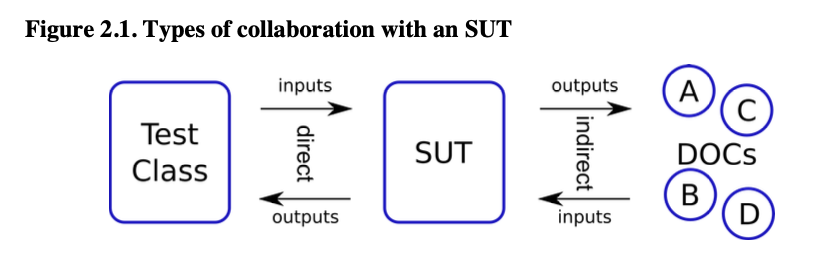
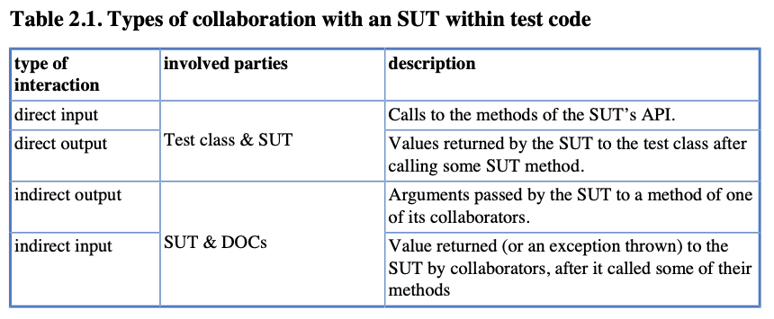
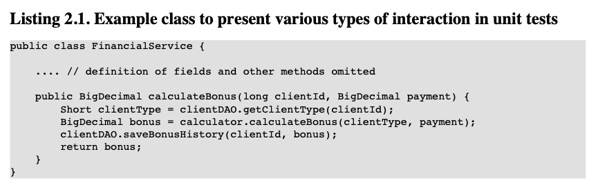
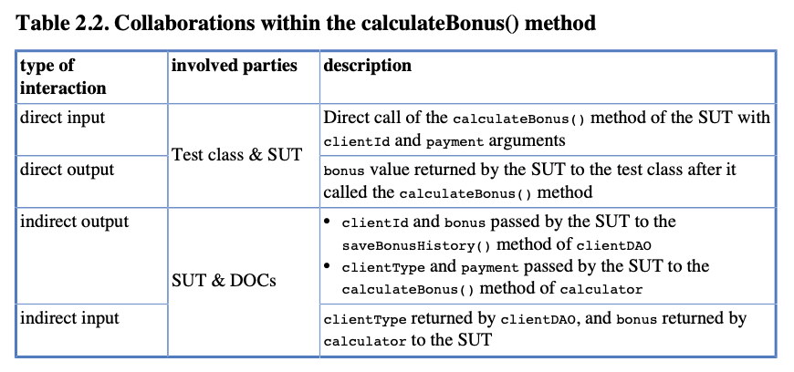
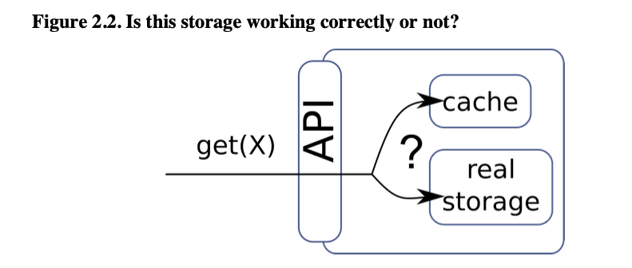

# Chapter 2 - Unit Tests

## 2.1 What is a Unit Test

Unit testlerin arkasındaki fikir basittir: şu anda üzerinde çalıştığınız sınıfın doğru şekilde çalıştığından emin
olmaktır - yani görevini yerine getirdiğinden emin olmaktır. Bu, belirli bir input data verildiğinde beklenen bir
output yanıt verip vermeyeceği veya anlamsız verilerle beslendiğinde uygun bir exception fırlatıp fırlatmayacağı gibi
konuları içerir. Dolayısıyla, beklenen davranışı doğrulayacak testler yazmak fikridir.

Ancak bu yeterli değildir. Sınıflarınızı izole bir şekilde test etmeli ve herhangi bir ortamda çalıştıklarını doğrulamak
için test etmelisiniz. Unit testleri yazarken önemli olan tek bir sınıfı ve daha fazlasını test etmemektir.
Veritabanları, Spring configuration dosyaları ve harici web servislerini unutun. Bunları Unit testlerinize dahil etmek
istemezsiniz. Sınıfınızın mantığına odaklanın. Kodunuzun düzgün çalıştığından emin olduktan sonra, diğer bileşenlerle
olan entegrasyonunu test edin! Ancak önce Unit testleri gerçekleştirin!

Ne yazık ki, hala birçok kişi Unit testlerle diğer test türlerini karıştırmaktadır veya developer'ların yazdığı
herhangi bir testi bu terimle tanımlamaktadır. Birçok insan, Unit test framework'u tarafından yürütüldüğü için
yazdıkları her testin "Unit" türünde olduğunu iddia etmektedir! Diğerleri ise "Unit testi" yapıyor olduklarını iddia
edip three layers bir yazılımı Unit olarak seçmektedir... Bu, tabii ki yanlıştır: kafa karışıklığına yol açar ve
tartışmayı zorlaştırır. Bunu yapmayın!

Unit testleri, diğer developer'ların testlerinden ayıran bazı özelliklere sahiptir. 1.2 bölümünde tartışıldığı gibi,
Unit testleri tek bir sınıfa odaklanır ve bir SUT'un yürütüldüğü context'i sıkı bir şekilde kontrol eder. Ayrıca son
derece hızlı çalışırlar ve genellikle developer'i suçlu methoda veya hatta suçlu kod satırına kadar kesin bir şekilde
hata noktalarına götürebilirler. Çalışmamızın kalitesi hakkında bu kadar kesin ve anlık geri bildirim sağlayarak,
hataları sistemin tamamına yayılmadan önce hızlı bir şekilde düzeltmemize yardımcı olurlar (bkz. 1.4 bölümü).

Kapsamlı ve titiz bir Unit test setinin varlığı, kodu korkmadan yeniden düzenleyebilmemizi sağlar.

Unit testlerinin yazılmasının bir başka faydası, kodumuzun live'a (yani her zaman güncel) bir belgesi olarak hizmet
etmeleridir. Unit testleri, Javadocs veya kodun kendisiyle birlikte geliştirilen herhangi bir metin açıklamasından çok
daha güvenilirdir.

Son ama en önemlisi, yetenekli bir developer, Unit testlerinin oluşturulma sürecini bir tasarım faaliyetine
dönüştürebilir. Bu, oldukça şaşırtıcı bir şekilde, Unit testlerinin sağladığı tüm faydalar arasında en önemlisi olabilir

## 2.2 Interactions in Unit Tests

Unit testlerle neyin test edilmesi gerektiğini ve nasıl test edilmesi gerektiğini anlamak için, test sınıfı ile SUT (
System Under Test) arasındaki etkileşimlere ve SUT ile onun DOC'ları (Dependent Objects and Collaborators - Bağımlı
Nesneler ve İşbirlikçiler) arasındaki etkileşimlere daha yakından bakmamız gerekmektedir.

Öncelikle, bir diyagram şeklinde bazı teorik bilgiler verebilirim. Şekil 2.1, bir SUT ile diğer varlıklar arasında olası
etkileşimleri göstermektedir.

İki etkileşim doğrudan ve SUT ile client'i (bu durumda bir test sınıfı) arasında gerçekleşir. Bu ikisi doğrudan test
kodundan "ulaşılabilir" şekildedir ve üzerlerinde kolayca işlem yapılabilir. Diğer iki etkileşim ise dolaylıdır ve SUT
ile DOC'lar (Bağımlı Nesneler ve İşbirlikçiler) arasındadır. Bu durumda, client (bir test sınıfı), bu etkileşimleri
doğrudan kontrol etme imkanına sahip değildir.

Yani, bir test sınıfı doğrudan SUT ile etkileşime geçebilir ve SUT'nin davranışını doğrulayabilir veya durum
değişikliklerini kontrol edebilir. Ancak, SUT'nin DOC'larla olan etkileşimlerini doğrudan kontrol edemez.

Başka bir olası sınıflandırma, etkileşimleri input'lar (SUT'nin bir mesaj alması) ve output (SUT'nin bir mesaj
göndermesi) olarak ayırır. Test yaparken, SUT'yi gereken bir duruma getirmek ve methodlarını çağırmak için doğrudan ve
dolaylı inputları kullanacağız. SUT'nin doğrudan ve dolaylı output'ları, SUT'nin davranışının ifadesidir; bu da SUT'nin
düzgün çalışıp çalışmadığını doğrulamak için onları kullanacağımız anlamına gelir.

Tablo 2.1, bir SUT'nin ve DOC'ların olası collaboration türlerini özetlemektedir. İlk sütun - "type of interaction" -
collaboration SUT'nin bakış açısından nasıl olduğunu açıklar. Bir test sınıfı, SUT'yi kullanan bir client (bir
kullanıcı) olarak hareket eder; bu nedenle "ilgili taraflar" sütununda yer alır.

Tabii ki! İşte bir örnek kod, müşteri ödemesi ve türüne dayanarak "bonus" hesaplayan bir finansal hizmeti (
FinancialService sınıfı) ve bununla etkileşen DOC'ları göstermek için:

Gördüğünüz gibi, SUT olan calculateBonus() metodu iki parametre alır (clientId ve payment) ve iki işbirlikçi ile
etkileşime geçer (**clientDAO** ve **calculator**). calculateBonus() metodunu tam olarak test etmek için hem input
parametrelerini (direct input), hem de işbirlikçilerinden dönen mesajları (indirect inputs) kontrol etmemiz
gerekiyor. Böylece dönen değerin (direct output) doğru olup olmadığını görebiliriz.

Tablo 2.2, calculateBonus() metodunda gerçekleşen ve test açısından önemli olan etkileşim türlerini özetler.

* direct input - Test class & SUT -> SUT'nin calculateBonus() metodunun clientId ve payment argümanları ile doğrudan
  çağrılması
* direct output - Test class & SUT -> SUT'nin calculateBonus() metodunu çağırdıktan sonra test sınıfına döndürülen bonus
  değeri.
* indirect output - SUT & DOC's -> SUT'nin clientDAO'nun saveBonusHistory() metoduna geçirdiği clientId ve bonus
  değerleri.
* indirect output - SUT & DOC's -> SUT'nin calculator'ın calculateBonus() metoduna geçirdiği clientType ve payment
  değerleri
* indirect input - SUT & DOC's -> clientDAO tarafından döndürülen clientType ve calculator tarafından SUT'ye döndürülen
  bonus değeri.

## 2.2.1 State vs Interaction Testing

Şimdi Figure 1.1'de gösterilen basit bir nesne yönelimli (OO) sistem soyutlamasını hatırlayalım. Bu şekilde, işçi ve
yönetici gibi iki tür sınıfın birlikte çalışarak bir client tarafından verilen bir isteği yerine getirdiği
görülmektedir. Kitap, her iki tür sınıfın da Unit testlerini açıklar. Öncelikle, işçilerin yapmış olduğu hesaplamaların
ve döndürdüğü değerlerin doğru olduğundan emin olmak istediğimiz için işçilerin dünyasına dalacağız. Bu Unit testin bir
parçası olan state testi, gerçekten basit ve uzun yıllardır tamamen kabul görmüştür. Bu tür bir test, direct input
ve output'ları kullanır. State testini, 3. Bölüm'de "Unit Tests with no Collaborators" başlığında ele alacağız.

Ardından, interactions testiyle ilgili daha zorlu konulara geçeceğiz. Yöneticilerin çalışmasına odaklanacağız ve
işbirlikçiler arasında nasıl mesajların iletiltiğine odaklanacağız. Bu, daha karmaşık ve sezgisel olmayan bir test
türüdür. Ara sıra, yeni fikirler ve araçlar ortaya çıkar ve etkileşimleri nasıl doğru bir şekilde test edileceği
konusunda hala canlı tartışmalar devam etmektedir. Gerçekten korkutucu olan, interaction testlerinin bazen iyi niyetli
olmaktan çok zarar verebilmesidir, bu yüzden sadece "nasıl" sorusuna değil aynı zamanda "olup olmadığı" sorusuna da
odaklanacağız. Bu tür bir test, indirect outputs'lara odaklanır. Interaction testini, 5. Bölüm'de "Mocklar, Stubs, Test
Spies" başlığında ele alacağız.

Direct Outputs'un test edilmesine gerçekten "State verification" denir çünkü bu, doğrudan sistemden dönen durumu veya
değerleri doğrulamayı içerir

## Why Worry about Indirect Interactions?

Bir nesne yönelimli fanatik şu noktada bana bağırarak başlayabilir: "Kapsülleme ve bilgi gizleme diye bir şey duydun mu
hiç? Öyleyse, SUT'un işbirlikçileri üzerinde hangi methodleri çağırdığı konusunda neden endişelenmeliyiz? Neden bunu
SUT'nin implementasyon detayı olarak bırakmayalım? Eğer bu SUT implementasyonunun özel bir bölümü ise, hiç
dokunmamalıyız."Bu mantıklı geliyor, değil mi? Keşke sınıflarımızı sadece API'lerini kullanarak tamamen test
edebilseydik! Ne yazık ki, bu mümkün değil. Bir örnek olarak, bir cache'den nesnelerin alınması durumunu düşünelim.

Cache'in genel fikrinin ne olduğunu hatırlayalım. İki depolama alanı bulunur: "real one", geniş kapasiteye sahip ve
average access time'a sahip, ve "cache" ise çok daha küçük kapasiteye sahip olmasına rağmen çok daha hızlı erişim
süresine sahiptir. Şimdi bir cache sistemine yönelik birkaç gereksinimi tanımlayalım. Bu tam teşekküllü bir cache
mekanizması olmayacak, ancak karşılaştığımız sorunu açıklamak için yeterli olacaktır.

Key X ile bir nesne istendiğinde, cache'li olan sistemimiz aşağıdaki basit kurallara göre hareket etmelidir:

1 - Eğer key X'e sahip nesne hiçbir depolama alanında bulunmuyorsa, sistem null değerini döndürecektir.
2 - Eğer key X'e sahip nesne herhangi bir depolama alanında bulunuyorsa, o nesne döndürülecektir.
a - Eğer key X'e sahip nesne cache storage alanında bulunuyorsa, bu depolama alanından döndürülecektir.
b - Eğer key X'e sahip nesne cache storage alanında bulunmuyorsa, ana depolama alanı aranacaktır.

Tabii ki, buradaki amaç, cache hit ratio oranını artıracak akıllı bir caching stratejisine sahip olmaktır - ancak
bu, gerçekten tartışmamızla ilgili değildir. İlgilendiğimiz şey, outputs (returned values) ve SUT ile
işbirlikçileri arasındaki etkileşimlerdir.

Yukarıda belirtilen gereksinimleri göz önüne alırsanız, state testiyle sadece 1 ve 2 numaralı gereksinimleri test
edebileceğimizi fark edeceksiniz. Bu, state testinin nesnelerin privacy'lerine saygı göstermesi nedeniyle gerçekleşir.
State testi, nesnenin içeride neler yaptığını görmeyi mümkün kılmaz - bu durumda, talep edilen nesnenin hangi depolama
alanından alındığını doğrulayamaz. Dolayısıyla, 2a ve 2b gereksinimleri state testi kullanılarak doğrulanamaz.

Bu aşağıdaki resimde gösterilmiştir. İki depolama alanından (hızlı bir cache storage ve daha yavaş real storage)
oluşan SUT'muz, tek bir get() methodi aracılığıyla erişilebilir. SUT'a request gönderen client, içsel karmaşıklığı
hakkında hiçbir şey bilmez.

İdeal olarak, bir request geldiğinde önce cache storage aranır ve eğer cache storage'de' verilen anahtar (bu
örnekte X) ile eşleşen bir input bulunmazsa, real storage alanı aranır. Ancak, SUT doğru şekilde uygulanmamışsa, önce
cache storage yerine real storage aranabilir. Verilen anahtarla bir nesneyi bekleyen client, bu iki durum arasındaki
farkı ayırt edemez. Onun bildiği tek şey, anahtar X ile bir nesne talep ettiği ve onu aldığıdır.

Sistemimizin beklendiği gibi çalışıp çalışmadığını gerçekten doğrulamak için interaction testi uygulanmalıdır.
İşbirlikçiler olan cache ve real storage ile yapılan çağrıların sırası kontrol edilmelidir. Bunun olmadığı
durumda, sistemimizin çalışıp çalışmadığını söyleyemeyiz.

Bu basit örnek, SUT'un observable davranışının (direct outputs) doğrulanmasının yeterli olmadığını kanıtlamaktadır.
Benzer sorunlar, diğerlerinin çabalarını koordine eden manager'ları (Section 1.1'e bakınız) test etmek
için ortaya çıkar. Daha önce belirtildiği gibi, bu tür koordinasyon sınıfları nesne yönelimli sistemlerde oldukça
popülerdir. Bu nedenle, (indirect outputs'ların) test edilmesi ile ilgili teknikler, araçlar ve sorunlar hakkında çok
zaman harcayacağız.

Başlangıçta daha basit duruma odaklanalım. Bir sonraki bölümde, işbirlikçisi(collaborators) olmayan basit nesnelerin
nasıl test edileceğini öğreneceğiz.

# Part II. Writing Unit Tests

Bir test, aşağıda ki durumlarda Unit test değildir!

- Veritabanı ile iletişim kuruyorsa,
- Ağ üzerinden iletişim kuruyorsa
- File System'a dokunuyorsa
- Diğer Unit testlerinizle aynı anda çalışamıyorsa,
- Çalıştırmak için özel işlemler yapmanız gerekiyorsa (örneğin, configuration dosyalarını düzenlemek),