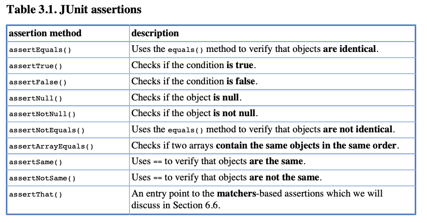
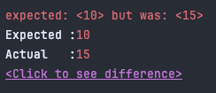
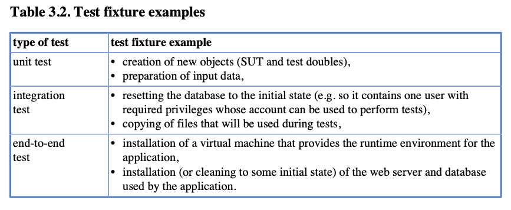
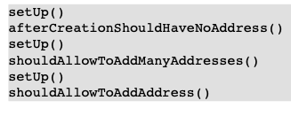
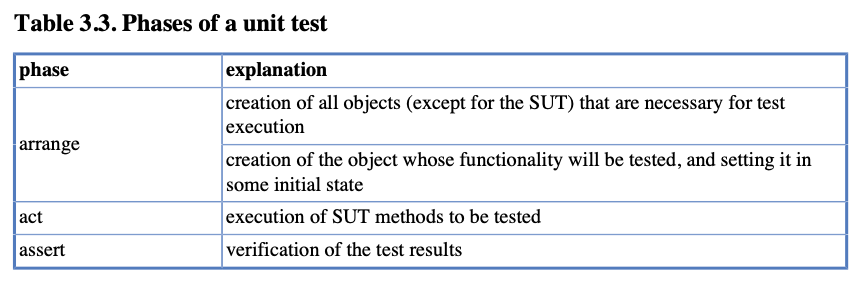
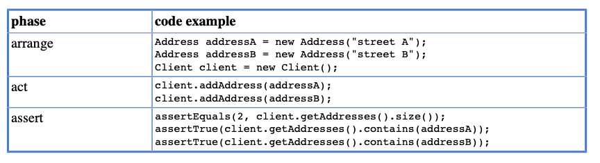
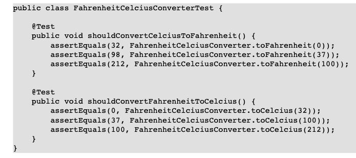

# Chapter 3 Unit Tests with no Collaborators

Interaction türlerini ve Unit testlerin bileşenlerini anlamak gerçekten eğlenceli olsa da, "teoriden pratik" yapmak için
artık bu bilgiyi kullanmanın zamanı geldi. Şimdilik, SUT'unuzun herhangi bir işbirlikçiye ihtiyaç duymadığını
varsayarak, test etme konularının bir alt kümesine odaklanacağız. Bu varsayım - gerçek hayattaki sınıfların çoğu için
geçerli olmasa da - bazı önemli kavramları, fikirleri ve teknikleri göstermemizi sağlayacaktır. Bu koşullar altında
açıklamak çok daha kolay olacak, ancak bu tekniklerin kullanımı kesinlikle işbirlikçisiz bir ortamla sınırlı değildir.
Aslında, örneğin TDD yaklaşımı gibi bazıları, Unit test etmenin kendisiyle sınırlı değildir.

Daha sonraki bölümlerde (5. Bölüm'den başlayarak, Mocks, Stubs, Test Spies) bu gerçekçi olmayan varsayımı bırakıyor ve
SUT'unun çeşitli şekillerde işbirliği yaptığı işbirlikçilerle test etme tekniklerini tartışıyoruz. Ancak şimdilik,
SUT'unuzun yalnız olduğunu varsayalım.

JUnit, özellikle Unit testlerine odaklanan en popüler Java test framework'udur. Tools girişini okuduktan sonra, JUnit
testleri yazmayı ve yürütmeyi öğreneceğiz. Ayrıca, kitap boyunca tekrar tekrar kullanacağımız bazı JUnit özelliklerini
de öğreneceğiz. Bunlardan bazıları burada kısaca bahsedilecek ve daha sonra detaylı bir şekilde tartışılacak.

Bu kitap, her ne kadar yüksek kalitede Unit testleri yazmak isterseniz bilmeniz gereken her şeyi içerse de, kapsamlı
bir JUnit öğretici değildir. JUnit burada açıklananlardan daha fazlasını sunar, bunlar arasında integration ve
end-to-end testler için faydalı bazı özellikler bulunur. Bu araçta gerçekten ustalaşmak istiyorsanız, JUnit belgelerine
başvurmanız gerekmektedir.

## 3.1 Project Structure and Naming Conventions

İlk Unit test deneyimimiz için, JUnit tarafından popüler bir Unit test öğreticisinde kullanılanla neredeyse aynı olan
bir Money sınıfı kullanacağız. Unit test için, Money sınıfı, herhangi bir programlama dilinde ünlü HelloWorld örneği
tarafından oynanan rolü benzer şekilde oynar:  Çok basit (ve dürüst olmak gerekirse oldukça kullanışsız) bir sınıfla
başlayacağız. Daha sonra genişletilecektir.

Money class'ini record olarak ayarladım

### 3.2 Class To Test

```
public record Money(int amount, String currency) {

    @Override
    public boolean equals(Object anObject) {
        if (anObject instanceof Money money) {
            return money.currency().equals(currency()) && amount() == money.amount();
        }
        return false;
    }
}
```

Gördüğünüz gibi, Money sınıfı immutable'dır. İki adet field'e sahiptir. Biraz logic içeren tek method, equals()'ın
implementasyonudur

## 3.3 Your First JUnit Test

Bir test yazmadan önce, bir test senaryoları listesine ihtiyacınız vardır. Eğer yardımcı oluyorsa bir yere not
alabilirsiniz, ancak genellikle kafanızda tutmak yeterli olacaktır.

Money sınıfının koduna baktığınızda, test edilebilecek iki şey fark edebilirsiniz:

- Constructor
- equals() methodu

Constructor metodunun test edilmesi basit bir konu gibi görünüyor ve bu yüzden tam olarak bununla başlayacağız.
Burada kontrol edebileceğimiz tek şey, amount ve currency'nin doğru şekilde ayarlanmış olup olmadığıdır.

```
    @Test
    public void constructorShouldSetAmountAndCurrency(){
        Money money = new Money(10,"USD");
        assertEquals(10,money.amount());
        assertEquals("USD",money.currency());
    }
```

- Bir SUT oluşturulur.
- SUT test edilir ve sonuçlar Assert sınıfının statik assertEquals() methodları kullanılarak doğrulanır.

## 3.3.1 Test Results

Elle yapılan testler (bu konuda bir tartışma için Bölüm A.1'e bakınız) "bende çalışıyor"dan, "emin değilim, ama daha
fazla araştırmak için zamanım yok" durumuna kadar bir dizi sonuçla sonuçlanabilir. Automated testlerde durumlar farklı
görünür. Sadece birkaç olası sonuç vardır. Bunlara daha yakından bakalım.

Automated bir test, geçti veya başarısız oldu şeklinde iki durumdan birinde sonlanır. İki diğer sonuç daha az sıklıkla
gerçekleşir - bir test atlanabilir veya hata ile tamamlanabilir. Automated testlerde "Şimdi çalışması gerektiğini
düşünüyorum" gibi bir yer yoktur!

Bir testin tüm doğrulamaları karşılanırsa ve beklenmedik bir exception oluşmazsa, o test başarılı olarak kabul edilir.
Başarılı bir test genellikle IDE'lerde ve test raporlarında yeşil renkle işaretlenir.

Eğer beklenmedik bir exception oluşursa, o zaman test başarısız olur. Bu, bir doğrulamanın karşılanmaması durumunda veya
kodunuzda bir hata olması durumunda, örneğin ArrayIndexOutOfBoundsException gibi bir hata oluşması durumunda
gerçekleşir. IDE'niz ve test raporlarınız, böyle bir başarısız testi kırmızı renkle işaretleyecektir.

Bir test, bazı varsayımlarının karşılanmaması durumunda (bkz. Bölüm 6.3) veya kullanıcı tarafından açıkça atlanması
gerektiğine karar verildiğinde atlanabilir (hiç çalıştırılmaz). Bu tür bir test genellikle sarı renkle işaretlenir.

Son olarak, bir test, yürütmesini kesen beklenmedik bir durum gerçekleştiğinde hata olarak sonuçlanabilir. Bu genellikle
nadir bir durumdur ve genellikle test kodunuzda bir sorun olduğunu gösterir. Örneğin, bir test methodu bazı
parametreleri bekliyor ancak bunlar sağlanmadığında bu durum oluşabilir (bkz. Bölüm 3.6). Başarısız testler gibi, hata
durumunda sonuçlanan testler de kırmızı renkle işaretlenir. Genellikle raporlarda başarısız testlerle birlikte
gruplanır.

## 3.4 JUnit Assertions

assertEquals() Bu assertion, expected değeri actual değerle karşılaştırır ve eşit değillerse bir assertion error
fırlatır. Actual value, expected value ile eşleştiğini doğrulamak için kullanılan yaygın bir assertion'dır.

```
assertEquals(10,money.amount());
assertEquals("USD",money.currency());
```

Tablo 3.1, org.junit.Assert sınıfının assertion methodlerini göstermektedir. Gösterilen methodlerin çoğu, farklı
parametrelere sahip çeşitli varyantlarda gelir (örneğin, assertEquals() methodi, double, long, String ve diğerleri gibi
iki parametre kabul eder). Kullanılabilir assertion methodleri hakkında detaylı bilgi için JUnit Javadocs'a başvurunuz.



Yukarıdaki methodlerin bazıları (örneğin, assertTrue(), assertNotNull()), yalnızca bir parametre ve isteğe bağlı bir
message alır (bkz. Bölüm 3.5). Diğerleri - örneğin, assertEquals() ve assertSame() - iki parametre ve isteğe bağlı bir
message alır. Böyle bir durumda, parametrelerin sırası aşağıdaki gibidir:

1 - (optional) message
2 - expected value
3 - actual value

İlk iki parametrenin sırasının ne fark yarattığını sorabilirsiniz. A'yı B'ye karşılaştırmak ile B'yi A'ya karşılaştırmak
arasında herhangi bir fark var mı? Sonuç açısından bir fark yoktur. Sonuçları aynı/eşit veya farklı olabilir, değil mi?
Farkı sadece test başarısız olduğunda fark edersiniz. Bunun üzerinde yakında duracağız.

Başka bir nokta da yukarıdaki tüm ifadeleri gerçekten öğrenmeniz ve onlardan faydalanmanız gerektiğidir. İlk başta
sadece en basitleriyle yetinmeye meyilli olabilirsiniz: yani assertTrue() ve assertFalse(). Onlar, doğru veya yanlış
değerlendiren bir koşul yazarsanız hemen hemen her şeyi doğrulamanıza izin verecektir. Doğru, ancak assertSame(),
assertNull() veya assertNotEquals() ile sonuçları doğrulamak, test kodunuzu çok daha okunabilir hale getirecektir.
Unutmayın, "iş için doğru aracı kullanın"! Bu her seviyede geçerlidir.

## 3.5 Failing Test

Hadi bir testin başarısız olduğunda ne olduğunu görelim. Kaçınılmaz olarak birçok başarısız test göreceksiniz, bu yüzden
onunla iyi bir şekilde tanışmak daha iyi olacaktır.

Testin başarısız olması için, Money sınıfının constructor'ında küçük bir değişiklik yapmamız gerekiyor.

```
    public Money {
        amount = 15;
    }
```

Record'un constructor'ını eziyorum ve amount'un degerini 15'e set ediyorum. Ne olursa olsun, argümanla geçilen değere
bakılmaksızın, amount değişkeni 15 olarak ayarlanacak.

Tabii ki, bu değişiklik testimizdeki (assertEquals(10, money.getAmount());) assert ifadelerinden birinin başarısız
olmasına neden olacak. Testi yeniden çalıştırdıktan sonra aşağıdaki mesaj ve stacktrace görüntülenecektir:



Bu satır, bir assert ifadesinin başarısız olduğunu bildiriyor. assertEquals() ifadesinin her iki parametresinin
değerleri yazdırılıyor: 10 expected, ancak actual 15 döndü.

Dikkat etmemiz gereken bir şey, assert ifadelerinin parametrelerinin sırasının gerçekten önemli olmasıdır. Testin
başarısız olma nedeniyle ilgili yazdırılan bilgiler, varsayılan sıraya (hatırlayın: önce expected value, sonra actual
value) uyduğumuz varsayımına dayanmaktadır. Başka herhangi bir durumda, yazdırılan bilgiler yanıltıcı olabilirdi.

## 3.6 Parameterized Tests

Genellikle, çeşitli input değerleriyle aynı methodu test etmek ve farklı output'lar beklemek önerilir. Bu bölümde,
JUnit'in bu görevde bize nasıl yardımcı olabileceğini öğreneceğiz.

## 3.6.1 The Problem

Varsayalım ki, 10 USD ile birlikte Money sınıfının constructor'ını test etmek istiyoruz ve ayrıca onu 20 EUR ile de test
etmek istiyoruz. Şu şekilde yapabiliriz;

```
    @Test
    public void constructorShouldSetAmountAndCurrency(){
        Money money = new Money(10,"USD");
        assertEquals(10,money.amount());
        assertEquals("USD",money.currency());

        money = new Money(20,"EUR");
        assertEquals(20,money.amount());
        assertEquals("EUR",money.currency());
    }
```

Bu yaklaşım işe yarayacak, ancak dezavantajları açıkça görülebilir. İlk olarak, duplication çok fazladır ve DRY (Don't
Repeat Yourself) prensibine açıkça aykırıdır. İkincisi, bu tür kod genellikle "kopyala&yapıştır" tekniği kullanılarak
oluşturulur, bu da sadece bir kısmını değiştirirken tüm bölümü kopyalama yoluyla sorun yaşamaya kesin bir reçetedir.
Üçüncü olarak, her yeni argüman setiyle birlikte test sınıfı büyüyecektir. Yeter artık! Daha iyi bir yol olmalı!

Yukarıda sunulan tekrarlamalardan kaçınmak için çeşitli teknikler kullanabilirsiniz. Örneğin, bir for döngüsü
kullanabilirsiniz. Bu daha iyi hale getirir, ancak aynı zamanda testinize logic (çok temel bir türde olsa da) dahil
etmenize neden olur, ki bu önerilmez (bkz. Bölüm 10.2). Ayrıca, constructorShouldSetAmountAndCurrency() methodunu bir
dizi daha küçük methode bölebilirsiniz, her biri yalnızca bir set parametresini kontrol eder. Evet, ancak bu, önceki
olarak tartışılan basit yaklaşımın istenmeyen özelliklerine benzer istenmeyen özelliklere sahip olurdu.

## 3.6.2 The Solution

Neyse ki, burada kendi çözümünüzü bulmanıza gerek yok. Bu gereksinim o kadar yaygındır ki, test framework'leri tam
olarak bu tür durumlar için bazı destekler sunar. Buna "parameterized testler" denir.

Hangi parameterized test aracını kullanmaya karar verirseniz verin, genel fikir her zaman aynıdır. Bir önceki anda
tartışılan constructorShouldSetAmountAndCurrency() methodu gibi, test methodu iki bölüme ayrılır. İlk bölüm, ikinci
bölüme (actual test methoduna) aktarılacak argümanların bir kaynağı olarak hareket eder ve gerçek testi yapmakla
sorumludur.

Daha önce belirtildiği gibi, JUnit'in parameterized testler için desteği sınırlıdır. Bu görev için ek bir, çok daha
güçlü bir kütüphane kullanacağız: JUnitParams.

**JUnitParams**'ın dependency'sini gradle icerisine ekliyorum;

```
testImplementation("org.junit.jupiter:junit-jupiter-params:5.9.3")
```

JUnitParams, veri sağlayan kısmın implementasyonu konusunda size seçenek sunar. Test methodu üzerinde bir annotation
veya ayrı bir test methodi olarak şekillenebilir.

Şimdi JUnitParams kullanarak test koduna bakalım. Birkaç yeni şey olacak, ancak bunları tek tek ele alacağız. Dikkat
edilmesi gereken temel nokta, sorumlulukların net bir şekilde ayrılmasıdır: getMoney() methodu veriyi sağlar ve
constructorShouldSetAmountAndCurrency() methodu test algoritmasını sağlar. Bu iki methodun birleştirilmesi, test
methodundaki @ParameterizedTest annotation'i sayesinde gerçekleştirilir.

```
class MoneyTest {
    private static Object[] getMoney(){
        return new Object[]{
          new Object[] {10,"USD"},
          new Object[] {20,"EUR"}
        };
    }

    @ParameterizedTest
    @MethodSource("getMoney")
    public void constructorShouldSetAmountAndCurrency(int amount, String currency) {
        Money money = new Money(amount,currency);
        assertEquals(amount,money.amount());
        assertEquals(currency,money.currency());
    }
}
```

@MethodSource anotasyonu testte kullanilacak olan methodu isaret eder.

Data sağlayan methodların bir Object[] array'i döndürmesi beklenir.

constructorShouldSetAmountAndCurrency() methodu, amount ve currency olmak üzere iki parametre bekler. getMoney() methodu
tarafından döndürülen array'in her satırı bu iki değeri içerir.

İlk argüman seti, sayı olarak 10 ve currency olarak USD'yi içerecektir. İkinci argüman seti, sayı olarak 20 ve currency
olarak EUR'yi içerecektir. Sabit değerler yerine, her iki argüman da Money sınıfından bir nesne oluşturmak ve
doğrulamak için kullanılır.

JUnit'in "arka planda" iki test durumu oluşturduğunu ve şimdi iki testin gerçekleştirildiğini bildirdiğini göreceksiniz.
Daha da önemlisi, ne olduğu hakkında ayrıntılı bilgi alacaksınız: yani her test için hangi değerlerin kullanıldığı.
MoneyTest açısından, sadece testin geçtiğini biliyorsunuz. MoneyParameterizedTest için ise hangi parametrelerin dahil
olduğunu da biliyorsunuz. Başarılı bir test çalışmasında bu büyük bir olay olmayabilir, ancak bir hatada hangi veri
kombinasyonunun hataya neden olduğunu hemen bileceksiniz.

## 3.6.3 Conclusions

Özetlemek gerekirse, özel bir kod yerine parametreli testler kullanmanın avantajları aşağıdaki gibidir:

- Özelleştirilmiş bir mantık (örneğin bir döngü) yerine, hatalı olabilecek kendi mantığınızın hiçbirini dahil
  etmezsiniz. Bu, testin okunabilirliğini artırır.
- Başka bir argüman seti eklemek çok kolaydır ve kodun büyümesine neden olmaz.
- Tek bir veri sağlayan method, birden fazla test methoduna (ve hatta birden fazla test sınıfına) veri sağlamak için
  kullanılabilir, bu da kodu daha da özlü hale getirir.
- Kopyala-yapıştır kodlama olmaz, "global" değişkenler olmaz ve DRY prensibi sadakatle yerine getirilir.
- Test mantığı (kodun nasıl çalışması gerektiği) ile test verileri (hangi değerlerin test edildiği) arasında net bir
  ayrım vardır.
- Testlerin yürütülmesiyle ilgili daha detaylı sonuçlar elde ederiz.

## 3.7 Checking Expected Exceptions

Zaman zaman kodunuzun exception fırlatması gerekebilir. Belki bir method beklenmedik (geçersiz) bir değer alır. Belki de
işbirliği yaptığı third-party taraf bileşen bir exception fırlatmıştır. Neyse, exception'lar, methodlarınızın
davranışının önemli bir parçasıdır. Sonuçların döndürüldüğü kadar önemlidirler. Sınıfınızın arayüzüne aittirler ve
dolayısıyla test edilmelidirler.

Neyse ki, beklenen istisnaları kontrol etmek günümüzde çok kolaydır. Aşağıdaki kod parçacığı bunu açıklar:

```
    @Test
    public void shouldThrowExceptions(){
    }
```

Şimdi bir örnek üzerinde durabiliriz. Money sınıfına bir değişiklik yapalım. Constructor'unda bir
IllegalArgumentException fırlatmasına izin verelim, eğer:

- amount 0'dan kucukse
- currency null yada bossa

```
public Money{
        if (amount<0){
            throw new IllegalArgumentException("Illegal amount : [" + amount + "]");
        }
        if (currency == null || currency.isEmpty()){
            throw new IllegalArgumentException("Illegal currency : [" + currency + "]");
        }
    }
```

Money constructor'ini hallettikten sonra test'lerimizi yazalim;

```
    private static final int VALID_AMOUNT = 5;
    private static final String VALID_CURRENCY = "USD";

    private static Object[] getInvalidAmount() {
        return new Integer[][]{{-12387}, {-5}, {-1}};
    }

    private static Object[] getInvalidCurrency() {
        return new String[][]{{null}, {""}};
    }

    @ParameterizedTest
    @MethodSource("getInvalidAmount")
    public void constructorShouldThrowIllegalArgumentExceptionForInvalidAmount(int invalidAmount) {
        new Money(invalidAmount, VALID_CURRENCY);
    }

    @ParameterizedTest
    @MethodSource("getInvalidCurrency")
    public void constructorShouldThrowIllegalArgumentExceptionForInvalidCurrency(String currency){
        new Money(VALID_AMOUNT,currency);
    }
```

gösterilen test metodlarında dikkate değer bir başka nokta, doğrulama (assertion) eksikliğidir. Aslında beklenen
exception'ların olup olmadığını kontrol etmek için herhangi bir kod yazmaya gerek yoktur. JUnit, bunu @Test
anotasyonu attribute'ları içindeki bilgilere dayanarak otomatik olarak halleder. Aslında otomatik olarak try/catch
calistirir

* her iki test de yalnızca belirli bir istisna fırlatıldığında başarılı olacaktır.
* her iki test metodunda da veri sağlayan methodlar kullanılır.
* iki testde de assert'inlar bulunmamaktadır

Burada vurgulamak istediğim şey, methodlara ve değişkenlere anlamlı isimler vermenin önemidir. Bu, testin okunabilir
olmasını sağlar ve her method veya değişkenin rolü konusunda şüpheye yer bırakmaz. Şu satıra bir göz atalım:

```
new Money(invalidAmount, VALID_CURRENCY);
```

Değişkenler için anlamlı isimler kullanarak, oldukça okunabilir bir test elde ettik. Sadece okuyun: "Bu kod satırı,
invalid amount ve geçerli bir money currency kullanarak Money sınıfından yeni bir nesne oluşturur." Her şey tamamen
açık.

## 3.8 Test Fixture Settings

"Test fixture" terimi, testlerin çalıştırıldığı ve sonuçların tekrarlanabilir olduğu "bilinen ve sabit bir ortam"
fikrini ifade eder. Bu tür bir ortamı oluşturmak için gereken adımlar, test türlerine ve kullanılan araçlara bağlı
olarak farklılık gösterebilir, ancak temel fikir her zaman aynıdır.

Bir yazılım bileşeninin (SUT) methodlarinin yürütülmeden önce tüm unsurların yerli yerinde olduğundan emin olma zamanı
geldi. Bu bölümde, test bileşeninin oluşturulması için JUnit'in basic desteğini öğreneceğiz. Yeni bazı anotasyonları
öğrenecek ve optimal test kodu yapısını tartışacağız.

## 3.8.1 Test Fixture Examples

Test ortamının otomatik olarak oluşturulması süreci genellikle testin en zorlu kısmıdır. Bu özellikle integration ve
end-to-end testler için geçerlidir. Unit testler için durum genellikle daha basit olsa da, yine de dikkate alınması
gereken bazı konular vardır. Aşağıdaki tablo, farklı test türleri için test bileşenleri örneklerini vermektedir.



Şimdi basit bir Client ve Address sınıfını tanıtalım. Varsayalım ki Client sınıfının nesnelerinin bir adres
koleksiyonunu depolayabildiğini doğrulamak istiyoruz. Bu sınıfın test edilmesine yönelik ilk yaklaşımımız aşağıdaki gibi
olabilir:

```
public class Client {
    List<Address> addresses = new ArrayList<>();

    public List<Address> getAddresses() {
        return addresses;
    }

    public void addAddress(Address address) {
        addresses.add(address);
    }
}
```

```
public record Address(String street) {
}
```

Iki class'i da create ettikten sonra test'lerimizi yaziyoruz. Aslinda ilk once testi yazmamiz gerekiyor ki nelere
ihtiyacimiz oldugunu gorelim

```
class ClientTest {
    private final Address addressA = new Address("street A");
    private final Address addressB = new Address("street B");

    @Test
    public void afterCreationShouldHaveNoAddress(){
        Client client = new Client();
        assertEquals(0,client.getAddresses().size());
    }

    @Test
    public void shouldAllowToAddAddress(){
        Client client = new Client();
        client.addAddress(addressA);
        assertEquals(1,client.getAddresses().size());
    }

    @Test
    public void shouldAllowToManyAddresses(){
        Client client = new Client();
        client.addAddress(addressA);
        client.addAddress(addressB);
        assertEquals(2,client.getAddresses().size());
        assertTrue(client.getAddresses().contains(addressA));
        assertTrue(client.getAddresses().contains(addressB));
    }
}
```

Bu test düzgün olsa da, nesnelerin initialize edilmesi ile ilgili tekrar eden bir kod fazlası bulunmaktadır. Her test
yönteminde client değişkeni oluşturulmaktadır. Eğer sadece her test methodu çalıştırılmadan önce onun önceden
oluşturulmasını sağlayabilseydik...

## 3.8.3 JUnit Execution Model

Test kodunda tekrarı önlemek için, JUnit'in @Test anotasyonuyla işaretlenmiş herhangi bir test yöntemi çalıştırmadan
önce test sınıfının yeni bir instance'inin oluşturduğu gerçeğini kullanabiliriz. addressA ve addressB gibi her bir örnek
değişkeninin, afterCreationShouldHaveNoAddress(), shouldAllowToAddAddress() ve shouldAllowToAddManyAddresses() test
methodlarının herhangi biri çalıştırılmadan önce yeniden oluşturulduğu anlamına gelir.

Her test yönteminde yeni bir Client'a ihtiyacımız varsa, yapmamız gereken tek şey onu bir instance field yapmaktır;

```
class ClientTest {
    private final Address addressA = new Address("street A");
    private final Address addressB = new Address("street B");
    private final Client client = new Client();

    @Test
    public void afterCreationShouldHaveNoAddress(){
        assertEquals(0,client.getAddresses().size());
    }

    @Test
    public void shouldAllowToAddAddress(){
        client.addAddress(addressA);
        assertEquals(1,client.getAddresses().size());
    }

    @Test
    public void shouldAllowToManyAddresses(){
        client.addAddress(addressA);
        client.addAddress(addressB);
        assertEquals(2,client.getAddresses().size());
        assertTrue(client.getAddresses().contains(addressA));
        assertTrue(client.getAddresses().contains(addressB));
    }
}
```

Client simdi bir instance field... Bu test, önceki testle işlevsel olarak eşdeğerdir, ancak biraz daha kısadır.
Görülebileceği gibi, client değişkeninin oluşturulması artık birden fazla yönteme dağılmamakta, sadece bir kez
gerçekleşmektedir. Ayrıca, tekrarlamalar da yoktur. Daha fazla test yöntemi bulunsaydı, bu yaklaşımın avantajları daha
da belirgin olurdu.

Bu testin okunması biraz daha zor olabilir, çünkü nasıl çalıştığını anlamak için test methodu dışına bakmamız gerekiyor.
Bu hatırlanması gereken bir noktadır.

## 3.8.4. Annotations for Test Fixture Creation

Bazı durumlarda, önceki paragraflarda sunulan yöntem çalışmayabilir. Özellikle, Client sınıfının nesnesi üzerinde bazı
methodları çağırmamız gerektiğinde bu durum ortaya çıkar.

Aynı problemi çözmenin başka bir yolu, tüm nesnelerin oluşturulmasından sorumlu olacak bir setUp() yöntemi (metod)
tanıtmaktır. Bu methodu @Before anotasyonuyla işaretleyerek, JUnit'e tam olarak bunu yapmasını söyleriz: her test
methodu çalıştırılmadan önce bu methodu çalıştırmasını sağlarız.

```
    private final Address addressA = new Address("street A");
    private final Address addressB = new Address("street B");
    private static Client client;

    @BeforeAll
    static void setUp() {
        client = new Client();
    }
```

**@BeforeAll** anotasyonu kullanildiginda method ve field mutlaka **static** olmalidir. @BeforeAll anotasyonu, JUnit'in
bu methodu her test methodu çalıştırılmadan önce çalıştırmasını sağlar. Bu, gerçek testlerin çalıştırılması öncesinde
gerekli nesnelerin hazırlanması ve gerekli başlatma adımlarının gerçekleştirilmesi için kullanılır. @BeforeAll
anotasyonunu kullanarak, her testten önce tutarlı bir şekilde kurulum işleminin gerçekleştirilmesini sağlayabiliriz. Bu,
kod tekrarını azaltır ve test kodunu daha okunabilir ve sürdürülebilir hale getirir.

Method yürütme aşamaları şu şekilde olur:



**@AfterAll** anotasyonu ile işaretlenen methodlar her test methodundan sonra calisirlar

```
    @AfterAll
    static void setUpAfter(){
        System.out.println("setUpAfter() method called");
    }
```

@BeforeAll ve @AfterAll anotasyonları hakkında konuştuğumuzda, bunların unit testlerinde nadiren kullanıldığını
belirtmek istiyorum. Unit testlerinde genellikle testlerin tamamlandıktan sonra temizlenmesi (kapatma, silme veya
kaldırma) istenen dosyalar, akışlar veya veritabanlarıyla etkileşimde bulunulmaz.

## 3.9. Phases of a Unit Test

Şimdi bazı Unit testlerle karşılaştığımıza göre, yapılarını daha yakından inceleyebiliriz. Muhtemelen fark ettiğiniz
gibi, bir Unit testi üç şeyle ilgilenir: ilk olarak, test edilecek bir nesne oluşturur (SUT) ve diğer gerekli
nesneleri (SUT'un işbirlikçileri) de oluşturur, ardından SUT'un yöntemlerini çalıştırır ve son olarak sonuçları
doğrular. Bu desen, Unit testler için o kadar yaygındır ki, bu tür testler genellikle "arrange, act, assert"
testleri olarak tanımlanır.



phase -> arrange -> Test yürütme için gereken SUT hariç tüm nesnelerin oluşturulması.
-> Test edilecek fonksiyonelliğe sahip nesnenin oluşturulması ve başlangıç durumuna ayarlanması.

act -> Test edilecek SUT (System Under Test) yöntemlerinin yürütülmesi.

assert -> Test sonuçlarının doğrulanması

Şimdi, önceki bölümde tartıştığımız ClientTest sınıfını analiz edelim. Tablo 3.4, bu testin arrange, act, assert
yapısıyla nasıl uyumlu olduğunu göstermektedir.



tek bir test methodu içindeki tüm doğrulama ifadelerinin, bir nesnenin (SUT) özelliklerini doğrulaması önerilir. Tek bir
test methodu içinde birçok nesne üzerinde doğrulama yapmak kötü bir uygulama olarak kabul edilir ve kaçınılmalıdır!

## 3.10 Conclusions

Bu bölümde JUnit ile tanıştınız ve şunları öğrendiniz:

- kitap boyunca kullanılacak varsayılan proje yapısı
- Test class'ları ve test yöntemleri nasıl yazılır
- Test'ler nasıl çalıştırılır
- JUnit, test yöntemlerinde beklenen sonuçları doğrulamak için kullanılan geniş bir doğrulama (assertion) yelpazesi
  sunar
- Parameterized test'ler nasıl kullanılır
- Beklenen exception'ları doğrulama
- Test Fixture yönetimi için annotasyonları nasıl kullanabilirim? (@BeforeAll, @AfterAll etc.)

Bu bölümde ele aldığımız konular, gerçekten güzel ve kullanışlı unit testleri yazmak isterseniz yeterlidir. Ancak,
daha fazla ayrıntıya girmedik ve bunun iki nedeni vardır: İlk olarak, birçok durumda daha fazla ayrıntıya ihtiyaç
duyulmaz çünkü test framework'leri (JUnit de dahil olmak üzere) oldukça basittir. İkinci olarak, bu kitabın ilerleyen
bölümlerinde JUnit hakkında öğrendiklerinize ekleyeceğimiz bir şeyler olacak ve bu, ortaya çıkan specific context'lerde
daha anlamlı olacaktır.

JUnit, henüz ele almadığımız birçok başka özelliğe sahiptir. Bunlardan bazıları, takip eden bölümlerde ele alınırken,
diğerleri bu kitabın kapsamının dışındadır çünkü Unit testleriyle gerçek kullanım bağlantısı bulunmamaktadır.

Bu bölümde en önemli konuyu sorsaydınız, ben parameterized testlere işaret ederdim. Onların doğru kullanımı son derece
avantajlıdır ve birçok durumu kapsayan çok öz ve kısa testler yazmanıza olanak sağlar. Parameterized testlerin kullanımı
tekrarlamaları ortadan kaldırır ve testlerin okunabilirliğini artırır.

## 3.11 Exercises

Aşağıda sunulan egzersizlerin amacı iki yönlüdür: İlk olarak, kodunuzu Unit test etme fikrine alışmanıza yardımcı olmak
için buradadırlar ve ikinci olarak, bunları gerçekleştirerek JUnit özellikleri konusundaki bilginizi pekiştireceksiniz.

## 3.11.2 String Reverse

Verilen string degeri reverse edip donduren bir method'umuz var. Class'in ismi de StringUtil;

```
public class StringUtil {
    public static String reverseVerb(String verb) {
        List<String> tempArray = new ArrayList<>(verb.length());
        for (int i = 0; i < verb.length(); i++) {
            tempArray.add(verb.substring(i, i + 1));
        }
        StringBuilder reversedString = new StringBuilder(verb.length());
        for (int i = tempArray.size() - 1; i >= 0; i--) {
            reversedString.append(tempArray.get(i));
        }
        return reversedString.toString();
    }
}
```

Bu class'in bu fonksiyonunu test etmek icinde test methodlarini yaziyorum;

```
    public static Object[] getVerbs() {
        return new String[][]{{"deneme"}, {"markdown"}};
    }

    @ParameterizedTest
    @MethodSource("getVerbs")
    public void reverseVerb (String verbs) {
        String reversedString = new StringBuilder(verbs).reverse().toString();
        assertEquals(reversedString,StringUtil.reverseVerb(verbs));
    }

    @Test
    public void reverseShouldThrowNullPointerException(){
        StringUtil.reverseVerb(null);
    }
```

Test'imiz calisiyor ve olusabilecek durumlari test ediyor;

## 3.11.3 HashMap

java.util.HashMap class'ını test edecek bir test yazacagiz

- put() yöntemiyle depolanan bir nesne, get() yöntemiyle alınabilir.
- Aynı key ile ikinci bir nesne eklenmesi, eski değerin yerine geçmesine neden olsun
- clear methodu ile tum content silinsin
- null degeri bir key olarak kullanilabilsin

```
public class HashMapTest {
    final String KEY_1 = "KEY1";
    final String KEY_2 = "KEY2";
    final String NULL_KEY = null;
    final String VALUE_1 = "VALUE_1";
    final String VALUE_2 = "VALUE_2";

    private static HashMap<String, String> hashMap;

    @BeforeAll
    static void setUp() {
        hashMap = new HashMap<>();
    }

    @Test
    void putShouldReturnOneElement() {
        hashMap.put(KEY_1, VALUE_1);
        assertEquals(1, hashMap.size());
        assertTrue(hashMap.containsKey(KEY_1));
        assertEquals(VALUE_1, hashMap.get(KEY_1));
    }

    @Test
    void putWithTheSameKeyShouldReplaceValue() {
        hashMap.put(KEY_2, VALUE_1);
        hashMap.put(KEY_2, VALUE_2);
        assertEquals(1, hashMap.size());
        assertTrue(hashMap.containsKey(KEY_2));
        assertEquals(VALUE_2, hashMap.get(KEY_2));
    }

    @Test
    void clearShouldRemoveAllItems() {
        hashMap.put(KEY_1, VALUE_1);
        hashMap.put(KEY_2, VALUE_2);
        assertEquals(2, hashMap.size());
        hashMap.clear();
        assertEquals(0, hashMap.size());
        assertFalse(hashMap.containsKey(KEY_1));
        assertFalse(hashMap.containsKey(KEY_2));
    }

    @Test
    void nullValueCanBeUsedAsKey(){
        hashMap.put(NULL_KEY,VALUE_1);
        assertEquals(1, hashMap.size());
        assertTrue(hashMap.containsKey(NULL_KEY));
        assertEquals(VALUE_1,hashMap.get(NULL_KEY));
    }
}
```

## 3.11.4. Fahrenheits to Celcius with Parameterized Tests



Yukarıda ki resimde gosterilen test'i parameterized hale çevireceğiz;

Once methodlari iceren bir class create ediyorum;

```
public class FahrenheitCelsiusConverter {

    public static int toCelcius(int fahrenheit) {
        return (int)Math.round(((double) fahrenheit - 32.0) * 5.0 / 9.0);
    }

    public static int toFahrenheit(int celcius) {
        return (int) Math.round((double) celcius * 9.0 / 5.0 + 32.0);
    }
}
```

Parameterized testleri yaziyorum;

```
class FahrenheitCelsiusConverterTest {
    private static Object[] getValues() {
        return new Object[]{
          new Object[] {32,0},
          new Object[] {99,37},
          new Object[] {212,100}
        };
    }

    @ParameterizedTest
    @MethodSource("getValues")
    void shouldConvertCelciusToFahrenheit(int fahrenheit, int celcius) {
        assertEquals(fahrenheit,FahrenheitCelsiusConverter.toFahrenheit(celcius));
    }

    @ParameterizedTest
    @MethodSource("getValues")
    void shouldConvertFahrenheitToCelcius(int fahrenheit,int celcius){
        assertEquals(celcius,FahrenheitCelsiusConverter.toCelcius(fahrenheit));
    }
}
```

## 3.11.5 Master Your IDE

IDE'nizin etkili bir Unit test desteği sunabilmesi için harcadığınız zaman önemlidir. Özellikle, aşina olmanız gereken
iki önemli özellik vardır:

- Templates

Her kaliteli IDE, daha büyük kod yapılarını hızlı bir şekilde oluşturmak için özel şablonlar oluşturmanıza izin verir.
Verimli bir Unit testi için, en azından şunları öğrenmelisiniz:

    * Test class template'i create etmeyi
    * bazı typical code constructor'ları oluşturun - yani parameterized testler ve set-up methodları.

- Quick Navigation

Test class'i ile Production class'i arasinda dolasilabilecek shortcut tuslari ayarlayalım