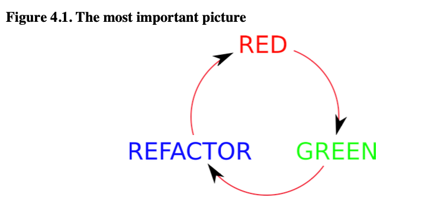
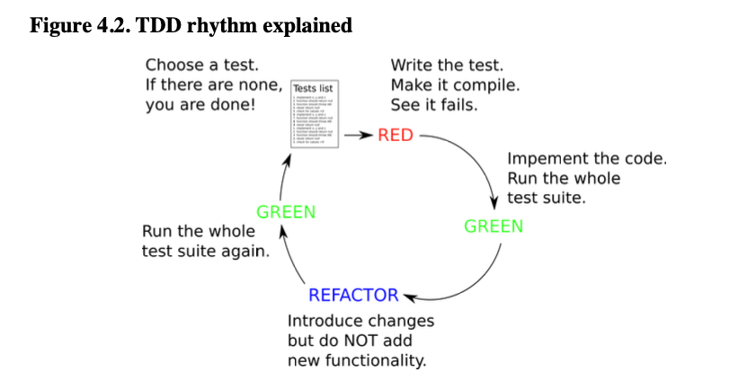
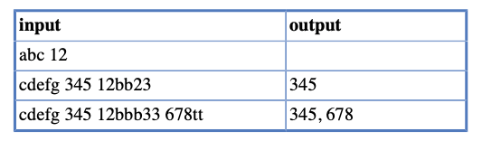

# Chapter 4 Test Driven Development

Test etmeye başladığınızda, işler basitti. Kod yazdınız, ardından geçerliliğini doğrulamak için testler yazdınız. Bu
mantıklı görünüyordu ve iyi sonuçlar getiriyordu. Ancak bir süre sonra birkaç sorun çıkaran kişi ;) işleri baş aşağı
çevirmeye ve uygulama öncesinde testler yazmaya ısrar etti. Bu oldukça şaşırtıcı bir fikir gibi görünse de oldukça
popüler hale geldi ve daha iyi sonuçlar getirdiği iddia edildi.

Başlangıçta, gerçek kod yazmadan önce testler yazmak, onu mümkün olan en kısa sürede doğrulamanın bir yolu olarak
görülüyordu. Test-first yaklaşımını takip eden giderek daha fazla insan, hemen doğrulamanın sadece kazanç sağlanan bir
kısmı olduğunu keşfetti Aslında, herhangi bir uygulama yazılmadan önce testler hakkında düşünmek güçlü bir tasarım
tekniği olduğu ortaya çıktı. Kod, sadece (iyice test edildiği için) daha iyi çalışmakla kalmadı, aynı zamanda mimarisi,
bakımı ve API kullanım kolaylığı açısından da "daha iyi göründü ve hissetti".

Bu nedenle, test-first yaklaşımı artık genellikle Test Odaklı Geliştirme (Test Driven Development - TDD) olarak
adlandırılıyor. TDD ve test-first arasındaki ilişki hakkında hala bazı tartışmalar var. Bununla birlikte, bu terimlerin
genel anlamda aynı şeyi ifade ettiği görülüyor. Bu nedenle, kitap boyunca bu iki terimden birini veya diğerini
kullanmayı sırayla tercih edeceğim.

Bu kitap, test etme yönlerine odaklanmaktadır ve burada TDD yaklaşımıyla ilgili makul bir doz alacaksınız. Bununla
birlikte, onu okumaya başlamadan önce test teknikleri konusunda biraz deneyim kazanmanızı öneririm. Ayrıca, gerçekten
harika olsa da, size TDD'yi "öğretmeyecek". Pratik yapmak, pratik yapmak, pratik yapmak gerekiyor!

Bu bölümde, uygulamadan önce testlerin nasıl yazılacağına daha yakından bakacağız. Teorik bir arka plan sunmanın yanı
sıra, pratik üzerinde odaklanacağız. Unutulmaması gereken önemli bir nokta, test-first yaklaşımının yalnızca unit
testleri üzerinde gösterileceği anlamına gelmemesidir. Aksine, bu yaklaşım her test seviyesinde (ve hatta kullanılması
gereken) uygulanabilir olabilir.

## 4.1 When to Write Tests?

Önceki paragraflarda bu soruya verilen iki yanıttan bahsetmiştik:

* implementasyondan sonra test yazmak (test-last AKA code-first)
* implementasyondan once test'leri yazin (test-first)

Açıkça görüldüğü gibi, bu iki yaklaşım birbirine zıttır. Belirli bir kod parçası için hangi kuralı izleyeceğinizi
seçmeniz gerekecektir. Bununla birlikte, her uygulama görevi veya kod parçası için daha uygun olanı seçerek, tüm kodlama
sürecinde her ikisini de kullanmanız mümkündür.

Test-first yaklaşımına büyük destekçi olmama rağmen, 4.8. bölümde test-last yaklaşımını tercih etme nedenleri hakkında
bazı tartışmalar yapacağım.

Ancak, "ne zaman test yazmalıyız?" sorusuna verilen önceki iki yanıtı tamamlayan başka bir yanıt daha vardır: "her bir
hata bulunduğunda bir test yaz". Her bir yaklaşımı daha detaylı olarak açıklayalım.

## 4.1.1 Test Last (AKA Code first) Development

"Test-last" yaklaşımında, testler product kodu tamamlandıktan sonra yazılır. Bu, daha yeni "test-first" yaklaşımından
önce gelen "geleneksel" bir test yaklaşımıdır.

Koddan sonra test yazmanın avantajları ve dezavantajları bulunmaktadır. Ana avantaj, test edilen nesnenin işlevselliği
iyi anlaşıldığında testlerin yazılmasıdır. Ana dezavantaj ise geliştiricinin, SUT'nin arayüzünü (davranışını) test etmek
yerine uygulamayı test etmeye (birkaç dakika önce yazılan kodu) odaklanmasıdır. Bu, aşağıdaki gibi testlere yol
açabilir:

* Implementasyona sıkı sıkıya bağlıdır ve bu nedenle her değiştiğinde yeniden yazılması gerekebilir.
* bu sorunu hafifletmek için, mümkün olduğunca testleri implementasyondan ayırmak ve developer'ları (bilinçaltında)
  başarılı geçmesini bekledikleri test durumlarını seçmeye teşvik etmek önemlidir.

Ek olarak, "test-last" yaklaşımını kullanırken hiç test yazmama dürtüsü her zaman mevcuttur. Kodun beklenildiği gibi
çalıştığından oldukça eminseniz, neden uğraşasınız ki? Kendiniz deneyerek log mesajlarının tam olarak istediğiniz gibi
olduğunu gördüyseniz, neden uğraşasınız ki? İşleyen bir kodun ardından test yazmak için çok fazla öz disiplin
gereklidir. Ve son teslim tarihi yaklaştığında, bu ekstra ve gereksiz görünen adımı atlayarak zaman kazanma dürtüsü
artar. Bence, bu, test-first yaklaşımını takip etmek için ciddi bir neden oluşturur.

Bazı durumlarda, örneğin mevcut bir kodla çalışırken, "test-last" yaklaşımı tek mümkün olan yaklaşımdır çünkü kod zaten
mevcuttur.

## 4.1.2 Test First Development

Bu bölüm tamamen "test-first" geliştirmeye adanmıştır, bu nedenle en önemli özelliklerinin kısa bir tanımıyla
başlayalım.

Test-first yaklaşımında, gerçek kod yazılmadan önce testlerin yazılması, developer'ların test edilen nesnenin
davranışını düşünmelerini sağlar. Bu aşamada implementasyon henüz mevcut olmadığından, test senaryoları tarafından
belirlenen minimum işlevselliğe sahip olan her bir sınıfın işlevselliği azaltılır - gereksiz işlevsellikler eklenmez.
Ayrıca, genel olarak arzu edilen, çok yüksek (eğer mümkünse %100) bir code coverage düzeyine sahip olmayı sağlar (Bkz.
Bölüm 11.3).

Bu yaklaşım her test seviyesine uygulanabilir. Özellikle, unit testleri için çok popüler ve uygun bir yaklaşımdır.

## 4.1.3. Always after a Bug is Found

Bir hata bulunduktan sonra yapmanız gereken ilk şey, hemen düzeltme dürtünüzü kontrol altına almaktır. Eğer hatayı "
sadece böyle" düzeltirseniz, ondan tamamen kurtulma fırsatını kaçırırsınız. Hata daha sonra tekrar ortaya çıkabilir (
başka bir hatayı düzeltirken yapılan değişiklikler geri alındığında gibi). Hatanın tekrarlanmamasını sağlamak için onu
düzeltmeden önce bir test yazarsanız, testlerinizin güvenlik ağını güçlendirecek ve aynı hata tekrar ortaya
çıkmayacaktır.

Evet, test-first veya test-last yöntemiyle kod yazın, bir hatayla karşılaştığınızda hemen bir test yazmalısınız. Bu
test, hatayı ortaya çıkarmalı yani doğru şeyin olmasını beklemeli ve başlangıçta hata verecek şekilde, gözlemlenen
hatalı davranışı tekrarlamalıdır. Daha sonra, kodu düzelterek testin geçmesini sağlamalısınız.

Bir hatanın bulunduktan sonra bir test yazmanın, aslında test-first yaklaşımına denk geldiğini düşündüğünüzde fark
edersiniz. Hatayı taklit etmek için başarısız olan bir test yazarsınız ve ardından kodu uygularsınız.

Büyük sorun burada hatayı tam olarak belirlemek ve bunu ortaya çıkaran bir Unit testi yazabilmektir. Bu oldukça zor
olabilir. Uygulamanızın kullanıcı arayüzünü tıkladığınız süreçte iş mantığınızda birden fazla hata ortaya
çıkıyor. Tam olarak hangi sınıfın belirli bir hatalı davranıştan sorumlu olduğunu söylemek o kadar da kolay değildir.
Genellikle, öncelikle daha yüksek seviyeli bir test (yani end-to-end bir test) yazarak çözülür ve ardından nedeni
hakkında bilgi toplamak için daha odaklanmış testler yazarak arama alanı daraltılır: önce integration, ve sonunda
Unit testleri.

## 4.2 TDD Rhythm

Test-first kodlamanın güzel yanı, sürekli tekrarlanan birkaç basit adımdan oluşmasıdır. Ve-bu ilk kez karşılaşıldığında
oldukça şaşırtıcı bir şekilde - bu basit adımlar büyük bir kodlama deneyimi ve harika sonuçlar sağlar.

Şimdi, 4.1 Numaralı Şekil'e bir göz atmanı istiyorum. Bu resim basitleştirilmiştir. Tüm gerçeği anlatmaz. Daha fazla
ayrıntı eklemek için bunu daha da geliştireceğiz. Ancak, bu MASA ÜSTÜNÜZDE asılı durması gereken resimdir. Size çalışma
ritmini verir:

- Test yaz ve fail olsun (RED)
- Code uzerinde calis (GREEN)
- Gereksizleri kaldir (REFACTOR)

Asla başarısız bir test olmadan kod yazmayın!



Sonraki resim - Şekil 4.2 - TDD ritmi hakkında daha fazla bilgi verir. Bu resimde test listesiyle başladığınız,
bunlardan birini seçtiğiniz ve ardından red-green-refactor döngüsünü takip ederek sonunda yeşil renkle bitirdiğiniz
görülmektedir.

İş tamamlandığında (yani belirli bir işlevsellik uygulandığında), yazılacak başka test kalmadığında biter.



Sonraki bölümlerde TDD ritminin her bir unsurunu detaylı olarak tartışacağız.

## 4.2.1 RED - Write a Test that Fails

Uygulanması gereken bazı functionality hakkında düşünün ve bunu bir test şeklinde yazın. Bu functionality henüz
implemente edilmedi, bu nedenle test kaçınılmaz olarak başarısız olacaktır. Sorun yok. Artık şunu biliyorsunuz:

- Functionality gercekten calismiyor
- Birkez implemente edildikten sonra, test sonucu RED'den GREEN'e dönüşeceği için bunu göreceksiniz

İlk başta, henüz mevcut olmayan bir şey için testler yazmak size garip gelebilir. Kodlama alışkanlıklarınızda hafif bir
değişiklik gerektirir, ancak bir süre sonra bunu büyük bir tasarım fırsatı olarak görmeye başlayacaksınız. Testleri önce
yazarak, client'in kullanması için uygun bir API oluşturma şansınız olur. Testler, bu yeni oluşturulan API'nin ilk
client'larıdır. İşte TDD'nin asıl amacı budur: Bir API'nin tasarımı.

Kendi yazacağınız kodun client'i gibi düşünürken, gerçekten gereken şeylere odaklanmalısınız. "Bu koleksiyonu döndüren
bir getter'a gerçekten ihtiyacım var mı, yoksa bu koleksiyonun en büyük elemanını döndüren bir method daha uygun
olabilir mi?" gibi sorular sormalı ve bu soruları testler yazarak cevaplamalısınız. Bu kitap API tasarımına ayrılmamış
olsa da, bu konunun yüzeyine bile değinsek, kodlama stilinizde devrim niteliğinde bir değişiklik getirebilir. Artık "
belki bir gün birine faydalı olabilirler" düşüncesiyle gereksiz yöntemler yazmak yok, bir değişmez (immutable) sınıf
daha uygunken otomatik olarak oluşturulan getter/setter'lar da yok. Client'in (test kodunun) gerçekten neye ihtiyaç
duyduğuna odaklanın. Ve tam olarak bunu ve başka bir şeyi değil, sadece bunu test eden testler yazın.

Önce bir test yazmak, nesnenin API'si açısından düşünmenizi sağlar. Henüz uygulamanın nasıl görüneceğini
bilemeyebilirsiniz (bir vizyonunuz olsa bile). Bu iyi bir şeydir: Çünkü testleriniz, nesnenin dış davranışını ve
uygulama ayrıntılarını daha fazla test etme şansına sahip olacaktır. Bu, uygulamayla ayrılmaz bir şekilde bağlantılı
olmayan, çok daha bakımı kolay testlerin elde edilmesine yol açar.

Her zaman başarısız olan bir testle başlayın ve onun başarısız olduğunu gözlemleyin. Bu adımı ihmal etmeyin! Bu,
testinizin kalitesi hakkında bilgi edinmenin nadir yollarından biridir (bkz. Bölüm 11, Test Kalitesi).

Tabii ki, testi hemen yazdıktan sonra çalıştıramazsınız. Neden mi? Çünkü gerçekten "başarısız bir test olmadan kod
yazma" kuralını takip ettiyseniz, testiniz mevcut olmayan sınıflar ve yöntemler kullanıyor olacaktır. Basitçe
derlenebilme özelliği olmayacaktır. Bu nedenle, bu ilk adımın bir parçası olarak testi derleyebilir hale getirmeniz
gerekecektir. Genellikle, IDE (Entegre Geliştirme Ortamı) test kodundan kullanılan sınıflar ve yöntemler için
varsayılan (boş) bir uygulama oluşturarak bunu kolaylaştırır.

Gerçekte, başarısız bir test yazmak bazen değdiğinden daha fazla zahmet gerektirebilir. Bu konuda bir tartışma için
lütfen 4.9. bölüme bakınız.

### How To Choose the Next Test To Write

Sadece başarısız bir test yazmanızı "sadece öylece" yapmanızı istemek biraz adil olmayabilir. Kolay gibi görünse de,
bunu nasıl yapmanız gerektiği konusunda size nasıl ilerlemeniz gerektiğini anlatabilirim. Diyelim ki uygulanması gereken
bir işlevler listesi ve onları kapsayan bir test listesi var. Şu anda başa çıkmanız gereken soru ilk testi nasıl
seçeceğinizdir. Ardından, onu uyguladıktan ve kodu tamamlayarak TDD döngüsünü tamamladıktan sonra, bir sonraki test için
nasıl ilerleyeceksiniz? Ve sonraki test için nasıl ilerleyeceksiniz?

Bu standart bir sorundur ve bildiğim kadarıyla "standart" bir yanıt yoktur. Hangi testin bir sonraki olarak uygulanması
gerektiğini belirlemek için genel olarak kabul görmüş bir heuristik yoktur. Ancak, topluluk arasında paylaşılan bazı
ipuçları işe yarayabilir. Onlara bir göz atalım.

"Low-Hanging Fruit" kuralı, "çok basit bir şeyle başlayın. Açık bir test vakası uygulayın"

Bu teknik özellikle takıldığınız durumlarda faydalı olabilir. Bir şeyler yazmak, hatta önemsiz veya sadece minimal öneme
sahip bir şey bile olsa, bu tür "yazma bloğu" durumunu aşmanıza yardımcı olabilir. Hangi testleri yazmanız gerektiği ve
test edilen methodun nasıl davranması gerektiği konusunda şüpheleriniz varsa, ilk adımı atmak en iyi seçenek olabilir.
Bu şekilde uygulanan işlevselliği önemli olmasa bile, en azından bulmacanın bazı parçalarını (SUT sınıfını ve bazı
methodlarını) yerine getirmiş olursunuz. İlerlemenize yardımcı olabilir.

Size başlamak için basit bir test vakası yazma örneği verebilirim:

- Bir fonksiyon için (söz konusu fonksiyonun amacı ne olursa olsun) bir parametre kontrolü testi yazma örneği:
- Bir parser yazarken, boş bir String'i parser methoduna ileterek ve geriye null değeri alarak başlamak

Hiçbir durumda, test edilmesi ve uygulanması gereken ana mantığı (muhtemelen oldukça karmaşık olanı)
değiştirmeyeceksiniz. Bununla birlikte, gerçek görevle ilgili bazı bilgiler sağlayabilecek sınıf ve methodlara sahip
olacaksınız. Eğer kaybolmuş hissediyorsanız ve nasıl ilerleyeceğinizi bilmiyorsanız, bu gerçekten işe yarar olabilir.

En Bilgilendirici Olanı. Başka bir yaklaşım, uygulanan işlevsellik hakkında en fazla bilgiyi sağlayan testle
başlamaktır. Bu, topa tam isabetle vurmak gibidir: bilgi açısından mümkün olan maksimum geri dönüşü sağlar.

Bu genellikle en zor ikilemlerle yüzleşmek anlamına gelir. Neyse ki, yine de bu ikilemlerle başa çıkmak zorundasınız, bu
yüzden etrafında dönüp durmak yerine neden doğrudan aksiyona atılmıyorsunuz?

Bu yaklaşım, "ilk maçım dünya şampiyonuyla olsa bile önemli değil - eğer tüm turnuvayı kazanacaksam, yine de onu yenmek
zorunda kalacağım" demek gibi bir şeydir. Bazı insanlar bu tür motivasyonu sevebilir.

Doğru bir noktaya değindiniz. Uygulanan işlevsellik hakkında en fazla bilgiyi sağlayacak testi seçmek zor olabilir.
Ancak, cevabı belirlemek için bir yaklaşım, henüz nasıl geçireceğinizi bilmediğiniz testi düşünmektir. Bu test,
anlamadığınız veya uygulamanın daha karmaşık olabileceği alanları vurgular.

Önceki parser örneği için bu yaklaşımı benimsenmiş olsaydınız, muhtemelen bir tam cümleyi ayrıştırmaya çalışarak
başlardınız. Bu, uygulanan işlevsellik hakkında kesinlikle çok şey öğretirdi. Bir tam cümleyi ayrıştırmak,
çeşitli dilbilgisi kurallarıyla, cümle yapısıyla ve potansiyel olarak daha karmaşık ayrıştırma mantığıyla uğraşmayı
gerektirir.

Öncelikle, Typical Case'i Test Edin, Sonra Corner Case'lere Geçin. "Typical Case" test etmek oldukça makul
görünmektedir. Bu fonksiyonun en sık nasıl kullanılmasını beklediğinizi düşünün. Bir tokenizer yazarken, geçerli bir
cümleyi input olarak kullanarak başlayın. Bir otomatik satış makinesi uygulaması geliştirirken, müşterinin 1 dolarlık
bir madeni para eklediği ve makinenin stokta bulunan bir ürünü seçtiği bir durumu ele alarak başlayın. Daha sonra corner
case'leri uygulamaya geçebilirsiniz.

Bu yaklaşım, "natural" bir test sırasını temsil eder, (bkz. Bölüm 6.1) olarak tartışıldığı gibi.

Deneyiminizi Dinleyin. "next test" ikilemiyle başa çıkmak için muhtemelen en değerli yol, deneyiminize kulak
vermektir. Deneyim, bu özel durum için hangi yaklaşımın en uygun olduğunu size söylemelidir. Kişisel olarak, genellikle
önce Typical Case'leri ele almayı tercih ederim, ancak bazen diğer yaklaşımları da kullanırım.

### Readable Assertion Message

Bir başarısız testiniz olduğunda ve bunu düzeltmek için kodu implementasyona başlamadan önce, ek bir ayrıntıyla
ilgilenmek tavsiye edilir: başarısız test tarafından yazdırılan mesajın neyin yanlış olduğunu tam olarak belirttiğinden
emin olun. Bazen, aslında çoğu zaman, JUnit tarafından varsayılan olarak yazdırılan bilgiler yeterlidir. Ancak yeterli
değilse, hata mesajı üzerinde çalışın (bazı ipuçları için Bölüm 8.4'e bakın) ve sonuçtan memnun kalana kadar
düzenlemeler yapın. Ardından, bir sonraki adıma geçin.

## 4.2.2. GREEN - Write the Simplest Thing that Works

Şimdi bir başarısız testiniz ve açık bir doğrulama mesajınız olduğuna göre, tabii ki kod yazarak testi geçireceksiniz!
Buradaki amaç çok ileri gitmemektir. Testi geçirecek en küçük miktarda kodu yazmak önemlidir. Eldeki göreve odaklanın.
Çubuğu yeşile dönüştürmelisiniz, işte bu kadar. Mümkün olabilecek geliştirmeler hakkında (çok fazla) düşünmeyin,
sınıfınızın potansiyel kullanımlarıyla ilgili endişelenmeyin, "güzel olacak" özelliklerde takılıp kalmayın. Henüz
uygulanmamış olan testlerin gereksinimlerini karşılamaya çalışmayın (ancak zaten zihninizde canlandırabiliyor
olabilirsiniz). Tek başarısız test, mevcut görevinizi netleştirir: sadece onu geçirin, başka bir şey yapmayın.

Unutmayın, başka testler de olacak. Diğer gereksinimleri kapsayacaklar. Ve zamanı geldiğinde, zihninizde size "hemen
uygula beni!" diye bağıran o harika özellikleri ekleyeceksiniz. Ah, onlara bir süre bağırmalarına izin verin. Belki
gerçekten gerekli olacaklar, belki de değil. Testleriniz size söyleyecek. Şimdiki göreve odaklanın.
Diğer yandan, ters tuzağa düşmeyin. "Basit" ve "aptalca" eşanlamlı değildir! "Çalışan en basit şey" basit olmalı, ancak
makul olmalıdır. Mevcut göreve odaklanmak, özensiz kod yazmak için bir bahane değildir.

Sizden, mimar veya tasarımcı olarak edindiğiniz deneyiminizi kulaklarınızı tıkamak için teşvik etmiyorum. Daha geniş
resmi düşünmemeniz gerektiğini söylemiyorum. Söylemek istediğim, "kodunuza kulak verin". Kendi fikirleriniz olsun, ancak
kodunuza kulak verin. Tasarımınıza rehberlik edebilir. Testlerinizi de dinleyin. Onlar size gerçekten önemli olanı
söyleyecek. Sizi heyecan verici olasılıkların sonsuz diyarında gezintiye çıkarmayacaklar.

## 4.2.3. REFACTOR - Improve the Code

Soru şu ki, basit özellikleri birer birer eklemek, son kodunuzun rastgele yerleştirilmiş unsurlar yığını gibi
görünmesine neden olmaz mı? Kod işleyecek, ancak geliştirmesi kolay olacak mı, esnek olacak mı, tüm nesne yönelimli
prensiplere (KISS, DRY, SRP vb.) uyacak mı? Ve işte bu noktada TDD ritminin bir sonraki adımına ulaşıyoruz: refaktoring.

Test geçtikten sonra kodunuza bazı değişiklikler yapabilirsiniz. Testlerin güvenliği size "çubuğu yeşil tuttuğunuz
sürece" hiçbir şeyi bozmayacağınız konusunda güven verir. O halde devam edin, refaktor yapın! Duplicated kodları
kaldırın, method adlarını değiştirin, değişkenlerin kapsamını güncelleyin, parçaları bir yerden başka bir yere taşıyın!
Ve testlerinizi sık sık yeniden çalıştırın. Refaktorlarınızın ne tür bir hasara yol açtığını size tam olarak
söyleyeceklerdir, eğer bir hasar varsa.

Peki, neden bu adım gereklidir? Bazı insanlar "eğer işe yarıyorsa, onarmayın" der - o zaman neden kendinizi bu görevle
yükleyelim? Cevap şu ki, önceki adımda (bir testi karşılayacak en az kodu yazma) elinizdeki göreve odaklandınız ve
uygulanan kod yeterince açık olmayabilir. İşe yarıyor, ancak bakım yapmak kâbus olabilir. Ve ötesinde, "sadece testi
geçmek için yeterli miktarda kod" yazarken sadece o belirli kod parçasını düşünüyordunuz. Şimdi daha geniş resme bakma
ve yalnızca birkaç dakika önce yazılan birkaç satır değil, tüm kodunuzu refaktor etme zamanı geldi.

Belki bazı gereksiz tekrarlamalar vardır, belki bazı işlevler private bir function'a taşınmalıdır, belki bazı
değişkenlerin adı değiştirilmelidir. Şimdi bunları yapma zamanı geldi.

Eğer "refactoring" yapmışsanız ve testler hala geçiyorsa, ancak uygulama şu anda bozulmuş durumdaysa, bu demektir ki
gerçekten "refactoring" yapmamışsınızdır. Sadece kodunuzu değiştirmişsinizdir. "Refactoring", testlerin güvenli bir ağı
üzerinde hareket etmeyi ifade eder. Tamamen test edilmiş bir kodla çalışmayı gerektirir. "Refactoring"e bir şeylerin
bozulması ile suçladığınızda adil davranmıyorsunuz. Basitçe kötü bir şekilde yapmışsınız demektir (yani yeterince iyi
test edilmemiştir).

### Refactoring the Tests

Testleri de yeniden düzenlemek (refactoring) gereklidir. Unutmayın, testler değerli bir varlıktır. Sıklıkla
çalıştırılacak, okunacak ve güncellenecektir. Kodunuzun temelini oluşturan ve bu nedenle sağlam ve yüksek kaliteli
olması gereken unsurlardır. Kodunuzun kalitesi testlerinize güçlü bir şekilde bağlıdır, bu yüzden gerçekten çok iyi
olduklarından emin olmanız gerekmektedir.

Refactoring, kodun işlevselliğini değiştirmeden yapısını yeniden yapılandırmak anlamına gelir. Testler açısından,
refactoring yapılmış testlerin önceden refactoring işlemine başlamadan önce aynı kod yollarını kullanması, aynı
metodları çağırması, aynı argümanları kullanması ve aynı doğrulamaları yapması gerektiği anlamına gelir.

Test refactoring'in açık bir sorunu, testlerin kendi testlerinin olmamasıdır, bu nedenle refactor işlemi sırasında
istenmeyen değişikliklerin yanlışlıkla yapılma riski vardır. Ancak, bu risk ilk bakışta göründüğü kadar ciddi değildir.
Öncelikle, doğru bir şekilde yazılan unit testleri gerçekten basittir (bkz. Bölüm 10.2). Karmaşık mantık içermezler, bu
nedenle değişiklikler yapıldığında bozulma riski taşımazlar. Testleri refactor ederken, test mantığıyla çalışmaktan
ziyade, örneğin bazı ortak işlevselliği set-up methodlarına taşımak gibi, daha çok hareketleri düzenlemekle
ilgilenirsiniz. Ayrıca, bir şeyleri yanlış yaparsanız, yeşil çubuğun hemen kırmızıya dönmesi muhtemeldir ve böylece
hemen bir hata olduğunu size bildirir.

Özetlemek gerekirse, dikkatli olun, ancak testlerinizi refactor etmekten çekinmeyin. Yürütülen test sayısının
değişmediğinden emin olun ve refactor işlemi sırasında yapılan değişikliklere güvenmiyorsanız, code coverage raporuna
bir göz atın (bkz. Bölüm 11.3).

### Adding Javadocs

Refactoring sürecinde production kodu ve testler için Javadoc dokümantasyonuna dikkat etmek önemlidir. Bu durumda iki
sorun ortaya çıkabilir:

1 - Öncelikle, tasarım henüz tam olarak fixed edilmediği için şu anda herhangi bir belgeleme yapmanın bir anlamı olup
olmadığı sorusu ortaya çıkabilir.

2 - Şu anda dökümentasyon yazmak, düşüncelerinizin akışını etkileyebilir. Zaten bir sonraki yazılacak test üzerine
odaklanmış durumdasınız. Bu "flow" denilen durumu kesip farklı bir etkinliğe geçmek iyi bir fikir mi?

Bu geçerli sorular, developer'ların belge yazma konusundaki doğal direnci tarafından pekiştirilir. Bu, belgelemenin
oluşturulmasının ertelenmesine yol açar... ki bu da tabii ki hiç belge olmamasına yol açar. Bu kısa vadede hoş
görünebilir, ancak uzun vadede ölümcül olabilir.

Önerim şu şekildedir:

- Kısa tutun - bu şekilde daha az zorlanırsınız. Sadece sınıfların ve metotların iş amacı ile ilgili ve önemli tasarım
  kararları hakkında yazın.
- Eğer gerçekten, gerçekten kodlama akışını kesmek istemiyorsanız, kodun içine TODO veya FIXME işaretleri koyarak
  kendinize bir not bırakın. Bunları kodun içine, monitörünüzdeki bir Post-it notuna veya sadece kafanızda bir not
  olarak kullanabilirsiniz (dikkatli olun, bu notlar genellikle kaybolma eğilimindedir!). Tabii ki, daha büyük işlev
  parçalarını bitirdikten sonra bu sorunu düzeltmeye ayıracak bir zaman ayırmanız gerekecektir.

Kendini belgeleyen kod yazmayı hedeflemelisiniz. Açıklayıcı metod isimleri kullanın ve okunabilir testler yazın. Bu
şekilde, Javadocs'a (bazı üst düzey açıklamalar dışında) neredeyse hiçbir şey koymamanız gerekecektir.

## 4.2.4. Here We Go Again

Kod yeniden düzenlendikten sonra, herhangi bir zararın ortaya çıkmadığından emin olmak için testleri tekrar çalıştırın.
Unutmayın, yalnızca son zamanlarda üzerinde çalıştığınız testleri değil, tüm unit testlerini çalıştırın. Unit testleri
hızlı bir şekilde çalışır: yalnızca seçilenlerin çalıştırılmasıyla zaman kazanılmaz. Tüm testleri çalıştırın,
geçtiklerini görün ve böylece bir sonraki teste geçmek için güvenli olun. Test yazma işlemi tamamlanana kadar bu süreci
tekrarlayın.

## 4.3 Benefits

TDD, iyi tasarım ve iyi kod kalitesine yardımcı olan bir uygulamadır, ancak bunları garanti etmez. İyi tasarım ve iyi
kod üretmek için hala yetenek, beceri ve uzmanlık gereklidir. TDD, daha iyi tasarım kararlarını teşvik eden ve test
edilebilirliği destekleyen yapılandırılmış bir yaklaşım ve geri bildirim döngüsü sağlar, ancak sonuçta beceri, yetenek
ve uzmanlığa bağlıdır.

Test-Driven Development'ın (TDD) bazı temel faydaları:

- kodun tamamı unit test'lerden geçirilmiştir
- kod, testleri karşılamak için yazılır - "muhtemelen faydalı olabilir" veya "kesinlikle bir gün gerekecektir" gibi
  gereksiz kod parçaları yazılmaz (YAGNI).
- testin geçmesi için en az miktarda kod yazmak, basit çözümlere yol açar (KISS).
- teşekkürler refactoring aşaması sayesinde kod temiz ve okunabilir olur (DRY).
- kesintilerden sonra bile kodlamaya kolayca devam etmek mümkündür; yapmanız gereken tek şey, listeden bir sonraki testi
  almak ve bir sonraki döngüye başlamaktır. TDD'nin bu döngüsel doğası, çalışmayı düzenli ve akıcı hale getirir.

Test-first geliştirme alışkanlığına alıştıkça, hata veren testler olmadan kod yazmak size rahatsızlık verebilir

## 4.4. TDD is Not Only about Unit Tests

Bu kitap genellikle unit testlere odaklanmış olsa da, Test-Driven Development (TDD) her seviyede uygulanabilen daha
geniş bir kavramdır

İki TDD döngüsünün gösterildiği şekil, TDD'nin farklı test seviyelerinde uygulanmasını temsil eder. Dış döngü,
genellikle GUI'ye veya sistem geneline karşı yürütülen end-to-end testleri temsil eder. Bu testler, geliştirme sürecini
yönlendirir ve çeşitli daha küçük işlevlerin uygulanmasını yönlendirir. Bu end-to-end testleri karşılamak için gereken
işlevleri uygulamanız gerekmektedir ve bu da bizi iç döngüye götürür. İç döngü, unit testlerin implementasyonu simgeler
ve daha küçük işlevlerin uygulanmasına ilişkindir.


İç içe geçmiş bu iki döngü arasında büyük bir fark vardır. Bir geliştirici iç döngünün bir gün içinde birçok döngüyü
tamamlaması mümkünken, dış döngünün bir döngüsü birkaç gün bile sürebilir. Ancak, her iki döngü de çalışma ritmi
açısından aynıdır: kırmızıdan yeşile geçmek ve ardından refactoring yaparak yeşili korumak.

TDD yöntemine dayanan bu geliştirme yaklaşımı, iç döngüdeki unit testlerden başlayarak son kullanıcı Acceptance Test'i
de içeren daha geniş bir kullanım alanına sahiptir. Acceptance Test Driven (ATDD) olarak adlandırılan bu
yaklaşım, geliştiricilerin, testçilerin ve iş paydaşlarının işbirliğini vurgular. Acceptance Test'lerin tanımlanması ve
uygulanması geliştirme sürecini yönlendirir. Burada daha fazla zaman harcamayacağız, ancak unit testlerde TDD'yi
ustalaştıktan sonra farklı test türleriyle de denemenizi öneririm.

## 4.5 Test First Example

Test-first yaklaşımını kullanarak basit bir sınıf kodlamaya başlayalım. Önceden gösterilen TDD döngüsüne adım adım
uymaya devam edeceğiz. İlk olarak başarısız bir testle başlayacağız, ardından hata mesajının yeterince bilgilendirici
olduğundan emin olduktan sonra kodu düzeltmeye geçeceğiz. Test başarılı olduğunda ise kodu iyileştirmek için refactoring
yapmaya odaklanacağız.

Teoriden uygulamaya geçmek gerçek hayatta ek bir çalışma gerektirebilir. İşte teorik örneklerde tam olarak ele alınmayan
karmaşıklıklar ve bağımlılıklar mevcut olabilir.

Yeni kavramları veya test-first geliştirme gibi metodolojileri tanıtırken örnekleri basitleştirmek yaygındır. Domain
modelinin karmaşıklığını azaltarak, sürecin kendisine daha fazla odaklanabilir ve test-first yaklaşımının uygulamada
nasıl çalıştığını anlayabilirsiniz.

## 4.5.1 The Problem

Haydi biraz futbol oynayalım, peki mi? Bir FootballTeam sınıfı oluşturacağız, böylece farklı takımları karşılaştırabilir
ve ligde birinci olan takımı görebiliriz. Her takım, kazanılan oyun sayısını kaydedecektir.

Şimdi bunun hakkında düşünelim. Sınıfın işlevselliği ve beklenen sonuçlar hakkında bir fikir edinmek için hayal edelim.
Ayrıntılara şu anda çok fazla odaklanmamıza gerek yok. İlk hamleyi yapabilmek için bazı test fikirlerine sahip olmamız
gerekiyor. Tamam, hadi düşünelim.

Öyleyse, örneğimizde iki takımımız var ve onları karşılaştırmamız gerekiyor. Comparable arayüzünü kullanabilirim gibi
görünüyor. Evet, bu, karşılaştırma için yaygın bir Java desenidir... burada herhangi bir karmaşıklığı düşünmeye gerek
yok... İyi... Şimdi, onları karşılaştırmak için her takımın kazanılan oyun sayısını hatırlaması gerekiyor ve
karşılaştırma mekanizması bunları kullanacaktır.

Bu bilgiyi tutmak için FootballTeam sınıfının bir alanı olmalı ve bu alan bir şekilde erişilebilir olmalı... Tamam... ve
en önemli şey karşılaştırma... Birkaç test yapmamız gerekiyor: Daha fazla galibiyete sahip olan takımların ilk
sıralanması gerektiğini görmeliyiz ve iki takımın aynı sayıda galibiyeti olduğunda ne olduğunu kontrol etmeliyiz.

## 4.5.2 RED - Write a Failing Test

İki takımı karşılaştırmak için her birinin kazandığı oyun sayısını hatırlaması gerekiyor. Basitlik için, kazanılan oyun
sayısını constructor parametresi olarak alan bir FootballTeam sınıfı tasarlayalım. İlk önce, bu constructor'ın
çalıştığından emin olalım.

```
    @Test
    public void constructorShouldSetGamesWon(){
        FootballTeam footballTeam = new FootballTeam(0);
        assertEquals(3,footballTeam.getGamesWon());
    }
```

IDE burada FootballTeam'im olmadigini bize bildirecektir. Ayrıca getGamesWon() methodu da yoktur.

Testin derlenmesi için gereken kodu yazarken hatırlanması gereken iki şey var:

- Tüm production kodu, testlerden farklı bir dizin yapısında tutulmalıdır. Önerim, daha önce tarif edilen yapıyı takip
  ederek src/main/java dizinine yerleştirmenizdir.
- Sadece testin derlenmesi için gereken minimum düzeyde işlem yapmanız yeterlidir. Gerekli sınıfları ve metotları
  oluşturun, ancak iş mantığıyla ilişkilendirmeyin. Unutmayın, testin şu anda başarısız olmasını istiyoruz!

```
public class FootballTeam {
    public FootballTeam(int gamesWon){}

    public int getGamesWon(){return 0;}
}
```

Bu kodu "bedava" olarak elde etmemiz oldukça ilginç. Burada sadece IDE'nin test temelinde bunu oluşturabilmesinden
bahsetmiyorum. El ile yazsak bile, zihinsel olarak zorlayıcı bir meydan okuma değildi! Testi yazmak zorlu olabilir,
ancak kodu oluşturmak çok ama çok basitti. Her zaman böyle olmasa da, genellikle böyle olur.

Test derleniyor ve sınıfımıza ait önemli bir işlevi doğrulayan bir assert içeriyor. Bu nedenle, testi çalıştırmaya
değer. Çalıştırdığımızda, aşağıdaki mesajla berbat bir şekilde başarısız oluyor:


Bu konuda net olalım - bu aşamada başarısız bir test iyi bir şeydir. Şimdi testin çalıştığını ve bazı önemli işlevlerin
henüz hazır olmadığını biliyoruz. Test geçtiğinde (yani yeşil ışığı gördüğümüzde) kadar bunları uygulayacağız.

Haklısınız, testlerimizde doğru bilgilendirici hata mesajlarının olması önemlidir. Kodu hemen düzeltme dürtüsüne karşı
koyarak, hata mesajıyla ilgilenmeliyiz. Bu mesaj tam olarak neyin yanlış olduğunu belirtiyor mu? Eğer cevap "hayır" ise,
özel bir hata mesajı ekleyebiliriz (bkz. Bölüm 8.4). Eğer mevcut mesajdan memnunsanız, o zaman ilerleyebiliriz.

Eğer SUT (System Under Test) kodumuzu bozarsak ve bu test başarısız olursa, assert mesajı bize tam olarak neyin yanlış
olduğunu söyleyecek ve düzeltmek kolay olacaktır. Tamam, o zaman TDD'nin bir sonraki aşamasına geçme zamanı - tabii ki
kodu düzelterek şimdi testi geçirelim.

## 4.5.3 GREEN - Fix the code

Bu sefer düzeltme oldukça basit: constructor'a parametre olarak geçirilen değeri bir internal variable'a kaydetmek
yeterli. Aşağıda düzeltilmiş FootballTeam sınıfı gösterilmektedir:

```
public class FootballTeam {
    private final int gamesWon;

    public FootballTeam(int gamesWon){
        this.gamesWon = gamesWon;
    }

    public int getGamesWon() {
        return gamesWon;
    }
}
```

Test'i de görelim;

```
    @Test
    public void constructorShouldSetGamesWon() {
        FootballTeam footballTeam = new FootballTeam(3);
        assertEquals(3, footballTeam.getGamesWon());
    }
```

Test şimdi geçmelidir. Ancak, henüz kutlamaya başlamayın! Bu, kodu geliştirmek, yeniden düzenlemek ve yorum eklemek için
zaman olduğu anlamına gelir. Yaptığınız değişiklikler ne kadar küçük olursa olsun, herhangi bir yanlışlıkla
bozulmadığından emin olmak için testi yeniden çalıştırın.

## 4.5.4 REFACTOR - Even If Only a Little Bit

FootballTeam sınıfı gibi basit bir durumda pek fazla refaktör yapılacak bir şey olmayabilir. Ancak, testin refaktörünü
unutmamamız önemlidir! En azından, sihirli sayı olan 3'ten kurtulmak için bir THREE_GAMES_WON değişkeni
tanımlayabiliriz.

```
    private static final int THREE_GAMES_WON = 3;
    @Test
    public void constructorShouldSetGamesWon() {
        FootballTeam footballTeam = new FootballTeam(THREE_GAMES_WON);
        assertEquals(THREE_GAMES_WON, footballTeam.getGamesWon());
    }
```

## 4.5.5 First Cycle Finished

İlk TDD döngüsünü tamamladık. Her şey, başarısız olan testle başladı. Ardından hata mesajı üzerinde çalıştık ve kodu
düzelttik. Test başarılı olduğunda, kodu refaktör ettik (ve testi tekrar çalıştırdık), böylelikle döngüyü tamamladık.
Buradaki temel zorluk, kendinizi fazla implementasyondan alıkoymaktır. FootballTeam sınıfının nasıl implemente edilmesi
gerektiği konusunda baştan çok net bir görüşünüz olabilir. Kodun sadece basit olduğunu düşünerek ilerlemek ve sadece
yazmak isteyebilirsiniz. Testler için yazmaya değmeyeceğini düşündüğünüz bir "çocuk oyuncağı" olduğu hissi normaldir.
Sonuçta, şimdiye kadar testler olmadan kod yazıyorsunuz ve oldukça iyi çalışıyor, değil mi? Bununla birlikte, ilk başta
biraz garip hissettirse bile, test-first modelini takip etmenizi teşvik etmek istiyorum. Onu tanıyın, birkaç saat
boyunca kullanın ve ardından beğenip beğenmediğinize karar verin. İlk izlenimler yanıltıcı olabilir.

### The Simplest Thing that Works’ Revisited

başarısız testi karşılamak için ne yaptığımıza bir daha bakalım. Gerçekten testleri geçirmek için "en basit şeyi" yaptık
mı? Aslında, yapılanın gerçekten şu olması gerektiği tartışılabilir:

```
public class FootballTeam {
    public FootballTeam(int gamesWon) {
    }

    public int getGamesWon() {
        return 3;
    }
}
```

Bu kod parçacığı gerçekten başarısız testi karşılıyor. Buna bir saçmalık da diyebilirsiniz, ancak bu saçmalıkta bir
bilgelik vardır. Yaptığı şey, testinizin belirli bir işlevselliği kapsamak için yeterince iyi olmadığını
kanıtlamaktır. "Bakın, testiniz o kadar acınası ki, bu kadar aptalca bir şey yaparak testi geçirebilirim. Daha çok çaba
harcamalısınız." der. Ve gerçekten daha fazla test yazmanızı sağlar.

Bir sonraki test örneğin, kazanılan oyun sayısının farklı bir sayıyla - mesela 3 yerine 5 - geçip geçmediğini
doğrulamaktır. Bu tür bir test açıkça başarısız olacaktır ve ardından kodu daha akıllı hale getirmeniz gerekecektir,
böylece her iki durumu da destekler.

Bu şekilde kendinizi kodla kandırma yöntemini uygulamak isteyip istemeyeceğinize siz karar verin. Bunu denemenizi
tavsiye ederim, çünkü bu tür bir egzersiz, gerçekten iyi testlerin neleri içerdiğini anlama becerinizi geliştirmenize
yardımcı olacaktır.

## 4.5.6 More Test Cases

Constructorgörünüyor ki düzgün çalışıyor, en azından bu bir değer için! Daha fazla değer için testler eklemeliyiz
ve ayrıca, constructor'a uygun olmayan bir kazanma sayısı geçirildiğinde bir exception fırlatmasını sağlamalıyız (Bkz.
Bölüm 6.1). Her iki durumda da parameterized testlerden (Bölüm 3.6'da tartışılan) yararlanacağız.

Ilk olarak FootballTeam class'ini eski haline geri alalim;

```
public class FootballTeam {
    private final int gamesWon;
    public FootballTeam(int gamesWon) {
        this.gamesWon = gamesWon;
    }

    public int getGamesWon() {
        return gamesWon;
    }
}
```

Testimizi parameterized hale getirdik. @ValueSource ile direk degerleri methoda inject ediyorum

```
    @ParameterizedTest
    @ValueSource(ints = {0, 1, 2})
    public void constructorShouldSetGamesWon(int values) {
        FootballTeam footballTeam = new FootballTeam(values);
        assertEquals(values, footballTeam.getGamesWon());
    }
```

Exception alabilmek için de bir test yazıyorum;

```
    @ParameterizedTest
    @ValueSource(ints = {-10,-1})
    public void constructorShouldThrowExceptionForIllegalNumberOfGamesWon(int values){
        new FootballTeam(values);
    }
```

### But is It Comparable?

Constructor düzgün çalışıyor. Şimdi ana soruna geçebiliriz: yani futbol takımlarını karşılaştırmaya. İlk olarak,
Comparable arayüzünü kullanacağımızı kararlaştırdık. Bu, sadece bu sınıfın uygulamasını etkilemekle kalmayacak, aynı
zamanda API'sini ve beklenen davranışını da etkileyecek önemli bir karardır. Eğer FootballTeam karşılaştırılabilirse,
client, birkaç takımı bir koleksiyona yerleştirdikten sonra onları sıralamak için Collections.sort() yöntemini
kullanabileceğini bekleyebilir. Eğer öyleyse, bu davranış için bir test olmalıdır. Aklıma gelen tek test şu şekildedir:

```
    @Test
    void shouldBePossibleToCompareTeams(){
        FootballTeam footballTeam = new FootballTeam(ANY_NUMBER);
        assertTrue(footballTeam instanceof Comparable<?>,"Football team should implemenent Comparable");
    }
```

Bu oldukça yaygın olmayan bir testtir: genellikle instanceof operatörünü kullanan testler yazmam. Ancak, bu durumda
meşru görünüyor çünkü FootballTeam sınıfının client'ları tarafından gereken önemli bir özelliği kapsar.

Lütfen constructor'a geçirilen statik değerin adını dikkate alın: ANY_NUMBER. Bu, argümanın önemli olmadığını gösterir.
Argümanın gerçek değeri testi herhangi bir şekilde etkilemez.

Bu test başarısız olacaktır.

```
public class FootballTeam implements Comparable<FootballTeam>{
    private final int gamesWon;
    public FootballTeam(int gamesWon) {
        this.gamesWon = gamesWon;
    }

    public int getGamesWon() {
        return gamesWon;
    }

    @Override
    public int compareTo(FootballTeam team) {
        return 0;
    }
}
```

Comparable Interface'ini implemente ettikten sonra kod yukarıda ki sekilde gozukecektir. Testi tekrar calistirdigimizda
gectigini gorecegiz.

Unutmayın, her zaman sahip olduğunuz tüm birim testlerini çalıştırın. Eğer gerçekten "birim" testler ise hızlı
çalışacaklardır - sık sık çalıştırmakta sorun yok, değil mi?

### Comparison Tests

Şimdi ilk karşılaştırma testini yazalım. Fikir basittir: farklı kazanma sayılarına sahip iki takımı alın ve onları
karşılaştırın.

```
    @Test
    void teamsWithMoreMatchesWonShouldBeGreater(){
        FootballTeam team_2 = new FootballTeam(2);
        FootballTeam team_3 = new FootballTeam(3);
        assertTrue(team_3.compareTo(team_2) > 0);
    }
```

Çalıştırıldıktan sonra test başarısız olacaktır.

Production kodunu düzeltelim, ancak testin gerektirdiğinden fazlasını uygulamayalım! Aşağıda gösterilen compareTo()
yöntemi, testin başarılı olmasını sağlayacak minimal (makul) bir implementasyondur:

```
    @Override
    public int compareTo(FootballTeam team) {
        if (gamesWon > team.gamesWon) {
            return 1;
        }
        return 0;
    }
```

Testim geçti.

```
    @Test
    void teamsWithLessMatchesWonShouldBeLesser(){
        FootballTeam team_2 = new FootballTeam(2);
        FootballTeam team_3 = new FootballTeam(3);
        assertTrue(team_2.compareTo(team_3)<0);
    }
```

Yukarıda ki testi Çalıştırın, başarısız olduğunu görün, ardından FootballTeam sınıfına değişiklikler yapın ve testlerin
başarılı olmasını sağlayın. Bu testin geçmesini sağlayan implementasyon yine de basittir:

```
    @Override
    public int compareTo(FootballTeam otherTeam) {
        if (gamesWon > otherTeam.gamesWon) {
            return 1;
        } else if (gamesWon < otherTeam.gamesWon){
            return -1;
        }
        return 0;
    }
```

Daha anlasilabilir olmasi icin argument'in ismini otherTeam olarak degistiriyoruz. Simdi iki takiminda esit mac
kazanmasi uzerine testlerimizi yazalim

```
    @Test
    void teamsWithSameNumberOfMatchesWonShouldBeEqual(){
        FootballTeam team_2 = new FootballTeam(2);
        FootballTeam team_3 = new FootballTeam(2);
        assertTrue(team_2.compareTo(team_3)==0);
    }
```

Evet, bu test anında geçer çünkü mevcut uygulamamız zaten eşitlik durumlarında 0 döndürüyor. Peki şimdi ne yapmalıyız?
Kesinlikle TDD ritminde bir adım atladık. Bu eşitlik testinin başarılı olduğunu görmemişiz, bu yüzden neden geçtiğini
bilmiyoruz. Bu, FootballTeam sınıfının beklenen davranışı gerçekten uyguladığı için mi, yoksa testimiz kötü yazılmış ve
her zaman geçen bir test mi?

Şimdilik testin kusursuz olduğunu ve FootballTeam'in uygulamasının da doğru olduğunu varsayalım. TDD'nin bazı köşe
noktalarını incelediğimizde bu konuyu tekrar ele alacağız (bkz. Bölüm 4.9).

Şimdi güvenlik ağına sahip olduğumuza göre, test edilen methodu gerçekten yeniden düzenleyebiliriz. Konuyu dikkatlice
düşündükten sonra, daha basit bir uygulamaya ulaştık:

```
    @Override
    public int compareTo(FootballTeam otherTeam) {
        return gamesWon - otherTeam.gamesWon;
    }
```

Comparable arayuzu şu şekilde çalışıyor;

x = 5 olarak düşünelim

x.compareTo(7) -> -1 degerini donecektir
x.compareTo(5) -> 0 degerini donecektir
x.compareTo(3) -> 1 degerini donecektir

Bu tekrar çalıştırılan testler, uygulamanın şu ana kadar belirlenen gereksinimleri (testler şeklinde ifade edilen)
karşıladığını gösteriyor.

## 4.6. Conclusions and Comments

TDD'nin gerçek değeri, sadece testlerin uygulanmasıyla ilgili teknik yönü değildir. TDD'nin sağladığı gerçek değer,
zihniyeti ve prensipleri içermesidir. TDD'yi uygulayarak, geliştiriciler işlerini küçük, yönetilebilir adımlara bölmeyi
öğrenirler, hızlı geri bildirim döngüleri aracılığıyla anlayış kazanırlar ve deneme yanılma yöntemini kullanarak
projenin evrimini yönlendiren değerli bilgiler elde ederler.

Şimdi sadece test-first yaklaşımını kullanarak bir sınıf uyguladık. Çok küçük adımlarla ilerledik. Detaylara dikkat
ettik. Kodu iyileştirdik. Hatta doğrulama mesajlarıyla ilgilendik. Ve tüm bu süre boyunca işlevsellik bozulmadığından
emin olmak için testleri tekrar tekrar çalıştırdık. Ve tüm bu süre boyunca ilerliyorduk... adım adım... her zaman
ileriye doğru.

Şimdi sana birçok soru sormak istiyorum. Nasıl buldun? RED-GREEN-REFACTOR ritmini beğendin mi? Kod yazmanıza
yardımcı oldu mu, yoksa düşünme ve kodlama tarzınızı engelledi mi? Oluşturulan kodun gerçekten çalıştığından emin misin?
Test yapmadan daha iyi veya daha hızlı yapabilir miydin, yoksa testleri uygulamadan sonra mı yazmayı tercih ederdin?
Hatta sıradan durumlar için bile test yazarak zaman kaybettiğini hissettin mi? Kodu yeniden düzenlemek konusunda kendine
güven hissettin mi?

Bu kadar basit bir örnek, kullanışlılığını göstermek için yeterli olmayabilir. Sorun o kadar basitti ki, baştan beri
zaten aklınızda bir uygulama hazır olurdu ve testleri önce yazmanın çok faydası olmazdı. Ancak, "vahşi doğada"
test-first kullanmaya başladığınızda farklı olacak. Uygulamasını nasıl yapacağınızı hiçbir fikriniz olmayan özellikler
için testler yazacaksınız. O zaman testlerin bir çözüm bulmanıza nasıl yardımcı olduğunu göreceksiniz.

Kişisel olarak, test-first tekniğine çok şey borçlu hissediyorum ve senin de hoşuna gideceğini umarım. Ancak, test-first
gerçekten sana uygun mu, karar vermek sana bağlı. Bu kitabın geri kalanında sadece test-first tekniğine güveneceğim.
Eğer beğenirsen harika! Beğenmezsen, lütfen yine de dayan!

TDD'nin faydalarını Section 4.3'te listelenen şekliyle incelemek mantıklı olur. Bunları dikkate aldınız mı? Kodunuz
testlerle %100 coverage edilmiş mı? Herhangi "olası önemli" özellikler uygulanmış mı? Basit mi? Temiz ve okunabilir mi?
Bir kesintiden sonra çalışmanıza devam ettiğinizde farkı fark ettiniz mi? Eğer öyleyse, belki de TDD çabaya değerdir!
Test-first yöntemiyle yazdığımız testlerle ilgili ek bir yorum yapmak istiyorum. Muhtemelen fark etmişsinizdir, her
test, FootballTeam sınıfının kendi nesnesini oluşturdu. Genellikle iyi bir fikir, her testin otomatik olarak yeni bir
nesne alacağı (temiz, iyi bilinen bir durumda) bir set-up'da SUT'u oluşturmaktır. Ancak, bu durumda mümkün değildi,
çünkü her test yöntemi farklı şekilde oluşturulmuş bir futbol takımı gerektiriyordu.

## 4.7 How to Start Coding TDD

Şimdi TDD yaklaşımının harikalarını okudunuz! Ve beğendiniz! Biraz garip görünebilir, ama aynı zamanda mantıklı. Bazı
büyük programcıların koddan önce test yazdığını duydunuz. Üstün kaliteleriyle tanınan bazı projelerin test-first
yazıldığını duydunuz. TDD teknikleri hakkında biraz zaman harcadınız, ritmi biliyorsunuz ve fikir hakkında giderek daha
da heyecanlanıyorsunuz Sonunda... kararınızı verdiniz: denemek istiyorsunuz... takım arkadaşlarınızın bir adım önünde
olmak istiyorsunuz. Şimdi hemen denemek için verilen sonraki görevi sabırsızlıkla bekliyorsunuz!

Veritabanları, Spring context'i, statik sınıflar, ORM araçları, JNDI çağrıları, web servisleri, global değişkenler,deep
inheritance hiyerarşisi ve console output hepsi birden üzerinize çullanır. Hiçbir şey test-first öğreticilerinde olduğu
gibi görünmez; okuduğunuz iyi tavsiyelerin hiçbiri yardımcı olmaz gibi görünür. Sadece ilerlemek tamamen imkansızdır!

Önerim, tam olarak TDD'nin teşvik ettiği şeydir. Küçük adımlarla ilerleyin. En basit şeylerle başlayın. Test-first
yaklaşımını kullanarak kolay görevleri uygulayın. Her TDD başarısını değerlendirin. Her TDD başarısızlığından öğrenin.
Eğer test-first yaklaşımını kullanarak çözemediğiniz bir şey bulursanız, çok fazla endişelenmeyin. Birkaç hafta(saatler,
günler, aylar?) sonra böyle görevlerle başa çıkabilir hale geleceksiniz. Deneyiminizi küçük adımlarla biriktirin. Gün
gün... Bu şekilde işe yarayacak - göreceksiniz!

Her gün daha da kolaylaşacak. İlk olarak, test-first kodlamada giderek daha iyi oluyorsunuz. "Ritmi hissediyorsunuz",
elinizdeki göreve odaklanıyor, sadece hipotetik olan olası ve faydalı konular üzerinde düşünmeyi bırakıyorsunuz, vb.
İkinci olarak, yapmaktan vazgeçtiğiniz şeyleri bırakıyor ve test etme düşüncesiyle düşünmeye başlıyorsunuz. Üçüncü
olarak, tasarımınız şimdi çok daha test edilebilir ve kodunuzun sonraki bölümleri daha kolay test edilebilir hale
geliyor.

## 4.8. When not To Use Test-First?

TDD'nin büyüsü işliyor ve bir kez ona hakim olduğunuzda, başka bir şekilde kod yazmaktan çekinebilirsiniz. Ancak, bu
yaklaşımın en iyi seçenek olmadığı bazı durumlar da vardır. Bu bölümde bunlardan bahsediyoruz.

Önceki bölümde açıklandığı gibi, sadece "nasıl yüzüleceğine" dair bir rehber okuduktan sonra derin uçta atlamak
gerçekten tavsiye edilmez. :) Programlama becerilerinize olan güvenim tamdır (ve diğerleri), ancak gerçek hayatta
programlama görevlerini test-first yaklaşımını kullanarak uygulamaya henüz hazır olmadığınız bir durumla
karşılaşabilirsiniz. Basit bir şeyle başlayın, deneyim kazanın ve ardından ilerleyin.

Bu, ilk test-first karşıtı durumun, deneyim, beceri ve güven eksikliğiyle tüm olası sorunlara saldırma durumu olduğunu
gösterir. Bunu yapmayın.

Ve hatta deneyiminiz olduğunda, hala TDD ile takılabileceğiniz durumlar olacaktır.

Testlerin yazılması genellikle kullanılan teknolojilerin iyi anlaşılmasını ve sorun alanının bilgisini gerektirir. Eğer
bunlara sahip değilseniz, gerekli bilgiyi edinmek için zamanınızın olmadığını ve gerçek kod yazmak yerine (bilinmeyen)
test framework'u ile mücadele edeceğinizi biliyorsanız, muhtemelen kod-first yaklaşımla başlamak daha iyidir. Her
zamanki gibi sağduyulu olun ve hatalardan ders çıkarın.

Bir başka TDD engeli, mevcut bir kod tabanına uygulandığında ortaya çıkar. Ciddi bir refaktörasyon yapmadan TDD'yi
uygulayamayabilirsiniz, böylece testlerin güvenlik ağı olmadan gerçek anlamda refaktörasyon yapamazsınız... Ancak o
zaman cebinize bazı hileler saklamış olursunuz: miras kodunuzun tuhaflıklarını ele almanıza izin veren araçlar. Ne yazık
ki, bazen tüm kodu baştan yazmayı tercih etsek de, bunları kullanmanız gerekecek.

Ancak, tüm bunlar daha çok integration testlerine uygulanır. Unit testlerin test-first kodlamayla yapılması konusundaki
deneyimim, en azından bazı state testlerinin bu şekilde yapılabilir olduğudur. Nesneler arasındaki etkileşimlerin test
edilmesi bazen daha zor olabilir (miras kod yapısı nedeniyle kolayca test edilemeyen kod yapısı).

## 4.9. Should I Follow It Blindly?

TDD, çok basit kurallara dayanan bir yöntemdir: önce bir test yazın, ardından onun başarısız olduğunu görün, testi
başarılı hale getirin, kodu düzenleyin, hala başarılı olduğunu görün ve sonra... döngüyü tekrarlayın. Dahası, bu
kuralların geniş uygulanabilirlikleri sayesinde güzellikleri artar - neredeyse herhangi bir programlama sorununu bu
yöntemle ele alabilirsiniz. Bununla birlikte, bu kurallar kutsal metinler değildir. Bazı durumlarda bazı adımları
atlamak mantıklı olabilir. Bu bölümde, böyle durumların bazı örneklerini veriyorum.

## 4.9.1. Write Good Assertion Messages from the Beginning

JUnit ile biraz deneyim kazandıktan sonra, varsayılan hata mesajının yeterli olduğunu ve düzeltilmesi gerektiğini
bilirsiniz. Testin başarısız olmasını beklemek yerine, deneyimim bana doğruyu söylüyorsa ve gerçekten mesajı düzeltmem
gerekiyorsa, beklemekten herhangi bir anlam görmüyorum. Bu nedenle, genellikle testin başarısız olmasını beklemeksizin
iyi bir hata mesajı yazarım.

## 4.9.2. If the Test Passes "By Default"

IDE'ler harikadır. Ancak, TDD alışkanlıklarınıza müdahale edebilirler. Bazen IDE, testin başarısız olduğunu görmemenize
izin vermeyebilir ve gerekli işlevselliği otomatik olarak oluşturabilir. Bu durumu göstermek için yeterli olan,bir testi
yazmaya başladığınızı varsayalım. Bu, en iyi test olmayabilir, ancak konuyu anlatmak için yeterlidir. Yazarken, IDE'niz
muhtemelen testin derlenebilmesi için gereken methodların boş bir implementasyonunu otomatik olarak oluşturmanızı
önerecektir.

```
    @Test
    void shouldClientSetAge(){
        client.setAge(20);
        assertEquals(20,client.getAge());
    }
```

- IDE size default constructor ile bir Client class'i yaratmayı onerecek
- setAge() ve getAge() metodlarına gelindiğinde, IntelliJ IDEA iki seçenek sunacaktır: bir metod oluşturma veya
  getter/setter oluşturma.

Eğer ikinci seçeneği seçerseniz otomatik olarak getter/setter'ları oluşturacaktır. Client sınıfı içerisinde;

```
    private int age;

    public int getAge(){
        return age;
    }

    public void setAge(int age){
        this.age = age;
    }
```

Şimdi testi çalıştırırsanız, başarılı olduğunu göreceksiniz. Hata... görünüşe göre TDD'nin ilk adımını atlamışız! Bu kod
sadece derlenmekle kalmayacak, aynı zamanda ilk testi geçecek, bu yüzden başarısız olan testi görmek için hiçbir
şansınız olmayacak!

Bu tür basit kod durumlarında, bir dakika için TDD alışkanlıklarınızı bırakmanızı ve IDE'nin doğru bir şekilde işleri
yapabileceğine inanmanızı öneririm. Ancak yapmamız gereken bir şey var. Test başarısız olursa, bunun
gerçekleştirildiğinden tamamen emin olacağız. Ancak gördüğümüz tek şey yeşil renkse, testin gerçekten çalıştığından emin
olmamız gerekiyor. Daha büyük test takımlarında, çalıştırılmayan bir testin gözden kaçırılması kolay olabilir. Bu yüzden
en azından testinizin gerçekten çalıştığından emin olun.

Maalesef, daha ince detayların olduğu bazı durumlar vardır ve ekstra dikkat gerektirir. FootballTeam sınıfı için (Bölüm
4.5.6'da görebilirsiniz) oluşturduğumuz compareTo() metodunun testlerini hatırladınız mı? IDE'nin compareTo() metoduna
yerleştirdiği varsayılan dönüş değeri 0 idi. Bu durumda, eğer iki futbol takımını kazanma sayıları açısından
karşılaştırırsak, böyle bir test anında geçerli olacaktır. compareTo() metodunun kodu, önceki olarak tartışılan
getter/setter'lardan çok daha karmaşıktır. Bunun yerine şunu öneririm: Kodu bozarak testin başarısız olduğunu görün.

Bizim durumumuzda, bunun anlamı 0'ı başka bir değerle değiştirmektir, örneğin:

```
    public int compareTo(FootballTeam otherTeam){
        if (gamesWon > otherTeam.gamesWon){
            return 1;
        }else if (gamesWon < otherTeam.gamesWon){
            return -1;
        }
        return 123123;
    }
```

Şimdi testi yeniden çalıştırın ve başarısız olduğunu görün. Güzel. compareTo() metodunun değişikliğini geri alın (yani
tekrar 0 döndürsün). Testi yeniden çalıştırarak başarılı olduğunu görün. Harika. Bu, testinizin gerçekten bu davranışı
doğruladığını gösterir. Ve tam olarak öğrenmek istediğimiz buydu.

## 4.10 Exercises

Yeni bir geliştirme yöntemiyle tanıştınız, bu yöntem gerçek implementasyon öncesinde testlerin yazılmasını teşvik
ediyor. Şimdi öğrendiklerinizi uygulama zamanı geldi. Bu bölümdeki egzersizler, görevlerin karmaşıklığı açısından çok
zor değil. Önemli olan, TDD ritmine odaklanmak ve algoritma hatalarına takılmadan ilerlemektir. Ödevinizi yaparken,
TDD'yi dikkatli bir şekilde takip etmeye ve her adımı gerçekten küçük parçalara bölmeye özen gösterin. İyi şanslar!

Bu egzersizleri yaparken, "başarısız bir testiniz olmadan asla kod yazmayın" kuralına uymayı unutmayın!

## 4.10.1 Password Validator

Bir hesap oluştururken, genellikle parolanın bazı güç gereksinimlerini karşılaması gerekir. X karakter uzunluğunda
olmalı, en az Y basamaklı olmalı, alt çizgi, karma ve küçük ve büyük harflerin bir karışımını vb. Parolaları doğrulamak
için kullanacağınız kurallar (gereksinimler) size bağlıdır.

```
    @ParameterizedTest
    @ValueSource(strings = {"Test123@#", "Deneme2395$#£"})
    void validateValidPassword(String password) {
        assertTrue(PasswordValidator.validate(password));
    }
```

Testi yazıyorum ve fail alarak başlıyorum. Password'u match etmek için Büyük karakter ile başlamasına içerisinde
rakamlar olmasına ve özel karakterlere ihtiyacım olacağını belirtiyorum

Ilk olarak PasswordValidator class'ini create ediyorum, ve testi tekrar çalıştırıyorum. Gene fail aldım. Çünkü validate
methodum yok. Fail aldıktan sonra validate methodunu da class içerisine static olarak tanıtıyorum. Testi tekrar
çalıştırıyorum ve gene fail alıyorum. Ardından validate methodunda fake implementasyon yaparak true döndürüyorum ve
testi geçiriyorum. Şimdi refactor zamanı.

Bir regex yazabilmek için aşağıdaki pattern'i takip etmem yeterli olacak;

```
"^(?=.*[0-9])(?=.*[a-z])(?=.*[A-Z])(?=.*[@#$%^&+=])(?=\\S+$).{8,}$";
```

Regex rakamları içereceğini, küçük harf barındıracağını, büyük harf barındıracağını, semboller barındıracağını ve son
olarak da 8 digit olacagini belirtiyor

```
public class PasswordValidator {
    private static final String PASSWORD_REGEX = "^(?=.*[0-9])(?=.*[a-z])(?=.*[A-Z])(?=.*[@#$%^&+=])(?=\\S+$).{8,}$";

    public static final Pattern PASSWORD_PATTERN = Pattern.compile(PASSWORD_REGEX);

    public static boolean validate(String password) {
        return PASSWORD_PATTERN.matcher(password).matches();
    }
}
```

PasswordValidator kısmında REGEX'i kullanarak gelen password'un gereken koşulları karşıladığını doğrulamam gerekiyor

```
    @ParameterizedTest(name = "#{index} - Run test with password = {0}")
    @ValueSource(strings = {"Test123@#", "Test121233@#&&"})
    void validateValidPassword(String password) {
        assertTrue(PasswordValidator.validate(password));
    }
```

Test class'imda 2 değeri geçerek password'un geçerli olduğunun testini yapıyorum. Birde başarısız olanı yazmam gerekiyor

```
    @ParameterizedTest(name = "#{index} - Run test with password = {0}")
    @ValueSource(strings = {"test1234!'^", "test5678%"})
    void validateInvalidPassword(String password) {
        assertFalse(PasswordValidator.validate(password));
    }
```

## 4.10.2 Regex

Bu örnek, size bir dize verildiğinde, bu diziden alınmış, en az 3 basamağa sahip tüm sayıları içeren bir liste döndüren
bir method yazmanızı gerektiriyor. Aşağıda, çeşitli girdi dizeleri için beklenen sonuçların bazı örnekleri verilmiştir



```
    private static Stream<Arguments> provideStringArguments() {
        return Stream.of(
                Arguments.of("abc 12", new int[]{}),
                Arguments.of("cdefg 345 12bb12b3", new int[]{345}),
                Arguments.of("asd443 abr123ss 678tt", new int[]{443, 123, 678})
        );
    }
```

Testimiz de kullanılmak üzere bir dataset hazırlıyorum. Ardından test'imizi yazıyorum;

```
    @ParameterizedTest
    @MethodSource("provideStringArguments")
    void extractNumbersWithThreeOrMoreDigitsFromString(String inputString, int[] expectedNumbers) {
        assertArrayEquals(expectedNumbers, RegexUtil.extractNumbersWithThreeOrMoreDigitsFromString(inputString));
    }
```

Testimizi yazdıktan sonra hemen çalıştırıyorum ve fail'i alıyorum. RegexUtil adında bir class'ım yok.

Boş bir şekilde RegexUtil class'ini create edip testimizi tekrar çalıştırıyorum. Faili alıyorum.
extractNumbersWithThreeOrMoreDigitsFromString isimli methodumuz yok. Methodu da void donduren ve static bir method
haline getirip testi tekrar calistiyorum. Bu sefer bana diyor ki arrayEquals bir int[] ile karşılatırmaya çalışıyorsun
ama void donduruyorsun

```
public class RegexUtil {
    public static int[] extractNumbersWithThreeOrMoreDigitsFromString(String inputString){
        return new int[]{0};
    }
}
```

Fake olarak 0 dönüyorum ve test'im tekrar fail. Şimdi refactor edeceğim;

```
public class RegexUtil {

    private static final String REGEX = "\\d{3,}";
    public static final Pattern PATTERN = Pattern.compile(REGEX);

    public static int[] extractNumbersWithThreeOrMoreDigitsFromString(String inputString) {
        ArrayList<Integer> numbersArrayList = new ArrayList<>();
        Matcher matcher = PATTERN.matcher(inputString);
        while (matcher.find()) {
            numbersArrayList.add(Integer.parseInt(matcher.group(0)));
        }
        return numbersArrayList.stream().mapToInt(i -> i).toArray();
    }
}
```

Testim artık çalışıyor

## 4.10.3 Booking System

Göreviniz, (çok) basitleştirilmiş bir rezervasyon sistemi yazmaktır. Aslında, bunu tek bir sınıf olarak yazabilirsiniz
ve bu sınıf aşağıdaki özelliklere sahip olmalıdır:

- rezerve edilen saatlerin bir listesini döndürmek,
- belirli bir saatin çifte rezerve edilmesine izin vermemek,
- geçersiz değerlerle (giriş parametreleri) mantıklı bir şekilde ilgilenin.

Kısıtlamalar açısından (TDD uygulamak için daha uygun hale getirmek için), sistem şunları yapmalıdır:

- Sistemde sadece bir kaynak bulunmalıdır ve bu kaynak rezervasyon yapılabilir olmalıdır. Örneğin, bir sınıf, çim biçme
  makinesi, restoran masası veya sizin için anlamlı olan başka bir şey olabilir. Bu kaynağın rezervasyon durumunu takip
  etmek ve kullanıcıların bu kaynağı rezerve etmesine olanak tanımak, sistemimizin temel özelliklerinden biri olacaktır.
- Sistemde gün kavramı bulunmamalı veya başka bir deyişle, tüm rezervasyonların bugün için olduğu varsayılmalıdır.
- Sistem sadece düzenli tam saatlik rezervasyonlara izin vermelidir (örneğin, 4:30'tan 5:30'a rezervasyon yapılmasına
  izin vermemelidir).
- Rezervasyonla ilgili ek bilgileri hatırlamak (kimin rezervasyon yaptığı, ne zaman vb.) gerekli değildir.

Ilk olarak test'imi yazıyorum;

```
    @Test
    void shouldCreateABookingSystem() {
        BookingSystem bookingSystem = new BookingSystem();
        Object expectedModel = new BookingSystem();
        assertNotEquals(expectedModel,bookingSystem);
    }
```

Fail'i alıyorum ve hemen BookingSystem adlı class'imi create ediyorum

```
public class BookingSystem {
}
```

Testim yesile dondu. Refactor islemi goremiyorum ve hemen bir sonraki test'e geciyorum

Hemen ilk olarak booked saatlerinin listesini donen bir methoda ihtiyacım var. Bunun için de bir dataset'e ihtiyacım var

```
    static Set<LocalTime> setOfValidHours;
    private static BookingSystem bookingSystem;
    private static Stream<LocalTime> validTimesForBooking() {
        return Stream.of(
                LocalTime.of(16, 0),
                LocalTime.of(17, 0),
                LocalTime.of(18, 0)
        );
    }

    @BeforeAll
    public static void setUp() {
        bookingSystem = new BookingSystem();
        setOfValidHours = validTimesForBooking().collect(Collectors.toSet());
        setOfValidHours.forEach(item-> bookingSystem.bookHour(item));
    }
```

Dataset içerisinde saatleri create ettikten sonra bookingSystem class'i içerisine bir bookHour methodu yerleştirerek
valid olan saatleri LocalTime cinsinde gönderiyorum.

Testimi yazıyorum;

```
    @Test
    void shouldReturnListOfBookedHours(){
        assertEquals(setOfValidHours,bookingSystem.getSetOfHours());
    }
```

Fail'i aldim. Cunku getSetOfHours adında bir methodum yok. BookingSystem class'ima ekliyorum

```
    public Set<LocalTime> getSetOfHours() {
        return Set.of(
                LocalTime.of(16, 0),
                LocalTime.of(17, 0),
                LocalTime.of(18, 0)
        );
    }
```

Fake bir implementasyon ile test'i GREEN'e çekiyorum. Şimdi refactor zamanı; BookingSystem'de bazı düzeltmeler yaptım

```
public class BookingSystem {

    private Set<LocalTime> setOfHours = new HashSet<>();
 
    public Set<LocalTime> getSetOfHours() {
        return setOfHours;
    }

    public void bookHour(LocalTime localTime) {

    }
}
```

Fakat testim tekrar fail'e döndü; BookingSystem'da logic'ler ekliyorum;

```
public class BookingSystem {

    private Set<LocalTime> setOfHours = new HashSet<>();
    public Set<LocalTime> getSetOfHours() {
        return setOfHours;
    }

    public void bookHour(LocalTime localTime) {
        if (setOfHours.contains(localTime)){
            throw new IllegalArgumentException("Booking is not allowed for: " + localTime);
        }
        if (localTime.getMinute()!=0){
            throw new IllegalArgumentException("Booking is allowed only for whole hour.");
        }
        setOfHours.add(localTime);
    }
}
```

Eğer gelen localtime set'imin içerisinde zaten mevcutsa exception fırlatıyorum. Gelen saatin minute'u 0 değilse gene
exception fırlatıyorum. Çünkü sadece saat başlarında kiralama mümkün. Eğer herşey tamamsa set'ime localtime'i ekliyorum

Test'im şimdi yeşil.

Booking saatini iki aynı saate yapamam

```
    @Test
    void shouldNotAllowBookHourTwice(){
        bookingSystem.bookHour(setOfValidHours.iterator().next());
    }
```

iterator.next() burada Set'in ilk LocalTime'ini dondurecek Set'imiz de zaten var olan bir saat oldugu için exception
alacağız

Yeni testim 1 tane daha saat ekleyebiliyor muyum?

```
    private final LocalTime LT_19_00 = LocalTime.of(19,0);
    
    @Test
    void bookingShouldAddHourToList(){
        bookingSystem.bookHour(LT_19_00);
        assertEquals(4,bookingSystem.getSetOfHours().size());
        assertTrue(bookingSystem.getSetOfHours().contains(LT_19_00));
    }
```

Testim başarılı bir şekilde geçti.

Son testim de saat başları hariç bir booking saati ekleyebiliyor muyum?

```
    private final LocalTime LT_18_30 = LocalTime.of(18,30);
    
    @Test
    void bookingShouldBeAllowedOnlyForWholeHour(){
        bookingSystem.bookHour(LT_18_30);
    }
```

Son testim'de de exception'i aldım ve tüm testlerim tamamlandı