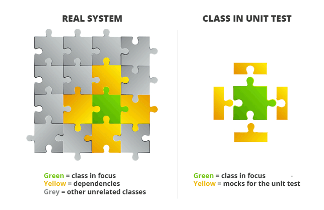
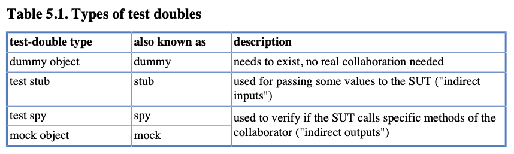
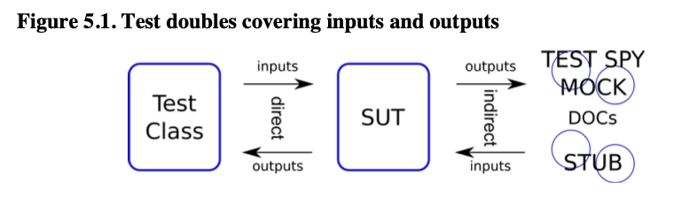
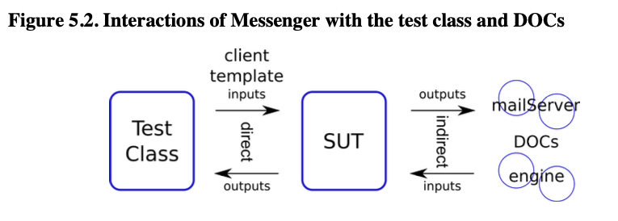
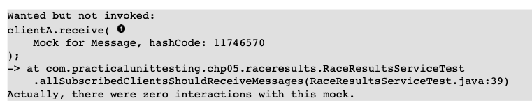
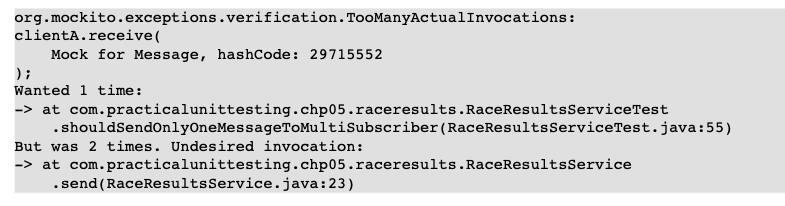
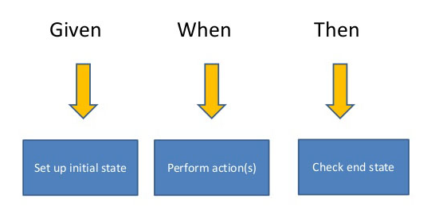

# Chapter 5 Mocks, Stubs, Test Spies



Mocks, bir bileşenin veya unit testin diğer unitlerle etkileşimini taklit etmek için kullanılan yapay nesneler veya
işlevlerdir. Bu nedenle, mocks'lar genellikle geçici olarak davranışları taklit etmek amacıyla kullanıldığından,
**state tutmazlar.**

**Mocks**, genellikle testler sırasında beklenen input ve outputları sağlamak için kullanılır. Bu beklenen input ve
outputlar, mocks üzerinde yapılandırılarak kontrol edilir. Ancak mocks, gerçek bileşenlerin yerine geçerken, genellikle
bir bileşenin iç durumunu (state) taklit etmek veya gerçek bir state tutmak için kullanılmazlar. State tutma genellikle
gerçek bileşenlerin görevidir. Bu nedenle, mocks'lar bir bileşenin davranışını taklit etse de, gerçek bir bileşenin
durumunu taklit etmek için kullanılmazlar. Eğer bir bileşenin durumunu taklit etmek gerekiyorsa, mocks yerine fake veya
stub gibi diğer test dublörü kullanılabilir.

**Stubs**, yazılım testlerinde kullanılan yapay bileşenlerdir ve genellikle belirli test senaryolarında beklenen
outputları döndürmek için önceden tanımlanmış yanıtlar sağlarlar. Stubs, mocks gibi davranışları taklit eder, ancak
genellikle daha basit bir yapıya sahiptirler ve genellikle sadece belirli bir output'u veya davranışı taklit etmek için
kullanılırlar. Stubs'ların temel amacı, bir bileşenin diğer bağımlılıklarını yerine getirmek ve test sırasında beklenen
davranışları sağlamaktır. Bununla birlikte, stubs'lar genellikle durum (state) tutma yeteneğine sahip **değillerdir**.

**"Test spies"**, yazılım testlerinde kullanılan bir başka test dublörüdür. Test spies, bir bileşenin davranışını
izlemek, kaydetmek ve raporlamak için kullanılır. Test spies, bir bileşenin diğer bileşenlerle olan etkileşimini
gözlemlemek için kullanılır. Test sırasında, bir bileşenin hangi metotların çağrıldığını, bu çağrıların hangi
parametrelerle yapıldığını veya çağrılan metotların hangi sıklıkta çağrıldığını kaydetmek için kullanılabilir. Bu
bilgiler daha sonra test sonuçlarını analiz etmek veya beklenen davranışı doğrulamak için kullanılabilir. Test
spies, test edilen bileşenin içine girmez ve durumunu taklit etmez. Bunun yerine, bileşenin diğer bileşenlerle olan
etkileşimini izler ve kaydeder.

Sınıflar insanlar gibi: sadece bazıları yalnız yaşayarak gelişir. Kitabın önceki bölümünde, test ettiğimiz sınıfların
kendi başlarına var olma gibi gerçekdışı bir varsayımı kabul etmiştik. Şimdi daha gerçekçi bir hale gelme ve ilişkilerin
zorlu sularda dalış yapma zamanı geldi. Göreceğiniz gibi, bu, kullanacağımız test teknikleri üzerinde ciddi bir etkiye
sahip olacaktır.

Şimdi işler ilginç hale gelecek. Karamsarlar muhtemelen her şeyin daha zor hale geldiğini eleştirecekler, optimistler
ise yeni ve heyecan verici zorluklar için heyecan duyacaklar. Hangi gruba ait olursanız olun, dikkatlice okuyun,
öğrendiklerinizi sorgulayın ve çok pratik yapın, çünkü burası gerçek unit testi zorluklarının başladığı yerdir.

Bölüm 2.2, bir SUT ile DOC'lar arasındaki çeşitli etkileşim türlerini gösterdi. Doğrudan input ve outputlarla nasıl başa
çıkacağımızı zaten tartıştık. Bu bölümde, geriye kalan SUT-DOC etkileşimlerini nasıl ele alacağımızı öğreneceğiz. Bunun
için test dublörlerini tanıtacağız, bu da bize birçok açıdan yardımcı olacaktır.

Genel olarak, test dublörleri, DOC'ları (Dependency of Component) yerine geçmek için kullanılır ve bu bize
aşağıdaki imkanları sağlar:

- SUT'un çalıştığı enviroment üzerinde tam kontrol elde edin,
- state testinin ötesine geçin ve SUT ile DOC'leri arasındaki etkileşimleri doğrulayın.

Test dublörleri ile karşılaşmadan önce, görevimizi büyük ölçüde kolaylaştıracak bir araç hakkında bilgi edinmeliyiz:
Mockito ile tanışma zamanı geldi. Şu anda teoriye çok fazla zaman harcamayacağız - sadece kısaca tanıtacağız. Daha
sonra, Mockito'yu eylem halinde izleyerek daha fazla bilgi edineceğiz - bu bölümdeki her örnekte kullanılacak.

## 5.1 Introducing Mockito

Başlangıç olarak belirtmek istiyorum ki, en azından birkaç iyi araç var ki bunlar test kodumuzda test dublörlerini
oluşturup kullanmamıza yardımcı olabilir. Ayrıca, bazı JVM dilleri - örneğin Groovy - dilin kendisine dahil edilmiş bazı
mocking yetenekleriyle birlikte gelir, bu da seçeneklerin alanını daha da genişletir. Ancak Java kullanıyoruz ve test
dublörlerininin dünyasına olan yolculuğumuzun başında Mockito en iyi seçenek gibi görünüyor.

Mockito, nispeten yeni bir framework'dur. Aslında, çok başarılı ve popüler bir mocking çatısı olan EasyMock'a dayanır.
Mockito, öncüsünden farklı olarak test spies'ların kullanımını teşvik ederek, çok daha temiz bir API ve okunabilir
hata mesajları sunar. Test spies'larına odaklanması sayesinde, zaten aşina olduğunuz arrange, act ve assert test kodunun
doğal sırasını korumanıza olanak tanır. Kullanımı oldukça sezgiseldir ve öğrenme eğrisi oldukça düzdür. Aynı zamanda,
karmaşık senaryolarda bile mükemmel bir şekilde uygun olması nedeniyle Mockito uzun süreli bir hizmet sunabilir.

Neyse ki, Mockito'nun syntax'i çok basit ve anlaşılır, bu yüzden uzun açıklamalardan kaçınabilir ve sadece
okunabilirliğinin tadını çıkarabiliriz. Daha sonra daha fazla bilgi edineceğiz, ancak şu anda bazı kod parçalarına
bakalım ve kısaca açıklayalım.

## 5.1.1 Creating test-doubles

Bir test dublörünü, normal bir Java nesnesi gibi düşünebilirsiniz. Benzersizliği, başka bir şey gibi davrandığı
gerçeğinden kaynaklanır: yani belirli bir türde bir nesne gibi. Önemli olan, bu imposter(sahtekar) üzerinde orijinal
sınıfın bir nesnesi üzerinde sahip olacağınızdan çok daha fazla kontrolünüz olmasıdır. Bu, testlerde test dublörlerinin
neden çok kullanışlı olduğunu açıklar.

Bölümün geri kalanında kullanacağımız çok basit bir arayüz;

```
public interface Car {
    boolean needsFuel();
    double getEngineTemparature();
    void driveTo(String destination);
}
```

Hayal edelim ki SUT'umuz (System Under Test) Car türünde bir DOC kullanıyor ve testlerimiz için bu DOC'un davranışını
tamamen kontrol etmemiz gerekiyor. Açıkçası, bir test dublörü kullanabilmek için öncelikle onu oluşturmamız
gerekmektedir (daha önce belirtildiği gibi, test dublörleri sonuçta normal Java nesneleridir). Ancak, onları
canlandırmak için new anahtar kelimesini kullanmıyoruz. Bunun yerine, Mockito veya başka bir özel framework'e onları
oluşturması için talepte bulunuyoruz.

Ilk olarak mockito dependency'lerini gradle icin ekliyorum;

```
testImplementation ("org.mockito:mockito-core:5.4.0")
```

```
Car myFerrari = Mockito.mock(Car.class);
```

Bu kod, bir test dublörü oluşturmak için org.mockito.Mockito sınıfını kullanır. Statik mock() methodu bir sınıfı argüman
olarak alır ve bu sınıfın bir nesnesini döndürür. Yukarıdaki kodda, Car türünde bir object oluşturulur. Mockito, hem
sınıfların hem de arayüzlerin test dublör'lerini oluşturmamıza olanak tanır. instanceOf operatörü aracılığıyla
oluşturulan nesnenin türünü kontrol etmeye çalışırsanız, bu nesnenin Car türünün geçerli bir örneği olduğunu
öğrenirsiniz.

Mockito'nun çeşitli yeteneklerini göstermek için testler kullanacağım.

```
public class CarTest {
    private final Car myFerrari = mock(Car.class);

    @Test
    void testIfCarIsACar() {
        assertNotNull(myFerrari);
    }

}
```

Bu test, test dublörü nesnesinin (myFerrari) Car türünün bir instance'i olduğunu kanıtlar.

Mockito, tüm test dublörü türlerini oluşturmak için mock() metodunu kullanır. Oluşturuldukları sırada bunlar arasında
ayrım yapılmaz. myFerrari nesnesi, dummy (sahte), stub (taklit) veya test spy (test gözetmeni) olabilir. Siz, bir
programcı olarak, beklenen davranışını ifade ederek ve eylemlerini doğrulayarak (veya doğrulamayarak) hangi rolü
oynadığına karar verirsiniz. test dublörü'ne sahip olmanın amacı, ona ne yapması gerektiğini söylemektir. Şimdi,
myFerrari nesnesini kullanmaya çalışırsanız, gerçekte herhangi bir müdahale olmaksızın bir şeyler yapabileceğini
keşfedersiniz. Özellikle, methodlarını çağırdığımızda bazı hazır (varsayılan) değerleri döndürebilir.

```
    @Test
    void testDefaultBehaviourOfTestDouble(){
        assertFalse(myFerrari.needsFuel(),"new test-double should return false as boolean");
        assertEquals(myFerrari.getEngineTemparature(),"new test-double should return 0.0 as double");
    }
```

Bu özellik - test dublör'lerinin bazı varsayılan değerleri döndürmesidir - Mockito'ya özgüdür. Aslında, bu, bu aracın
temelinde yatan belirli bir felsefenin bir tezahürüdür. Mockito tarafından oluşturulan test dublörü 'nice' olarak
kabul edilir, yani davranışları sıkı bir şekilde doğrulanmaz (varsayılan olarak). Mockito'yu kullanırken, etkileşimleri
doğrulamak için açıkça istemek zorundasınız. Bu, daha derinlemesine bazı sonuçları beraberinde getirir.

Diğer popüler araçlar, yani EasyMock ve JMock, varsayılan olarak 'strict' test dublörü kullanarak ters bir yaklaşım
benimser

## 5.1.2 Expectations

Tabii ki, yalnızca sıfır ve yanlış değerler döndürebilen bir nesne, testlerimiz için pek kullanışlı değildir. myFerrari
test dublörüne ne dediğimize uymasını öğretme zamanı geldi.

Varsayalım ki myFerrari test dublörü'nün yakıta ihtiyacı olup olmadığı sorulduğunda true değerini döndürmesini
istiyoruz. Bu nasıl yapılabilir;

```
    @Test
    void testDefaultBehaviourOfTestDouble(){
        assertFalse(myFerrari.needsFuel(),"new test-double should return false as boolean");
        when(myFerrari.needsFuel()).thenReturn(true);
        assertTrue(myFerrari.needsFuel());
    }
```

- Evet, zaten biliyoruz - Boolean için varsayılan dönüş değeri **false**'tur.
- Şimdi myFerrari'ye yakıt durumu sorulduğunda ne yapması gerektiğini söylüyoruz. when() yöntemi, org.mockito.Mockito
  sınıfının başka bir statik yöntemidir.
- Davranış değişti. Bu kez myFerrari true değerini döndürdü. needsFuel() metodunun ardışık tüm çağrıları da true
  değerini döndürecektir.

Örnek Mockito'nun çok okunabilir bir özelliğini de göstermektedir. Önemli kısım şudur:

```
when(myFerrari.needsFuel()).thenReturn(true);
```

sadece "şöyle" okunabilir. "Birisi myFerrari'ye needsFuel() sorduğunda true döndürmeli" şeklinde
okuyabiliriz.

Benzer bir sözdizimi kullanarak, test dublörü'ne exception fırlatma talimat'ı da verebiliriz.

Mocking framework'lerinin bu özelliği - talep üzerine exception fırlatma - uygulamanızın yürütülmesi sırasında meydana
gelebilecek tüm hataları simüle etmek için son derece kullanışlıdır. Özellikle third party component'lerle işbirliği
gerektiren olası senaryoları test ettiğinizde - örneğin veritabanları veya web servisleri gibi.

```
    @Test
    void throwException(){
        when(myFerrari.needsFuel()).thenThrow(new RuntimeException());
        myFerrari.needsFuel();
    }
```

Bu test de geçerlidir, çünkü myFerrari, needsFuel() metodu çağrıldığında false döneceği için exception fırlatır.

## 5.1.3 Verification

Şimdi, Mockito kullanarak test dublörü testlerimizde gereken bazı değerleri döndürmesini söyleyebileceğimizi biliyoruz.
Bu harika ve bu bilgiyi çok yakında kullanacağız. Ancak, test amaçlı olarak daha fazlasına ihtiyacımız var. SUT'un (
sahip olduğu test dublörü tarafından temsil edilen) bazı metodlarını çalıştırdığından emin olmak istiyoruz. Bunun
için, test dublörünün bazı metodlarının çağrılıp çağrılmadığını da doğrulamamız gerekiyor. Başka bir deyişle, SUT'un
indirect output'larını doğrulamak istiyoruz.

Dikkatli olun, çünkü bu an, gerçek etkileşim testlerinin dünyasına girdiğimiz andır! Şimdiye kadar, testlerimiz sadece
diğer işbirlikçileri belirtti. Beklentiler, "belirli bir işbirlikçiye yapılan bir çağrı gerçekleşirse, bu işbirlikçi X
veya Y yapmalı" şeklinde yorumlanabilir. Şimdi durum farklı. Belirli işbirlikçilerin metodlarının gerçekleştirilmesini
talep etmeye başlıyoruz. Bu, testlerimizin production koduna çok bağlı hale gelmesine neden olur, bu da sorun demektir,
çünkü testlerimiz kırılgan hale gelir - SUT'un uygulaması değişirse, testlerimizi yeniden yazmamız gerekecektir. Burada
izlenecek altın kural şudur: Eğer SUT'un bazı özellikleri state testi kullanılarak test edilemezse, yalnızca bir
interaction testi yazın.

Aşağıda gösterilen bir test dublörü davranışının doğrulanmasıyla ilgili başarılı bir girişimi sunar. İlk olarak
myFerrari'nin bazı metodlarını çağırır, ardından bunların çağrılıp çağrılmadığını doğrular. myFerrari'nin davranışını
kontrol etmek için org.mockito.Mockito sınıfının verify() adlı farklı bir statik yöntemi kullanılır. Test başarılı
geçer, çünkü istenen metodlar gerçekten çağrılmıştır.

```
    @Test
    void testVerification(){
        myFerrari.driveTo("Sweet home Alabama");
        myFerrari.needsFuel();

        verify(myFerrari).driveTo("Sweet home Alabama");
        verify(myFerrari).needsFuel();
    }
```

test dublörü'nün metodlarını çağırmak. Burada hiçbir özel durum yok: herhangi bir Mockito syntax'i yok, sadece normal
metod çağrıları.

Verify kısmı. Gerçekten myFerrari'nin Alabama'ya gitmesi istenip istenmediği ve birinin "Yakıt ihtiyacınız var mı?"
sorusunu sorması kontrol edildi.

Bir kez daha kod oldukça okunaklıdır: "myFerrari'nin drive() metodunun Alabama'ya gitmesi istendiğini doğrulayın."

Şimdi başka bir örneğe göz atalım. Bu sefer beklentiler karşılanmıyor.

```
    @Test
    void testVerificationFailure(){
        myFerrari.needsFuel();
        verify(myFerrari).getEngineTemparature();
    }
```

- Car tipindeki bir test dublörü'nün needsFuel() metoduna çağrı yapıldı.
- Ancak getEngineTemperature() metodunun çağrılması bekleniyordu! Bu kesinlikle işe yaramayacak ve başarısız olacaktır.

Hata mesajı oldukça açıktır. Mockito ayrıca kod satırları hakkında detaylı bilgi sağlar, bu nedenle sorunu bulmak
oldukça basittir.

Aşağıdaki örnek Mockito'nun sadece çağrılan metodları doğrulayabilmesi değil, aynı zamanda geçirilen parametrelere de
duyarlı olabilmesini gösterir.

```
    @Test
    void testVerificationFailureArguments(){
       myFerrari.driveTo("Sweet home alabama");
       verify(myFerrari).driveTo("Sweet home chicago");
    }
```

- myFerrari Alabama'ya doğru ilerledi.
- Ama chicago'ya gitmek istiyorduk

## 5.1.4 Conclusions

Şimdiye kadar Mockito'ya biraz baktık ve biliyoruz ki bize test dublörleri ile test yazmada yardımcı olabilir. Özellikle
Mockito aşağıdaki işlemleri yapabilir:

- farklı test dublörleri oluşturmak (örneğin, Car myFerrari = Mockito.mock(Car.class)),
- ...ki varsayılan olarak bazı önceden belirlenmiş değerler döndürür (örneğin, assertFalse(myFerrari.needsFuel())),
- onlara nasıl davranmaları gerektiğini söylemek (örneğin, when(myFerrari.needsFuel()).thenReturn(true) veya when(
  myFerrari.needsFuel()).thenThrow(new RuntimeException())),
- onların bazı metodlarının çağrıldığını doğrulamak (örneğin, verify(myFerrari).needsFuel())

Tam bir resim elde etmek için, Mockito'nun bazı sınırlamalarının da olduğunu belirtmek gerekir. Özellikle, belirli
tasarım standartlarına uymayan kodlarla çalışırken size yardımcı olmayabilir (özellikle, Mockito loosely coupled
kodlarla iyi çalışır)

## Types of Test-Double

Mockito ile ilgili temel bilgilere sahip olduktan sonra, bu bölümün gerçek konusuna geçebiliriz. test dublörü'lerinin
daha fazla bilgisini öğrenmek ve testlerde kullanmaya başlamak zamanı geldi. Unit testlerin amacı, kendi kodumuzun
doğruluğunu doğrulamaktır. İstediğimiz şey, web servisleri, dosya sistemleri, diğer modüller, veritabanları veya 3rd
party yazılımlar tarafından girişilen dikkat dağıtıcı unsurlardan bir parça kodu korumak ve sonra onun beklenildiği gibi
çalışıp çalışmadığını kontrol etmektir. Bu durumu elde etmek için, SUT'un (System Under Test) işbirlikçileri üzerinde
sıkı bir kontrol sağlanmalıdır. Bu şekilde, SUT'un izolasyonu sağlanarak test edilebilir, bu da unit testlerin önemli
bir özelliğidir Şimdi, bir sınıfın gerçek işbirlikçilerini yerine koymak için kullanılabilecek çeşitli test nesnelerine
bakalım.

Tüm bu nesneler, "test dublörü" adı altında gruplandırılır. Karşılaşacağımız dört test dublörü türü aşağıda Tablo
5.1'de özetlenmiştir. Tanımlar biraz kriptik gibi görünse de, her bir test dublörü türünü bazı örnek kodlarla
tartıştıktan sonra her şey açık olacaktır.



Figure 5.1, test stubs'larının, test spies'ların ve mocks'ların, test sınıfının SUT ve DOC'leri arasındaki iletişimin
farklı bir yönünü nasıl kapsadığını gösterir.



Bu verilere dayanarak şu gözlemleri yapabiliriz:

- Dummy ve stublar test ortamını hazırlamak için kullanılır. Bunlar doğrulama amacıyla kullanılmaz. Bir dummy, bir değer
  olarak iletilmek üzere kullanılır (örneğin, doğrudan bir method çağrısının parametresi olarak), bir stub ise SUT'a (
  Sistem Altında Test edilen bileşen) bazı veriler iletir ve onun Dokümantasyonlu Diğer Bileşenlerinden (DOCs) birini
  taklit eder.
- Test spies ve mocks, SUT ve DOC'lar (Dokümantasyonlu Diğer Bileşenler) arasındaki iletişimin doğruluğunu doğrulamak
  amacıyla kullanılır. Ancak, test kodunda nasıl kullanıldıklarında farklılık gösterirler ve bu nedenle farklı isimlere
  sahiptirler. Her ikisi de test-fixed de yer alabilir; ancak bu yalnızca ikincil bir amacıdır.
- SUT'un direct output'u için test dublörü kullanılmaz, çünkü yanıtlarını doğrudan gözlemleyerek doğrudan test
  edilebilir.

Teoride tüm test dublör'lerinin belirli rolleri ve sorumlulukları olduğunu belirtelim, ancak gerçek hayatta
programlamada durum böyle değildir. Genellikle bir test dublörü'nün birden fazla rolü olduğu ve hatta kendinizin bile
test kodu yazdığı durumlarla karşılaşabilirsiniz. Tipik olarak, bu durum test spies ve mocks ile sıkça gerçekleşir.
Bunlar, SUT'a indirect input'lar sağlamak için de sıklıkla kullanılır ve bu nedenle aynı zamanda bir stub rolünü de
üstlenirler.

**Fake** : Eksiksiz bir açıklama için, başka bir test dublörü türü olan "fake"i tanımlayalım. Fake, gerçek işbirlikçi
gibi neredeyse aynı işlevi görür, ancak bir şekilde daha basit ve/veya zayıftır (bu nedenle üretim ortamında
kullanılmaya uygun değildir). Aynı zamanda genellikle kullanım açısından daha "ucuzdur" (yani daha hızlı veya daha basit
bir şekilde kurulabilir), bu da testler için uygundur Tipik bir örnek, tam teşekküllü bir veritabanı sunucusunun yerine
kullanılan bellek içi bir veritabanıdır. SQL isteklerini oldukça iyi şekilde karşıladığından bazı testlerde
kullanılabilir; ancak üretim ortamında kullanmak istemezsiniz. Testlerde, fake, dummy ve stub gibi bir ortam parçası (
test fixture) olarak rol oynar ve doğrulama nesnesi değildir. Fakeler, unit testler yerine integration testlerinde
kullanılır, bu nedenle daha fazla detaya girmeyeceğiz.

## 5.2.1 Code To Be Tested with Test-Doubles

Şimdi test dublörü türlerini bildiğimize göre, onları kullanmaya başlayabiliriz. İlk olarak, test dublörlerinin test
sürecindeki rolünü göstermek için bazı kod satırlarını tartışalım.

Aşağıda ki kod, mesajların gönderilmesinden sorumludur. sendMessage() methodunun parametrelerinden bazı
verileri (örneğin, bir müşterinin e-postası) alır ve ardından işbirlikçilerine belirli eylemleri gerçekleştirmeleri için
talimat verir. Kod basit olmasına rağmen gerçek hayata oldukça yakındır (gerçek kodun, basitlik adına bazı argüman
kontrolü ve exception handling yapacağı düşünülür - ikisini de atlayacağız).

Not : Her bir test dublörü'nün faydalarını gerçekçi bir örnek kullanarak sunmak amaçlanmaktadır. Bir sınıfı unit
testlerle test etmek genellikle yeterli değildir: aynı zamanda daha yüksek seviyeli (örneğin, integration) testlere de
ihtiyaç duyabilirsiniz.

```
public class Messenger {
    private TemplateEngine templateEngine;
    private MailServer mailServer;

    /* Collaborators (İş birlikçiler) constructor'a inject oluyorlar */
    public Messenger(TemplateEngine templateEngine, MailServer mailServer) {
        this.templateEngine = templateEngine;
        this.mailServer = mailServer;
    }

    /* Bu method void döndürür ve Messenger nesnesinin state'ini değiştirmez, bu da onu state testi yaklaşımını
    kullanarak test etme imkanımız olmadığı anlamına gelir.*/
    public void sendMessage(Client client,Template template){
        String msgContent =
                /* Bizim gerçekten ilgilendiğimiz şey bu: Messenger ve işbirlikçileri arasındaki işbirliği. SUT'umuz,
                ortak işbilirçilerinin her birinde bazı methodlar çağırır ve ayrıca sendMessage() methodu client method
                parametresinden bazı veriler alır.*/
                templateEngine.prepareMessage(template,client);
        mailServer.send(client.getEmail(),msgContent);
    }
}
```

Bu kod, önceki tartışmamızda bahsettiğimiz nesne yönelimli sistemler hakkındaki konuşmamızı oldukça iyi yansıtıyor.
Messenger sınıfı, gerçek bir iş yapmak yerine mesajları dönüştürme ve iletim işlemlerini yönetmeye odaklanır. mailServer
ise sınıfımızın bir işbirlikçisi olarak gerçek işi yapmakla sorumludur, ancak muhtemelen mesajı bir 3rd party
kütüphaneye iletmektedir.



Figure 5.2'de gösterildiği gibi, işbirlikçiler SUT ile farklı şekillerde etkileşimde bulunurlar.

Bu sendMessage() methodunun test edilmesi zorlu bir durumdur. Herhangi bir değer döndürmez, bu yüzden çalışmasının
sonuçları doğrudan gözlemlenemez. Ayrıca, client veya template nesnesinin durumunu bile değiştirmez, bu nedenle bunları
doğrulama için kullanamayız. Yapabileceğimiz şey, gerçek bir templatEengine uygulamak ve gerçek bir mailserver
kurmaktır. Ayrıca, bir e-postanın teslim edilmesini doğrulamak için gerçek bir mail client'i kullanabiliriz.
Bu tür bir şey mümkündür, ancak bu bizi unit testlerden uzaklaştırarak integration testlerinin alanına taşır. Bu
integration testi için daha fazla hazırlık (test-fixture) gerektirir ve daha yavaş çalışır. Hata durumunda, hatanın
nerede olduğuna karar vermek çok daha zor olacaktır - SUT'ta mı, işbirlikçilerin kodunda mı yoksa belki veritabanı
depolama uygulamasında mı.

Şu anda amacımız bu sınıfı izole bir şekilde test etmek olduğundan, integration testlerinden başka bir şey düşünmemiz
gerekiyor. Eğer yalnızca SUT ve DOC'ların etkileşimlerini doğrulayabilseydik... O zaman beklediğimiz gibi çalıştığından
emin olabilirdik. Neyse ki, test dublörleri kullanarak bunu mümkün kılabiliriz. Onları kullanarak şunları yapabiliriz:

- tamamen SUT'nin çalışma context'ini kontrol etmek için kullanabiliriz.
- SUT ve DOC'lar arasındaki iletişimi dinlemek için kullanabiliriz.

Başlangıç olarak en basit olanı olan dummy ile başlayacağız ve daha sonra daha ilginç test dublörleri olan stub, test
spy ve mock ile devam edeceğiz. Sonunda, hepsinin birlikte nasıl çalıştığını ve geçerli bir test senaryosu oluşturduğunu
göreceğiz. Amacımız gerçekten sınıfı test etmek değil, her bir test dublörünün bize nasıl yardımcı olabileceğini
anlamaktır.

### What should be unit-tested?

Davranışı doğrulayan unit testlerini tartışırken, doğrulanması gereken şeyi anlamak oldukça önemlidir. Messenger
sınıfıyla ilgili olarak, yalnızca bir şeyi doğrulayabiliriz: mailServer'ın send() yönteminin, client parametresi ve
templateEngine işbirlikçisi tarafından sağlanan aynı argüman değeriyle çağrılıp çağrılmadığını doğrulamak. Neden sadece
bu? Çünkü bu, test edilen sınıfın tamamıdır! Daha önce tartışıldığı gibi, SUT'umuz bir "manager"dir - başkalarının
çalışmasını koordine ederken kendisi çok az iş yapar. Unit testiyle doğrulayabileceğimiz tek şey bu koordinasyon
bölümüdür.

## 5.2.2 The Dummy Object

Messenger class'ında ki sendMessage() methodunun template parametresine bakın. Bu, yalnızca başka bir yöntem olan
templateEngine.prepareMessage() için bir input parametresi olarak kullanılır. İşte burada bir dummy kullanılabilir.
Zaten org.mockito.Mockito sınıfının statik mock() yöntemine aşinayız. Bu method, bir Sınıfı bir argüman olarak alır ve
bu sınıfın bir nesnesini döndürür - bu durumda Template türünden bir nesne. Şimdi bu template nesnesini testlerimizde
kullanabiliriz: gerçek bir Template nesnesi için mükemmel bir dummy'dir

```
public class MessengerTest {
    /* Bir dummy object oluşturma. Ona, mock() yöntemi kullanarak oluşturulan gerçek bir nesneyi atıyoruz.*/
    Template template = mock(Template.class);
    /* SUT'nin methodunu, bir parametre olarak bir dummy template object'i kullanarak çalıştırma.*/
    sut.sendMessage(client,template);
}
```

Özetlemek gerekirse, bir testi yürütmek için sadece bir dummy object gereklidir, ancak gerçekten herhangi bir yararlı
işlem için gerekli değildir. Sadece "orada olması" gerekmektedir. Bazı durumlarda null yeterli olabilir, ancak genel
olarak istenen türde bir nesne oluşturmak için bir mocking framework kullanmak daha ileri görüşlü olacaktır.

Haklısınız. Deneyimlerime göre, dummy object'leri çok sık kullanmazsınız

Evet, fark etmiş olabilirsiniz, bir temmplate parametresine null değeri geçmek yeterli olabilir. Bu işe yarayabilir,
ancak genel olarak önerilmez. Test edilen methodun daha sonra bir argüman kontrol işlevselliği ile genişletilebileceği
olasıdır, bu durumda null değerleri kabul edilmeyecektir. Bu durumda testiniz bozulacak ve bu her zaman sinir bozucu
olacaktır. Bu geçici çözüm yerine, baştan itibaren null olmayan bir değer kullanmanızı öneririm.

## 5.2.3 Test Stub

Şimdi templateEngine işbirlikçisine bir göz atalım. Bu nesne, bir değer sağlamak için kullanılır (bir e-postanın
içeriği), böylece daha sonra mailServer e-posta gönderebilir. **Stub** tam olarak bu tür işbirlikler için kullanılır:
SUT'ye bazı değerler sağlayarak sınıfın indirect input'larıyla ilgilenmeye olanak tanır.

Dummy durumunda, sadece onu oluşturmanız gerekmektedir. Methodları hiç çağrılmaz veya çağrılanların sonucu önemli
değildir. Ancak bir stub kullanırken, methodları çağrıldığında hangi değerleri döndüreceğini belirtmek için ona talimat
vermemiz de gerekmektedir. Aşağıda gösterilecek olan örnek, bir stub oluşturmanın ve ona talimat vermenin nasıl
yapılabileceğini göstermektedir. Bu, zaten aşina olduğumuz Mockito'nun when() yöntemini kullanmaktadır

```
    void stubTest() {
        /* Stub oluşturma - geleneksel olarak, mock() yöntemi aracılığıyla yapılır. */
        TemplateEngine templateEngine = mock(TemplateEngine.class);
        /* templateEngine test stub'ı SUT'ye enjekte edilir, böylece kullanılabilir hale gelir. */
        Messenger sut = new Messenger(templateEngine, mailServer);

        /* templateEngine test dublörünün gerçekleştirmesi gereken davranışı when() yöntemi kullanarak
        tanımlayabiliriz.*/
        when(templateEngine.prepareMessage(template,client)).thenReturn(MSG_CONTENT);
        /* SUT'nin methodunun yürütülmesi, SUT'nin stub'ımızın prepareMessage() methodunu çağırmasına neden olacaktır.*/
        sut.sendMessage(client,template);
    }
```

Bir stub oluştururuz ve ardından şu talimatı veririz: "Birisi sana belirli bir template ve client ile bir mesaj
hazırlamanı istediğinde, lütfen MSG_CONTENT değerini dön". Mockito, stub'ın istediğimiz şekilde davranmasını
sağlayacaktır. Indirect input üzerinde kontrol sağladık. Artık templateEngine'den SUT'ye herhangi bir değer
geçirebileceğimiz testler yazabiliriz.

Test stublar, işbirlikçiler tarafından fırlatılan exception'ları simüle etmek için sıklıkla kullanılır. Böyle bir
expection-oriented test dublörü ayrı bir isim ile tanıtır - bir sabotajcı. Devepolerlar ve testçiler arasında bu
ismin popülerlik kazandığını fark etmedim, bu yüzden sadece test stub terimini kullanacağım.

## 5.2.4 Test Spy

Şu anda eksik olan tek şey, indirect output'ları da kontrol altına alacak bir genişletme. Bu, SUT'nin işbirlikçilerine
gönderdiği mesajları nasıl kontrol edeceğimizi henüz bilmediğimiz anlamına geliyor. Hem mock'lar hem de test spy'lar bu
görevde bize yardımcı olabilir. İlk olarak test spy'a bir göz atalım.

SUT'nin tek indirect output'u, mailServer'ın send() yöntemiyle iletişimidir. Bu, test spy kullanarak
doğrulayabileceğimiz bir şeydir. Mockito'nun verify() yöntemi kullanılarak bunu yapmanın nasıl olduğunu gösteren örnek
aşağıda yer almaktadır.

```
    void testSpyTest(){
        /* TestSpy mock aracılığı ile yaratıldı */
        MailServer mailServer = mock(MailServer.class);

        /* mailServer test spy'ı, SUT'ye enjekte edilir, böylece kullanılabilir hale gelir.*/
        Messenger sut = new Messenger(mailServer,templateEngine);

        /* sut'un sendMessage methodu calistirilir */
        sut.sendMessage(client,template);

        /* SUT'nin sendMessage() methodu yürütülürken ne olduğunu doğrulama. SUT gerçekten verilen parametrelerle
        mailServer'ın send() yöntemini çağırdı mı? Doğrulama işlemini yapan kodun yine okuması oldukça kolaydır:
        "mailServer'ın send() yönteminin verilen e-posta ve mesaj içeriği ile çağrıldığını doğrula."*/
        verify(mailServer).send("some@email.com",msgContent);
    }
```

Örneğimizde test spy'ı kullanarak SUT'nin eylemlerini gerçekten doğrulayabiliriz. Bu, gerçek testin yapıldığı yerdir:
SUT'nin beklediğimiz şekilde davranıp davranmadığını kontrol ederiz.

## 5.2.5 Mock

Mocks hakkında en azından bir şey söylemem gerektiğini hissediyorum. Fonksiyonel olarak, bir mock ve bir test spy
arasında pek fark yoktur. Bir test spy'ın yapabileceği şeyleri bir mock da yapabilir (ve tam tersi). Fark, sözdiziminde
ve test yöntemlerinizdeki kod akışında yatar. Mock'un ve test spy'ın temel amacı aynıdır: nesneler arasında iletişimin
gerçekleştiğini (yani bazı yöntemlerin çağrıldığını) doğrulamaktır.

Örneğimize gelince, beklenen davranışı doğrulamak için bir test spy kullanmaya karar verdiğimiz alanı tam olarak
kapsayan bir mock kullanabilirdik.

## 5.3 Putting it All Together

Önceki bölümlerde, bu kodu test etmek için her bir test dublörünün - dummy, stub, test spy ve mock - rolünü tartıştık.
Şimdi birlikte çalışırken onları nasıl kullanacağımızı gösterme zamanı geldi. Ancak kod gösterilmeden önce birkaç
uyarıda bulunmak istiyorum.

Böyle bir kodu unit testler kullanarak test edebiliyor olmamız çok iyi. SUT'yi çevreden izole etmeyi, direct ve
indirect inputları ve outputları kontrol etmeyi nasıl bildiğimiz gerçekten harika. Stubs, test spy'lar, dummies ve
mock'ların arasındaki farkı öğrenmek mükemmel. Bu bilgiyi birçok kez kullanacak ve sizi daha iyi bir geliştirici
yapacak - bundan eminim. Ancak, hangi seviyede (hangi tür testle) hangi bölümün test edilmesi gerektiği kararı kolay bir
karar değil. Aslında, bunun için bir şeye ihtiyaç var: deneyim.

Messenger class'ını test etmek isteseydim, unit ve integration testlerinin bir karışımını tercih ederdim. Kesinlikle
unit testlerini kullanırdım - gerçek bileşenleri kullanırken tetiklemesi zor olan tuhaf şeyleri kontrol etmek için.
Örneğin, clientDAO'nun beklenmedik sonuçlar döndürmesini sağlardım - örneğin, NoSuchUserInDatabase türünde bir exception
fırlatma gibi. Unit testleri, test dublörleri ile birlikte bu tür doğrulamalar için harika bir şekilde çalışır.
Aynı zamanda, kodumun gerçekten e-postaların gönderilmesine yol açtığını görmek için integration testlerini kullanırdım.
Bu şu anlama gelir ki:

- bir e-posta template'i hazırlamak ve TemplateEngine sınıfını implemente etmek, böylece gerçekten güzel bir e-posta
  mesajı hazırlayabilir.
- MailServer sınıfını implemente etmek, böylece e-postalar gerçekten gönderilebilir hale gelir.

Ancak o zaman, birkaç unit ve integration testi yazdığımız için huzurlu bir şekilde yatağımızda uyuyabilir ve
kodumuzun her şeyle yolunda olduğundan emin olabiliriz. Bunun söyledikten sonra, şimdi bir unit testi için iyi bir
örneğe geçelim. Aşağıda gösterilen bu test, böyle bir kod için unit testleri yazma becerimizi gösterecektir. Test
dublörlerini nasıl kullanacağımızı kanıtlar. Ancak, akılda tutmamız gereken şey, burada ele alınan işlevselliği tamamen
kapsamak için yazılması gereken birçok diğer test - unit, integration ve end-to-end - içinden seçilmiş yalnızca tek bir
test olduğudur.

```
public class MessengerTest {

    /* Test icin bazı static degerler kullaniyoruz */
    private static final String CLIENT_EMAIL = "some@email.com";
    private static final String MSG_CONTENT = "Dear John! You are fired";

    @Test
    void shouldSendEmail(){
        /* Test dublörlerinin oluşturulması için static mock() yönteminin kullanılması. Bu noktada, birbirlerinden
        farklı değiller.*/
        Template template = mock(Template.class);
        Client client = mock(Client.class);
        MailServer mailServer = mock(MailServer.class);
        TemplateEngine templateEngine = mock(TemplateEngine.class);

        /* SUT'nin oluşturulması. Burada mock() methodunu kullanmak istemiyoruz, gerçek bir test yapmak istiyoruz!
        DOC'ların SUT'ye dependency'lerin inject edilmesi.*/
        Messenger sut = new Messenger(templateEngine,mailServer);

        /* SUT'nin gereksinimlerini karşılamak için DOC'ların stublanması (her bir DOC'ın ne gerektirdiğini anlamak
        için Messenger sınıfına bakın).*/
        when(client.email()).thenReturn(CLIENT_EMAIL);
        when(templateEngine.prepareMessage(template,client)).thenReturn(MSG_CONTENT);

        /* SUT methodunun calıştırılması */
        sut.sendMessage(client,template);

        /* SUT'nin davranışının doğrulanması: "mailServer DOC üzerinde diğer işbirlikçilerden elde edilen
        CLIENT_EMAIL ve MSG_CONTENT ile send() yöntemi çağrıldı mı?"*/
        verify(mailServer).send(CLIENT_EMAIL,MSG_CONTENT);
    }
}
```

Test'in geçebilmesi için class'ları create ediyorum;

```
public class Template {
}

public record Client(String email) {
}

public class MailServer {
    public void send(String email, String msgContent) {
    }
}

public class TemplateEngine {
    public String prepareMessage(Template template, Client client) {
        return "Dear John! you are fired";
    }
}
```

## 5.4 Example: TDD with Test Doubles

Şimdi, TDD ve test dublör'lerini öğrendiğimiz iki teknikle entegre edilen bir örneği ele alalım.
Bu örnek, yarış sonuçlarını ilgilenen taraflara bildiren bir hizmetin nasıl test edileceğini ve uygulanacağını
göstermektedir. Uygulamanın fikri oldukça açıktır. Subscribe olunmasına izin veren bir bildirim hizmeti vardır. Hizmet,
tüm
Subscribara mesajlar göndermelidir. Ve, temel olarak, bu kadar.
Genel olarak, sistem bileşenleri arasında sıkı bir bağımlılıktan kaçınmak iyi bir şeydir. Bu kurala uygun olarak,
subscriber'ların hizmet hakkında mümkün olduğunca az şey bilmelerini ve bunun tersini yapmayı istiyoruz. Bu sonucu elde
etmek için, publish/subscribe tasarım desenini kullanabiliriz, bu da tam olarak bunu yapar: publisherları
subscriber'lardan ayrıştırır.

İlk olarak, RaceResultsService sınıfımız için bazı gereksinimleri tartışalım:

- Client'ların subscribe olabilmesini sağlamalıdır (bu, mesajları almaya başlamaları anlamına gelir).
- Subscribe olanların unsubscribe olmalarını sağlamalıdır (bu, mesaj almaya son vermeleri anlamına gelir).
- Her yeni mesaj geldiğinde subscribe olanlara mesajları iletmelidir

Bu basit gereksinimler, biraz sağduyuyla birlikte, bize zaten birçok test durumu sağlar. İlerleyen bölümlerde
aşağıdakileri uygulayacağız:

- Eğer client subscribe değilse, hiçbir mesaj alması gerekmemektedir.
- Client subscribe ise, her gelen mesajı bir kez (ve sadece bir kez) almalıdır.
- Birden fazla client subscribe ise, her biri her gelen mesajı almalıdır.
- Aynı client tarafından ardışık subscribe istekleri gönderildiğinde (hiçbir şey olmaz), görmezden gelinmelidir.
- Client unsubscribe olursa, ona artık mesaj gönderilmemesi gerekmektedir.

RaceResultsService (SUT) öğesini test edeceğiz ve doğru subscribe'lara (DOCs) mesaj gönderdiğinden emin olacağız. İlk
bakışta, tartışılan işlevselliği uygulamak için en az üç türün olması gerektiği gibi görünüyor. İlk olarak,
RaceResultsService sınıfından bir nesneye (SUT) sahip olmalıyız. Ardından, subscribe olabilen, unsubscribe olabilen ve
mesaj alabilen bir Client türü oluşturmamız gerekmektedir (bu tür nesneler, DOCs rolünü oynayacaktır). Ayrıca, race
result'larının servisten subscribe olan client'lara iletilen bir Message türüne de ihtiyacımız olacak.

Bu işlevselliği uygularken TDD yaklaşımını izleyeceğiz. Bu süreçte Mockito hakkında da birkaç şey öğreneceğiz.

## 5.4.1 First Test: Single Subscriber Receives Message

İlk test, tek bir client'in RaceResultsService'ye Subscribe olduğunda mesajları alıp almadığını doğrulamayı amaçlar.
Bu test aynı zamanda başka bir önemli rol de oynar, çünkü onu yazmak bize her şeyi düzgün bir şekilde yerleştirmemize
yardımcı olur. Gerçek bir test yapmadan önce bazı test kodu yazmak, RaceResultsService'nin temel yapısını ve DOCs'nin
interface'lerini oluşturmamıza olanak tanır. Aslında, gerçekten bir şeyleri test edebileceğimiz bir süre daha olacak.
Testimize aşağıda gösterildiği gibi, SUT'nin oluşturulmasıyla başlıyoruz.

```
    @Test
    void subscribedClientShouldReceiveMessage(){
        RaceResultService raceResultService = new RaceResultService();
    }
```

Test'i çalıştırıyorum ve faili alıyorum. RaceResultService isimli class yok;

```
public class RaceResultService {
}
```

Fonksiyonelliği test etmek için ele alınan iki diğer türü tanıtmamız gerekmektedir: Client ve Message. DOC's

```
    @Test
    void subscribedClientShouldReceiveMessage(){
        RaceResultService raceResultService = new RaceResultService();
        Client client = mock(Client.class);
        Message message = mock(Message.class);
    }
```

Client ve Message test dublör'leri, her ikisi de Mockito.mock() yöntemi kullanılarak oluşturulur. Bu
noktada, rolleri henüz tanımlanmamıştır - ileride dummies, stubs veya test spies olabilirler.

Bu noktada IDE, Message ve Client tiplerinin henüz mevcut olmadığını ve her iki tipi de oluşturmayı öneriyor. Soru şu
ki, bunlar arayüzler olarak mı yoksa sınıflar olarak mı oluşturulmalıdır? **"Koda bir uygulama yerine bir interface ile
yaklaşma"** temel kuralını izleyerek, ilk seçeneği tercih ederim. Bu, boş iki interface'in oluşturulmasına yol
açar

```
public interface Client {
}

public interface Message {
}
```

Şimdi gerçek testi yazma zamanı geldi. Aşağıda sunmak istediğim işlevsellik şunlardır:

- client service'e subscribe olur
- service Subscribe olan client'a bir mesaj gönderir.

```
    @Test
    void subscribedClientShouldReceiveMessage(){
        RaceResultService raceResultService = new RaceResultService();
        Client client = mock(Client.class);
        Message message = mock(Message.class);

        raceResultService.addSubscriber(client);
        raceResultService.send(message);

        verify(client).receive(message);
    }
```

- client service'e subscribe olur
- raceResultService'i tum client'lara mesaj gonderir,
- verify kısmı : subscribe olan client'in mesaj aldığından emin olmak

Evet, bu test senaryosunda, client test dublörü, client'in mesajı alıp almadığını doğrulamak için bir test spy olarak
görev yapar, diğer bir test dublörü olan mesaj nesnesi ise davranışının doğrulanmadığı ve SUT'nin herhangi bir bilgiye
ihtiyaç duymadığı bir sahte nesnedir. Sadece diğer nesneler arasında iletilmektedir.

Test'i calistirdigimda fail alacagim cunku client ve raceResultService icerisinde methodlarım yok

```
public interface Client {
    void receive(Message message);
}
```

```
public class RaceResultService {
    public void addSubscriber(Client client){};
    public void send(Message message){};
}
```

Test derlenir, bu yüzden çalıştıralım. Exception mesajı - açıkça işlevin çalışmadığını gösteriyor. Client herhangi bir
mesaj almadı. Çok iyi! Bu, gerçekten TDD'nin RED aşamasında olduğumuzu gösterir. TDD yaklaşımını takip ederek,
başarısız olan testi karşılayan "çalışan en basit şeyi" uygulayalım. Aşağıdaki kod böyle bir uygulamayı gösteriyor.

```
public class RaceResultService {
    private Client client;
    public void addSubscriber(Client client){
        this.client = client;
    };
    public void send(Message message){
        client.receive(message);
    };
}
```

Bir kez daha, bu kodun nasıl değiştirileceğini hayal edebilirim ve hatta nasıl değiştirileceğini tahmin edebilirim (
örneğin, tek bir client alanı yerine bir client koleksiyonu kullanarak). Ancak, bu bilgiyi kullanmıyorum. Şu anda
kodlamak, YAGNI (You Ain't Gonna Need It) prensibinin bir örneği olur. Gerçekten yapmam gereken, testin geçmesini
sağlamaktır (küçük adımlarla ilerlemeyi hatırlayın). Yukarıda gösterilen uygulama, bu hedefi başarıyla gerçekleştirir.
Şimdilik mükemmel olarak kabul edilebilir ve herhangi bir değişiklik gerektirmez.

Testin yürütülmesi, bu uygulamanın şu an için yeterli olacağını garanti ediyor.

Sonraki testi uygulamadan önce, biraz zaman harcayarak kodu yeniden düzenlemeye ve daha okunabilir hale getirmeye karar
verdim. Şu ana kadar yazılan kod için pek yapılacak bir şey yok. Sınıflar ve interface'ler çok kısa (kopyalanmış kod
parçaları yok, vb.) ve mevcut method ve sınıf isimlerini beğeniyorum. Bu noktada, sadece Javadocs yazmanızı öneririm:
özellikle, RaceResultsService sınıfı için, çünkü bu kodun (iş açısından) önemli bir bölümüdür.

Tek bir client'a mesaj gönderildiğini biliyorum, şimdi bu işlevin birden fazla Subscriber için de çalışıp çalışmadığını
test etmek istiyorum

İkinci test metodunu (allSubscribedClientsShouldRecieveMessages()) ilk test metodunun
(subscribedClientShouldReceiveMessage()) içeriğini kopyalayarak oluşturdum. Ardından orada bazı değişiklikler yaptım.
Kopyala-yapıştır tekniği potansiyel olarak tehlikeli olabilir, bu yüzden testin istediğim şekilde çalıştığından emin
olmak için tekrar kontrol etmem gerekiyor.

```
    @Test
    void allSubscribedClientsShouldRecieveMessages(){
        RaceResultService raceResultService = new RaceResultService();
        Client clientA = mock(Client.class,"clientA");
        Client clientB = mock(Client.class,"clientB");
        Message message = mock(Message.class);

        raceResultService.addSubscriber(clientA);
        raceResultService.addSubscriber(clientB);
        raceResultService.send(message);

        verify(clientA).receive(message);
        verify(clientB).receive(message);
    }
```

Eski test (yalnızca tek bir Subscriber'a mesaj göndermeyi doğrulayan test) dokunulmamış olarak bırakılıyor, bunun
gereksiz gibi göründüğü söylenebilir. Ancak, onu korumaya devam edeceğim, böylece her zaman bu işlevin tek bir
Subscriber için çalışacağından emin olabilirim.

Yukarıda ki test, service'in birden fazla Subscriber için çalışıp çalışmadığını doğrular.

Yeni testi uygulamak için, Client sınıfının daha fazla test dublörüne ihtiyacım var. Lütfen, işler yolunda gitmediğinde
test dublörlerini ayırt etmemize yardımcı olacak mock() metodunun ek String parametresine dikkat edin.

Daha önce tartışılan testin durumunda olduğu gibi, hem clientA hem de clientB nesneleri **test spy**'leri olarak
kullanılırken, message ise bir **dummy**'dir.

Bu nadir durumlardan biri, "numaralı" değişken isimlerinin (clientA, clientB) kullanımını haklı buluyorum. Genellikle
tüm değişkenlere anlamlı isimler vererek biraz bilgi iletmeye çalışırım (örneğin, vipClient veya clientWithZeroAccount
gibi), ancak bu sefer sadece iki farklı client olduğunu söylemek istiyorum. Bu nedenle, clientA ve clientB bana uygun
geliyor.



Ek String parametresi sayesinde, exception mesajı bize tam olarak bildirir ki message'in clientA'ya gitmesi gerekiyordu.

Evet, açıkça RaceResultsService sınıfının addSubscriber() ve send() yöntemleri birden fazla client üzerinde çalışamıyor.
Aşağıda olası bir düzeltme gösterilmiştir.

```
public class RaceResultService {
    private final Collection<Client> clients = new ArrayList<>();
    public void addSubscriber(Client client){
        clients.add(client);
    };
    public void send(Message message){
        clients.forEach(client->client.receive(message));
    };
}
```

Güncellenmiş implementasyon, bir Subscriber yerine birden çok Subscriber'i depolamak için bir Collection kullanır. Şimdi
test geçiyor. Subscriberlara mesaj gönderme temel işlevi çalışıyor.

### Refactoring

Production kodu iyi görünüyor, ancak test kodunun gerçekten yeniden düzenlenmesi gerekiyor. Her test metodunda SUT ve
DOC'ların oluşturulmasıyla ilgili açık bir tekrar vardır. Daha önce tartışıldığı gibi, burada iki seçeneğimiz var:
JUnit'in yürütme modelinden yararlanmak veya yeni bir setUp() yöntemi tanıtmak.

```
public class RaceResultsServiceTest {

    private final RaceResultService raceResultService = new RaceResultService();
    private final Client clientA = mock(Client.class,"clientA");
    private final Client clientB = mock(Client.class,"clientB");
    private final Message message = mock(Message.class);


    @Test
    void subscribedClientShouldReceiveMessage(){
        raceResultService.addSubscriber(clientA);
        raceResultService.send(message);

        verify(clientA).receive(message);
    }

    @Test
    void allSubscribedClientsShouldRecieveMessages(){
        raceResultService.addSubscriber(clientA);
        raceResultService.addSubscriber(clientB);
        raceResultService.send(message);

        verify(clientA).receive(message);
        verify(clientB).receive(message);
    }
}
```

Şimdi test metodları çok daha basit ve oluşturma kodu tekrar etmiyor.

## 5.4.3. The Third Test: Send Messages to Subscribers Only

Bundan sonra, Subscribe olmayan client'ların hiçbir mesaj almadığından emin olmamız gerekiyor. Şu ana kadar yazılan
kodlara baktığımda, testin anında geçeceğini düşünüyorum; yine de test edilmesi gerekiyor (çünkü daha sonra kodda bazı
değişiklikler yapılırsa, bu işlevin bozulmaması önemlidir).

```
    @Test
    void notSubscribedClientShouldNotReceiveMessage(){
        verify(clientA,never()).receive(message);
        verify(clientB,never()).receive(message);
    }
```

Bu test, Mockito'nun yeni bir özelliğini sunuyor: bir şeyin hiç gerçekleşmediğini kontrol etme yeteneği. Bu, statik
never() yöntemi kullanılarak yapılır. Kod çok okunabilir ("clientA'nın hiçbir zaman bir mesaj almadığını doğrulayın")
şekildedir. Test hemen geçer

Son testin anında geçmesi, bizi biraz tedirgin etmeli. Bu bir uyarı işaretidir. Bu durum, testin başka testler
tarafından zaten doğrulanan şeyleri tekrarladığı anlamına gelebilir. Ancak burada durum böyle değil. Başka bir olasılık
ise çok "defansif" bir şekilde test yapıyor olmamızdır. Bu, aslında orijinal gereksinimlerin kapsamı dışında olan kötü
şeylerden kendimizi korumaya çalıştığımız anlamına gelir. SUT'un bir şey yapmadığını test etmek genellikle sorgulanır.
Bizim durumumuzda, Subscribe olmayan client'ların mesajı almayacağına dair doğrudan bir gereksinim yok; ancak buna
mantıklı bir ek yapmayı ve böyle bir testin meşru olduğunu düşünüyorum. Ancak bu bir subjektif konudur ve burada farklı
bir görüşe sahip olabilirsiniz.

Şimdi test koduna bir süre bakıyorum. Orada bir tür bir desen görüyorum. Ardışık testler, SUT'ya bir, iki veya hiç
Subscriber olmadığında ne olduğunu doğrular. Bu deseni daha belirgin hale getirmek için testlerin sırasını yeniden
düzenledim

```
public class RaceResultsServiceTest {
    private final RaceResultService raceResultService = new RaceResultService();
    private final Client clientA = mock(Client.class, "clientA");
    private final Client clientB = mock(Client.class, "clientB");
    private final Message message = mock(Message.class);

    // Zero subscribers
    @Test
    void notSubscribedClientShouldNotReceiveMessage() {
        verify(clientA, never()).receive(message);
        verify(clientB, never()).receive(message);
    }

    // One subscriber
    @Test
    void subscribedClientShouldReceiveMessage() {
        raceResultService.addSubscriber(clientA);
        raceResultService.send(message);

        verify(clientA).receive(message);
    }

    // two subscribers
    @Test
    void allSubscribedClientsShouldRecieveMessages() {
        raceResultService.addSubscriber(clientA);
        raceResultService.addSubscriber(clientB);
        raceResultService.send(message);

        verify(clientA).receive(message);
        verify(clientB).receive(message);
    }
}
```

Testlerde ilerlemenin net bir şekilde görünmesi, test edilen sistemin davranışını ve gereksinimlerini anlamamıza
yardımcı olur.

## 5.4.4. The Fourth Test: Subscribe More Than Once

Şimdi, Subscriberlarin birden fazla kez Subscribe olduğunda RaceResultsService'in davranışını doğrulayalım. Bu durum,
SUT'un normal, makul kullanım yolundan biraz dışarıda olsa da mümkündür ve test edilmelidir. Bir Subscriber'in tekrar
Subscribe olduğunda yalnızca bir mesaj almasını doğrulayan bir testi göstermektedir

```
    @Test
    void shouldSendOnlyOneMessageToMultiSubscriber(){
        raceResultService.addSubscriber(clientA);
        raceResultService.addSubscriber(clientA);
        raceResultService.send(message);

        verify(clientA).receive(message);
    }
```

Varsayılan olarak, Mockito, bir yöntemin tam olarak bir kez çağrıldığını doğrular. Testi çalıştırdıktan sonra,
uygulamamızın beklenildiği gibi davranmadığı ortaya çıktı.



Bu sorunu çözmek için RaceResultsService sınıfında List yerine Set kullanarak düzeltme yapılabilir. Bir Set, yinelenen
öğelere izin vermez ve bu durumu istemediğimiz bir davranıştır.

```
public class RaceResultService {
    private final Collection<Client> clients = new HashSet<>();

    public void addSubscriber(Client client) {
        clients.add(client);
    }

    public void send(Message message) {
        clients.forEach(client -> client.receive(message));
    }
}
```

Set yinelenen object'lere izin vermediği için testimiz başarılı olacaktır

### Mockito: How Many Times?

Yukarıda ki testimize geri dönelim ve Mockito hakkında yeni bir şey öğrenelim. Bu kod, client'in receive() methodunun
çağrılıp çağrılmadığını doğrulayan tek bir satır içeriyor. Daha kesin olmak gerekirse, bu methodun sadece bir kez
çağrılıp çağrılmadığını Mockito kullanarak doğruluyor.

```
verify(clientA).receive(message);
```

Başka bir değer belirtmek isterseniz, Mockito sınıfının başka bir statik yöntemini kullanabilirsiniz: times(), örneğin:

```
    @Test
    void shouldSendOnlyOneMessageToMultiSubscriber(){
        raceResultService.addSubscriber(clientA);
        raceResultService.addSubscriber(clientA);
        raceResultService.send(message);

        verify(clientA,times(3)).receive(message);
    }
```

Test fail verir cunku methodu 3 defa cagirir;

## 5.4.5. The Fifth Test: Remove a Subscriber

Kalan şey, bir client'in UnSubscribe olduktan sonra herhangi bir mesaj almamasını sağlamaktır. Böyle bir test, mevcut
testlere dayanarak oluşturulabilir - yani Subscribe olan bir client'in mesajları aldığını kanıtlayan testlere. Bu testin
uygulaması aşağıda sunulmuştur;

```
    @Test
    void unsubscribedClientShouldNotReceiveMessages(){
        raceResultService.addSubscriber(clientA); (1)
        raceResultService.removeSubscriber(clientA); (2)
        raceResultService.send(message);

        verify(clientA,never()).receive(message); (3)
    }
```

Testi çalıştırıyorum ve hemen fail'i alıyorum. Çünkü removeSubscriber methodum mevcut değil

1 - Bu kod satırından sonra clientA'nın mesaj almaya başlaması gerektiğini biliyoruz. Bu bilgimiz, bu davranışı
doğrulayan diğer testlere (yani subscribedClientShouldReceiveMessage()) dayanmaktadır.

2 - Ancak removeSubscriber() methodunun bu davranışı değiştirmesini istiyoruz

3- ...bu nedenle clientA hiçbir mesaj almayacak. Yine, bu "negatif" doğrulama never() yöntemi kullanılarak yapılır.

RaceResultService class'ımda eksik olan methodu yerine yerleştiriyorum;

```
public void removeSubscriber(Client client){
}
```

Testimi tekrar çalıştırıyorum ve faili alıyorum. Çünkü removeSubscriber methodumu implemente etmedim

```
    public void removeSubscriber(Client client){
        clients.remove(client);
    }
```

Testim başarılı bir şekilde çalışıyor. Bu işlevsellik, eldeki görevi tamamlar. Planlanan tüm testler yazıldı ve hepsi
başarılı oldu. Şimdi öğrendiklerimizi özetlemenin zamanı geldi.

## 5.4.6. TDD and Test-Doubles - Conclusions

RaceResultsService örneği, nesneler arasındaki etkileşimleri doğrulamak için test dublörlerini nasıl kullanacağımızı
gösterdi. Test spy sayesinde verilen işlevselliği uygulayabildik. Test-first kodlama ve yol boyunca refactor
yaparak TDD yaklaşımını takip ettik. Kodlama şeklimizle ve çabalarımızın sonuçlarıyla ilgili bazı ilginç noktalar
bulunmaktadır.

### More Test Code than Production Code

Bir ilginç nokta, yazılan kod miktarıydı. Yaklaşık olarak, üretim koduyla karşılaştırıldığında test kodunun yaklaşık
olarak iki katı kadarını yazdık (JavaNCSS9 ile sayıldı). Daha fazla test yazıldığında - ve daha önce belirtildiği gibi,
birkaç ek test eklemek mantıklı olur - test kodu açısından sonuç daha da olumlu olur. Bu beklenmedik bir durum değil.
Test first kodlama yaparken ve detaylı bir şekilde test yaparken, bu tür bir test-to-code oranını bekleyebilirsiniz.

### The Interface is What Really Matters

Yazdığımız kodla ilgili ilginç bir gerçek, işbirliği yaptığımız sınıflardan hiçbirini uygulamamış olmamızdır. Hem
Message hem de Client sınıfları uygulanmadı. Bu, kullanıldıkları sayı göz önüne alındığında oldukça garip bir durumdur.
Bununla birlikte, sadece interface'lerine sahip olmamız yeterli oldu.

İşte buradaki önemli nokta! Bu, RaceResultsService üzerinde çalışırken, takım arkadaşlarınızın Message ve Client
sınıflarını aynı anda kodlaması anlamına geliyor - tabii ki interface'ler üzerinde anlaşmaya varmış ve onlara sadık
kalınmışsa. Bu, böyle basit görevleri ekip üyeleri arasında yaymanız gerektiği anlamına gelmez, ancak bu tür bir şeyi
yapma olasılıklarının olduğunu bilmek önemlidir. Client ve Message gibi basit sınıflar üzerinde çalışırken büyük bir
fark yaratmayabilir, ancak service'lerinizi ve DAO katmanlarınızı ayrı ayrı (hatta aynı anda) kodlayabilmenin yardımcı
olduğu kesindir.

Başlangıçta bir interface'ler başlamak, başka bir avantajı da beraberinde getirir: yol çalışmalarıyla benzerlik göz
önüne alındığında, sonunda birleşmeyen iki yarım köprü inşa etme riski yoktur. Aslında, başlangıçta bir buluşma
noktasıyla başlamış olacaksınız, bu yüzden böyle bir durumun ortaya çıkma riski hiç yoktur.

Sonuç olarak, hiçbir DOC uygulaması (Client ve Message sınıfları) olmadan oldukça iyi bir iş çıkardık. Çünkü bu aşamada
önemli olan tek şey interface'lerdir.

### Interactions Can Be Tested

RaceResultsService örneği, etkileşimlerin doğrulanabilmesinin mümkün olduğunu bir kez daha kanıtlamıştır. Hatta umarım
bunun, ilk bakışta göründükleri kadar korkutucu olmadığını gösterdiğini bile söyleyebilirim.

Aslında, başka bir seçeneğimiz yoktu. RaceResultsService, diğer varlıklarla etkileşimler üzerine kurulu olduğu için
başka bir şeyi test edebilecek bir durum yoktu. Faaliyetlerinin observable output'ları yoktur.

Ve unutmayın, Client sınıfı henüz implemente edilmedi, dolayısıyla RaceResultsService implementasyonunun kalitesini
client'ların davranışlarına bakarak doğrulamanın bir yolu yoktur

### Some Test Doubles are More Useful than Others

RaceResultsService testlerinde sadece iki test dublörü kullanıldı - bir dummy ve bir test spy. Bununla ilgili özel bir
durum yok: sadece gerekenleri kullandık ve bu sefer stub'ların oynayabileceği bir rol olmadı.

Aynı şekilde, mock nesnelerini de kullanmadık: çünkü daha önce bahsedildiği gibi, test spy'ları birbirleriyle
değiştirilebilir bir şekilde kullanılabilirler.

## 5.5. Always Use Test Doubles... or Maybe Not?

İyi bir unit testin önemli bir özelliği izolasyondur. İzolasyon içinde test etmek, SUT'nin diğer sınıfların
implementasyonundan bağımsız olarak doğru davranıp davranmadığını bulmanızı sağlar. Bu, unit testlerin önemli bir
özelliğidir ve dikkatsizce terk edilmemelidir. Önceki bölümlerde, SUT'nin işbirlikçilerini tamamen kontrol etmek için
test dublörlerini nasıl kullanacağımızı öğrendik.

Ancak bu, her sınıfın her işbirlikçisi için her zaman bir test dublörü oluşturmanız gerektiği anlamına gelmez mi?
Eğer gerçek bir işbirlikçi kullanmak, veritabanı bağlantıları, 3rd party framework'ler veya maliyetli hesaplamaların
unit testlerin yürütülmesinde yer alması anlamına geliyorsa, başka bir seçeneğiniz yoktur: bir test dublörü
kullanmalısınız - aksi takdirde unit test olmaktan çıkacaktır. Gerçek bir sınıf kullanmak, (varsayımsal) unit
testinizin çok sayıda external component'e bağımlı olmasına neden olur - bu da testinizi beklenmedik şekilde başarısız
yapabilir, hatta kodunuz iyi çalışmış olsa bile. Bu unit testler için kabul edilemez bir durumdur.

Ancak, bir işbirlikçi çok basit bir sınıf ise ve neredeyse hiç mantığı yoksa, onu bir test dublörü ile değiştirmeye
değer mi? Bu soruya bir cevap bulmak için aşağıda gösterilen iki basit sınıfın örneğini inceleyelim.

```
public class Phone {
    private final boolean mobile;
    private final String number;

    public Phone(boolean mobile, String number) {
        this.mobile = mobile;
        this.number = number;
    }

    public boolean isMobile(){
        return mobile;
    }
}
```

Ancak, yine de çok önemli, faydalı ve gereksinim duyulan bir test olabilir. Bununla birlikte, iyi bir unit testin sahip
olması gereken bazı özelliklere sahip olmayabilir: yani, kısa sürede tamamlanma ve error localization özellikleri.

Phone adında bir class'ım var;

```
public class Phone {
    private final boolean mobile;
    private final String number;

    public Phone(boolean mobile, String number) {
        this.mobile = mobile;
        this.number = number;
    }

    public boolean isMobile(){
        return mobile;
    }
}
```

Bu class'ı kullanan Client adında bir class'ım var;

```
public class Client {
    private final List<Phone> phones = new ArrayList<>();

    public void addPhone(Phone phone){
        phones.add(phone);
    }

    public boolean hasMobile(){
        for (Phone phone : phones) {
            if (phone.isMobile()){
                return true;
            }
        }
        return false;
    }
}
```

Bizim burada test edeceğimiz methodu hasMobile() methodu; Görüldüğü gibi, Client sınıfı Phone sınıfıyla sıkı bir şekilde
bağımlıdır. Phone'u Client'ten koruyacak bir arayüz bulunmamaktadır. Şimdi, Client sınıfının hasMobile() yöntemini nasıl
test edebileceğimizi düşünelim. Aşağıdakileri doğrulayabilecek birkaç test durumu gerekecektir:

- Eğer client'in telefonu yoksa, hasMobile() methodu false değerini döndürmelidir.
- Eğer client'in sadece sabit (yani sabit hatlı) telefonları varsa, hasMobile() yöntemi false değerini döndürmelidir.
- Eğer client'in bir veya daha fazla mobil telefonu varsa (ve istediği kadar sabit hatlı telefonu), hasMobile() yöntemi
  true değerini döndürmelidir.

Amaçlarımız doğrultusunda, telefon sayısını bir adet mobil ve bir adet sabit hatlı olarak sınırlayacağız. Bu, konuyu
anlatmak için yeterli olacaktır.

## 5.5.1. No Test Doubles

Bu kadar basit bir durumda, sınıfları doğrudan test kodunda kullanmak cazip gelebilir. Telefonu bir mobil telefon olarak
belirlemek çok kolaydır: sadece constructor'ına true değerini geçmek yeterlidir

### No test-doubles used

```
public class ClientTest {
    final static String ANY_NUMBER = "999-888-777";
    final static Phone MOBILE_PHONE = new Phone(true,ANY_NUMBER); (1)
    final static Phone STATIONARY_PHONE = new Phone(false,ANY_NUMBER); (2)

    Client client = new Client();

    @Test
    void shouldReturnTrueIfClientHasMobile(){ (3)
        client.addPhone(MOBILE_PHONE);
        client.addPhone(STATIONARY_PHONE);
        assertTrue(client.hasMobile());
    }

    @Test
    void shouldReturnFalseIfClientHasNoMobile(){ (4)
        client.addPhone(STATIONARY_PHONE);
        assertFalse(client.hasMobile());
    }
}
```

1 - 2 - Gerçek nesneler SUT tarafından kullanılmak üzere oluşturulur.

3 - 4 - Her iki test methodu da Phone sınıfının gerçek nesnelerini kullanır ve her ikisi de doğruluğuna güvenir.

gösterilen test kodu açık ve özeldir. İlgili boolean parametreyle bir Phone sınıfı constructor'ı kullanılarak gereken
DOC'lar oluşturulur - mobil telefonlar için true, sabit hatlı telefonlar için false.

## 5.5.2 Using Test-Doubles

Alternatif yaklaşım, gerçek nesneler yerine test dublörlerini kullanmaktır

```
public class ClientTest {
    final static Phone MOBILE_PHONE = mock(Phone.class); (1)
    final static Phone STATIONARY_PHONE = mock(Phone.class); (2)
    Client client = new Client();

    @Test
    void shouldReturnTrueIfClientHasMobile(){
        when(MOBILE_PHONE.isMobile()).thenReturn(true); (3)

        client.addPhone(MOBILE_PHONE);
        client.addPhone(STATIONARY_PHONE);
        assertTrue(client.hasMobile());
    }

    @Test
    void shouldReturnFalseIfClientHasNoMobile(){
        client.addPhone(STATIONARY_PHONE);
        assertFalse(client.hasMobile());
    }
}
```

1 - 2 - İşbirlikçiler, Mockito'nun mock() methodu kullanılarak oluşturulur. DOC'ların oluşturulması, Phone sınıfının
constructor'ından tamamen bağımsızdır.

Phone sınıfının gerçek nesnelerine karşı, test dublörleri nesnenin davranışını bilemez, bu yüzden onlara talimat
vermemiz gerekmektedir. Bu, mobil telefonlar için gereklidir (true değerini döndürmelidir). Sabit hatlı telefonlar için
ise döndürülecek bir değeri belirtmek gerekmez, çünkü Mockito tarafından oluşturulan mock'lar varsayılan olarak false
değerini döndürürler

Test dublörleri olmadan oluşturulan kod ile, yukarıda gösterilen kod çok farklı değildir. Phone sınıfının nesnelerinin
nasıl davranması gerektiğini tanımlayan constructor call'lar, Mockito'nun mock() ve when() yöntemlerine yapılan
çağrılarla değiştirilmiştir.

### No Winner So Far

Şu ana kadar her iki yaklaşım da iyi görünüyor. Gerçek sınıfları test kodunda kullanmak, Client ve Phone arasındaki
yakın ilişki tarafından doğrulanıyor gibi görünmektedir. Her iki test sınıfı da özeldir ve herhangi bir mantık
içermemektedir.

## 5.5.3. A More Complicated Example

Ancak, bu çok sağlam yapının üzerinde biraz oynayalım ve Phone sınıfına küçük bir değişiklik yapalım: davranışını daha
akıllı hale getirelim. Phone constructor'i, pattern matching kullanarak bir numaranın bir mobil telefona ait olup
olmadığını tanıyabilir. Bu değişiklik nedeniyle constructor'in ikinci boolean parametresine ihtiyacı yoktur.

```
    public Phone(boolean mobile, String number) {
        this.number = number;
        this.mobile = number.startsWith("+") && number.endsWith("9");
    }
```

Bu tabii ki bir mobile number'i tanımak için geçerli bir yol değildir.

Bu değişiklik yapıldıktan sonra, mock kullanmayan test güncellenmelidir. Bu sefer uygun telefonları (mobil ve sabit
hatlı) oluşturmak için Phone sınıfının iç yapısını bilmek gerekmektedir. Bunun olmaması durumunda, geliştirici istenen
türde bir telefonu oluşturamaz. Test, aşağıda ki şekilde görünmeye başlar;

```
public class ClientTest {
    final static Phone MOBILE_PHONE = new Phone("+123456789"); (1)
    final static Phone STATIONARY_PHONE = new Phone("123123123"); (2)
    Client client = new Client();

    @Test
    void shouldReturnTrueIfClientHasMobile() {
        client.addPhone(MOBILE_PHONE);
        client.addPhone(STATIONARY_PHONE);
        
        assertTrue(client.hasMobile());
    }

    @Test
    void shouldReturnFalseIfClientHasNoMobile() {
        client.addPhone(STATIONARY_PHONE);
        
        assertFalse(client.hasMobile());
    }
}
```

Seçilen telefon numaraları, Phone sınıfının constructor mantığına uygun olmalıdır.

Bu versiyon ClientTest sınıfı, Phone sınıfının implementasyonu ile bağımlıdır. Eğer Phone yapıcısında kullanılan
pattern matching mekanizması değişirse, test kodunun da değişmesi gerekecektir. SRP prensibi açıkça ihlal edilmiştir,
çünkü bu test sınıfı aynı zamanda Client sınıfı implementasyonuna da bağlıdır (ClientTest'in değişme nedeni birden
fazladır). Bu bir uyarı işaretidir.

SRP ihlali, DRY prensibinin de ihlal edildiği anlamına gelir. Kesinlikle, Phone constructor'ının ve isMobile() metodunun
beklenildiği gibi çalıştığını sağlayacak bir PhoneTest sınıfının olması gerekmektedir! Bu işlevselliği test etmek için,
PhoneTest aynı (veya neredeyse aynı) telefon örneklerini oluşturmalıdır, Eğer öyleyse, Phone sınıfında yapılan bir
değişiklik, PhoneTest ve ClientTest olmak üzere iki testte değişiklik gerektirecektir. Bu kötü bir durumdur.

Şaşırtıcı bir şekilde (ya da daha doğrusu... belki de değil!), test dublörleri üzerine kurulu test sınıfı değişmedi.
Stub nesneler, Phone sınıfındaki algoritma değişikliğini veya constructor'a iletilen argüman değerlerindeki farkı fark
etmedi, çünkü bunlardan hiçbirini kullanmıyorlar. Belirli bir yürütme noktasında belirli değerleri döndürmeleri
emredildi ve hala bu emirlere uymaktalar.

## 5.5.4. Use Test Doubles or Not? - Conclusion

Bu konu sadece "gerçek" nesnelerin durumunda tartışmaya değerdir: yani, bir iş mantığı olan ve karmaşık bir davranış
sunan nesnelerin durumunda. DTO'lar veya Value Object gibi durumlarda, bir test dublörünün kullanılması gereksiz
olacaktır. Benzer şekilde, java.util.ArrayList'in bir test dublörü oluşturulması önerilmez.

Önceki paragraflarda belirtildiği gibi, test dublörleri olmadan test yapmak mümkün olsa da ciddi sonuçları beraberinde
getirir. İlk olarak, test kodunu işbirlikçilere ait mantıkla karmaşıklaştırabilir ve bu durumda işbirlikçilerin kodu
değiştiğinde beklenmedik test hatalarına neden olabilir. İkinci olarak, aynı kod yapılarını (örneğin, DOC'ların
oluşturulması) birden çok testle tekrarlamak zorunda bırakır. Bu durum, bir sınıfta yalnızca küçük bir değişiklik
yapmanın bile testleriniz üzerinde bir etkiye sahip olması ve birçok testin değiştirilmesini gerektirmesi anlamına
gelir. Üçüncü olarak, sınıfları belirli bir sırayla geliştirmenizi zorunlu kılar (örneğin, Phone sınıfı, Client sınıfına
başlamadan önce hazır ve tamamen test edilmiş olmalıdır) ve işbirlikçilerin mevcut implementasyonuna aşırı bağımlı
olmanıza neden olabilir.

Öte yandan, bazı durumlarda test dublörlerini kullanmak gereksiz olabilir. Test dublörleriyle yeni tanışan kişiler için,
mock(MyClass.class) yerine new MyClass() yazmak çok daha doğal olabilir, özellikle test dublörlerini kullanmanın anında
bir fayda sağlamadığı durumlarda. Genel olarak, test dublörlerini kullanmanızı öneririm. Onların oluşturulması ve
beklentilerin belirlenmesiyle ilgili ek yük başlangıçta gereksiz gibi görünebilir (özellikle işbirlikçi çok basitse).
Ancak, sınıflarınızın tasarımı değiştiğinde izolasyondan faydalanacak ve testleriniz beklenmedik şekilde
bozulmayacaktır. Ayrıca, mevcut framework'ler sadece çok az miktarda kod yazmanızı gerektirir, bu nedenle üretkenlikte
bir düşüş olmaz. Test dublörlerini kullanmak, DOC'ların uygulamasına neredeyse imkansız bir şekilde güvenmenizi önler,
çünkü henüz var olmayabilir.

Aşağıdaki durumlar dışında, test dublörü yerine gerçek bir işbirlikçi kullanmayı düşüneceğim durumlar şunlardır:

- işbirlikçi çok, çok basit bir yapıya sahipse ve tercihen herhangi bir mantık içermiyorsa (örneğin, sadece accessors ve
  mutators metodlara sahip bir "container" sınıfı gibi)
- işbirlikçinin mantığı o kadar basit ki, istenen duruma nasıl ayarlanacağı açıktır (ve mantığı yakın gelecekte
  geliştirilmeyecektir).

Yazılım geliştirmede değişiklikler kaçınılmazdır ve görünüşte ne kadar olasılıksız görünse de, basit görünen
işbirlikçiler bile zaman içinde gelişebilir.

## 5.6. Conclusions (with a Warning)

Bu bölümde, unit testinin en önemli ve muhtemelen en zor kısmını tartıştık. Çeşitli test dublörü türleri hakkında bilgi
edindik ve testlerde onları oluşturup yönetmek için Mockito'yu kullanmaya başladık. Bir örnek üzerinde çalışmak, test
dublör'lerı kullanarak TDD yaklaşımıyla test geliştirmenin nasıl olduğu konusunda genel bir bakış kazanmamızı sağladı.

Test dublörlerinin tanıtılmasıyla ve özellikle test spy'larla interaction testine giriş yaptık. Onlar sayesinde, sadece
state testiyle mümkün olamayacak çok daha fazlasını test edebiliriz. Bu kesinlikle iyi bir şey. Ancak her zaman bir
bedel ödemek gerekiyor ve bu test dublörleri için de geçerli. Bu nedenle, yeni test yeteneklerimizi kullanmaya
başlamadan önce, bizi bekleyen tehlikelere dikkat etmeye çalışmalıyız.

Aslında, henüz görmediğimiz bir tuzaktayız. Sorun şu şekildedir: Bildiğimiz gibi, yalnızca state testine odaklanırsak
her şeyi test edemeyiz Ancak, nesneler arasındaki etkileşimleri test etmeye başlarsak, masum görünen bile olsa
refactoring'in bile testleri bozabileceğini yakında fark ederiz. Peki, neden böyle? State testiyle ilgilendiğimiz tek
şey sonuçtur (bazı method çağrılarının sonucu), bu da bize test edilen kodu rafactor özgürlüğü verir. Interaction
testinde durum farklıdır çünkü burada önemli olan, işbirlikçilere yönelik çağrılan methodlardır.

Başka bir çözüm, kodun DOC'ların oluşturulma kısımlarını bazı yardımcı methodlara çıkarmaktır. Bu, birden çok değişiklik
sorununu çözer, ancak test kodunun okunabilirliğini azaltır çünkü okuyucunun farklı sınıflar arasında atlama yapmasını
zorunlu kılar.

Interaction testi, bir nesnenin implementasyonu hakkında bazı varsayımlar yapar ve bu nedenle uygulamanın bu kısmını
değiştirmeyi zorlaştırır.

Bu durumu siyah kutu/beyaz kutu benzetmesiyle düşünebiliriz. State testinde, SUT bir siyah kutudur. İçine bazı şeyler
koyarız ve neyin çıktığını doğrularız. State testi, nesnelerin gizlilik haklarına saygı duyar ve içeride "nasıl"
çalıştığıyla ilgili herhangi bir varsayım yapmaz. Sadece eylemlerin sonuçlarını "ne" olduğuna odaklanır. Interaction
testiyle odak değişir, "ne"den "nasıl"a geçer. SUT artık siyah bir kutu değildir. Tam tersine, SUT'nin içine bakarız (
bilgi gizleme prensibine aykırı olarak) ve iç bileşenlerini doğrularız. Ve, mantıklı bazı kuralları ihlal ettiğimizde
olduğu gibi, bunun için bir bedel öderiz.

## 5.7 Exercises

Bu bölümde sunulan egzersizler, test dublörleri ile test yapma konusundaki bilginizi uygulayarak pratik yapmanıza olanak
sağlayacak. Ayrıca Mockito framework'ünü tanımak için size fırsat sunacak.

## 5.7.1. User Service Tested

Kullanıcının yeni şifresini almasını ve userDAO'nun updateUser() yönteminin çağrıldığını doğrulayın:

```
public class UserServiceImpl {
    private final UserDAO userDAO;
    private final ch05.SecurityService securityService;

    public UserServiceImpl(UserDAO userDao, ch05.SecurityService service) {
        this.userDAO = userDao;
        this.securityService = service;
    }

    public void assignPassword(User user) {
        String passwordMD5 = securityService.md5(user.getPassword());
        user.setPassword(passwordMD5);
        userDAO.updateUser(user);
    }
}
```

Problemleri tek tek gidermek adına; User isimli bir interface create ediyorum;

```
public interface User {
    String getPassword();
    void setPassword(String passwordMd5);
}
```

UserDAO interface'im

```
public interface UserDAO {
    void updateUser(User user);
}
```

ch05.SecurityService interface'im

```
public interface SecurityService {
    String md5(String password);
}
```

Test case'lerim

```
public class UserServiceImplTest {
    @Test
    void assignPasswordShouldSetMD5Hash(){
        //given
        UserDAO userDAO = mock(UserDAO.class);
        ch05.SecurityService securityService = mock(SecurityService.class);
        User user = mock(User.class);
        UserServiceImpl userServiceImpl = new UserServiceImpl(userDAO,securityService);

        //when
        when(securityService.md5(anyString())).thenReturn("482c811da5d5b4bc6d497ffa98491e38");
        when(user.getPassword()).thenReturn("123");
        
        userServiceImpl.assignPassword(user);

        //then
        verify(user).setPassword("482c811da5d5b4bc6d497ffa98491e38");
        verify(userDAO).updateUser(user);
    }
}
```



Testlerde "given" bölümü, testin öncül koşullarını ve input değerlerini belirtmek için kullanılır. Bu bölümde test
senaryosuna uygun bir başlangıç durumu oluşturulur.

Örneğin, kullanıcının şifre sıfırlama işlemini test etmek istediğimizi düşünelim. "given" bölümünde, bir kullanıcı
nesnesi oluşturulabilir ve başlangıç şifresi atanabilir. Bu kullanıcı nesnesi, testin başlangıç durumunu temsil eder.

"when" bölümünde gerçekleştirilen eylem, genellikle sınıfın veya nesnenin belirli bir davranışını tetikleyen bir method
çağrısıdır. Bu bölüm, testin test edilen işlemi doğru bir şekilde gerçekleştirdiğini doğrulamak için kullanılır.
securityService'in md5 methodu anyString denilerek bir String beklediğini belirtir. Dönecek olan String'de then kısmında
setPassword ile geçilendir.getPassword() methodu bir String döndürüyor mu? assignPassword methodu bir user alıyormu?

Testlerde "then" bölümü, belirli bir eylemin sonuçlarını doğrulamak için kullanılır. Bu bölümde, önceden
belirlenmiş olan beklenen sonuçlarla gerçek sonuçlar karşılaştırılır ve testin geçerli olup olmadığı kontrol edilir.