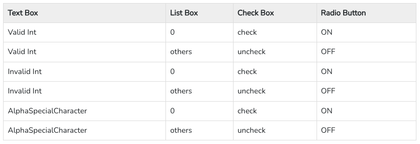
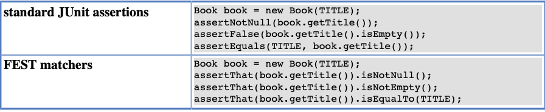

# Chapter 6. Things You Should Know

Bu kitabın önceki bölümlerini okuduktan sonra, artık unit testleri yazma konusunda yetenekli olmanız gerekiyor.
Aslında, bazı insanların "ileri" olarak gördüğü şeyler hakkında, örneğin parameterized testler ve test dublörleri gibi
konular hakkında birçok şey biliyor olmalısınız. Bununla birlikte, görevlerinizi tamamlamanızı kolaylaştıracak birçok
başka şeyi de bilmeniz gerekiyor. Var olan bilginiz ve genel programlama deneyiminizi kullanarak bunları kendiniz
çözebilirsiniz, ancak burada eğitiminize devam etmenizi ve özel patternler, sık karşılaşılan sorunlar ve unit testinin
çeşitli yönleri hakkında okumanızı öneririm.

Bu bölümde, öncelikle test yazma konusunda genel bazı yönleri (özellikle gelişmiş beklenen exception handling ve
matcher'ların kullanımı) tartışacağız. Ardından, koleksiyonları test etme, time-depent methods test etme gibi
son derece yaygın sorunlara odaklanan bazı nasıl yapılır alt bölümlerine geçeceğiz.

## 6.1. What Values To Check?

Bu bölümün konusu, verilen bir function için yazılması gereken testlerin sayısıyla ilgili yaygın bir sorunu
tartışmaktadır. Mutlak bir cevap sunmamakla birlikte, kesinlikle bu konuda biraz ışık tutmaktadır.

Functionality'i test etmek için, methodlara hangi argümanların geçirileceğine karar vermeniz gerekmektedir. Genel
olarak,
her input argümanının tüm kombinasyonlarını test etmek imkansızdır (açıkça ortada). Bu durum bizi, tüm olası durumları
temsil edecek bir argüman alt kümesini seçmeye zorlar. Bu zor gibi görünebilir, ancak genellikle oldukça basittir. Doğru
argümanları seçmek için bazı ipuçlarını tartışalım.

Genel tavsiyem şudur: Üç gruba ait argümanları seçmelisiniz: expected values (beklenen değerler) (Happy path olarak
bilinir), boundary values (sınır değerleri) ve strange values (yabancı değerler) (validity veya domain olarak da
bilinir).

## 6.1.1. Expected Values

Bu şekilde, bir client'in kodunuzu nasıl kullanmasını beklersiniz. Ad olarak "John", yaş olarak "52" ve favori renk
olarak "yellow" geçmesini beklersiniz. Ayı girdi olarak alan function'lara 1 ile 12 arasında değerler geçmesini
beklersiniz.

Yarıçap parametresini alan Circle sınıfının constructor'ina pozitif bir değer geçmesini beklersiniz.

Eğer benden bir XML dosyasını ayrıştırmamı istiyorsa ve fiyatı 30'dan büyük olan tüm ürünleri bulmamı istiyorsa, en
azından dosyanın geçerli bir XML dosyası olmasını beklersiniz. Ve benzer şekilde devam eder...

Bu kesinlikle kontrol etmeniz gereken bir şeydir. Kodunuzu normal, makul, mantıklı ve expected values ile çağırın ve
doğru şekilde çalıştığından, yani doğru cevapları verdiğinden emin olun. Bu son derece önemlidir. Eğer kodunuz bu tür
düzgün input argümanları için düzgün çalışmazsa, işe yaramaz.

## 6.1.2. Boundary Values

Normal değerler için kodunuzu kontrol ettikten sonra, boundary values'ları araştırma zamanı gelmiştir. Bu tür
değerler, hataların tipik bir kaynağıdır. Boundary Values'lara özellikle meraklı olmanız gerekmektedir.

Önceki bölümde, expected values'ları temsil eden argümanları seçtik. Onlarla çalışması istendiğinde kodunuzun ne yapması
gerektiği her zaman açıktı. Kısacası, işini yapmalıydı. Şimdi sınırlarda olan argümanları seçiyoruz. Bazen "reasonable
argument (makul arguman)" olarak etiketlenmiş bir kutudan seçeriz, bazen de "out-of-scope kapsam dışı" olarak
etiketlenmiş bir kutudan seçeriz.

Test yazarken hangi değerin hangi gruba ait olduğuna karar vermemiz gerekiyor. Bu noktada, örneğin -1'in bir
IllegalArgumentException'a yol açıp açmaması gerektiği veya normal hesaplamaların devam etmesine neden olması gerektiği
konusunda karar veririz.

Bir örnek üzerinde tartışalım. Tek bir tamsayı parametresi alan ve bir ayın kaç gün olduğunu döndüren bir methodu
düşünelim. Aşağıdaki varsayımlara sahip olduğunuzu düşünelim:

- 1 Ocak'ı, 2 Şubat'ı, ..., 11 Kasım'ı ve 12 Aralık'ı simgeler.

Şimdi boundary values'ları test edelim. Kesinlikle kontrol etmemiz gereken şey, sayacımızın gerçekten 1 ile başlayıp 0
ile başlamadığıdır. Bu yüzden şunları kontrol etmemiz gerekiyor:

- 0 hata ile başarısız olmalı, 1 ise Ocak için bir değer döndürmelidir.

Ve benzer şekilde, "the other end (diğer ucunu)" da kontrol etmemiz gerekiyor:

- 12 Aralık için bir değer döndürmeli, 13 ise hata ile başarısız olmalıdır.

Değerlerin analizi, kontrol edilmesi gereken bazı ilginç bulgulara yol açabilir. Örneğin, bir ayı temsil eden bir
tamsayıyı alan function, enum Month tanıtılarak geliştirilebilir. Bu şekilde, hatalı değerlerin geçişi artık bir sorun
olmaz. Bu, testler hakkında düşünmeye başladığınızda ve boundary values'ları göz önünde bulundurduğunuzda ortaya çıkan
bir örnektir. Yeniden tasarım gerçekleşir ve daha iyi bir tasarım ortaya çıkar. Ve bu iyi bir şeydir!

## 6.1.3. Strange Values

Kodunuz gerçekten de güvenilir. expected values'lar ile iyi çalıştığı doğrulandı ve bazı sınırlama kontrol yeteneklerine
sahip. Bu güzel bir şey, ancak yeterli değil. Kod henüz tamamen strange values'lar ile başa çıkmak için hazır değil.
Expect(beklenen) değer ne olursa olsun, her zaman beklenmedik bir şeyle karşılaşabilirsiniz. Bu nedenle, beklenmedik
durumları bekleyin ve muhtemelen aşağıdakilerden biriyle karşılaşın:

- negatif değerler (örneğin, yaş gibi) anlam ifade etmeyen durumlarda sadece pozitif değerlerin beklendiği durumlar,
- null veya empty value'lar (örneğin, boş String'ler, boş koleksiyonlar),
- beklentilere uymayan veri yapıları, örneğin sıralama yapıldığında varsayılan yerlerde sıralanmamış veya tekrarlanan
  veriler içeren yapılar,
- bozuk dosyalar (beklenenden farklı bir mime türü, geçersiz XML, metin yerine ikili bir dosya vb.),
- beklenenden farklı bir türde nesneler (zayıf tip dönüşümlü dillerde mümkün olan durumlar).

Bu tür test etme, kodunuzun kullanıcı tarafından girilen değerlerle uğraştığı durumlarda özellikle önemlidir - doğrudan
bir WWW formu aracılığıyla veya kullanıcı tarafından yüklenen bir dosyadan bilgi okuyarak olsun. Kullanıcılardan gelen
verileri doğrudan aldığınızda, her türlü değeri beklemeye hazır olunmalısınız!

Hadi örnek olarak tarihleri ele alalım. Tarihler, karışıklık ve hataların yaygın bir kaynağıdır çünkü:

- Doğaları gereği karmaşık olabilirler (örneğin, artık yıllar, aylardaki farklı gün sayıları).
- Onları farklı şekillerde kullanırız (yani, çeşitli veri formatları - örneğin, YYYY-AA-GG vs. YYYY-GG-AA).

Öyleyse test ettiğimiz function'ın bir String olarak tarihi almasını düşünelim. Beklentimiz, tarihin YYYY-AA-GG
formatında olmasıdır. Kod zaten aşağıdaki durumlarla başa çıkacak şekilde test edildi:

- normal values - 2011-01-18, 1956-07-14, 2015-12-23, ...
- boundary values - 2011-02-28 and 2011-02-29, ...

Şimdi, beklenmedik tarihlerle karşılaşmaya karşı korunmalıdır. Örneğin, bir kullanıcı tarafından girilen bir tarih
aşağıdakilerden biri olabilir:

- 2011-28-03 - Bu, gerekli olan YYYY-MM-DD yerine YYYY-DD-MM formatında bir tarihtir.
- 2011/04/18 - Bu farklı bir grup seperator'u kullanan bir tarihtir.
- tomorrow - Bu güzel bir tarih olsa da, aslında expected(beklenen) şey değil.
- null veya empty String - Bu sık sık meydana gelir.
- http://some.address/, I love you Mom veya blah (*&$ - Bu da olabilir.

## 6.1.4. Should You Always Care?

"Eğer önceki bölümü okurken "Bu basit fonksiyon için ömür boyu test yazmak zorunda kalacağım..." gibi korkunç bir
düşünce aklınıza geldiyse, belki de bir sonraki birkaç paragraf sizi sevindirebilir.

Diyelim ki AgeValidator sınıfı için testler yazıyorsunuz. Web tabanlı uygulamanız, web formundan (muhtemelen HTML) geçen
argümanların geçerliliğini kontrol etmek için bu sınıfı kullanacak. Bu formun yaş alanına sadece iki basamaklı değer
girebileceğinizi biliyorsunuz. Soru şu, bu bilgiyi kullanarak test edilen değerler kümesini [0..99] ile sınırlamalı
mısınız? validateAge() yöntemine 100 veya -1 geçen testler yazmak anlamlı mıdır?

Tüm sınıflarınızı ve methodlarınızı uygulamanızın context'ine bağlı olmamalarını sağlayacak şekilde tasarlasaydınız,
kesinlikle daha sağlam ve yeniden kullanılabilir olurlardı, bu da kesinlikle iyi bir şey olurdu. Ancak buna yönelmeli
misiniz? Bu, karşılaşacağınız yaygın bir sorundur. Hadi bunu tartışalım."

Ve eğer her bileşeni yeniden kullanılabilirlik gözeterek kodlarsanız, entegre edilmiş uygulamanız alt-optimal performans
sergileyebilir. Örneğin, her bileşen aynı kontrolleri (örneğin, null değer kontrolü) tekrar eder. Web katmanında
argümanları null olup olmadığına dair kontrol yapmak gerçekten mantıklı mı? Ardından bu kontrolleri hizmetler katmanına
geçirip tekrar aynı kontrolleri yapmak ve daha sonra DAO katmanına geçirip tekrar aynı kontrolleri yapmak gerçekten
mantıklı mı? Bence değil.

Gerçekten de, "utility" sınıflar gibi yardımcı sınıfların farklı context'lerde daha yüksek bir reusability şansı
vardır. Bu tür sınıfları, argümanlar hakkında çok fazla varsayımda bulunmadan herhangi bir context'de çalışacak şekilde
hazırlamanız önemlidir. Bu, 0 ile 9 arasındaki değerlerden çok daha geniş bir değer aralığında test edilmeleri gerektiği
anlamına gelir, örneğin Integer.MIN_VALUE ile Integer.MAX_VALUE arasındaki değerler. Bu doğrulayıcının bu durumda çok
daha fazla çalışma gerektirmediğini düşünüyorum. Ancak diğer durumlarda durum farklı olabilir.

İpucu: Birden çok farklı argüman kümesine ihtiyaç duyan methodlarla başa çıkmak için bazı yöntemler vardır. Eğer bu
önemli bir konu ise, "pairwise testing" ve quickcheck gibi araçlar hakkında bilgi edinmenizde fayda var.

### Pairwise Testing :

Pairwise Testing veya All-pairs testing olarak da bilinen Çiftli Test, combinatorial method kullanarak yazılımın test
edilmesi için alınan bir test yaklaşımıdır. Bu method, dahil olan parametrelerin tüm olası ayrık kombinasyonlarını test
etmek için kullanılır. Test edilmesi gereken bir yazılım parçasının 10 adet input field'i ve her bir input field için 10
adet olası ayarının olduğunu varsayalım. Bu durumda, test edilmesi gereken 10^10 olası giriş bulunmaktadır. Bu durumda,
tüm kombinasyonların tamamen test edilmesi imkansızdır, hatta tüm kombinasyonları test etmek istesek bile. Bir örnek
üzerinden konsepti anlamaya çalışalım:

10 öğe içeren basit bir listbox (0,1,2,3,4,5,6,7,8,9 diyelim) ile birlikte bir checkbox, radio button, textbox ve
OK butonu olan bir uygulama olsun. Textbox için kısıt, yalnızca 1 ile 100 arasındaki değerleri kabul edebilmesidir.
Aşağıda, her bir GUI nesnesinin alabileceği değerler verilmiştir:

```
List Box - 0,1,2,3,4,5,6,7,8,9

Check Box - Checked or Unchecked

Radio Button - ON or OFF

Text Box - Any Value between 1 and 100

Exhaustive combination of the product B is calculated.
```

```
List Box = 10
Check Box = 2
Radio Button = 2
Text Box = 100

Total Number of Test Cases using Cartesian Method : 10*2*2*100 = 4000
Total Number of Test Cases including Negative Cases will be > 4000
```

Şimdi, test senaryolarının sayısını azaltma fikrine bakalım. Öncelikle, geleneksel yazılım test tekniklerini kullanarak
kaç test senaryosu olduğunu bulmaya çalışalım. List box değerlerini 0 ve diğerlerini 0 olarak düşünebiliriz, çünkü 0 ne
pozitif ne de negatif bir değerdir. radio button ve onay kutusu değerleri azaltılamaz, bu nedenle her birinin 2
kombinasyonu (AÇIK veya KAPALI) olacaktır. Metin kutusu değerleri üç girişe (Geçerli Tam Sayı, Geçersiz Tam Sayı,
Alfa-Özel Karakter) indirgenebilir.

Şimdi, yazılım test tekniklerini kullanarak test senaryolarının sayısını hesaplayalım: 2 * 2 * 2 * 3 = 24 (negatif
durumları içeren).

Daha da azaltmak için All-pairs tekniğini kullanarak kombinasyonları azaltabiliriz.

- Step 1: Değerleri, en fazla sayıda değere sahip olan ilk sırada, en az sayıya sahip olan son sırada olarak
  yerleştirin.
- Step 2: Şimdi tabloyu sütun sütun doldurmaya başlayın. listbox 2 değer alabilir.
- Step 3: Sıradaki tartışılan sütun checkbox olacak. Yine checkbox 2 değer alabilir.
- Step 4: Şimdi listbox ve checkbox arasındaki tüm kombinasyonları kapsadığımızdan emin olmamız gerekiyor.
- Step 5: Şimdi aynı stratejiyi radio button için kullanacağız. Radio button 2 değer alabilir.
- Step 6: Aşağıdaki tabloda gösterildiği gibi, tüm çift değerlerin kapsandığını doğrulayın.



Result of Pair-Wise Testing:

```
Exhaustive Combination results in > 4000 Test Cases.
Conventional Software Testing technique results in 24 Test Cases.
Pair Wise Software Testing technique results in just 6 Test Cases.
```

### QuickCheck

QuickCheck, program özelliklerinin rastgele test edilmesi için bir kütüphanedir. Programcı, fonksiyonların sağlaması
gereken özellikleri belirterek bir programın bir özelliğini sağlar ve QuickCheck, bu özelliklerin büyük bir sayıda
rastgele oluşturulan durumda geçerli olduğunu test eder. Özellikler, QuickCheck tarafından sağlanan kombinatörleri
kullanarak Haskell dilinde ifade edilir. QuickCheck, özellikleri tanımlamak, test verilerinin dağılımını gözlemlemek ve
test verisi distribution'larını tanımlamak için kombinatörler sağlar.

## 6.1.5. Not Only Input Parameters

Şimdiye kadar, input parametrelerini serbestçe ayarlamamıza izin veren durumları ele aldık. Ancak gerçek dünyada her
input metot argümanı olarak iletilmez. Zaten DOC'ların sağladığı indirect inputlarla ilgili sorunları tartıştık. SUT'nin
DOC'larla etkileşiminde, önceden tartışılan kurallar geçerlidir. Yani, şunlar için test senaryoları yazmalıyız:

- DOC'un normal davranışı (örneğin, makul değerler döndürmesi veya makul exception'lar fırlatması)
- DOC'lar boundary values'ları döndürürler
- DOC unexpected value'lar döndürüyor, yani exception'lar fırlatıyor, bu olasılık dışıdır.

## 6.2. How to Fail a Test?

3.4 bölümünde tartışılan doğrulama yöntemlerinin yanı sıra, Assert sınıfında dikkatimizi çeken bir adet daha method
bulunmaktadır: fail(). Bu method bir testi başarısız yapar ve isteğe bağlı bir ileti belirtmeye izin veren overrided
sürümleri bulunur. fail() methoduyla sonlandırılan bir test, karşılanmayan bir doğrulama nedeniyle başarısız
oldu diye kabul edilir. Geçmişte, fail() methodu beklenen exception'ların doğrulanması için kullanılıyordu. Şu anda,
JUnit bunun için daha iyi bir mekanizma sağlamaktadır

Sonuç olarak, unit testlerde nadiren fail() methodlarını kullanmanız gerekecektir, hatta hiç kullanmayabilirsiniz.
Ancak, bazı durumlarda gerçekten kullanışlı olabilir, bu yüzden varlığı hakkında bilgi sahibi olmanız iyi olur. fail()
methodunun bir olası kullanımı Bölüm 6.4'te tartışılmaktadır.

## 6.3. How to Ignore a Test?

Bazı durumlarda bazı testlerin yoksayılmasını isteyebilirsiniz. Belirli bir işlev hala geliştirme aşamasında olabilir ve
testler henüz yürütülmemelidir. Bu tür durumlarda, seçili test yöntemlerini @Ignore anotasyonuyla işaretleyebilirsiniz.

Diğer durumlarda aynı etkiyi elde etmek isteyebilirsiniz, ancak kararı çalışma zamanına kadar ertelemek
isteyebilirsiniz. JUnit, bunu yapmanın bir yolunu sağlayarak Assume sınıfını sunar. JUnit JavaDocs'a göre, Assume
sınıfı, bir testin anlamlı olduğu koşullar hakkında varsayımlar belirtmek için kullanışlı bir "yöntem kümesi" sağlar.
Aşağıdaki örneği düşünün:

```
public class AssumeTest {
    @Test
    void shouldRunOnlyMacOS(){
        assumeTrue(thisIsAMacOSMachine());
        System.out.println("running on macOS");
    }
    private boolean thisIsAMacOSMachine(){
        return System.getProperty("os.name").startsWith("Mac");
    }

    @Test
    void shouldRunOnlyLinux(){
        assumeTrue(thisIsALinuxMachine());
        System.out.println("running on linux");
    }

    private boolean thisIsALinuxMachine(){
        return System.getProperty("os.name").startsWith("Linux");
    }
}
```

Her test yönteminin bir "precondution'ı" vardır. Eğer bu precondution sağlanmazsa, test yönteminin geri kalanı
yürütülmeyecektir. İşletim sistemine bağlı olarak, sadece bu mesajlardan birini göreceksiniz.

## 6.4. More about Expected Exceptions

Test kodunda beklenen exception ile ilgili açık bir doğrulama bulunmamaktadır. Her şey test yönteminin anotasyonu
aracılığıyla ele alınmaktadır.
Bu pattern'in üç temel dezavantajı bulunmaktadır. İlk olarak, yakalanan exceptionın tüm özelliklerini incelememize izin
vermez - exception atıldıktan sonra bile SUT'nin özelliklerini incelememize izin vermez. İkinci olarak, anotasyon
kullanımı, test kodunu arrange/act/assert (veya BDD'yi savunanlardansanız given/when/then) gibi
geleneksel düzenden sapmaktadır. Üçüncü olarak, test, beklenen exception atan test veya üretim kodunun hangi satırı
olursa olsun geçecektir.

Şimdi, bazı temel olmayan durumların beklenen exceptionlarıyla nasıl başa çıkacağımızı öğrenme zamanı geldi.
Daha önce de belirtildiği gibi, testlerde beklenen exceptionları belirtme kuralları, try-catch-finally ifadesinin
yakalama bloğu için geçerlidir: yakalamayı beklediğiniz exceptionları açıkça adlandırın ve genel exception sınıflarını
asla kullanmayın!

## 6.4.1. The Expected Exception Message

Bazı nadir durumlarda, exceptionın uygun bir iletiyle atılıp atılmadığını doğrulamak önemli olabilir. Bu genellikle
nadir bir durumdur, çünkü exception message genellikle bir uygulama ayrıntısıdır ve client'ların umursayacağı bir şey
değildir.

```
public class Phone {
    private String number;
    public void setNumber(String number){
        if (null == number || number.isEmpty()){
            throw new IllegalArgumentException("number can not be null or empty");
        }
        if (number.startsWith("+")){
            throw new IllegalArgumentException("number can not be start + sign");
        }
        this.number = number;
    }
}
```

Her iki durumda da IllegalArgumentException fırlatılır, ancak farklı bir iletiyle. Aynı türden iki exception atılması,
code smell olarak değerlendirilebilir. Eğer farklı iki exception atılırsa daha iyi olabilirdi

Hayal edin, Phone sınıfının setNumber() methodu tarafından atılan expected exception doğrulayan bir test yöntemi olsun.
Bu durumda yalnızca exception türüne (bu durumda IllegalArgumentException) güvenmek yeterli olmayacaktır.
İlk yapabileceğimiz şey, bir try-catch ifadesi kullanan eski bir exception testi yöntemine geri dönmektir.

```
public class PhoneTest {
    Phone phone = new Phone();

    @Test
    void shouldThrowIllegalArgumentExceptionForEmptyNumber() {
        try {
            phone.setNumber(null); (1)
            fail("should have thrown IllegalArgumentException"); (2)
        } catch (IllegalArgumentException exception) {
            assertEquals("number can not be null or empty", exception.getMessage()); (3)
        }
    }

    @Test
    void shouldThrowIllegalArgumentExceptionForPlusPrefixedNumber() {
        try {
            phone.setNumber("+123123"); (4)
            fail("should have thrown IllegalArgumentException"); (5)
        } catch (IllegalArgumentException exception) {
            assertEquals("number can not be start + sign",exception.getMessage()); (6)
        }
    }
}
```

- 1 - 4 - setNumber() yönteminin InvalidArgumentException türünde bir exception fırlatmasını bekliyoruz.

- 2 - 5 - Eğer bu noktaya ulaşmışsak, bu demek oluyor ki beklenen exception fırlatılmamıştır - bu yüzden testi başarısız
  olarak işaretlemek için (Assert sınıfının statik fail() yöntemini kullanarak) başarısızlık durumuna geçme zamanı
  gelmiştir.

- 3 - 6 - catch bloğu içinde exception mesajını doğrulayabiliriz.

try-catch ifadesini kullanarak, fırlatılan exceptionın messagini veya diğer özelliklerini (örneğin, root cause) test
edebiliriz. Ancak, bu tür bir test koduyla gurur duymak zordur, her seferinde gördüğümde içimde rahatsızlık hissettiğim
catch bloğunda yutulan exception vardır ve "ters" doğrulama olarak fail() kullanımı garip görünmektedir. Keşke bu
try-catch yapısından kurtulabilsek...

## 6.4.2. Catch-Exception Library

Aşağıdaki kod istediğimizi doğrulamak için try-catch ifadesinden kurtulmanın mümkün olduğunu kanıtlıyor ve bunu yaparken
güzel, temiz bir arrange/act/assert yaklaşımı benimsiyor. Bu, Rod Woo tarafından sağlanan Catch-Exception adlı ek
bir kütüphaneyi kullanır ve test kodunda beklenen exceptionlarla başa çıkmak için bazı kullanışlı yöntemler sağlar.

Rod Woo'nun catch-exception library'sine ait dependency'leri gradle icerisine ekledim

```
testImplementation ("com.googlecode.catch-exception:catch-exception:1.2.0")
```

Library yeni mockito ile uyumsuz olduğu için çalışmadı

## 6.5. Stubbing Void Methods

Stub'ın Bazı durumlarda, void metotlarının yerine konması gerekebilir. Mockito bunu yapmanıza izin verir, ancak küçük
bir
kısıtlama vardır: syntax, şimdiye kadar öğrendiğimizden önemli ölçüde farklıdır. Örneğin, someMethod() metotunun
davranışını stub'lamak için genellikle aşağıdakini yazarsınız:

```
when(someObject.someMethod()).thenReturn("some value");
```

Ancak, bir metot void döndürüyorsa, syntax farklılık gösterir (açıkça void metottan bir şey döndürmek anlamsızdır, bu
yüzden aşağıdaki örnekte voidMethod()'a bir exception fırlatması talimatı veriyoruz):

```
doThrow(new IllegalArgumentException("bad argument!"))
    .when(someObject).voidMethod();
```

Orijinal Mockito belgelerinde belirtildiği gibi, bu farklı syntax gereklidir çünkü: "Void metotların yerine konması,
compiler'ın parantez içinde void metotları sevmediği için when(Object) methodundan farklı bir yaklaşım gerektirir..."
doThrow() methodu dışında, void metotlarla çalışırken yardımcı olabilecek iki başka yöntem daha vardır: doNothing() ve
doAnswer(). Mockito belgeleri bunları detaylı bir şekilde ele alır ve her ikisi için çok iyi örnekler verir.

## 6.6 Matchers

Bu zamana kadar neredeyse yalnızca standart JUnit assertion'larını kullandık. Bazı temel boolean ifadeleri doğrulamak
için assertTrue() kullanıldı, iki nesneyi eşitlik açısından karşılaştırmak için assertEquals() kullanıldı ve bir
nesnenin null olup olmadığını kontrol etmek için assertNull() veya assertNotNull() kullanıldı, vb. Bu temel
assertion'lar, düşünebileceğiniz herhangi bir koşulu doğrulamak için yeterlidir. Bu doğru olsa da, burada daha fazla
iyileştirme yapılacak alan bulunmaktadır! Özellikle, matchers kullanarak daha okunabilir test kodu elde edebiliriz, ki
bu her zaman iyi bir şeydir.

## 6.6.1. JUnit Support for Matcher Libraries

Bir dakikalığına tarihe dalalım. Uzun zaman önce, Hamcrest, Java dünyasındaki tek Matcher kütüphanesiydi. Bu dönemde,
JUnit kullanıcıları için kullanımını kolaylaştırmak amacıyla Assert sınıfına eski dostlarımız assertEquals, assertTrue
ve diğerlerinin yanına bir ek assertion yöntemi olan assertThat() eklendi. Bu JUnit API'ya yapılan eklemeler o zaman
doğru görünüyordu, ancak birkaç yıl sonra yeni Matcher kütüphaneleri ortaya çıktığında, bu bir hata olarak kalmıştı. Bu,
Hamcrest ile bir sorun olduğu anlamına gelmez! Hiç de öyle değil: hala çok iyi, başarılı ve çok popüler bir araçtır.
Ancak, JUnit API'sındaki Hamcrest ile ilişkili assertThat() methodunun varlığı, geliştiricilerin bunun JUnit ile
kullanılması gereken Matcher kütüphanesi olduğunu düşünmesine neden olur.

Şu anda, Java geliştiricileri için en popüler iki Matcher kütüphanesi bulunmaktadır: Hamcrest ve FEST Fluent Assertions.
İşlevsellik açısından sunulan özellikler çok benzerdir, ancak API konusunda farklılıklar gösterirler. Ana fark, FEST'in
akıcı bir arayüz API sunmasıdır. Bu, mevcut IDE'lerin otomatik tamamlama özelliğiyle çok iyi çalışır ve bu nedenle
Hamcrest'e kıyasla onu daha değerli bulmamın nedenlerinden biridir.

Gerçek şu ki, JUnit testlerinde kolaylıkla herhangi bir Matcher kütüphanesini kullanabilirsiniz. Genellikle yapmanız
gereken tek şey, uygun bir sınıfı (JUnit'in Assert sınıfına eşdeğer bir sınıfı) import etmektir; bu gerçekten de bu
kadar basittir! Örneğin, FEST Fluent Assertions Matcher kütüphanesini kullanmak için yapmanız gereken tek şey
org.fest.assertions.Assertions sınıfını import etmektir.

The information included in this section is valid across all currently existing implementations of matchers; you can use
what you learn here with both FEST and Hamcrest (the two most popular frameworks of this kind). All the examples will be
written with FEST, but only because this is my tool of choice.

Bu bölümde yer alan bilgiler, mevcut tüm Matcher kütüphanelerinde geçerlidir; burada öğrendiklerinizi hem FEST hem de
Hamcrest (bu türün en popüler iki framework'u) ile kullanabilirsiniz. Tüm örnekler FEST ile yazılacaktır, ancak sadece
bu benim tercih ettiğim araç olduğu için.

## 6.6.2. Comparing Matcher with "Standard" Assertions

Bu kitabın bazı bölümlerinde, assertion'ların okunabilirliğinin iki yönü olduğunu zaten belirttik: test kodu içinde
nasıl göründükleri ve bir assertion başarısız olduğunda geliştiriciye hangi bilgilerin verildiği. Matcherler, her iki
konuda da yardımcı olmak için özellikle kullanışlıdır.

Matcherler, testlerinizi daha okunabilir hale getirir. Dil düzeyinde ek okunabilirlik sağlarlar, çünkü
assertThat(worker).isA(manager) şeklindeki sözcük sırası, standart assertEqual() doğrulamasına kıyasla doğal dil ile
çok daha yakından benzerlik gösterir. Bu, kutudan çıkan FEST veya Hamcrest Matcherleri için de, kendiniz yazdığınız
özel Matcherler için de geçerlidir. Aşağıdaki örnek bunu göstermektedir:



Matcher kullanmanın doğrulamalara özgü bir "ritim" kattığını fark edebilirsiniz: hepsi benzer şekilde okunur.

## 6.7. Mockito Matchers

Matcher konusundaki tartışmamızı sürdürerek, özel, test dublörleri ile ilgili durumlarda Matcherlerin kullanımına
bakalım.

Şimdiye kadar, Mockito'ya stubing yaparken dikkate aldığımız metodların argümanları konusunda çok spesifik olduk. Benzer
şekilde, test dublörlerinin davranışını doğrularken, belirli değerlerle belirli metodların çağrılmasını bekledik.
Örneğin, 5.4.5 Bölümünde, client'in belirli bir mesaj nesnesini alıp almadığını doğruladık. Bu mantıklıdır, ancak bazen
çağrıların argümanlarını bu kadar ayrıntılı şekilde ifade etmek hem fazla rigid'dir hem de gereksizdir. Bu bölümde,
Mockito tarafından sağlanan argüman Matcherlerini kullanarak testlerimizi daha esnek hale getirmeyi öğreneceğiz.

Ancak öncelikle, neden bu özellik ile uğraşalım? Temel olarak bunu yapmanın iki iyi nedeni vardır:

- Matcherlerin kullanılmasıyla kodun doğal bir dil gibi okunabilir hale gelmesi (pek tabii, neredeyse...) ve daha iyi
  okunabilirlik elde edilmesi.
- Daha esnek Matcherler aracılığıyla test kodu içinde önemsiz bazı ayrıntıların atlanması sayesinde geliştirilebilir
  bakım sağlanması.

Mockito, verification veya stublamada kullanılabilecek çeşitli önceden tanımlanmış Matcherler sunar. Bunların birçoğu
vardır ve bazıları sadece testlerinizin okunabilirliğini sağlamak için diğerlerinin alias'larıdır.Aşağıdaki liste,
mevcut tüm Matcher öğelerinin sadece bir alt kümesini içermektedir:

- any() matches any object (or null),
- anyVararg() matches any number and values of arguments,
- isNull(), isNotNull() match null and not-null values respectively,
- anyBoolean(), anyByte(), anyChar(), anyDouble(), anyFloat(), anyInt(), anyLong(), anyShort(), anyString() match these
  Java types (or null),
- isA(Class<T> clazz) matches any object of a given class,
- same(T value) matches an object which is the same (==) to a given object,
- anyCollection(), anyList(), anyMap(), anySet() matches any kind of instance of each sort of collection (or null),
- refEq(T value, String... excludeFields) matches an object that is reflection-equal to the given value; allows us to
  specify excluded fields, not to be taken into account,
- eq(boolean value), eq(byte value), eq(char value), eq(double value), eq(float value), eq(int value), eq(long value),
  eq(short value), eq(T value) - matches values which are equal to given arguments.

Yukarıdaki methodların birçoğu, generics uyumluluğunu sağlamak için ek argümanlara (java.lang.Class türünde) sahip
olarak da mevcuttur. Bu sayede derleyici uyarılarını önlemek amaçlanır.

String argümanlarla çalışmak için bazı yardımcı Matcherler de mevcuttur:

- startsWith(String prefix), endsWith(String suffix), verilen prefix/suffix ile starts/end bir String'le eşleşir.
- contains(String substring), belirtilen alt String içeren bir String ile eşleşir.
- matches(String regex), belirtilen bir regex ifadeyle eşleşen bir String'le eşleşir.

Bu tür matchers'lar, bazı "generic" stublama davranışlarını veya beklentilerini belirtmek için kullanışlıdır. Örneğin,
bu kod, getUser() metoduna ne tür bir ID parametresi geçirilirse geçirilsin, her zaman userDAO stub'ının user nesnesini
döndürmesini sağlar.

```
public class MockitoMatchersTest {
    UserDAO userDAO = mock(UserDAO.class);
    User user = new User();

    @Test
    void test() {
        when(userDAO.getUser(anyInt())).thenReturn(user); (1)

        assertEquals(user, userDAO.getUser(1));
        assertEquals(user, userDAO.getUser(2));
        assertEquals(user, userDAO.getUser(3));

        verify(userDAO,times(3)).getUser(anyInt()); (2)
    }
}
```

1 - anyInt() Matcherini kullanarak userDAO'nun stublanması.

2 - getUser() metodunun, belirli bir tamsayı argümanıyla üç kez çağrıldığının doğrulanması.

Yukarıdaki örnek, belirli değerlerden kurtulmanızı ve kodunuzu stublama veya doğrulama işlemlerinde daha esnek
argümanlar kullanmanızı gösteriyor. Mockito'nun bu özelliği, sadece testlerinizde gerçekten belirtmeniz gerekenleri
belirtme yaklaşımıyla uyumludur. Yani, getUser() metodunun 789'a eşit bir argümana ihtiyaç duyması test mantığınız için
önemli değilse, belki anyInt() yeterli olabilir? Öyleyse tereddüt etmeyin. Doğru soyutlama seviyesinde çalışın ve yeni
öğrendiğimiz kullanışlı matcher'ların altında önemsiz ayrıntıları gizleyin.

UserDAO ve User class'larım olmadığı için create etmem gerekiyor

```
public class User {
}

public interface UserDAO {
    User getUser(Integer id);
}
```

## 6.7.2. Matchers Warning

Unutulmaması gereken bir şey, eğer argument matchers kullanıyorsanız, tüm argümanların eşleştiriciler tarafından
sağlanması gerektiğidir. Bu, 6.18 numaralı örnekte (doğrudan Mockito belgelerinden kopyalanan bir örnek)
gösterilmektedir.

```
verify(mock).someMethod(anyInt(), anyString(), eq("third argument")); (1)
verify(mock).someMethod(anyInt(), anyString(), "third argument"); (2)
```

1 - Bu doğrudur: tüm argümanlar matchers'lardır.

2 - Bu yanlıştır: üçüncü argüman bir eşleştirici değildir ve bir istisna fırlatılmasına neden olacaktır.

## 6.8 Rules

Zaten @Before ve @After anotasyonları hakkında bilgi sahibiyiz, bunlar test methodları çalıştırılmadan önce ve sonra
işlemler yapmak için çok kullanışlıdır. Bunların dışında, JUnit daha esnek bir mekanizma sunar, bu anotasyonları
değiştirebilen ve ayrıca kapasitelerinin ötesinde işlemler yapmanıza izin veren bir mekanizmadır.

JUnit kurallarını, aspect-oriented programlamaya benzetebiliriz. Anotasyonların kullanımıyla, bu kurallar bir kez
bildirilebilir, ancak birçok teste uygulanabilir. Aynı kodu birçok farklı yerde tekrarlamak veya kalıtım kullanmak
gerekmez.

Bu bölümde tartışılan functionality nadiren unit testlerinde kullanılır. Bununla birlikte, bazı durumlarda
vazgeçilmezdir, bu yüzden onlar hakkında da bilgi edinmeliyiz.

JUnit, test sınıflarını veya test methodlarını etkileyen kurallar yazmanıza olanak tanır. Her ikisi de çok benzer bir
şekilde yazılır ve kullanılır. Sınıf düzeyinde çalışması amaçlanan özel bir kural, TestRule arayüzünü uygulamalıdır.
Test methodları için çalışması amaçlanan özel bir kural, MethodRule arayüzünü uygulamalıdır. JUnit'in JavaDocs'ını
gezinerek zaten mevcut birkaç kural olduğunu öğrenebilirsiniz. Tüm bunlar aşağıda listelenmiştir:

* ErrorCollector, bir test methodunda birden fazla hatayı bir araya toplamak için kullanılan bir kuraldir.
* ExpectedException, fırlatılan exception'lar hakkında flexible assertions'lar yapmanızı sağlayan bir kuraldır.
* ExternalResource, örneğin bir Server'i başlatıp durdurmanıza olanak sağlayan bir kuraldir.
* TemporaryFolder, geçici dosyalar oluşturmanıza ve testten sonra silmenize olanak sağlayan bir kuraldır.
* TestName, method sırasında kullanmak üzere test adını hatırlayan bir kuraldir.
* TestWatcher, method yürütme sırasında olaylara mantık eklemenizi sağlayan bir kuraldir.
* Timeout, belirli bir süre sonra testin başarısız olmasına neden olan bir kuraldir.
* Verifier, nesne state'i yanlış olduğunda testin başarısız olmasını sağlayan bir kuraldir.

## 6.8.1 Using Rules

Rules'ları nasıl kullanacağınızı öğrenmenin en iyi yolu, onları uygulamada görmektir. JUnit tarafından sağlanan
roles'lerden birini örnek olarak ele alalım.

```
public class RuleTest {
    @Test
    void willFail() {
        assertTimeout(Duration.ofMillis(20), () -> Thread.sleep(100)); (1)
    }

    @Test
    void willPass(){
        assertTimeout(Duration.ofMillis(100),()->Thread.sleep(50));
    }
}
```

assertTimeout kuralı 20 milisaniyeden daha uzun süren herhangi bir testi durduracak ve başarısız olarak
işaretleyecektir. ikinci method 100 saniye bekleyecek ve thread daha uzun sürerse o da fail gonderecek

## 6.10 Testing Thread Safe

Gerçek dünyada yazdığımız uygulamalar genellikle aynı anda erişime açıktır. Bu eş zamanlı yükü işleyebilecek şekilde
yazılımımızın çalıştığını doğrulamak için özel araçlar (örneğin JMeter17) kullanırız. Bazen, bu tür gereksinimleri
doğrulamak, tek sınıflarla ilgili durumlarda bile önemli olabilir. Bu bölüm, böyle bir test örneği sunmaktadır.

ID'leri oluşturmak için görevi olan bir utility class'ının implementasyonunu yapalım:

```
public interface IdGenerator {
    Long nextId();
}
```

## 6.10.2. ID Generator: First Implementation

```
public interface IdGenerator {
    Long nextId();
}
```

Basit bir implementasyonu;

```
public class SystemIdGenerator implements IdGenerator{
    @Override
    public Long nextId() {
        return System.currentTimeMillis();
    }
}

```

SystemIdGenerator sınıfı, ID elde etmek için System sınıfının bir statik yöntemini kullanır.

Döndürülen ID'lerin gerçekten unique olup olmadığını test etmek için, SystemIdManager'in nextId() methodunu iki
kez ardışık olarak çağırmamız ve sonuçları karşılaştırmamız gerekmektedir.

```
public class SystemIdGeneratorTest {
    SystemIdGenerator idGenerator = new SystemIdGenerator();
    @Test
    void shouldIdIsUnique() {
        Long idA = idGenerator.nextId();
        Long idB = idGenerator.nextId();

        assertNotEquals(idA,idB);
    }
}
```

idA ve idB'nin oluşturulması sırasında bir süre geçmesine rağmen, bu testi her çalıştırdığımda başarısız oluyor. Bu,
SystemIdGenerator sınıfının bir örneği tarafından oluşturulan her iki ID'nin de eşit olduğu anlamına geliyor. Görünüşe
göre mevcut CPU'lar, nextId() yöntemini her milisaniyede iki kez çalıştırmak için yeterince hızlıdır. Ancak, test koduna
bakarak, bazı durumlarda testin başarılı olabileceğini düşünüyorum. Bu son derece istenmeyen bir durumdur. Bir kez
başarılı olurken bir sonraki sefer başarısız olurlar ve bu belirsiz davranışın nedenini aydınlatabilecek ipuçları
yoktur.

Bunu söyledikten sonra, yakında çok daha iyi bir test yazacağımı söz veriyorum. Ancak şimdilik, ID üreteci sınıfını daha
iyi hale getirelim, böylece testi geçebilsin.

AtomicIdGenerator sınıfı - bir tekli artırma operatörü kullanır. Şimdi her zaman unique değerler döndürmelidir.

```
public class AtomicIdGenerator implements IdGenerator{
    private static Long nextId = System.currentTimeMillis();
    
    @Override
    public Long nextId() {
        return nextId++;
    }
}
```

Testi bu ID üreteci versiyonuna karşı çalıştırırsak, test başarılı olacaktır. Testi kaç kez çalıştırırsak çalıştıralım,
içinde tekrar tekrar döngü ekleseniz bile başarılı olacaktır. Bununla birlikte, bu, üreteç sınıfımızın gerçek dünyada
kullanılmaya hazır olduğu anlamına gelmez. Bir sonraki adımda, hala yeterince sağlam olmadığını kanıtlayacağız.

Eğer kodunuzun eş zamanlı olarak kullanılmasını bekliyorsanız, testleriniz bunu simüle etmelidir.

Bir tekli artırma operatörü atomik olsa bile (ki değildir!), iki thread aynı anda nextId() yöntemini çalıştırabilir ve
aynı değeri alabilir. Nasıl mı? İki thread, nextId değişkeninin aynı "eski" değerini alabilir, ardından her ikisi de
bunu artırabilir ve ardından idA ve idB değişkenlerine bir "yeni" değer atayabilir. Bu tür bir tehdidi ortaya çıkaracak
bir test yazmak için iki ayrı thread oluşturmalı ve onları nextId() yöntemine tam olarak bu şekilde erişmelerini
sağlamalıyız - ki bu hiç kolay değil. JUnit bunu tek başına başarmamıza yardımcı olmayacak. Burada kitap bir library'den
bahsediyor fakat library deprecate edilmiş.

## 6.11. Time is not on Your Side

Zaman biçimlendirme ve depolamayla ilgili hataların sayısı korkunç derecede fazladır. Wikipedia, bunlar arasında ünlü
Y2K sorununun da olduğu birçok örneği vermektedir. Zamanla ilgili kesinlikle karmaşık bir şeyler var - bizi onun tuhaf
ve öngörülemeyen doğasıyla uyumlu olmayan kodlar yazmaya zorlayan bir şey. Bu bölümde, davranışı zaman tarafından
belirlenen sınıflarla nasıl başa çıkacağımızı göreceğiz.
Zaman bağımlı bir sınıfın tipik bir örneği, aşağıda gösterilmiştir. Kodu kendisi basit olsa da, böyle bir kodu test
etmek kolay değildir.

```
public class Hello {
    public static String sayHello(){
        Calendar current = Calendar.getInstance();
        if (current.get(Calendar.HOUR_OF_DAY)<12){
            return "good morning";
        } else {
            return "good afternoon";
        }
    }
}
```

Şu anki tarihi döndürür (testin yürütülme anındaki tarih).

Gerçekten de, bu örnek zaman bağımlı kodun unit testlerini zorlaştıran sorunları kapsamaktadır. Hello sınıfının
sorununu çözmeyi öğrenirseniz, daha karmaşık mantıkla nasıl başa çıkacağınızı da öğrenmiş olacaksınız. Zaman bağımlı
kodlar, benzersiz zorluklar sunabilir ve doğruluğunu sağlamak için etkili test stratejileri bulmak önemlidir.

Hello sınıfıyla ilgili olarak yazdığımız herhangi bir test, sonucunu yürütme zamanına bağlı olarak değiştirecektir.
Aşağıdaki örneği inceleyelim. Yürütme sonrasında testlerden biri başarısız olacaktır. Bu kabul edemeyeceğimiz bir
durumdur. Unit testlerden beklenen, çevreden soyutlanarak ve belirli bir sınıfın her zaman çalıştığından emin olmaktır.

```
public class HelloTest {
    Hello hello = new Hello();
    
    @Test
    void shouldSayGoodMorningInTheMorning() {
        assertEquals("good morning",hello.sayHello());
    }

    @Test
    void shouldSayGoodAfternoonInTheAfternoon() {
        assertEquals("good afternoon",hello.sayHello());
    }
}
```

Gösterilen test'lerden birisi mutlaka fail olacaktır. Harika! Farklı bir şey düşünmemiz gerekiyor... İşte! İşin püf
noktası, zamanı Hello sınıfının bir işbirlikçisi haline getirmektir

```
public interface TimeProvider {
    Calendar getTime();
}
```

TimeProvider interface'inin varsayılan bir implementasyonu, muhtemelen Calendar.getInstance()'i yeniden kullanacaktır.

```
public class Hello {
    private TimeProvider timeProvider;

    public Hello(TimeProvider timeProvider) {
        this.timeProvider = timeProvider;
    }

    public String sayHello(){
        Calendar current = timeProvider.getTime();
        if (current.get(Calendar.HOUR_OF_DAY)<12)
            return "good morning";
        else
            return "good afternoon";
    }
}
```

TimeProvider işbirlikçisi, bir constructor parametresi olarak enjekte edilmiştir; bu, bir test dublörüyle kolayca
değiştirilebileceği anlamına gelir.

timeProvider.getTime() kullanılırken Calendar.getInstance() yerine kullanılır.

Dikkatli bir okuyucu, Hello sınıfının tasarımının TimeProvider sınıfına daha fazla işlevsellik taşıyarak
iyileştirilebileceğini fark edebilir. Bu konuyu bu bölümün sonundaki egzersizlerden birinde ele alacağız (bkz. Bölüm
6.15).
Yeniden tasarlanan Hello sınıfının testleri aniden basit hale gelmiştir.

```
public class HelloTest {
    private static Hello hello;
    private static TimeProvider timeProvider;

    @BeforeAll
    static void setUp() {
       timeProvider = mock(TimeProvider.class);
       hello = new Hello(timeProvider);
    }
}
```

Burada TimeProvider'ın bir mock sürümü oluşturulmuş ve SUT'ye enjekte edilmiştir.

```
public class HelloTest {
    private static Hello hello;
    private static TimeProvider timeProvider;

    @BeforeAll
    static void setUp() {
        timeProvider = mock(TimeProvider.class);
        hello = new Hello(timeProvider);
    }

    @ParameterizedTest
    @ValueSource(ints = {0, 1, 2, 3, 4, 5, 6, 7, 8, 9, 10, 11})
    void shouldSayGoodMorningInTheMorning(int hours) {
        when(timeProvider.getTime()).thenReturn(getCalendar(hours));
        assertEquals("good morning",hello.sayHello());
    }

    @ParameterizedTest
    @ValueSource(ints = {12,13,14,15,16,17,18,19,20,21,22,23})
    void shouldSayGoodAfternookInTheAfternoon(int hours){
        when(timeProvider.getTime()).thenReturn(getCalendar(hours));
        assertEquals("good afternoon",hello.sayHello());
    }

    private Calendar getCalendar(int hour){
        Calendar calendar = Calendar.getInstance();
        calendar.set(Calendar.HOUR_OF_DAY,hour);
        return calendar;
    }
}

```

Burada timeProvider test dublörünün stubbing'i gerçekleştirilmiştir.

```
when(timeProvider.getTime()).thenReturn(getCalendar(hours));
```

TimeProvider için test dublörü kullanarak, test gerçek sistem saatinden bağımsız hale gelir, güvenilir ve tutarlı
sonuçlar elde edilir

Yeniden Tasarım Tek Seçenek Değildir. Bu yeniden tasarım hilesi (yani timeprovider'i ayrı bir varlık olarak
uygulama) böyle zaman bağımlı kodlarla başa çıkmanın tek yoludur. PowerMock veya JMockit gibi araçlar kullanarak
Calendar sınıfını istediğimiz değeri döndürmeye ikna etmek mümkündür. Bu gibi çözümleri önermiyorum, çünkü SUT'nin
kodunu daha iyi hale getirmezler. Bunun yerine, mevcut uygulamanın kodunu sabitler ve bazı uygulama ayrıntılarını test
kodu içinde tekrarlarlar (daha fazla bilgi için Bölüm 7.6'ya yeniden tasarım seçeneği ve alternatifleri arasındaki
tercihlerin tartışması için bakınız). Yine de, farklı seçenekler hakkında bilgi sahibi olmanız gerektiğine inanıyorum -
bu yüzden onlardan bahsediyorum.

## 6.11.1. Test Every Date (Within Reason)

Zaman bağımlı kodlarla nasıl başa çıkacağımızı bildiğimize göre - şimdi genel ama yine de çok önemli bazı açıklamalara
geçme zamanı geldi. Çok sayıda hata, zaman bağımlı kodlara yetersiz test yapıldığından kaynaklanır. Geliştiriciler, "
bugün çalışıyorsa, yarın da çalışması gerektiği" naif bir inanca sahip gibi görünüyorlar. Peki, her zaman böyle
olmayabilir. Söylemek istediğim nokta, zamanla uğraşırken gerçekten, gerçekten dikkatli olmanız gerektiğidir ve bu da
aşağıdakileri içerir:

* bu tür kodlar için unit testleri yazarken titiz olun,
* testlerinizi en az birkaç sonraki yıl için düşünerek çalıştırın.

Unit testlerle, tüm olası tarihler veya saatler için test yapmama bahanesi yoktur. Testleriniz son derece hızlıysa,
neden 5 yıl ileriye yönelik testler yapmıyorsunuz? Sadece yapın ve böylece kodun o belirli parçasında gelecek beş yıl
boyunca herhangi bir zamanla ilgili sorunla karşılaşmayacağınıza emin olun.

## 6.11.2. Conclusions

Bu bölümde, zamanla bağımlı sistem birimlerinin nasıl ele alınacağını tartıştik. Çözüm oldukça basittir: zamanı SUT'nin
bir işbirlikçisi haline getirin ve diğer işbirlikçilerle yaptığınız gibi aynısını yapın: onu bir test dublörüyle
değiştirin. Bunu yaptıktan sonra tasarımınız iyileşecek (SUT, zaman yönetimi bilgisinden kurtulacak ve iş mantığına
odaklanabilecek) ve ardından tüm işbirlikçilere standart bir yaklaşımla devam edebileceksiniz. Evet, bu zaman
karşısında (en azından unit testlerde) zafer kazanmak için yeterli. :)

Bu bölümde sunulan teknik, unit test seviyesinde zaman sorununu ele almak için yeterlidir. Bununla birlikte, daha üst
seviyede uygulama testleri yaparken karşılaşacağınız zamanla ilgili birçok sorunu çözmez. Sunucuların ve
veritabanlarının farklı saat dilimleri, database triggers veya yalnızca gece belirli saatlerde çalışan harici
işlemler gibi sorunlarla karşılaşabilirsiniz. Ayrıca, geçerlilik süresi dolan güvenlik sertifikaları da size ciddi
sorunlar çıkarabilir. Neyse ki, bunların hiçbiri unit testlerinizi etkilemez!

## 6.12 Testing Collections

Bazen SUT'ların methodları, döndürdüğü koleksiyonların içeriği SUT'ların iş mantığına bağlı olarak belirlenir. Elbette,
bu test edilmesi gereken bir durumdur. Bu bölüm, koleksiyonların ve içeriklerinin test edilmesi hakkında bazı bilgiler
sunmaktadır.

## 6.12.1. The TDD Approach - Step by Step

Öncelikle, TDD ile koleksiyon içeriğinin test edilmesiyle ilgili bazı açıklamalar. Bunun adım adım yapılması önerilir.
İlk olarak, döndürülen bir koleksiyonun null olmadığını doğrulayan basit bir assertion kullanarak başlayın. Testin
başarısız olduğunu görün (çünkü IDE'nizin oluşturduğu varsayılan bir uygulama muhtemelen null döndürecektir). Testi
geçmesi için yeni bir koleksiyon döndürerek başarılı yapın. Ardından, döndürülen koleksiyonun beklenen öğe sayısına
sahip olup olmadığını doğrulayan başka bir assertion ekleyin. Şimdi içeriği doğrulamaya başlayın. Elde edilen test
kodunun bir örneği aşağıda gösterilmiştir. Her biri bir öncekinden daha kısıtlayıcı olan birçok assertion içerir.

```
public class UserTest {
    @Test
    void shouldReturnUsersPhone(){
        CollectionTestUser user = new CollectionTestUser();
        user.addPhone("123 456 789");

        List<String> phones = user.getPhones();

        assertNotNull(phones); (1)
        assertEquals(1,phones.size());
        assertTrue(phones.contains("123 456 789"));
    }
}
```

1 - Her zaman kontrol etmeye değer, çünkü ardışık assertion'larda NulPointerException hatası oluşmasını engeller.

Bu pattern başlangıçta doğal görünmese de, bir şeyler ters giderse %100 doğrulukla hataları belirleyebilirsiniz. Ancak
tabii ki bu kadar titiz olmanız gerekmez - daha büyük adımlarla ilerlemek isterseniz, elbette yapabilirsiniz. Burada
birkaç saniye tasarruf edebilirsiniz, ancak diğer yandan daha sonra çok daha fazla zaman kaybedebilirsiniz. Kararı size
bırakıyorum.

Yukarıda gösterildiği gibi, JUnit'in yaygın assertion'larını kullanarak koleksiyonların içeriğini test etmek mümkündür:
örneğin assertEquals(), assertTrue() ve assertFalse(). İki koleksiyonun içeriğini karşılaştırmanız gereken durumlarda
JUnit çok fazla destek sunmamaktadır. Neyse ki, JUnit testlerinden içinde kullanabileceğimiz birçok diğer kütüphane
bulunmaktadır ve bu görevde bize yardımcı olabilir.

Sonraki birkaç örnek için şu şekilde tanımlanan iki küme, setA ve setB, varsayalım:

### Testing collections with Hamcrest assertions

```
public class HamcrestCollectionTest {
    private static Set<String> setA = new LinkedHashSet<>();
    private static Set<String> setB = new LinkedHashSet<>();
    static String s1 = "s1";
    static String s2 = "s2";

    @BeforeAll
    static void setUp(){
        setA.add(s1);
        setA.add(s2);
        setB.add(s1);
        setB.add(s2);
    }

    @Test
    void collectionsUtilityMethods(){
        assertThat(setA,hasItem(s1));
        assertThat(setA,hasItem(s2));
        assertThat(setA,not("xyz"));
        assertThat(setA,hasItems(s1,s2));
        assertThat(setB,hasItems(s1,s2));
    }
}
```

- Hamcrest, belirli bir koleksiyonun belirli değerleri içerip içermediğini test etmemizi sağlar.
- Maps için Hamcrest, input'ların (key ve value) veya sadece key'lerin doğrulanması için assertion'lar sağlar.

## 6.12.3. Custom Solution

Eğer koleksiyon testiyle ilgili ihtiyaçlarınız öyle özeldir ki, önceden sunulan çözümler hiçbiri yeterli değilse, kendi
çözümünüzü bulmak dışında başka seçeneğiniz olmayacaktır. İlerlemek için en az iki seçeneğiniz olacak:

* İhtiyacınıza göre koleksiyon doğrulaması yapacak yardımcı methodlar yazmak,
* Özel matchers oluşturmak

İlk seçenek uygulaması daha hızlıdır, ancak testlerin okunabilirliğine katkıda bulunmaz. Matchers ek çalışma
gerektirse de, daha fazla yeniden kullanılabilirlik sunar ve çok okunabilir assertion'lar sağlayan güzel bir test
DSL sunar.

