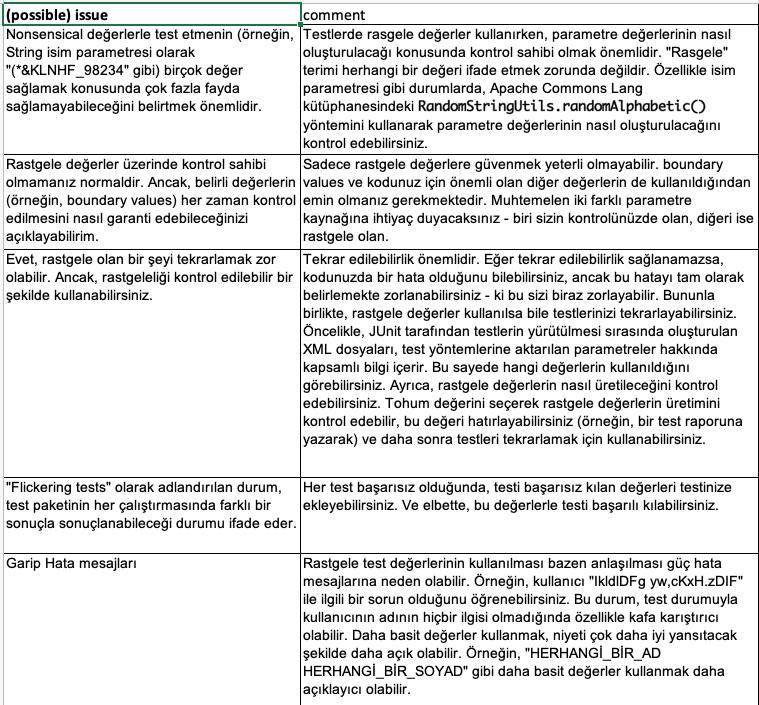
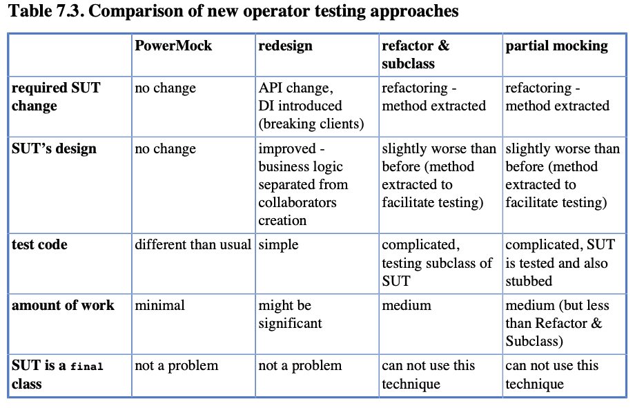

# Chapter 7. Points of Controversy

Geliştirici topluluğu içinde hâlâ tartışmaya açık birçok test yazma konusu bulunmaktadır. Bu bölümde bunlardan
bazılarını tartışacağız. Bazen kesin bir cevap verilecek, bazen de çeşitli seçenekler sunulacak

## 7.1. Access Modifiers

KÖzellikle, neredeyse her örnek değişken için private anahtar kelimesini kullandım. Bu yaklaşımda bir sorun yok; ancak
bazı insanlar bunun gereksiz olduğunu düşünebilir.

Buradaki nokta, production kodunda encapsulation ve information hiding konusunda takıntılı olurken, bu durumun test
sınıfları için geçerli olmamasıdır. Test sınıfları neredeyse hiçbir zaman diğer sınıflar tarafından kullanılmazlar, bu
da bir field veya methodun private olarak işaretlenmesinin kodu gerçekten daha iyi hale getirmediği anlamına gelir. Bu
nedenle, her şeyi private anahtar kelimesiyle işaretlemek alışkanlığına sahipseniz, test koduyla da bu yaklaşımı
benimseyin. Öte yandan, private'ı atlayarak test kodunuzun okunabilirliğini artıracağınıza inanıyorsanız, ondan
kurtulun

## 7.2. Random Values in Tests

İlk başta, test etme ve rastgele değerler birbiriyle güzel bir şekilde uyum sağlar gibi görünür. Bazı insanlar, her
seferinde farklı değerlerle testleri çalıştırmanın, seçilen bazı değerlerle çalıştırmaktan daha iyi bir şekilde kodun
dayanıklılığını kanıtlayabileceğini düşünmektedir. Deneyimime göre, bu bir yanılgıdır ve testlerde rastgele değerler
kullanmak daha çok zarar verir. Aslında, rastgeleliğin testlerde kullanıldığı ve beyhude olduğu durumları
hatırlayabiliyorum, ancak faydalı çıkan bir durum hatırlayamıyorum! Bu bölüm, kaçınılması gereken tipik durumları
göstermektedir.

Elbette, rastgele testlerin sadece geçerli değil, aynı zamanda hayati olduğu bazı alanlar vardır! Örneğin, Apache
Lucene'in test paketlerinde, önemli bir Java 7 hatasını bildirmelerine olanak sağlayan birçok rastgele oluşturulmuş test
vakası bulunur. Ancak, kodu tartışmaya başlamadan önce, rastgele değerlerin oluşturulması için birçok yol olduğunu
belirtmek istiyorum, bunlar şunları içerir:

- custom utility method'ları
- genel kullanım için kütüphaneler kullanma; örneğin, Apache Commons Lang kütüphanesi, istenen uzunlukta ve farklı
  karakter setlerinden (yalnızca harfler, yalnızca sayılar, ikisinin kombinasyonu vb.) oluşan rastgele String'ler
  oluşturmak için bir RandomStringUtils sınıfı sağlar.
- özel test odaklı framework'ler kullanma, örneğin Quickcheck

Burada tartışmak istediğim konular, aslında rastgele değerlerin nasıl oluşturulduğuyla ilgili değil, daha çok
testlerinizde rastgeleliği kullanma fikriyle ilgilidir.

Apache Common kütüphanesini rastgele değerler üretmesini için kullanacağız; Gradle dependency'lerini ekledim

```
implementation ("org.apache.commons:commons-lang3:3.12.0")
```

## 7.2.1. Random Object Properties

Varsayalım ki, UserToPersonConverter sınıfının bir SUT (Test Edilen Sistem) olduğunu ve User sınıfının bir nesnesini
kişinin takma adına dönüştürerek Person sınıfının nesnelerine çevirebildiğini düşünelim. SUT'nin uygulaması aşağıdaki
gibi olsun:

```
public class UserToPersonConverter {
    public static Person convert(User user){
        return new Person(user.name(), user.surname());
    }
}
```

Bu class'ın ihtiyacı olan User ve Person nesnelerini record olarak tanımlıyorum;

```
public record User(String name,String surname) {
}

public record Person(String name,String surname) {
    public String getNick() {
        return name + " " + surname;
    }
}
```

Test'i de şu şekilde yazıyorum;

```
public class UserToPersonConverterTest {
    String name = RandomStringUtils.randomAlphabetic(8);
    String surname = RandomStringUtils.randomAlphabetic(5);
    User user = new User(name,surname);
    Person person = UserToPersonConverter.convert(user);


    @Test
    void name() {
        assertEquals(name + " " + surname,person.getNick());
    }
}
```

Yukarıdaki uygulamanın arkasındaki fikri doğru anladığım kadarıyla, rastgele değerlerin kullanılmasıdır çünkü bunlar (
varsayılan olarak) verilen bir testin dayanıklılığını vurgular. Adeta test, "Bakın, her seferinde testi farklı bir
kullanıcının adıyla çalıştırıyorum ve hala başarılı geçiyor! Harika, değil mi?" diye haykırır gibi görünmektedir.

## 7.2.2. Generating Multiple Test Cases

Testi daha etkileyici hale getirmek için doğal bir sonraki adım, aynı işlevselliği tek bir test metodunun yürütmesi
içinde daha fazla rastgele değerle test etmektir. Bunu, data provider's kullanarak başarabiliriz, örneğin:

```
public class UserToPersonConverterDataProvidersTest {
    private static Object[] getRandomNames() {
        Object[] values = new Object[100][100];
        for (int i = 0; i < values.length; i++) {
            values[i] = new Object[]{RandomStringUtils.randomAlphabetic(5), RandomStringUtils.randomAlphabetic(8)};
        }
        return values;
    }

    @ParameterizedTest
    @MethodSource("getRandomNames")
    void shouldConvertUserNamesIntoPersonNick(String name, String surname) {
        User user = new User(name, surname);
        Person person = UserToPersonConverter.convert(user);
        assertEquals(name + " " + surname, person.getNick());
    }
}
```

Bu test metodu, farklı rastgele değerlerle 100 kez çalıştırılır.

Yukarıda ki test, öncekinden daha ciddi görünse de, aslında çok daha güçlü değildir. Bizi UserToPersonConverter'ın
artık kapsamlı bir şekilde test edildiğini düşünmeye kandırır. Maalesef, gerçek böyle değildir.

UserToPersonConverter sınıfının uygulamasına (Listing 7.1'de gösterilen) tekrar bir göz atalım. 100 tane anlamsız,
telaffuz edilemez ismi (her biri 5 ve 8 karakter uzunluğunda) geçirdiğimiz için daha etkili bir şekilde test edildi mi?
Bence değil. İlk test tarafından keşfedilmeyen bazı hataları 2. ila 100. testlerin ortaya çıkarma olasılığı çok
düşüktür. Test parametrelerinin çeşitliliği çok sınırlıdır ve her bir testin eklediği değer de sınırlıdır. Eğer rastgele
oluşturulan değerlerin sayısını 100'den 1000'e çıkarsak bile, bu değer artmaz.

Test etme konusunda, ben miktar yerine kaliteli test vakalarına öncelik vermek isterim. İyi bir kalitede test vaka,
production kodunda bazı eksiklikleri ortaya çıkarabilir. Mümkün senaryoları dikkatlice düşünüp ardından bazı değerlerin
bilinçli bir şekilde seçilmesini öneririm. UserToPersonConverter sınıfının testi kesinlikle farklı uzunluklarda (boş
dizeleri de içeren), farklı büyük küçük harf kullanımına sahip isimler ve soyadlarını içerecektir. Test kodunda bu kadar
çok isim kullanmaktan kaçınmak için bazı rastgelelikler de kullanabilirim; ancak, bazı sınır durumlarına (boş veya aşırı
uzun dizeler gibi) dikkat ederim. Test parametrelerimdeki çeşitlilik, yukarıda ki data provider tarafından üretilenden
kesinlikle daha fazla olurdu.

# 7.2.3. Conclusions

Kendiniz de gözlemlediğiniz gibi, rastgele değerlerle birden çok test oluşturmak otomatik olarak test kümesini daha
güçlü hale getirmez. Bunun yerine, testleri karmaşıklaştırabilir ve bir dizi soruna yol açabilir. Ancak, eğer
rastgelelik test etme alanınızda gerçekten uygunsa, en azından doğru bir şekilde yapmaya çalışın. Aşağıda ki tablo,
testlerinizde rastgele değerlerin kullanımıyla ilgili bazı ipuçlarını sunmakta ve konuyla ilgili sorunları
tartışmaktadır.



Testlerde rastgele değerler kullanmayı pek tercih etmiyorum, bunu itiraf etmeliyim. Testin kalitesini artıracak pek çok
durum görmediğim için genel olarak şunu önermeyi tercih ederim:

* Binlerce rastgele durum oluşturmak yerine, doğrulanması gereken önemli değerler üzerinde daha fazla düşünerek zaman
  harcamak daha iyi olabilir
* Rastgele çöp String'ler yerine anlamlı isimler kullanmak daha iyidir.

## 7.3. Is Set-up the Right Thing for You?

Artık bildiğimiz gibi, test methodlarimizle SUT'yi ve işbirlikçilerini test etmeden önce "temiz" bir durumda
olduklarından emin olmak genellikle iyidir. Ancak, bunun nasıl gerçekleştirildiği konusu bazı sorunları ortaya çıkarır.
Bildiğimiz gibi, JUnit, her bir methodu çalıştırmadan önce test sınıfının yeni bir instance'ini oluşturur. Bu, SUT'yi ve
işbirlikçilerini farklı yerlerde oluşturmamıza izin verir. İlk olarak, SUT'yi ve işbirlikçilerini bildirimleriyle
birlikte örnek üyeler olarak oluşturabiliriz. İkinci olarak, test methodları içinde nesneler oluşturabiliriz. Üçüncü
olarak, özelleşmiş setUp içinde nesneler oluşturabiliriz. Son olarak, ancak en az önemlisi, tüm bu seçenekleri
birleştirebiliriz. Bu alternatiflere daha yakından bakalım.

### Creation along with declaration

```
public class DeclarationTest {
    Collaborator collaborator = mock(Collaborator.class);
    OtherCollaborator otherCollaborator = mock(OtherCollaborator.class);
    SUT sut = new SUT(collaborator,otherCollaborator);

    @Test
    void testA(){
        sut.someMethod();

        //assertions
    }
}
```

Gerekli olan class'larım aşağıda ki şekildedir;

SUT.class

```
public class SUT {
    private final Collaborator collaborator;
    private final OtherCollaborator otherCollaborator;

    public SUT(Collaborator collaborator, OtherCollaborator otherCollaborator) {
        this.collaborator = collaborator;
        this.otherCollaborator = otherCollaborator;
    }

    public void someMethod(){};
}
```

Collaborator interface;

```
public interface Collaborator {
}
```

OtherCollaborator interface;

```
public interface OtherCollaborator {
}

```

Bu yaklaşım, işbirlikçilerin az olduğu ve text-fixturenın göreceli olarak basit olduğu "daha küçük" testler için iyi
çalışır. Daha karmaşık nesnelerin oluşturulması için bu teknik daha az uygulanabilir, çünkü test kodu okunabilirliği
azalır.

### SetUp method

```
public class SetUpTest {
    private static Collaborator collaborator;
    private static OtherCollaborator otherCollaborator;
    private static SUT sut;
    
    @BeforeAll
    static void setUp(){
        collaborator = mock(Collaborator.class);
        otherCollaborator = mock(OtherCollaborator.class);
        sut = new SUT(collaborator,otherCollaborator);
    }
}
```

Bu yöntem, daha basit testler için gereğinden fazla olabilir, ancak oluşturulan nesnelerin sayısı ve karmaşıklığı
arttıkça bu teknik daha mantıklı hale gelir. Bazen daha fazla sayıda setup methoduna sahip olmak, her birinin niyeti
açıklayan bir isimle olmasını sağlamak bile mantıklı olabilir.

text-fixture oluşturma için setup methodlarının kullanımı, bazı geliştiriciler tarafından ağır eleştirilere maruz
kalır. text-fixtureın oluşturulmasını test methodlarından ayırarak, test methodlarını okunabilirlik açısından
azalttığımızı belirtirler: yani test methodları tek başına anlaşılamaz - okuyucunun @Before ile işaretlenmiş methodları
da geçmesi gerekir. Şüphesiz, bu konuda endişelenmemiz gereken bir durumdur!

### Creation of objects in every test method

```
public class EachMethodTest {
    @Test
    void testA() {
        Collaborator collaborator = mock(Collaborator.class);
        OtherCollaborator otherCollaborator = mock(OtherCollaborator.class);
        SUT sut = new SUT(collaborator,otherCollaborator);
        
        sut.someMethod();
        
        //assertions
    }
}
```

Bu yaklaşımın açık bir avantajı, her yöntemin diğer kod parçalarına bakmaya gerek duymadan anlaşılabilmesidir.
Öte yandan, aynı SUT nesnelerini ve işbirlikçilerini birden fazla test yönteminde oluşturmanın da dezavantajları vardır.
Test sınıflarının uzunluğu artar ve DRY prensibi ihlal edilir. Test methodlarının okunabilirliği de sorgulanabilir:
genellikle oldukça uzun olup çok fazla set-up logic'i içerir. Tüm bu hazırlık kodunda test durumunun özü kaybolabilir.
Peki bu bulmacanın doğru cevabı nedir? Bence burada etkili olan birkaç faktör var:

- DRY prensibi. Eğer DRY prensibi sizin için çok önemliyse, muhtemelen set-up yaklaşımını kullanırsınız. Test
  mantığının bir kısmının set-up içine dahil edildiği gerçeğine alıştıktan sonra, testlerinizi okumakta sorun
  yaşamazsınız.
- Testlerin okunabilirliği. Öte yandan, eğer BDD'ye (Davranışsal Geliştirme Yaklaşımı) ilgi duyuyorsanız, testlerinizin
  kendi kendine yeterli olmasını takdir edersiniz.
- Consistency. Eğer kod tabanınızın her yerinde aynı şekilde yazılmasını istiyorsanız, muhtemelen tüm testlerinizde aynı
  yaklaşımı izlemek istersiniz. Eğer bu en önemli faktör değilse, o zaman muhtemelen bu kitap için testler yazarken
  yaptığım gibi yaparsınız: birden fazla test yöntemi (ve birden fazla işbirlikçi) olan test sınıfları için set-up
  kullanırken, daha kısa testlerde text-fixture oluşturmayı test methodlarine yerleştirirsiniz.
- Complexity. Bazen test durumunun karmaşıklığı sizin için kararı verecektir. Daha karmaşık testler için yukarıda
  bahsedilen tekniklerin bir karışımıyla sonuçlanabilirsiniz, bu yüzden buna hazırlıklı olun!

## 7.4. How Many Assertions per Test Method?

One Assertion Per Test Method fikri, geliştiriciler arasında oldukça popülerdir. Popülerliğinin bir kısmı, tecrübesiz
veya beceriksiz geliştiricilerin elinde çok sayıda kod satırına dönüşen multi assertion test methodlarının yanlış
kullanımına bağlanabilir. Ayrıca, Dave Astel ve Roy Osherove gibi önde gelen TDD ve test savunucuları tarafından popüler
forumlarda tartışılmış ve teşvik edilmiştir.

Bu kitapta şimdiye kadar sunulan tüm kod örnekleri, bu fikre katılmadığımı ve takip etmediğimi oldukça açık bir şekilde
göstermektedir. Ve bunun ardındaki bazı motivasyonları anladığımı ve paylaştığımı söylesem de, en azından dogmatik
versiyonuna abone olmamanız için sizi ikna etmeye çalışacağım.

## 7.4.1. Code Example

Elbette, sorunu daha iyi anlamak için bir örneğe bakalım. Dave Astels'in "One Assertion per Test" başlıklı yazısından
bir örnek kullanacağım. Bu örnek, bir dize argüman olarak geçilen bazı bilgileri ayrıştırarak mantıklı bir domain
class'ı oluşturma sorununu ele alıyor. Aşağıda, orijinal test yöntemine bakalım;

```
public class AddressParsingOneAssertTest {
    private final Address address = new Address("ADDR1$CITY IL 60563$COUNTRY"); (1)

    @Test
    void testAddr1(){ (2)
        assertEquals("ADDR1",address.getAddr1());
    }

    @Test
    void testCsp(){ (3)
        assertEquals("CITY IL 60563",address.getCsp());
    }

    @Test
    void testCountry(){ (4)
        assertEquals("COUNTRY",address.getCountry());
    }
}
```

1 - her test yöntemi için text-fixture ayarlamak,

2 - 3 - 4 her bir test methodu yalnızca bir doğrulama içerir,

Gördüğünüz gibi, "One Assertion per Test method" bize çok odaklanmış, küçük, hatta bazen sadece tek satırlık test
methodlari sunar. "Adres ayrıştırmanın nasıl olduğunu" daha geniş bir anlayışla görebilmek için en az birkaçını
taramamız gerekir. Buna karşılık, eğer Adres sınıfının constructor'ı düzgün çalışmazsa, bunun hakkında tam bir bilgiye
sahip olursunuz - yani başarısız test durumları size tam olarak hangi kısımların çalıştığını ve hangi kısımların
çalışmadığını söyleyecektir.

Peki birde bunu inceleyelim;

```
public class AddressParsingManyAsserts {
    @Test
    public void testAddressParsing() {
        Address anAddress = new Address("ADDR1$CITY IL 60563$COUNTRY");
        assertEquals("ADDR1",  anAddress.getAddr1());
        assertEquals("CITY IL 60563",  anAddress.getCsp());
        assertEquals("COUNTRY",  anAddress.getCountry());
    }
}
```

* Tek test methodu ve 3 assertions
* setUp methoduna ihtiyaç yok

Bu sefer test yöntemi sayısı önemli ölçüde daha azdır, ancak methodların kendileri biraz daha büyüktür (ancak hala makul
derecede kısadır). Tüm parsing assertions'lar bir araya getirildiği için "address parsing"in ne anlama geldiğini
anlamak çok kolaydır. Bununla birlikte, dezavantajı ise, Adres sınıfı constructor'ina giren herhangi bir hata yavaş
yavaş ortaya çıkabilir

Matcher tabanlı bir çözüm daha da iyi olabilir. Örneğin: assertThat(anAddress).hasCountry("COUNTRY").hasCsp("CITY IL
60563").hasAddr1("ADDR1").

Bir önemli nokta ise, ikinci versiyon testinde her ne kadar test methodu başına birden fazla doğrulama olsa da, her test
methodu sadece bir şeyi test eder - Adres constructor'inin adresleri doğru bir şekilde ayrıştırma yeteneğini.

## 7.5. Private Methods Testing

herkes genel olarak public methodları test etmemiz gerektiği konusunda hemfikirdir. Bu methodlar, client'lar
tarafından kullanılan functionality'i sağlar, bu nedenle test edilmeden bırakmak mantıksız olur. Ancak, private
methodlari test etmek konusunda farklı iki görüş bulunmaktadır. Bu iki görüşü dinleyelim.

## 7.5.1. Verification vs. Design - Revisited

Bazı insanlar buna kesinlikle karşı çıkarlar. Bir nesnenin internal implementation'i hakkında varsayımlarda bulunmanın
kötü bir fikir olduğunu belirtirler: Tek önemsememiz gereken şey, genel API'sidir. Bir sınıfın zayıf tasarımını
suçlayarak bu durumu düzeltmek ve daha test edilebilir bir çözüm elde etmek isteyeceklerdir. Private methodlari, test
edilmeleri gerektiğini dile getiren, private sınıfların göstergesi olarak görürler ve bu sınıfları, genel API'ları
aracılığıyla düzgün bir şekilde çıkarıp test etmeyi tercih ederler. Private methodlari test etmeye karşı pratik bir
argüman, bunların yeniden düzenlemeler sırasında değişikliğe açık olmaları ve testlerinin tehlikeye girmesidir.

Diğerlerinin ise böyle bir itirazları olmaz. Herhangi bir sorun çıkarabilecek her şeyi (Bkz. Bölüm 10.5) test etmemiz
gerektiğini söylerler, bu bir sınıfın genel olarak erişilebilir bir kısmı olsa da olmasa da fark etmez. Kodlarının
testlerle kapsanmış olmasını isterler ve "yeterince iyi" gibi görünen kodları complicated refactorings veya
redesigns of code yapmaya meyilli hissetmezler.

## 7.5.2. Options We Have

Böyle bir ikilemle karşılaştığınızda ne yapmanız gerektiğine gelince, birkaç şey yapabilirsiniz.

İlk yapmanız gereken şey, böyle bir durumdan kaçınmaktır ve muhtemelen kaçınmalısınız. Bunun nasıl yapıldığını merak
ediyorsanız, TDD yaklaşımını takip ederek bunu başarabilirsiniz. Test-first kodlama yaparken, private methodlarin nasıl
ortaya çıktığını düşünün. Cevap, bu methodlarin refactoring aşamasında oluşturulduğudur, bu da içeriklerinin
testlerle tamamen kapsandığı anlamına gelir (gerçekten TDD kurallarını takip ediyorsanız ve yalnızca başarısız bir test
olduğunda kod yazıyorsanız). Bu tür durumlarda "bir şekilde test edilmesi gereken test edilmemiş bir private yöntem"
sorunu yoktur, çünkü böyle methodlar basitçe mevcut değildir.

Maalesef, bu sorunumuza kesin çözüm değil! Bu, sıfırdan yazılım geliştirirken doğru bir yanıttır, ancak mevcut bir kodla
çalışırken size yardımcı olmaz. Daha da rahatsız edici olan şey, mevcut bir kodla karşılaştığımızda genellikle "tavuk ve
yumurta" ikilemiyle karşı karşıya kalıyor oluşumuzdur.

- Bir sınıfın refactoring edilmesi gerekiyor, ancak bu işlemi gerçekleştiremiyorsunuz çünkü yol boyunca herhangi bir
  şeyi bozup bozmadığını size söyleyecek testlere sahip değilsiniz.
- Sınıf için testler yazılmalıdır, ancak bunun sınıfın önce refactored edilmiş olmaması durumunda kolayca
  gerçekleştirilmesi zordur.

Bu durumda, bu durumdan çıkmanın yollarını bulmak için daha ileri seçenekleri araştırmamız gerekecek.

Diğer bir yaklaşım, en inatçı miras kodlarla(most vicious legacy code) bile biraz refactor yapmak, biraz test
etmek, sonra tekrar rafactor, test etmek, refactor, vb. şeklinde hareket etmektir. Bebek adımlarıyla ilerlemek.
Muhtemelen integration testleriyle başlamanız gerekecektir (bu, sıkıca bağlı sınıflardan ve veritabanı gibi harici
kaynaklardan oluşan legacy application'lar için bazen daha kolay yazılabilen testlerdir) ve daha sonra testlerinizi
giderek daha odaklı hale getirmeniz gerekecektir. Adım adım ilerleyin... Bu sıkıcı bir görevdir ve kesinlikle kısa bir
süre içinde tamamlanmaz. Faydası, loosely coupled, test edilebilir bir uygulama elde etmenizdir. Ancak, bu potansiyel
olarak tehlikeli bir yaklaşımdır ve kodun karmaşıklığı ve legacy nature göz önüne alındığında başarı garantisi vermez.

Bu konudaki zorluklar nedeniyle, bazı insanlar "kolay" yolu tercih etmektedir. Ekstra bir çalışma olmadan (veya yalnızca
bu çalışmanın minimal düzeyde olmasıyla) private metodları olduğu gibi test etmelerine izin verecek teknikleri (ve/veya
araçları) kullanırlar. Özetlemek gerekirse, şu gözlemleri yapabiliriz:

- Gerçekten de, private metodların test edilmesini geleneksel test metodolojilerinde genellikle teşvik edilmez veya
  desteklenmez.
- Bazı geliştiriciler, kodlarının test edilmesini ve %100 nesne yönelimli olmasını talep ederken, diğerleri testin
  yeterli olduğuna inanır ve temiz bir tasarımı elde etmek için mücadele etmez.
- Yeni bir kod yazarken, genellikle bu kodu, public API'si üzerinden tamamen test edilebilir şekilde yazma avantajına
  sahibiz.
- Eski kodlarla çalışırken, özel metodların test edilmesinde bazı ödünler veririz. Kodun hakkaniyetli davranmadığı
  durumlarda, adil oynamayı da unuturuz.

## 7.5.3. Private Methods Testing - Techniques

Private metodların test edilmesine karşı yapılan tüm argümanları göz önünde bulundurarak, en azından onları test etmeye
hazır olmalıyız. Bazen bu, hayatımızı kurtarabilir! Şimdi, private metodların test edilmesi için iki en popüler teknik
üzerinde konuşalım. Onları göstermek için aşağıdaki sınıfı kullanacağız:

```
public class SomeClass {
    private boolean privateMethod(Long param){ (1)
        return true;
    }
}
```

1 - Bu, test etmek istediğimiz metodun kendisidir.

### Reflection

Bu teknik, java.lang.reflect paketindeki Method sınıfını kullanır. Bu sınıf, metodlar hakkında bilgi toplamanın yanı
sıra, access modifier'lara da değişiklik yapma gibi işlemleri yapmayı sağlar. Örnek kod aşağıda gösterilmiştir.

```
public class PrivateMethodReflectionTest {
    @Test
    void testingPrivateMethodWithReflection() throws NoSuchMethodException, InvocationTargetException, IllegalAccessException {
        SomeClass sut = new SomeClass(); (1)
        Class[] parameterTypes = new Class[1];
        parameterTypes[0] = Long.class;
        Method method = sut.getClass().getDeclaredMethod("privateMethod", parameterTypes); (2)
        method.setAccessible(true); (3)

        Object[] parameters = new Object[1];
        parameters[0] = 5569L;

        Boolean result = (Boolean) method.invoke(sut,parameters); (4)

        assertTrue(result); (5)
    }
}
```

1 - SUT (System Under Test) yalnızca test edilecek tek bir private metodu içerir.

2 - 3 - reflection, privateMethod() metodunu erişilebilir hale getirmek için kullanılır.

4 - invoke() metodu Object türünde bir değer döndürdüğü için, onu beklenen tipe dönüştürmemiz gerekmektedir.

5 - privateMethod() metodunun beklenildiği gibi çalıştığını doğrulamak.

Açıkça, bu tür bir kodu her gün yazmamamız gerekiyor! Kötü bir görüntüye sahip, reflection olarak maskelenmiş ve
privateMethod() metodunu başka bir şeye dönüştürürseniz bozulacak bir yapı kullanıyor.

### Access Modifiers

Başka bir seçeneğimiz, private bir methodun access modifier'ini zayıflatmaktır. Bu, test kodu tarafından daha kolay
erişilebilir hale getirir. Ancak genellikle böyle bir methodu herkese açık yapmak istemeyiz. Bir sınıfın API'sine sadece
test etmek için yeni methodlar eklemek çok fazla olurdu.

```
public class SomeClass {
    boolean privateMethod(Long param){
        return true;
    }
}
```

- privateMethod() artık private değil - "default" bir access modifier'a sahip.
- Bu, aynı paket içindeki sınıflardan doğrudan çağrılabileceği anlamına gelir.

```
public class PrivateMethodAccessModifierTest {
    @Test
    void testingPrivateMethodWithReflection(){
        SomeClass sut = new SomeClass();
        assertTrue(sut.privateMethod(55567L));
    }
}
```

Bu çözüm, production kodunda ciddi bir değişiklik gerektirir ve bu her zaman mümkün olmayabilir. Öte yandan, test kodu "
normal"dir - yani, beklenmedik yapıların olmadığı bir şekilde hazırlanmıştır. Ayrıca, test edilen methodlarin adının
değişmesine karşı bağışıktır, çünkü refactoring araçları yeni method adını test kodu içinde kolayca güncelleyecektir.

## 7.5.4. Conclusions

Private methodları test etme konusunda bölümü yazarken, itiraf etmeliyim ki bunu hiç açıklamamam gerekip gerekmediği
konusunda ikilemde kaldım. Bir yönüm, bu yöntemin kötü ve nesne yönelimli programlamaya karşı olduğunu, iyi uygulamaları
teşvik etmeyi amaçlayan bir kitapta yer vermemem gerektiğini ve bu durumun bir kişiye kod kalitesi konusunda büyük bir
baskı yarattığını iddia etti. Diğer yönüm ise, okuyucularıma güvenmem gerektiğini savundu. Benim rolüm, farklı
seçenekleri sunup açıklamak olacak, böylece sevgili okuyucu, hangi yolu izleyeceğinize kendiniz karar verebileceksiniz.
Sonuçta, bu ikinci tarafım galip gelmiş olmalı!

Private methodları test etmekten vazgeçmenizi çok zorlamış olabilirim. Hala iyi tasarımla birlikte doğrudan test
etmelerine ihtiyaç duymayacağınıza inanıyorum. Bununla birlikte, bazen (çok nadir olsa da...) bu bölümde açıklanan
teknikleri kullanmanız gerekebileceğini düşünüyorum. Bu nedenle, kitaba bunları dahil etmeye karar verdim.

## 7.6. New Operator

Test dublörlerini (Chapter 5, Mocks, Stubs, Test Spies) tanıtırken, SUT'nin işbirlikçilerinin kolayca
değiştirilebileceğini varsaymıştık. Bu durum, onların SUT'ye "enjekte" edildiği durumlarda geçerlidir - constructor
parametreleri, method parametreleri veya setter'lar kullanılarak. Ancak, her zaman böyle olmaz. Bu bölüm, SUT'nin
işbirlikçilerini doğrudan değiştirmenin basit bir yolunun olmadığı durumlarda ne yapılacağını açıklar.

MySut sınıfının myMethod() methodu, new operatörünü kullanarak başka bir nesne (MyCollaborator sınıfından) oluşturur.
Ardından, bu yeni oluşturulan nesneyi kullanır (methodlarını çağırır, döndürdüğü değerleri kullanır, vb.).

```
public class MySut {
    public void myMethod(){
        MyCollaborator collaborator = new MyCollaborator();
        // some behaviour worth testing here which uses collaborator
    }
}
```

```
public class MyCollaborator {
}
```

Yukarıda ki kod, tamamen geçerli bir Java kodudur ve açıkçası karmaşık da değildir. Bununla birlikte, SUT ve
işbirlikçisi arasındaki etkileşimleri test etmek ek bir çaba gerektirir. Böyle bir method için bir test iskeleti
aşağıdaki gibi görünecektir:

```
public class MySutTest {
    @Test
    void testMyMethod(){
        MySut mySut = new MySut(); (1)
        MyCollaborator collaborator = mock(MyCollaborator.class); (2)
        // make sut use collaborator (3)

        // set expectations regarding collaborator's behaviour
        // execute sut's method(s)
        // verify results and/or collaborator's behaviour
    }
}
```

1 - SUT'nin create edilmesi

2 - SUT'nin işbirlikçisi için bir test dublörü oluşturma:

3 - SUT'un collaborator'i kullanmasını sağlayın. Ama nasıl?

MySut sınıfı için bir test yazarken, çok hızlı bir şekilde bir sorunla karşılaşırız. SUT'nin MyCollaborator sınıfının
test dublörünü kullanmasını zorlayacak doğrudan bir yol yoktur. Bu da, SUT'nin ortamını kolayca kontrol edemeyeceğimiz
anlamına gelir. Sahip olduğumuz bir seçenek, izolasyonda test etmeyi unutmak ve her iki sınıfı (MySut ve MyCollaborator)
birlikte test etmektir. Bu, kısa vadede oldukça iyi işleyebilir, ancak test etmemiz gereken senaryoların tamamını test
etmek zorlaşır. Bu konudaki tüm tartışmayı tekrar yaşamamıza gerek yok: testlerde izolasyon genellikle mücadele edilmeye
değerdir, bu yüzden onun için mücadele edelim!

myMethod() yöntemi, işbirlikçisini oluşturmak için new operatörünü kullansa da, bu bölümdeki tartışma aynı zamanda diğer
benzer durumları da kapsar. Özellikle, myMethod() yerine bir fabrika deseni (örneğin MyCollaborator collaborator =
MyFactory.getCollaborator(...)) kullanılsa veya bir arama hizmeti (örneğin MyCollaborator collaborator =
LookupService.findCollaborator(...)) kullanılsa dahi, test etme sırasında tam olarak aynı sorunu ortaya çıkaracaktır.
Aşağıdaki bölümlerde tartışılan çözümler, bu benzer senaryolara da uygulanabilir olacaktır.

Şimdi, bu soruna çözüm olabilecek olası çözümleri tartışalım. Her birinin kendine özgü avantajları ve dezavantajları
vardır ve bunlar aşağıdaki bölümlerde tartışılacaktır. Ancak, bunlara daha yakından bakmadan önce, burada tam olarak
hangi tür bir ikilemle karşı karşıya olduğumuzu netleştirelim.

Test etme araçları iki tipe ayrılabilir. Bazıları yalnızca verification ile ilgilenirken, diğerleri daha çok tasarım ile
ilgilidir. Mockito ikinci gruba aittir: iyi yazılmış, loosely coupled kodlarla mükemmel çalışır, ancak tightly-coupled
kodları test etmeyi "reddeder". Şu anda karşı karşıya olduğumuz sorun - hem new operatörünün hem de statik methodların
kullanımı - tam da kodun loosely coupled olmadığı durumun bir temsilidir. Nesneler arasındaki bağlar (bu durumda sut ve
collaborator arasındaki bağlar) o kadar sıkıdır ki, test amacıyla gevşetmek zordur.

Bunu okuduktan sonra, çözümlerin her iki tür aracı da kullanmaktan kaynaklanmasını beklemek oldukça doğaldır. Ya
tightly-coupled kodları test etmemizi sağlayan bir araç kullanabiliriz ya da orijinal kodda bazı değişiklikler
yapmamız (umarım daha iyi hale getirerek) ve ardından ikinci gruptaki bir aracı kullanmamız gerekecektir.

## 7.6.2. Redesign and Inject

Production kodunda çalışarak, onu daha test edilebilir hale getireceğiz. Bu hedefe ulaşıldıktan sonra, herhangi bir
reflection veya class loading tricks kullanmadan yaygın bir Mockito yaklaşımını kullanabileceğiz.

Temel olarak, işbirlikçi bir nesnenin test dublörüyle kolayca değiştirilebileceği iki yol vardır:

* MyCollaborator türünde bir MySut sınıfına yeni bir alan oluşturun ve
    * ya MyCollaborator sınıfından bir nesneyi constructor methodunun argümanı olarak geçirin ya da bir setter yöntemi
      aracılığıyla
    * veya myMethod() methodunu yeniden tasarlayın, böylece MyCollaborator sınıfından bir nesneyi argümanlardan biri
      olarak alır.

Hangi seçeneği seçersek seçelim, test kodu yazmak o zaman çok kolay olacaktır. Aşağıda yeniden düzenlenmiş
bir MySut sınıfı (constructor'a enjekte edilen işbirlikçi ile) gösterilir

```
public class MySut {
    private final MyCollaborator myCollaborator; (1)

    public MySut(MyCollaborator myCollaborator) { (2)
        this.myCollaborator = myCollaborator;
    }

    public void myMethod() {
        // burada işbirlikçiyi kullanan test edilmeye değer bazı davranışlar var (3)
    }
}
```

1 - 2 - MySut sınıfının nesnelerini oluşturan MySut client'ları, MyCollaborator sınıfının bir nesnesini sağlar.

3 - myMethod() içinde new operatörü kullanılmaz. İşbirlikçi nesnesi, MySut sınıfı dışında oluşturulmuş ve yapıcı
parametre olarak geçirilmiştir.

myMethod() methodu artık işbirlikçilerin oluşturulmasıyla uğraşmaz. Çalıştırıldığında zaten mevcut olan MyCollaborator
sınıfının bir myCollaborator nesnesini kullanır.

```
public class MySutTest {
    @Test
    void testMyMethod(){
        MyCollaborator myCollaborator = mock(MyCollaborator.class);
        MySut mySut = new MySut(myCollaborator);

        //normal mockito stubbing/test spying test
    }
}
```

MySut sınıfının güncellenmiş constructor'i, işbirlikçi test dublörünün kolayca enjekte edilmesine izin verir.

Yukarıda ki test bize hiç sürpriz yapmaz. sut'un işbirlikçisini değiştirmek, uygun test dublörünü yapıcısına
iletmekten ibarettir.

Bu örnek, SUT'nin yeniden tasarlanmasıyla karmaşık bir durumun (bir test açısından) çok daha basit bir hale
getirilebileceğini göstermektedir. Nesnelerin karmaşık bir şekilde oluşturulmasını (new operatörü veya statik fabrika
yöntemleri kullanımını) bağımlılık enjeksiyonu ile değiştirmek mümkün ise, test etmek sıradan bir görev haline gelir.

Yine de, bazı dezavantajlar veya en azından farkında olmamız gereken bazı konular vardır:

* Production kodu, testlerin gereksinimlerini karşılamak için değiştirilir
* Böyle bir yeniden tasarım, mevcut client'ları bozar (bu gerçekten bir yeniden tasarım, bir refactoring değil).
* Extra bir kod yazmanız gerekebilir

Artı yönünde, iki önemli şey bulunmaktadır:

* Production kodunun tasarımı iyileştirilir (myMethod(), business task ile ilgilenebilir ve nesne oluşturma ile uğraşmak
  zorunda kalmaz)
* Testlerin yazılması çok basittir (bu aynı zamanda anlaşılması ve bakımı kolay olduğu anlamına gelir).

Tüm olası seçenekleri tartıştıktan sonra bazı sonuçlar çıkarılacak, ancak şimdiden bu tekniği kullanmanızı teşvik etmek
istiyorum, çünkü gerçek acının nedenine değil, sadece semptomlarına çözüm getirir. Production kodunuzu yeniden
tasarlayarak daha iyi hale getirir ve "test edilebilirlik side-effect'ini" elde eder.

## 7.6.3. Refactor and Subclass

Bazı durumlarda, önceki bölümde tartışılan yeniden tasarım mümkün olmayabilir. Örneğin, eski API'yi kullanan bir
client'i bozmayı göze alamayabiliriz. Bu tür durumlarda, sınıfı daha test edilebilir hale getirmenin başka bir yolunu
bulmamız gerekiyor. Bu, belirli bir refactoring işlemiyle yapılabilir.

Bu bölümde sunulan pattern, birçok farklı isimle bilinir. [meszaros2007] buna Test-Specific Subclass adını
verirken, [feathers2004] ise "subclass and override" ismini kullanır.

MySut class'imin refactored edilmiş hali;

```
public class MySutRefactored {
    public boolean myMethod() {
        MyCollaborator myCollaborator = createCollaborator(); (1)
        return true;
    }

    // Test yapmayı kolaylaştırmak için method'a çıkarıldı (2)
    protected MyCollaborator createCollaborator() { (3)
        return new MyCollaborator();
    }
}
```

1 - Doğrudan new operatörünü çağırmak yerine, yeni bir methoda bir çağrı bulunmaktadır.

2 - Ben, çıkarılan methodun amacının unit testlerin gerçekleştirilmesi için oluşturulduğunu açıkça belirtmek için kısa
bir comment eklemenizi şiddetle öneririm.

3 - Çıkarılan methodun varsayılan bir access modifier'i vardır ve çok etkileyici bir içeriği yoktur.

createCollaborator() methodunun access modifier'i konusunda, onu protected yapmayı veya varsayılan erişim korumasını (
sözde "package-private") kullanmayı seçebiliriz. Bu, test sınıflarımız üzerinde bazı etkilere sahiptir. Onları
production koduyla aynı pakette tutarsak, varsayılan erişim yeterli olacaktır. Farklı paketlerde bulunuyorlarsa, erişimi
daha az kısıtlayıcı hale getirmemiz gerekecektir (protected).

Orijinal sınıfa yapılan değişiklik minimaldir. Yaptığımız tek şey basit bir "extract method" refactoringidir. İlk başta
gereksiz gibi görünebilir, ancak aslında yeni bir test imkanı sunar. Aşağıda bu küçük refactoringden faydalanan bir test
gösterilmektedir.

```
public class MySutRefactoredTest {
    private MyCollaborator myCollaborator;

    class MySutRefactoredSubClassed extends MySutRefactored { (1)
        @Override
        protected MyCollaborator createCollaborator() { (2)
            return myCollaborator;
        }
    }

    @Test
    void myMethod(){
        MySutRefactored sut = new MySutRefactoredSubClassed(); (3)
        myCollaborator = mock(MyCollaborator.class); (4)

        when(myCollaborator.someMethod()).thenReturn(true);
        assertTrue(sut.myMethod());
    }
}
```

1 - 3 - Yeni bir sınıf tanıtılır - orijinal sınıfın alt sınıfı (test etmeyi amaçladığımız sınıf). Bu yeni tanıtılan
sınıfın bir nesnesi - MySutRefactoredSubClassed - test edilecektir.

2 - Yeni sınıf, createCollaborator() methodunu override eder. Yeni implementasyon, MyCollaborator sınıfının bir test
dublörünü döndürür.

4 - Sut'a işbirlikçi enjekte etmeye ihtiyaç yoktur - bunu SUT'un üst sınıfının myMethod() yöntemi yapar

Burada myCollaborator nesnesini someMethodunu'da create etmem gerekiyor;

```
public class MyCollaborator {
    public Boolean someMethod() {
        return false;
    }
}
```

Bu bölümde sunulan basit teknik, gerçekten kullanışlı olabilir. Şimdi, bazı avantajları ve dezavantajları listelemek
suretiyle sonuçlandıralım:

- Clients'ları (SUT'un API'si değişmemiştir) bozmaz ve aynı zamanda test yazmanıza olanak tanır.
- Değişiklikler SUT class'ı ile sınırlıdır.
- Production kodunun tasarımı, refactoring öncesine göre biraz daha kötüdür. Yeni eklenen method garip ve potansiyel bir
  kapsülleme sorunu oluşturur. (Belirtmek gerekir ki, SUT'un bütünlüğünde bu hafif azalma nedeniyle herhangi bir zarar
  görmediğimi belirtmeliyim.)
- SUT'un myMethod() methodu hala işbirlikçileri oluşturuyor (business task'lara odaklanmak yerine), bu da tasarımının
  geliştirilmediği anlamına geliyor.

Bazı insanlar, gerçek bir SUT yerine bir alt sınıfı test etmekten rahatsız olurlar. Kişisel olarak, gerçek şeyi test
etmekten çok memnun olurdum, ancak sıkı kontrol altındaki bir alt sınıfın testinin amacım için fazlasıyla yeterli
olduğunu biliyorum

## 7.6.4. Partial Mocking

Bu bölümde gösterilen teknik, daha önce sunulan alt sınıf ve override tekniğine çok benzer. Fark, kodlama
gereksinimlerinin daha az olması ve bazı Mockito özelliklerine dayanmasıdır.

İlk adım, önceki tartışılan adımla neredeyse aynıdır. Yalnızca yeni bir nesnenin oluşturulmasıyla ilgilenecek bir method
çıkarmanız gerekmektedir.

```
public class MyPartialSut {
    public boolean myMethod(){
        MyCollaborator myCollaborator = createCollaborator();
        return true;
    }

    MyCollaborator createCollaborator() { (1)
        return new MyCollaborator();
    }
}
```

1 - Extract edilen method

Şu ana kadar burada hiçbir yenilik yok. Fark sadece test sınıfına geldiğinde görülür. Ancak, herhangi bir yeni kodu
incelemeden önce Mockito hakkında yeni bir şey öğrenmemiz gerekiyor.

Mockito, gerçek nesneleri "spy(gözetleme)" etmemize olanak tanır. Bu, gerçek bir nesnenin hangi methodlarının
çağrıldığını ve hangilerinin intercepted(yakalandığını) edildiğini (ve stub edildiğini) bizim belirleyebileceğimiz
anlamına gelir. spy() methodunun Javadocs'unda bu şu şekilde açıklanır:

"Gerçek nesnenin bir spy'ini oluşturur. Spy'lar, stub edilmedikleri sürece gerçek methodu çağırır."

```
when(collaborator.someMethod()).thenReturn(true);
```

kullanmak yerine

```
doReturn(collaborator).when(sut).createCollaborator();
```

kullanırız.

gerçek yöntemin (someMethod()) execution'ini önlemek için, çünkü:

* gerçek methodun bazı exception'ları fırlatma olasılığı vardır,
* eğer onu doğrulamak istiyorsak, o zaman çağrı sayısı artar.

Test class'i

```
class MyPartialSutTest {
    @Test
    void testMyMethod() {
        MyPartialSut sut = spy(new MyPartialSut()); (1)
        MyCollaborator myCollaborator = mock(MyCollaborator.class);

        doReturn(myCollaborator).when(sut).createCollaborator(); (2)
    }
}
```

1 - SUT, new operatörü kullanılarak oluşturulmadı. Bunun yerine, Mockito'nun başka bir statik yöntemi kullanıldı.

2 - Başka olağandışı bir durum. SUT'un belirli bir yöntem çağrısı için önceden belirlenmiş değerler döndürmesini
istiyoruz

Daha önce belirtildiği gibi, spy() yöntemiyle oluşturulduğunda sut, stub edilmemişse kendi sınıfının normal bir nesnesi
gibi davranır. Örneğimizde, sut'un createCollaborator() dışındaki tüm methodları, new anahtar kelimesiyle oluşturulmuş
gibi çalıştırılır. Ancak, createCollaborator() yöntemi farklıdır. createCollaborator() çalıştırıldığında, Mockito
tarafından yakalanır ve hiçbir şekilde gerçek sut nesnesine dokunmadan önceden belirlenmiş değerler döndürülür.

Bu kafa karıştırıcı! SUT burada iki rol üstleniyor: İlk olarak, test ediliyor (yukarıdaki listelemede kısaltma nedeniyle
gösterilmedi), ve ikinci olarak, test değeri sağlamak için bir test stub olarak kullanılıyor.

spy() methodunu kullanarak partial mocking etme işlemi bazı özelliklere sahiptir.

Avantajlar ve dezavantajlar açısından, bu teknik önceden tartışılan teknikle çok benzerdir ve aşağıdaki farklara
sahiptir:

- Bir alt sınıf oluşturma ihtiyacı yoktur. Bu, Mockito tarafından "arka planda" gerçekleştirilir.
- Test kodu daha kısa ve özeldir.
- SUT daha da karmaşık hale geliyor... Gerçek bir şeyi mi test ediyoruz, yoksa Mockito tarafından oluşturulan strange
  artifact'mi?

Sonuç olarak, bu teknik önceki bölümde tartışılan teknikle (Bölüm 7.6.3) çok benzerdir. Fikir aynıdır: SUT'a
değişiklikler yapmak ve bir kısmını önceden belirlenmiş bir davranışla değiştirmek. Önceki teknikte bunu elle yaparken,
bu bölümde Mockito ile nasıl yapılacağını öğrendik. Bu iki yaklaşım arasında anlamsal bir fark yoktur. Bazı insanlar ilk
tekniğin daha iyi olduğunu düşünür (muhtemelen SUT'un alt sınıflandırmasını açıkça kontrol edebildikleri için),
diğerleri ise bir framework kullanımının el ile yapılan işleri otomatikleştirerek işleri daha basit hale getirdiğini
savunurlar. Burada bir kazananı seçmek gerçekten zordur.

Unutulmaması gereken şey, bu teknikle karmaşık kodun test edilebilmesine olanak sağlanmasıdır, ancak bu kodu daha iyi
hale getirmez. Eğer amacınız şeyleri doğrulamaksa, bu sizin için yeterli olabilir. Daha temiz bir kod istiyorsanız,
önceki tartışılan şekilde sınıflarınızı yeniden tasarlamanız daha iyi olacaktır.

## 7.6.5. Conclusions

Bu bölümde, işbirlikçileri oluşturmak için new operatörünü kullanan kodun test edilmesi için çeşitli seçenekleri
tartıştık.



* Yeniden tasarım muhtemelen doğru bir yöntemdir, ancak diğer tekniklere göre daha fazla çalışma gerektirir ve
  client'ları bozar (API değişikliği nedeniyle). Temel faydası, production kodunun iyileştirilmiş tasarımıdır.
* Refactor & Subclass ve Partial mock, benzer faydalar sunar: API değişikliği olmadan sınıfları test etme yeteneği.
  Bununla birlikte, biraz çaba gerektirirler, final sınıflarla kullanılamazlar ve production kodunu daha iyi hale
  getirmezler (biraz daha kötü hale getirirler).

Sonuç olarak, her zaman tasarımı daha iyi hale getirmeyi hedeflemenizi şiddetle öneririm

## 7.7. Capturing Arguments to Collaborators

Bazen işbirlikçilere iletilen argümanların beklenildiği gibi tam olarak olduğunu doğrulamak gerekebilir. Bu özellikle
SUT'un methodu içinde oluşturulduysa zor olabilir. Bu bölümde, böyle bir kodu test etmemize izin veren olası çözümleri
tartışacağız.

Öncelikle, bu sorunu göstermek için kullanılacak sınıfları tanıyalım. Class'lar:

* PIM - Personal Information Manager'i temsil eder. Bu, SUT'dur.
* Calendar - PIM'in collaborator'idir
* Meeting - Calendar'in method call'una geçilen bir argüman

Tüm üç tür aşağıdaki listelemelerde gösterilmiştir:

```
public interface Calendar {
    void addEvent(Event event);
}
```

Calendar interface'inin ihtiyacı olan Event interface'i;

```
public interface Event {
}
```

Meeting Class'ı;

```
public class Meeting implements Event {
    private final Date startDate;
    private final Date endDate;

    public Meeting(Date startDate, Date endDate) {
        this.startDate = startDate;
        this.endDate = endDate;
    }

    public Date getStartDate() {
        return startDate;
    }

    public Date getEndDate() {
        return endDate;
    }
}
```

SUT olarak PIM class'i;

```
public class PIM {
    private final static int MILLIS_IN_MINUTE = 60 * 1000;
    private Calendar calendar;

    public PIM(Calendar calendar) { (1)
        this.calendar = calendar;
    }

    public void addMeeting(Date startDate, int durationInMinutes){ (2)
        Date endDate = new Date(startDate.getTime() + (long) MILLIS_IN_MINUTE * durationInMinutes);
        Meeting meeting = new Meeting(startDate,endDate);
        calendar.addEvent(meeting);
    }
}
```

1 - İşbirlikçi, bir constructor argümanı olarak geçirilir - test kodu içinde SUT'a test dublörünü enjekte etme konusunda
bir sorun olmayacaktır.

2 - Meeting türünden yeni bir nesne oluşturulur ve ardından bu nesne, işbirlikçinin addEvent() methoduna bir parametre
olarak kullanılır.

PIM sınıfını test ettiğimizde karşılaştığımız sorun şudur: addMeeting() yönteminin uygun bir Meeting nesnesi
oluşturduğundan nasıl emin olacağız? calendar.addEvent() yöntemine iletilen parametreyi bir şekilde yakalamamız
gerekiyor. Bunun için iki yöntem bulunmaktadır.

addMeeting() methodunu test etme sorunu, zayıf tasarımından kaynaklanır. Çok fazla sorumluluğu vardır - Meeting
nesnesinin oluşturulmasıyla ilgilenir ve calendar işbirlikçisiyle etkileşimde bulunur. Örneğin, uygun Meeting
nesnelerinin oluşturulmasından sorumlu başka bir işbirlikçi tanıtarak işlevselliğini ayırırsak, addEvent() yönteminin
argümanlarını test etme konusunda hiçbir sorun olmaz!

## 7.7.1. Capturing Arguments - Creating Identical Objects

Peki, SUT'un addMeeting() methodu tarafından oluşturulması beklenen Meeting sınıfından bir nesne oluşturmamız nasıl
olur? Ardından, calendar test dublörünün addEvent() yönteminin aynı Meeting nesnesiyle çağrılıp çağrılmadığını
doğrulayabiliriz. İyi bir fikir gibi görünüyor, o zaman deneyelim!

```
class PIMTest {
    private static final int ONE_HOUR = 60;
    private static final Date START_DATE = new Date();
    private static final int MILLIS_IN_MINUTE = 1000 * 60;
    private static final Date END_DATE = new Date(START_DATE.getTime() + ONE_HOUR * MILLIS_IN_MINUTE);

    @Test
    void shouldAddNewEventToCalendar() {
        Calendar calendar = mock(Calendar.class);
        PIM pim = new PIM(calendar);
        Meeting expectedMeeting = new Meeting(START_DATE, END_DATE); (1)

        pim.addMeeting(START_DATE, ONE_HOUR); (2)
        verify(calendar).addEvent(expectedMeeting); (3)
    }
}
```

1 - SUT'un addMeeting() methodu tarafından oluşturulması beklenen Meeting sınıfından bir nesne oluşturulur. Bu nesne,
beklentilerimizle aynıdır.

2 - Test edilen SUT'un methodu çalıştırılıyor.

3 - calendar.addEvent() methodunun tam olarak aynı Meeting nesnesiyle çağrılıp çağrılmadığının doğrulanması.

Görünüşe göre iyi görünüyor, evet, ancak maalesef işe yaramaz. Test aşağıdaki hata mesajıyla başarısız olur

```
Argument(s) are different! Wanted:
calendar.addEvent(ch07.Meeting@17ae7628);
-> at ch07.PIMTest.shouldAddNewEventToCalendar(PIMTest.java:23)
Actual invocations have different arguments:
calendar.addEvent(ch07.Meeting@1136b469);
-> at ch07.PIM.addMeeting(PIM.java:16)

```

Hmm, garip! addMeeting() methodunun uygun bir Meeting nesnesi oluşturduğuna yemin edebilirdim... Ve aslında öyle
yapıyor! Sorun başka bir yerdedir. Meeting sınıfı equals() methodunu override etmez, bu yüzden nesnelerin eşitliği
referansla doğrulanır ve bu nedenle başarısız olur. Bunu Meeting sınıfına uygun methodları ekleyerek düzeltebiliriz.

```
    @Override
    public boolean equals(Object o) {
        if (this == o) return true;
        if (o == null || getClass() != o.getClass()) return false;

        Meeting meeting = (Meeting) o;

        if (!startDate.equals(meeting.startDate)) return false;
        return endDate.equals(meeting.endDate);
    }
```

Şimdi, testi tekrar çalıştırırsak, başarılı olur. İyi, işbirlikçiye iletilen argümanların beklendiği gibi olup
olmadığını doğrulamanın ilk çözümüne sahibiz.,

Ancak, bu ideal bir çözüm değildir. Artı yönleri söyleyebiliriz:

- çalışıyor
- oldukça açık ve anlaşılması kolaydır.

Maalesef, eksileri hakkında daha fazla şey söylemek gerekiyor:

- İlgili bir domain nesnesinin equals() methodu implemente edilmiş olmayabilir.
- Daha kötü durumlarda, bir domain nesnesinin equals() methodu zaten uygulanmış olabilir ve testimiz tarafından
  gerektirilen şekilde farklı davranabilir.
- Doğrulama "tam"dır - equals() methodumuzun kontrol ettiği her şeyi kontrol eder. Bu, aşırı özellikli testlere yol
  açabilir.
- İşbirlikçinin method argümanının özellikleri üzerinde doğrudan bir assertion yoktur.

Bu dezavantajlardan dolayı, daha iyi bir çözüm bulmamız gerekiyor.

## 7.7.2. Capturing Arguments - Using Mockito’s Features

Aşağıdaki kod, işbirlikçinin method argümanlarının test edilmesi için başka bir yaklaşımı gösterir. Bu yaklaşım, Mockito
ArgumentCaptor sınıfını kullanır.

```
class PIMTest {
    private static final int ONE_HOUR = 60;
    private static final Date START_DATE = new Date();
    private static final int MILLIS_IN_MINUTE = 1000 * 60;
    private static final Date END_DATE = new Date(START_DATE.getTime() + ONE_HOUR * MILLIS_IN_MINUTE);

    @Test
    void shouldAddNewEventToCalendar() {
        Calendar calendar = mock(Calendar.class);
        PIM pim = new PIM(calendar);
        ArgumentCaptor<Meeting> argument = ArgumentCaptor.forClass(Meeting.class); (1)

        pim.addMeeting(START_DATE,ONE_HOUR);

        verify(calendar).addEvent(argument.capture()); (2)
        Meeting meeting = argument.getValue(); (3)
        assertEquals(START_DATE,meeting.getStartDate()); (4)
        assertEquals(END_DATE,meeting.getEndDate()); (5)
    }
}
```

1 - ArgumentCaptor sınıfının bir nesnesi oluşturulur ve bu nesne, Meeting türündeki argümanlarla ilgili bilgileri
toplayacaktır.

2 - addEvent() methodunun çağrıldığı doğrulanır ve Mockito'ya bu method çağrısının argümanlarını yakalaması talimatı
verilir.

3 - addEvent() yöntemine gerçek argüman, ArgumentCaptor nesnesinden çıkarılır.

4 - 5 - Burada, addEvent() methoduna doğru nesnenin argüman olarak geçirildiğini doğrulayan klasik assertion'lar
bulunmaktadır.

ArgumentCaptor'ı işbirlikçilere iletilen argümanları doğrulamak için kullanabiliriz. Bu çözümün bazı olumlu özellikleri
vardır:

- bu çözüm, domain nesnesinin (bizim durumumuzda Meeting sınıfının) equals() yöntemine dayanmaz,
- argümanların herhangi bir özelliğini test etmek için kullanılabilir,
- argümanlarla ilgili beklentilerimizi belirtmek için "normal" assertion'lar kullanılır.

Genel olarak, Mockito, bir işbirlikçinin argümanlarını doğrulama görevini kolaylaştırmada iyi bir iş çıkarır. Ancak,
Mockito belgelerinin uyarısı gibi, ArgumentCaptor kullanmanın gerekliliği, kodun iyi tasarlanmadığının bir işareti
olabilir:

## 7.8. Conclusions

Bu bölümde tartışılan konular gerçek hayattaki problemlerin bir yansımasıdır. Bunlarla genellikle eski kodla çalışırken
karşılaşacaksınız, ancak şu anda üzerinde çalıştığınız uygulamayı nasıl tasarlayacağınıza ilişkin kararlar verirken de
karşılaşabilirsiniz. Ve seçimler yapmanız gerekecek. Bu bölümde, karşılaştığınız soruna doğru çözümü seçebilecek kadar
bilgi sahibi olmanız umuduyla bazı önemli ikilemleri tartıştık. Belki uygulamanızı yeniden tasarlayacak ve private
method testi sorunundan kaçınacaksınız, belki de bu tür kaba yöntemleri kullanarak bunu yapmanızı sağlayacak çözümleri
tercih edeceksiniz. Bu, eldeki sorunun bağlamına, kendi deneyim ve tercihlerinize bağlıdır.