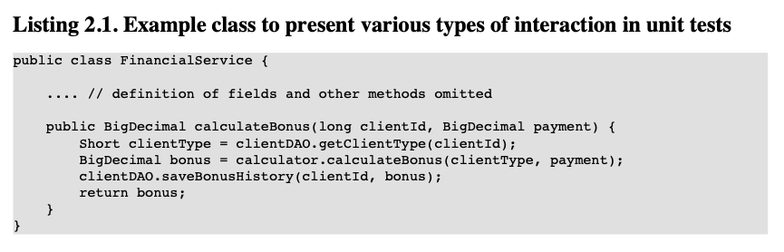
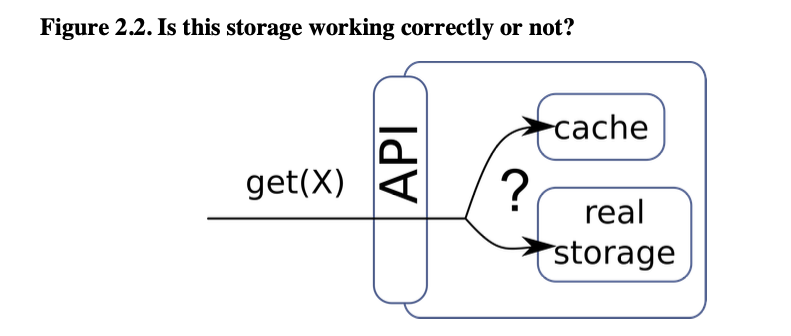
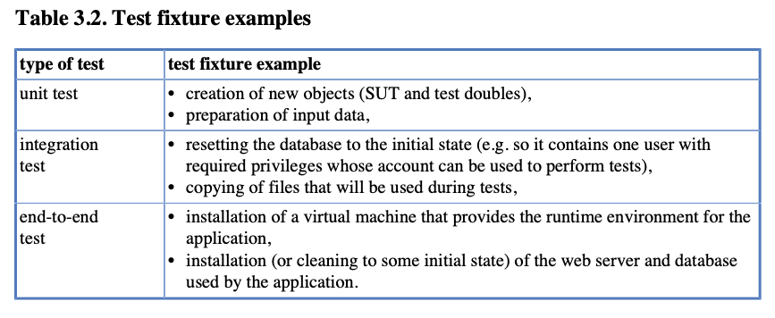
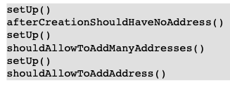
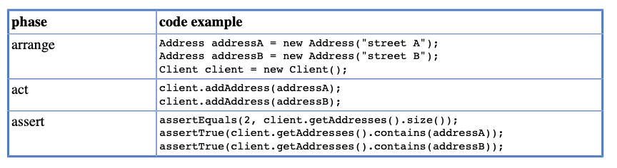

# Chapter 1 On Tests and Tools

Bu giriş bölümü, testin ana kategorilerini sunar. Her birinin rolünü anlamamızı sağlar ve aynı zamanda unit testinin
yeri ve amacını görmemizi sağlar.

## Naming Chaos

Eğer testler konusuna derinlemesine inmeye başlarsanız, kaç farklı isimle karşılaşacağınıza şaşıracaksınız. Unit tests,
integration tests, smoke tests, stress tests, end-to-end tests, exploratory tests, system tests, performance tests,
user test, automated tests, acceptance tests vb. Birçok isimle karşılaşmanız mümkün olacak.
Bu kadar çok sayıdaki test ve mevcut sınıflandırmaların çeşitliliği karşısında şaşkına dönebilirsiniz. Her biri için bir
tanım aramaya başladığınızda ise aynı terim için büyük farklılıklar gösteren birçok tanım bulacaksınız. Bu terminolojik
karmaşa, test konularını takip etmeyi gereğinden daha zor hale getiriyor.

Bu kitapta, testle ilgili terimlerin en yaygın kullanılan setini takip etmekteyim. Seçtiğim isimlerin amacı iyi bir
şekilde tanımladığını düşünüyorum. Umarım sizin için de aynı şekilde anlamlı olurlar.

## 1.1 An Object-Oriented System

Hemen üç temel test türünü ele alacağız: unit tests (bu kitabın ana konusu), entegration tests ve end-to-end
tests. Java dünyasında nesne yönelimli (OO) programlama paradigması hakim olduğu için, bu testlerin bir OO sisteminin
test edilmesinde hangi rolü oynadığını öğreneceğiz. Şekil 1.1, böyle bir sistemin çok basit bir soyutlamasını
sunmaktadır. (Çalışanlar ve yöneticilerin ne anlama geldiğine çok yakında değineceğiz.)


Evet, doğru! Bir sürü daire ve ok. Daireler nesneleri temsil ediyor, oklar ise aralarında iletilen mesajları gösteriyor.
Gördüğünüz gibi, bu resimde bir client de bulunuyor ve onun hareketi (istemi) OO sistemimizde büyük bir etkinlik
başlatmış durumda. Neden bu kadar çok nesne ve mesaj var? Neden zeki bir nesne client'in isteğiyle başa çıkamaz? İşte,
bir OO dünyasının sakinlerinin çok sınırlı bilgiye ve sadece belirli bir yetenek setine sahip olduklarını görmekteyiz.
Her biri çok kısıtlı işlevselliğe sahiptir veya başka bir deyişle, kendi başlarına çok fazla şey yapamazlar. Bu nedenle,
kullanıcının bakış açısından yararlı bir şey elde etmek için işbirliği yapmaları gerekmektedir. Bu, aşağıdaki gibi bir
hareket tarzına yol açar:

- Ben sadece basit bir web denetleyicisiyim, bu yüzden sizin için verileri veritabanından alamam. Ama size yardımcı
  olabilecek biri var - ona UserDAO diyelim. Bu yüzden isteğinizi ona ileteceğim. Ah! Şimdi hatırladım ki UserDAO'nun
  HTTP isteğini anlamadığını. Onun ihtiyaç duyduğu bilgileri çıkarıp ona ileteceğim. Şimdi onun cevabını bekleyelim.

Evet, işte nasıl çalıştığı budur. Aslında, birçok sınıf sadece iletileri iletmekten başka bir şey yapmaz ve belki de
bunları bazı şekillerde dönüştürür.

Düşünüldüğünde, orada çok fazla gerçek iş yapan sınıf (yani sizin tarafınızdan yazılan sınıflar) bulunmamaktadır. ORM
Muhtemelen bunu yazmamışsınızdır. Sonuçta, etrafınızda çok sayıda sağlam çözüm olduğunda neden yazasınız? Dependency
Injection Container'i (DI)? Olası değil. Logging Framework? Hayır. Uygulamanızda gerçek iş mantığının miktarını
düşünürseniz, ne kadar az olduğuna şaşırmış olabilirsiniz. Elbette, bazı business logic'leriniz vardır. Bu nedenle
müşteriniz yeni bir uygulama için bir sipariş vermiştir. Ancak muhtemelen birçok hazır kullanıma hazır eleman
kullandınız ve sizin için çok iş yapan birçok bileşen vardır. Ve bu harika bir şeydir, çünkü kod yeniden kullanımı, özel
olarak tasarlanmış unsurlara tamamen odaklanmanızı sağlayarak hızlı bir şekilde uygulamalar oluşturmanın harika bir
yoludur. Ancak öyleyse, muhtemelen sınıflarınızın birçoğu yalnızca appropriate collabarators (uygun işbirlikçilere)
appropriate messages (uygun iletileri) ileterek şeyleri bir araya getiren sınıflardır. Diğerlerinin çalışmasını koordine
ederler. Bu tür sınıflara **managers** diyeceğiz. Çalışmaları, worker'ların yaptığı işten önemli ölçüde farklıdır.

Yakında göreceğiniz gibi, bu fark test etme üzerinde ciddi bir etkiye sahiptir.

## 1.2 Types of Developers' Tests

Bir OO (nesne yönelimli) sistem resmini akılda tutarak, her test türünün etkilendiği sistem parçalarını görselleştirmeye
çalışabiliriz. Bu, her bir geliştirici testinin kapsamını ve amacını anlamamıza yardımcı olacaktır.

Önce, bu kitap boyunca sıkça kullanacağımız iki önemli terimi tanıtmak istiyorum: SUT ve DOC.

SUT veya System Under Test olarak adlandırdığımız şey, test edilen sistemin bir parçasını ifade eder. Testin türüne
bağlı olarak, SUT çok farklı granülerlikte olabilir - bir sınıftan bir uygulamanın tamamına kadar.

DOC veya Dependent on Component olarak adlandırılan şey, SUT'in görevlerini yerine getirmek için gereken herhangi bir
varlıktır. Genellikle DOC, SUT ile aynı granülerlikte olur, yani SUT bir sınıfsa, diğer sınıfları kullanır; bir modülse,
diğer modüllerle işbirliği yapar.

"DOCs" ve "collaborators" (işbirlikçiler) terimlerini birbirinin yerine kullanacağım.

Aşağıdaki bölümler, çeşitli test türlerini çok kısa bir şekilde tanıtacak. Her biri hakkında çok daha fazla şey
söylenebilir, ancak şimdilik sadece OO sistem resmine odaklanalım ve her test türünün hangi kısmını kapsadığını görmeye
çalışalım.

## 1.2.1 Unit Tests

Unit testleri, tek bir sınıfa odaklanır. Kodunuzun çalıştığından emin olmak için kullanılırlar. Test edilecek sınıfın
gerçek collaborators (işbirlikçilerini), test dublörleriyle değiştirerek, test edilecek sınıfın çalıştığı context'in tüm
yönlerini kontrol ederler. Sistemin kullanıcıları hakkında hiçbir şey bilmezler ve katmanlar, harici sistemler ve
kaynaklar hakkında bilgi sahibi değillerdir. Çok hızlı çalışırlar ve sık sık yürütülürler.

Bu, Şekil 1.2'de gösterilmektedir. Sadece bir nesne açıkça görülebilirken, sistemdeki diğer tüm unsurlar gri tonlu
olarak gösterilir. Görünen tek unsurlar test edilecek olan SUT (System Under Test) - test edilecek nesnedir. Gri tonlu
unsurlar, test tarafından tam olarak etkilenmeyen veya çeşitli test dublörleriyle değiştirilen sistem parçalarını
simgeler. Yatay çizgiler, katmanların (örneğin, görünüm, hizmetler, DAO katmanları) sınırlarını temsil eder. Resimde
görüldüğü gibi, bir Unit testi bir katmanın içinde yer alır.


Her unit testing framework'u ile çalışan test, bir unit test değildir! Unit testlerinizin, 2.1 bölümünde sunulan tanıma
uygun olduğundan emin olun!

## 1.2.2 Integration Tests

Integration testleri, kodunuzun farklı modüllerinin doğru şekilde Integrationuna odaklanır ve özellikle kontrolünüz
dışındaki kodlarla Integration'ını kapsar. Bir örnek, iş sınıflarınız ile bir OSGi konteyneri, ORM framework'u veya web
services framework arasındaki bağlantı olabilir. Integration testleri, unit testlerden çok daha geniş bir kod alanını
kapsamasına rağmen, hala geliştiricinin bakış açısından kodu test eder.

Integration testleri, unit testlerden çok daha yavaş bir şekilde çalışır. Genellikle yürütülebilmesi için bazı
kaynakların (örneğin, bir application context) yapılandırılması gerekmekte ve yürütülmesi, genellikle yavaş yanıt veren
bazı varlıkların (örneğin, veritabanları, dosya sistemi veya web hizmetleri) çağrılarını içermektedir. Integration
testlerinin sonuçlarını doğrulamak için genellikle harici kaynaklara (örneğin, bir SQL sorgusu çıkarma) bakmak
gerekmektedir.

Test dublörleri, gerçek sistem parçalarının (örneğin, sınıflar veya modüller) fake yerine geçen bileşenlerdir. Bu konu,
daha sonra 5. Bölüm olan "Mocks, Stubs, Test Spies" bölümünde detaylı olarak ele alınacaktır.


Şekil 1.3 gösterildiği gibi, Integration testleri genellikle birkaç katmana yayılır (örneğin, services'in DAO
katmanıyla doğru şekilde çalışıp çalışmadığını test etmek için). Integration testleri, ekibiniz tarafından yazılan kodu
ve aynı zamanda test edilen uygulama tarafından kullanılan 3rd party kütüphanelerden gelen kodu yürütür. Unit
testlerde olduğu gibi, sistemde geniş alanlar ya Integration testleri tarafından etkilenmez ya da test dublörleriyle
değiştirilir. Integration testleri genellikle kullanıcı arayüzüne (GUI) dokunmaz. Bu nedenle, resimde müşteri (sistem
kullanıcısı) gösterilmez.

## 1.2.3 End-to-End Tests

End-to-End testler, kodunuzun müşterinin bakış açısından çalıştığını doğrulamak için kullanılır. Kullanıcının sistemi
nasıl kullanacağını taklit ederek, sistemin tamamı test edilir. Bu nedenle, tüm katmanları kapsarlar. End-to-End
testlerde, test dublörleri nadiren kullanılır - amaç gerçek sistem üzerinde test yapmaktır. End-to-End testler
genellikle yürütülmesi için önemli bir zaman gerektirir.


Şekil 1.4, tüm katmanlardan (GUI, web service layer veya test edilen sistemdeki diğer harici API'ler gibi) öğeleri
test eden bir end-to-end testini göstermektedir. End-to-end testler, front-end'den (GUI elemanlarına tıklamalar gibi)
storage layer'lara (örneğin, veritabanı depolama) kadar olan tüm bileşenleri test eder. End-to-End testler, gerçek
kullanıcıların yaptığı taleplere benzer şekilde başlatılır (örneğin, GUI elemanlarına tıklamalar).

## 1.2.4 Examples

**Test tiplerine gore ornekler:**

### Unit tests:

- FootballPlayer sınıfından bir nesnenin, ikinci sarı kartı aldıktan sonra durumunun "fired" olarak değişmesi
  gerekmektedir.
- Product sınıfının bir constructor'i, fiyat argümanı 0'dan küçükse IllegalArgumentException (anlamlı bir mesajla
  birlikte) fırlatmalıdır.

### Integration tests

- UserService sınıfının deleteAccount() metodunun, değeri 1 olan bir ID argümanıyla çağrılması, bu ID'ye sahip hesabın
  veritabanından silinmesine neden olmalıdır.
- ItemDAO sınıfına, ID'si 5 olan bir öğe için ikinci kez talep edildiğinde, gerçek veritabanına dokunmaması ve istenen
  öğeyi cache'den alması gerekmektedir.
- ParcelService, paketin ayrıntılarını bulmak için bir web servisi ile iletişim kurmalı ve paket bulunamazsa uygun hata
  bilgisiyle birlikte bir e-posta göndermek için EmailService'i kullanmalıdır.

### End-to-End tests

- Giriş yapmış bir kullanıcı, herhangi bir genel resmin yanındaki "yorum ekle" düğmesine tıklayarak yorum ekleyebilir.
  Misafir kullanıcılar (giriş yapmamış kullanıcılar), yayınlandıktan sonra bu yorumu görebilir, ancak kendi yorumlarını
  gönderemezler.
- Bir mağaza sahibi, bir Ürün Ekle formunu kullanarak mağazasına yeni bir ürün eklediğinde, bu ürünü bir Arama Formu'nda
  adını arama alanına girerek bulmak mümkün olmalıdır.
- Bir kullanıcı, geo-lokasyon verilerini whatCityIsThis web servisi aracılığıyla gönderdiğinde, sistem şehir adıyla
  yanıt vermelidir.

Yukarıda ki liste SUT'ların ve DOC'ların unit testlerden (daha küçük), integration testlerine (orta) ve End-to-End
testlere (daha büyük) geçişte nasıl "büyüdüğünü" göstermektedir. Farklılık açık bir şekilde görülebilir. Unit testlerde
SUT'lar ve DOC'lar sadece sınıflardır. Integration testleri, modüllerin veya katmanların seviyesinde etki eder.
End-to-End testlerde ise tüm uygulama test edilir (uygulamanın kendisi bir SUT haline gelir) ve diğer uygulamalar
collaborators (işbirlikçi) (DOC) olarak kullanılır.


Önceki bölümlerde sunulan tüm test türleri önemlidir. Bir geliştirme ekibi açısından, her birinin kendi değeri vardır.
Unit testler yüksek kaliteli kod sağlamaya yardımcı olur, Integration testleri farklı modüllerin etkili bir şekilde
birlikte çalıştığını doğrular, End-to-End testler ise kullanıcıların bakış açısını yansıtarak sistemi deneyimler.
Uygulamanın türüne bağlı olarak, bunlardan bazıları diğerlerine göre daha uygun olabilir.

Farklı test türlerini düşünmenin başka bir yolu, bunları bir ölçekte yerleştirmektir. Bu ölçeğin bir ucunda, yalnızca
belirli bir sistemi doğru bir şekilde uygulayıp uygulamadığımızı kontrol etmek için kullanılan unit testler bulunur.
Diğer ucunda ise, ana amaç doğru sistemi uyguladığımızı doğrulamak olan End-to-End testler bulunur. Integration testleri
ise bu ikisinin arasında yer alır.

Bu kitap unit testlere odaklanırken, diğer test türlerine çok sınırlı bir şekilde değinmektedir. Ancak, bu test
türlerinin varlığından haberdar olmak ve yalnızca unit testlere güvenmemek çok önemlidir. Unit testler
Developerlarin testlerinin temelidir, ancak genellikle tek başlarına yeterli değildirler. Unit testleri öğrenirken
bunu aklınızda tutmanız önemlidir.

Hangi testleri uygulamanız için yazmalısınız? Ne yazık ki, bu soruya kolay bir cevap yoktur. Farklı test türlerinin
doğruluk oranını tanımlayan altın bir kural bulunmamaktadır. Bu, yazdığınız uygulamanın türüne çok yüksek bir derecede
bağlıdır.

## 1.3 Verification and Design

Test yaklaşımlarının sürekliliği, iki zıt inanç arasında yer alır. Farkı netleştirmek için her iki uç noktayı da
tanıtacağım.

Bazı insanlar (onlara kolaylık sağlamak için "verifiers" olarak adlandıracağım), kodlarının çalıştığından emin
olmak istiyor. Bu, hedefleri - yapması gerektiği gibi çalıştığından emin olmak. Testi zor olan kodlar için, test
yapabilmek için mevcut tekniklere başvuracaklar. Testability kutsal amaçlarına ulaşmak için, gerektiğinde bazı
nesne yönelimli kurallardan ödün verecekler. Yansıma (reflection) kullanarak method görünürlüğünü değiştirebilir veya
final sınıflarla uğraşmak için sınıf yükleme hileleri kullanabilirler. Bu şekilde, kâbus gibi bir geçmişe sahip kod
dahil olmak üzere neredeyse her şeyi test edebilirler. "dirty hacks" kullanmakla suçlandıklarında, omuzlarını silker
ve "çamurda yüzüyorsam zaten kirli hissetmiyorum" diye yanıtlarlar.

Diğer bir grup - onları "Designerlar" olarak adlandıralım - nesne yönelimli kurallara uymayı en önemli şey olarak görür
ve bu kuralların kolayca test edilebilir bir kod ürettiğine inanır. Onlar için testler, kodun sağlığının bir
göstergesidir. Kolay yazılabilen testler, sağlam bir kodun göstergesidir. Test yazarken karşılaşılan zorluklar, kodun
sorunlarına işaret eder ve kodun yeniden düzenlenmesi gerektiğinin açık bir işaretidir. Designerlar, üretim kodu için
kullandıkları teknikleri kullanarak testler yazmayı tercih eder ve yansıma (reflection) veya sınıf yükleme hilelerinden
kaçınırlar. Designerlar özellikle TDD yaklaşımını sevmekte olup, belirli bir kod kalitesini garanti eder. Mevcut bir
kod durumunda, daha test edilebilir hale getirmek için genellikle kodu yeniden yapılandırmaya (veya yeniden yazmaya)
eğilim gösterirler.

Görüldüğü gibi, bu iki yaklaşım arasındaki çatışma asla çözülemez. Destekçiler farklı görüşlere sahiptir, farklı
ihtiyaçları ve değer verdikleri farklı şeyler vardır. Her ikisinin de üstünlüklerini "kanıtlamak" için bazı iyi
örnekleri vardır. StackOverFlow uzerinde ki bir tartisma:

- Reflection, özel metodları test etmenin en iyi yoludur.
- Evet, tasarımınız üzerinde düşünmelisiniz!

Bu ayrım, mevcut olan farklı test araçlarının sunulan özelliklerini incelerseniz de açıkça görülür. Bazıları (örneğin
JMockit ve Powermock), sizi test edilemeyen şeyleri test etme gücüyle donatarak, static sınıfları, final sınıfları ve
constructor'ları taklit etmenizi veya private metodları çağırmanızı sağlar. Diğerleri ise bu tür hileleri kullanmaktan
kaçınırlar. Örneğin, JUnit, private metodların testini kolaylaştıracak herhangi bir özellik sunmamıştır, hatta JUnit'in
ilk günlerinden beri birçok kişi böyle bir şey istemiş olmasına rağmen.

Designer ve verificator terimleri, testlere nasıl yaklaşılabileceği konusunda önemli bir farkı vurgulamak için
kullanılmıştır. Ancak, benim bildiğim kadarıyla kimse tamamen Designer veya tamamen verificator değildir. Hepimiz bu
ikisi arasında bir yerde yer alırız.

## 1.4 But Should Developers Test Their Own Code

Evet, çok defa duyduğunuz gibi, sizin (bir geliştirici olarak) kendi kodunuzu test etmemeniz gerektiği söylenir. Bu
iddianın desteklenmesi için birçok sebep sunulur, ancak en güçlü ve en yaygın kullanılan iki sebep şu şekildedir:

- Developerların test becerileri eksiktir
- Kendinizin yargılayan hakim olmalısınız

Bu konuda açık olalım. Her ikisi de iyi nedenlere dayanıyor ve kuşkusuz, birçok geliştirme ekibinin gerçek deneyimlerine
dayanıyor. Bu nedenle, bunları hafife almak yanlış olur. Bununla birlikte, test etme konusundaki "ortak bilgi"nin bir
tür yanlış anlama veya belki de test etmenin çeşitlilik ve amaçlarına dair genel bir anlayış eksikliğine işaret ettiğine
ikna oldum.

Eğer müşterilere yazılımı göndermeden önceki son testlerden bahsediyorsak, genel olarak bu tür testlerin profesyonel
test ekipleri tarafından yürütülmesi gerektiğine inanıyorum. Bir geliştiricinin GUI üzerinden tıklayarak veya deneyimli
bir testçi kadar saldırgan ve meraklı olamayacağı konusunda size katılıyorum. Ancak, bu tür testler tek seçenek
değildir! Developerlar tarafından yapılabilen birçok değerli test vardır ve yapılmalıdır.

Dahası, bazı yazılımlar Developerlar dışındakiler tarafından kolayca test edilemez! Backend çözümlerini düşünün. Bu
tür yazılımlar genellikle grafik arayüzü (GUI) veya kullanıcı dostu giriş noktaları içermez ve çevrenin mimari veya
donanım yönleriyle güçlü bağımlılıklara sahip olabilir.

Müşterinin bakış açısından yazılımı kontrol etmek önemlidir, ancak bu daha büyük bir puzzle'ın sadece tek bir
parçasıdır. Sizinle bir yazılımı paylaşmadan önce, bir geliştirme ekibi size sağlamak zorundadır. Eğer Developerlar
kendi testlerini yapmazlarsa, muhtemelen düşük kalitede bir şey sunacaklardır. Developerlarin yaptığı testler,
müşteriye sunulan ürünün kalitesini artırmanın yanı sıra, kod tabanının kalitesini de artırır ve bu herhangi bir
geliştirme ekibi için önemli bir konudur. Bu küçümsenecek bir şey değildir. Bir geliştirme ekibinin, koduna ne kadar
güvendiği ve ne kadar gurur duyduğu o kadar önemlidir ki, daha iyi sonuçlar elde eder. Developerlarin yaptığı testler,
bir ekibin güven kazanmasına ve fazla şüpheye kapılmadan ilerlemesine yardımcı olur.

Ayrıca, hataları erken yakalamak maliyeti büyük ölçüde azaltır ve onarımda geçen süreyi kısaltır. Erken aşamada daha
fazla hata bulursanız, maliyetleri o kadar az olacaktır. Bu iyi bilinen time-cost oranı Figure 1.5'te
gösterilmiştir.


Developerlarin yaptığı testler, hatalara karşı ilk savunma hattıdır. Hatalar ortaya çıktığı anda onları yok ederler.
Tabii ki, bu bölümün başında belirtilen nedenlerden dolayı, bazı hatalar muhtemelen geçebilir. Evet, bu olabilir! İşte
bu yüzden, başka savunma hatları da bulunmalıdır: yani yüksek becerilere sahip, uzmanlaşmış test ekipleri. Umarım kalan
tüm hataları bulup ortadan kaldırırlar.

Aslında, birçok şirket (neredeyse) sadece Developerlarin yaptığı testlere güvenir. Facebook veya WordPress gibi büyük
şirketler, continuos deployment yaklaşımını benimserler ve bu yaklaşımı "automated test'leri geçerse, üretime gider"
şeklinde özetleyebiliriz.

## 1.5 Tools Introduction

Bu bölüm, testlerin yazılması ve yürütülmesi için kullanacağım araçları tanıtıyor. Bu, testle ilgili farklı yaklaşımlar
hakkındaki son tartışmamıza (1.3 Bölümüne bakın) ilişkilidir. Bu farklı yaklaşımlar, neredeyse aynı problem alanlarını
kapsayan birçok aracın var olmasından sorumludur.

Örnek olarak, mocking frameworks'leri ele alalım. Gerçekten bu kadar çok mocking framework'e ihtiyacımız var mı? Cevap "
evet" ve bunun nedeni her mocking framework'in biraz farklı olması ve test dublörleri yazılması konusunda biraz farklı
bir yaklaşımı kolaylaştırmasıdır. Bu, test framework'lerinden IDE'lere kadar diğer araç grupları için de geçerlidir.

Genel olarak, test araçları kullanımı çok basittir. Bu iyi bir haber, değil mi? Ancak dikkatli olun – bir hile var! Bu
aldatıcı kullanım kolaylığı, birçok geliştiricinin, test yapmayı bildiğini varsaymasına neden olur, sadece test
araçlarını kullanabildikleri için – yani birkaç satır JUnit kodu yazabiliyor olmaları. Bu açıkça yanlıştır. Araçlar
düşüncesizce kullanılabilir veya yetenekli bir el tarafından kullanılabilir. Sizi yönetebilirler veya itaatkar
hizmetkarlarınız olabilirler. Önemli olan 'neden' ve 'ne için' olduğunu kavramaktır, böylece ne zaman kullanmanız
gerektiğini (veya kullanmamanız gerektiğini) bilirsiniz.

Bu kitap boyunca, belirli araçlarda somutlaşan fikirlerin önemini vurgulayacağım. Bu fikirleri iyi anlarsanız, neredeyse
herhangi bir araçla takip edebilirsiniz. Eğer sadece araçlara odaklanırsanız, yakında size değerli gelen her şeyi tekrar
öğrenmeniz gerekecektir. Fikirler kalıcıdır, ancak araçlar sadece kısa bir süre için vardır.

Eğer tercih ettiğiniz araçlar farklı ise ve farklı araçlar kullanıyorsanız, bu bir sorun değildir. Günümüzde araçlar
birbirine çok benzer. Farklı yollar boyunca evrim geçirmişlerdir, ancak birbirlerini etkilemiş ve genellikle
rakipleriyle benzer özellik setlerine sahip olmuşlardır. Modern araçları kullanarak benzer sonuçlar elde edebilir ve bu
kitapta sunulan teknikleri kullanmaya devam edebilirsiniz. Benim seçtiğim araçlar kişisel favorilerimdir ve dikkatli bir
şekilde seçilmiştir. Kitapta sunulan bazı tekniklerin, diğer araçları kullanmaktan daha kolay bir şekilde
kullanabileceğinizi düşünüyorum. Sizin için tek risk, sizin de onların üstünlüğüne ikna olmanız ve ardından araç
kutunuza yeni oyuncaklar eklemeniz olabilir. Bu pek kötü bir şey gibi görünmüyor, değil mi?

## Testing Framework : JUnit

JUnit (http://junit.org), Java için açık kaynaklı bir test framework'udur. Kent Beck tarafından 1997 yılı civarında
oluşturulmuş olup o zamandan bu yana Java geliştiricileri için de facto bir standart test aracıdır. Tüm IDE'ler (
Eclipse, IntelliJ IDEA), derleme araçları (Ant, Maven, Gradle) ve popüler framework'ler (örneğin, Spring) tarafından
desteklenmektedir. JUnit, geniş bir kullanıcı topluluğuna sahiptir ve çeşitli ilginç uzantı projeleriyle
desteklenmektedir. Unit testler için özellikle tasarlanmış olsa da, diğer test türleri için de yaygın olarak
kullanılmaktadır.

## Mock Library : Mockito

Mockito (http://mockito.org), nispeten yeni bir mocking framework (ya da daha doğrusu test-spy framework'u). Szczepan
Faber'ın gururla babası olduğu 2007'nin dördüncü çeyreğinde doğmuş ve hızla kaliteli bir ürün haline gelmiştir. Mock
süreci üzerinde tam kontrol sağlar ve "temiz ve basit API ile güzel testler yazmanıza olanak tanır". İlk olarak
Easymock'tan türetilen Mockito, önemli ölçüde gelişmiş ve öncüsünden birçok açıdan farklılık gösterir hale gelmiştir.
Mockito'yu JUnit ile birlikte kullanmak çok kolaydır.

## Matcher Libraries : FEST and Hamcrest

Testleri daha okunabilir ve bakımı daha kolay hale getirmek için kitabın bazı bölümlerinde aşağıdaki eşleştirici (
matcher) kütüphanelerini kullandım: FEST Fluent Assertions (http://code.google.com/p/fest/) ve
Hamcrest (http://code.google.com/p/hamcrest/).

## JUnit Params

JUnit'un en popüler test framework'u olması, her açıdan en iyi olduğu anlamına gelmez. Aslında, ciddi zayıf noktalara
sahiptir ve parametrized testlere destek verme konusunda zayıf kalır. Neyse ki, yıllar içinde birçok ek kütüphane
oluşturulmuş ve JUnit kullanıcılarına düzgün bir parametrized test desteği sağlamak amacıyla bunlar geliştirilmiştir.

## EasyTest

Proje web sitesinde EasyTest'i "JUnit framework'une dayalı bir Data Driven Testing Framework" olarak duyurulmuştur.
EasyTest, JUnit'in varsayılan parametrized testlerine bazı güzel iyileştirmeler sunar. Kitapta, EasyTest'in Excel
dosyalarını işleme yeteneklerini kullanacağız.

## Code Coverage : Cobertura

Code Coverage Tools'lar arasında birkaç ilginç seçenek bulunmaktadır, kişisel tercihim ise
Cobertura'dır (http://cobertura.sourceforge.net). Cobertura, tüm derleme araçları, IDE'ler ve sürekli entegrasyon
sunucuları ile iyi çalışır.

## Mock Libraries : PowerMock and EasyMock

Kitapta kullanılan mocking framework Mockito olsa da, bazı durumlarda diğer seçeneklere göz atmak faydalı olabilir.
Powermock (http://code.google.com/p/powermock/), final sınıfların ve statik methodların mock'lanması gibi güçlü
özellikler sunar. Bu özellikleri bir kez kullanarak, alternatif bir test yaklaşımını göstermek ve tartışmak için
kullanacağız. EasyMock (http://easymock.org), mock-based test ve spy based test arasındaki farkı göstermek
için kullanılacaktır.

## Mutation Testing : PIT

PIT Mutation Testing (http://pitest.org), Java için hızlı bir bytecode based mutation testi sistemidir ve unit
testlerinizin etkinliğini test etmenizi sağlar. Java 5 ve JUnit 4.6 (ve üzeri) ile çalışır.

## Utilities : Catch-Exception, Tempus-Fugit, and Unitils

Catch-Exception kütüphanesi (http://code.google.com/p/catch-exception/), production kodu tarafından uygun
exception'ların fırlatılıp fırlatılmadığını doğrulayan testlerin yazılmasına yardımcı olur. Java 1.6 gerektirir.

Unitils (http://www.unitils.org), "unit ve integration testini kolay ve sürdürülebilir hale getirmeyi amaçlayan" açık
kaynaklı bir kütüphanedir. Sadece "Reflection asserts" modülü adlı birkaç özelliğini kullanacağız.

Tempus-fugit (http://tempusfugitlibrary.org), "concurrent kod yazma ve test etme için Java micro-library" olarak
tanımlanan bir kütüphanedir. Diğer birçok şeyin yanı sıra, JUnit'e, çok sayıda thread tarafından aynı anda
çalıştırılacak kodun test edilmesi için önemli yetenekler kazandırır.

## Build Tools : Maven and Gradle

Unit testleri genellikle derleme sürecine dahil edilir, yani bir derleme aracı tarafından çalıştırılır. Bu kitapta,
testleri Maven (http://maven.org) ve Gradle (http://gradle.org) kullanarak nasıl çalıştıracağınızı anlatıyorum.

# Chapter 2 - Unit Tests

## 2.1 What is a Unit Test

Unit testlerin arkasındaki fikir basittir: şu anda üzerinde çalıştığınız sınıfın doğru şekilde çalıştığından emin
olmaktır - yani görevini yerine getirdiğinden emin olmaktır. Bu, belirli bir input data verildiğinde beklenen bir
output yanıt verip vermeyeceği veya anlamsız verilerle beslendiğinde uygun bir exception fırlatıp fırlatmayacağı gibi
konuları içerir. Dolayısıyla, beklenen davranışı doğrulayacak testler yazmak fikridir.

Ancak bu yeterli değildir. Sınıflarınızı izole bir şekilde test etmeli ve herhangi bir ortamda çalıştıklarını doğrulamak
için test etmelisiniz. Unit testleri yazarken önemli olan tek bir sınıfı ve daha fazlasını test etmemektir.
Veritabanları, Spring configuration dosyaları ve harici web servislerini unutun. Bunları Unit testlerinize dahil etmek
istemezsiniz. Sınıfınızın mantığına odaklanın. Kodunuzun düzgün çalıştığından emin olduktan sonra, diğer bileşenlerle
olan entegrasyonunu test edin! Ancak önce Unit testleri gerçekleştirin!

Ne yazık ki, hala birçok kişi Unit testlerle diğer test türlerini karıştırmaktadır veya developer'ların yazdığı
herhangi bir testi bu terimle tanımlamaktadır. Birçok insan, Unit test framework'u tarafından yürütüldüğü için
yazdıkları her testin "Unit" türünde olduğunu iddia etmektedir! Diğerleri ise "Unit testi" yapıyor olduklarını iddia
edip three layers bir yazılımı Unit olarak seçmektedir... Bu, tabii ki yanlıştır: kafa karışıklığına yol açar ve
tartışmayı zorlaştırır. Bunu yapmayın!

Unit testleri, diğer developer'ların testlerinden ayıran bazı özelliklere sahiptir. 1.2 bölümünde tartışıldığı gibi,
Unit testleri tek bir sınıfa odaklanır ve bir SUT'un yürütüldüğü context'i sıkı bir şekilde kontrol eder. Ayrıca son
derece hızlı çalışırlar ve genellikle developer'i suçlu methoda veya hatta suçlu kod satırına kadar kesin bir şekilde
hata noktalarına götürebilirler. Çalışmamızın kalitesi hakkında bu kadar kesin ve anlık geri bildirim sağlayarak,
hataları sistemin tamamına yayılmadan önce hızlı bir şekilde düzeltmemize yardımcı olurlar (bkz. 1.4 bölümü).

Kapsamlı ve titiz bir Unit test setinin varlığı, kodu korkmadan yeniden düzenleyebilmemizi sağlar.

Unit testlerinin yazılmasının bir başka faydası, kodumuzun live'a (yani her zaman güncel) bir belgesi olarak hizmet
etmeleridir. Unit testleri, Javadocs veya kodun kendisiyle birlikte geliştirilen herhangi bir metin açıklamasından çok
daha güvenilirdir.

Son ama en önemlisi, yetenekli bir developer, Unit testlerinin oluşturulma sürecini bir tasarım faaliyetine
dönüştürebilir. Bu, oldukça şaşırtıcı bir şekilde, Unit testlerinin sağladığı tüm faydalar arasında en önemlisi olabilir

## 2.2 Interactions in Unit Tests

Unit testlerle neyin test edilmesi gerektiğini ve nasıl test edilmesi gerektiğini anlamak için, test sınıfı ile SUT (
System Under Test) arasındaki etkileşimlere ve SUT ile onun DOC'ları (Dependent Objects and Collaborators - Bağımlı
Nesneler ve İşbirlikçiler) arasındaki etkileşimlere daha yakından bakmamız gerekmektedir.

Öncelikle, bir diyagram şeklinde bazı teorik bilgiler verebilirim. Şekil 2.1, bir SUT ile diğer varlıklar arasında olası
etkileşimleri göstermektedir.


İki etkileşim doğrudan ve SUT ile client'i (bu durumda bir test sınıfı) arasında gerçekleşir. Bu ikisi doğrudan test
kodundan "ulaşılabilir" şekildedir ve üzerlerinde kolayca işlem yapılabilir. Diğer iki etkileşim ise dolaylıdır ve SUT
ile DOC'lar (Bağımlı Nesneler ve İşbirlikçiler) arasındadır. Bu durumda, client (bir test sınıfı), bu etkileşimleri
doğrudan kontrol etme imkanına sahip değildir.

Yani, bir test sınıfı doğrudan SUT ile etkileşime geçebilir ve SUT'nin davranışını doğrulayabilir veya durum
değişikliklerini kontrol edebilir. Ancak, SUT'nin DOC'larla olan etkileşimlerini doğrudan kontrol edemez.

Başka bir olası sınıflandırma, etkileşimleri input'lar (SUT'nin bir mesaj alması) ve output (SUT'nin bir mesaj
göndermesi) olarak ayırır. Test yaparken, SUT'yi gereken bir duruma getirmek ve methodlarını çağırmak için doğrudan ve
dolaylı inputları kullanacağız. SUT'nin doğrudan ve dolaylı output'ları, SUT'nin davranışının ifadesidir; bu da SUT'nin
düzgün çalışıp çalışmadığını doğrulamak için onları kullanacağımız anlamına gelir.

Tablo 2.1, bir SUT'nin ve DOC'ların olası collaboration türlerini özetlemektedir. İlk sütun - "type of interaction" -
collaboration SUT'nin bakış açısından nasıl olduğunu açıklar. Bir test sınıfı, SUT'yi kullanan bir client (bir
kullanıcı) olarak hareket eder; bu nedenle "ilgili taraflar" sütununda yer alır.


Tabii ki! İşte bir örnek kod, müşteri ödemesi ve türüne dayanarak "bonus" hesaplayan bir finansal hizmeti (
FinancialService sınıfı) ve bununla etkileşen DOC'ları göstermek için:



Gördüğünüz gibi, SUT olan calculateBonus() metodu iki parametre alır (clientId ve payment) ve iki işbirlikçi ile
etkileşime geçer (**clientDAO** ve **calculator**). calculateBonus() metodunu tam olarak test etmek için hem input
parametrelerini (direct input), hem de işbirlikçilerinden dönen mesajları (indirect inputs) kontrol etmemiz
gerekiyor. Böylece dönen değerin (direct output) doğru olup olmadığını görebiliriz.

Tablo 2.2, calculateBonus() metodunda gerçekleşen ve test açısından önemli olan etkileşim türlerini özetler.


* direct input - Test class & SUT -> SUT'nin calculateBonus() metodunun clientId ve payment argümanları ile doğrudan
  çağrılması
* direct output - Test class & SUT -> SUT'nin calculateBonus() metodunu çağırdıktan sonra test sınıfına döndürülen bonus
  değeri.
* indirect output - SUT & DOC's -> SUT'nin clientDAO'nun saveBonusHistory() metoduna geçirdiği clientId ve bonus
  değerleri.
* indirect output - SUT & DOC's -> SUT'nin calculator'ın calculateBonus() metoduna geçirdiği clientType ve payment
  değerleri
* indirect input - SUT & DOC's -> clientDAO tarafından döndürülen clientType ve calculator tarafından SUT'ye döndürülen
  bonus değeri.

## 2.2.1 State vs Interaction Testing

Şimdi Figure 1.1'de gösterilen basit bir nesne yönelimli (OO) sistem soyutlamasını hatırlayalım. Bu şekilde, işçi ve
yönetici gibi iki tür sınıfın birlikte çalışarak bir client tarafından verilen bir isteği yerine getirdiği
görülmektedir. Kitap, her iki tür sınıfın da Unit testlerini açıklar. Öncelikle, işçilerin yapmış olduğu hesaplamaların
ve döndürdüğü değerlerin doğru olduğundan emin olmak istediğimiz için işçilerin dünyasına dalacağız. Bu Unit testin bir
parçası olan state testi, gerçekten basit ve uzun yıllardır tamamen kabul görmüştür. Bu tür bir test, direct input
ve output'ları kullanır. State testini, 3. Bölüm'de "Unit Tests with no Collaborators" başlığında ele alacağız.

Ardından, interactions testiyle ilgili daha zorlu konulara geçeceğiz. Yöneticilerin çalışmasına odaklanacağız ve
işbirlikçiler arasında nasıl mesajların iletiltiğine odaklanacağız. Bu, daha karmaşık ve sezgisel olmayan bir test
türüdür. Ara sıra, yeni fikirler ve araçlar ortaya çıkar ve etkileşimleri nasıl doğru bir şekilde test edileceği
konusunda hala canlı tartışmalar devam etmektedir. Gerçekten korkutucu olan, interaction testlerinin bazen iyi niyetli
olmaktan çok zarar verebilmesidir, bu yüzden sadece "nasıl" sorusuna değil aynı zamanda "olup olmadığı" sorusuna da
odaklanacağız. Bu tür bir test, indirect outputs'lara odaklanır. Interaction testini, 5. Bölüm'de "Mocklar, Stubs, Test
Spies" başlığında ele alacağız.

Direct Outputs'un test edilmesine gerçekten "State verification" denir çünkü bu, doğrudan sistemden dönen durumu veya
değerleri doğrulamayı içerir

## Why Worry about Indirect Interactions?

Bir nesne yönelimli fanatik şu noktada bana bağırarak başlayabilir: "Kapsülleme ve bilgi gizleme diye bir şey duydun mu
hiç? Öyleyse, SUT'un işbirlikçileri üzerinde hangi methodleri çağırdığı konusunda neden endişelenmeliyiz? Neden bunu
SUT'nin implementasyon detayı olarak bırakmayalım? Eğer bu SUT implementasyonunun özel bir bölümü ise, hiç
dokunmamalıyız."Bu mantıklı geliyor, değil mi? Keşke sınıflarımızı sadece API'lerini kullanarak tamamen test
edebilseydik! Ne yazık ki, bu mümkün değil. Bir örnek olarak, bir cache'den nesnelerin alınması durumunu düşünelim.

Cache'in genel fikrinin ne olduğunu hatırlayalım. İki depolama alanı bulunur: "real one", geniş kapasiteye sahip ve
average access time'a sahip, ve "cache" ise çok daha küçük kapasiteye sahip olmasına rağmen çok daha hızlı erişim
süresine sahiptir. Şimdi bir cache sistemine yönelik birkaç gereksinimi tanımlayalım. Bu tam teşekküllü bir cache
mekanizması olmayacak, ancak karşılaştığımız sorunu açıklamak için yeterli olacaktır.

Key X ile bir nesne istendiğinde, cache'li olan sistemimiz aşağıdaki basit kurallara göre hareket etmelidir:

1 - Eğer key X'e sahip nesne hiçbir depolama alanında bulunmuyorsa, sistem null değerini döndürecektir.
2 - Eğer key X'e sahip nesne herhangi bir depolama alanında bulunuyorsa, o nesne döndürülecektir.
a - Eğer key X'e sahip nesne cache storage alanında bulunuyorsa, bu depolama alanından döndürülecektir.
b - Eğer key X'e sahip nesne cache storage alanında bulunmuyorsa, ana depolama alanı aranacaktır.

Tabii ki, buradaki amaç, cache hit ratio oranını artıracak akıllı bir caching stratejisine sahip olmaktır - ancak
bu, gerçekten tartışmamızla ilgili değildir. İlgilendiğimiz şey, outputs (returned values) ve SUT ile
işbirlikçileri arasındaki etkileşimlerdir.

Yukarıda belirtilen gereksinimleri göz önüne alırsanız, state testiyle sadece 1 ve 2 numaralı gereksinimleri test
edebileceğimizi fark edeceksiniz. Bu, state testinin nesnelerin privacy'lerine saygı göstermesi nedeniyle gerçekleşir.
State testi, nesnenin içeride neler yaptığını görmeyi mümkün kılmaz - bu durumda, talep edilen nesnenin hangi depolama
alanından alındığını doğrulayamaz. Dolayısıyla, 2a ve 2b gereksinimleri state testi kullanılarak doğrulanamaz.

Bu aşağıdaki resimde gösterilmiştir. İki depolama alanından (hızlı bir cache storage ve daha yavaş real storage)
oluşan SUT'muz, tek bir get() methodi aracılığıyla erişilebilir. SUT'a request gönderen client, içsel karmaşıklığı
hakkında hiçbir şey bilmez.



İdeal olarak, bir request geldiğinde önce cache storage aranır ve eğer cache storage'de' verilen anahtar (bu
örnekte X) ile eşleşen bir input bulunmazsa, real storage alanı aranır. Ancak, SUT doğru şekilde uygulanmamışsa, önce
cache storage yerine real storage aranabilir. Verilen anahtarla bir nesneyi bekleyen client, bu iki durum arasındaki
farkı ayırt edemez. Onun bildiği tek şey, anahtar X ile bir nesne talep ettiği ve onu aldığıdır.

Sistemimizin beklendiği gibi çalışıp çalışmadığını gerçekten doğrulamak için interaction testi uygulanmalıdır.
İşbirlikçiler olan cache ve real storage ile yapılan çağrıların sırası kontrol edilmelidir. Bunun olmadığı
durumda, sistemimizin çalışıp çalışmadığını söyleyemeyiz.

Bu basit örnek, SUT'un observable davranışının (direct outputs) doğrulanmasının yeterli olmadığını kanıtlamaktadır.
Benzer sorunlar, diğerlerinin çabalarını koordine eden manager'ları (Section 1.1'e bakınız) test etmek
için ortaya çıkar. Daha önce belirtildiği gibi, bu tür koordinasyon sınıfları nesne yönelimli sistemlerde oldukça
popülerdir. Bu nedenle, (indirect outputs'ların) test edilmesi ile ilgili teknikler, araçlar ve sorunlar hakkında çok
zaman harcayacağız.

Başlangıçta daha basit duruma odaklanalım. Bir sonraki bölümde, işbirlikçisi(collaborators) olmayan basit nesnelerin
nasıl test edileceğini öğreneceğiz.

# Part II. Writing Unit Tests

Bir test, aşağıda ki durumlarda Unit test değildir!

- Veritabanı ile iletişim kuruyorsa,
- Ağ üzerinden iletişim kuruyorsa
- File System'a dokunuyorsa
- Diğer Unit testlerinizle aynı anda çalışamıyorsa,
- Çalıştırmak için özel işlemler yapmanız gerekiyorsa (örneğin, configuration dosyalarını düzenlemek),

# Chapter 3 Unit Tests with no Collaborators

Interaction türlerini ve Unit testlerin bileşenlerini anlamak gerçekten eğlenceli olsa da, "teoriden pratik" yapmak için
artık bu bilgiyi kullanmanın zamanı geldi. Şimdilik, SUT'unuzun herhangi bir işbirlikçiye ihtiyaç duymadığını
varsayarak, test etme konularının bir alt kümesine odaklanacağız. Bu varsayım - gerçek hayattaki sınıfların çoğu için
geçerli olmasa da - bazı önemli kavramları, fikirleri ve teknikleri göstermemizi sağlayacaktır. Bu koşullar altında
açıklamak çok daha kolay olacak, ancak bu tekniklerin kullanımı kesinlikle işbirlikçisiz bir ortamla sınırlı değildir.
Aslında, örneğin TDD yaklaşımı gibi bazıları, Unit test etmenin kendisiyle sınırlı değildir.

Daha sonraki bölümlerde (5. Bölüm'den başlayarak, Mocks, Stubs, Test Spies) bu gerçekçi olmayan varsayımı bırakıyor ve
SUT'unun çeşitli şekillerde işbirliği yaptığı işbirlikçilerle test etme tekniklerini tartışıyoruz. Ancak şimdilik,
SUT'unuzun yalnız olduğunu varsayalım.

JUnit, özellikle Unit testlerine odaklanan en popüler Java test framework'udur. Tools girişini okuduktan sonra, JUnit
testleri yazmayı ve yürütmeyi öğreneceğiz. Ayrıca, kitap boyunca tekrar tekrar kullanacağımız bazı JUnit özelliklerini
de öğreneceğiz. Bunlardan bazıları burada kısaca bahsedilecek ve daha sonra detaylı bir şekilde tartışılacak.

Bu kitap, her ne kadar yüksek kalitede Unit testleri yazmak isterseniz bilmeniz gereken her şeyi içerse de, kapsamlı
bir JUnit öğretici değildir. JUnit burada açıklananlardan daha fazlasını sunar, bunlar arasında integration ve
end-to-end testler için faydalı bazı özellikler bulunur. Bu araçta gerçekten ustalaşmak istiyorsanız, JUnit belgelerine
başvurmanız gerekmektedir.

## 3.1 Project Structure and Naming Conventions

İlk Unit test deneyimimiz için, JUnit tarafından popüler bir Unit test öğreticisinde kullanılanla neredeyse aynı olan
bir Money sınıfı kullanacağız. Unit test için, Money sınıfı, herhangi bir programlama dilinde ünlü HelloWorld örneği
tarafından oynanan rolü benzer şekilde oynar:  Çok basit (ve dürüst olmak gerekirse oldukça kullanışsız) bir sınıfla
başlayacağız. Daha sonra genişletilecektir.

Money class'ini record olarak ayarladım

### 3.2 Class To Test

```
public record Money(int amount, String currency) {

    @Override
    public boolean equals(Object anObject) {
        if (anObject instanceof Money money) {
            return money.currency().equals(currency()) && amount() == money.amount();
        }
        return false;
    }
}
```

Gördüğünüz gibi, Money sınıfı immutable'dır. İki adet field'e sahiptir. Biraz logic içeren tek method, equals()'ın
implementasyonudur

## 3.3 Your First JUnit Test

Bir test yazmadan önce, bir test senaryoları listesine ihtiyacınız vardır. Eğer yardımcı oluyorsa bir yere not
alabilirsiniz, ancak genellikle kafanızda tutmak yeterli olacaktır.

Money sınıfının koduna baktığınızda, test edilebilecek iki şey fark edebilirsiniz:

- Constructor
- equals() methodu

Constructor metodunun test edilmesi basit bir konu gibi görünüyor ve bu yüzden tam olarak bununla başlayacağız.
Burada kontrol edebileceğimiz tek şey, amount ve currency'nin doğru şekilde ayarlanmış olup olmadığıdır.

```
    @Test
    public void constructorShouldSetAmountAndCurrency(){
        Money money = new Money(10,"USD");
        assertEquals(10,money.amount());
        assertEquals("USD",money.currency());
    }
```

- Bir SUT oluşturulur.
- SUT test edilir ve sonuçlar Assert sınıfının statik assertEquals() methodları kullanılarak doğrulanır.

## 3.3.1 Test Results

Elle yapılan testler (bu konuda bir tartışma için Bölüm A.1'e bakınız) "bende çalışıyor"dan, "emin değilim, ama daha
fazla araştırmak için zamanım yok" durumuna kadar bir dizi sonuçla sonuçlanabilir. Automated testlerde durumlar farklı
görünür. Sadece birkaç olası sonuç vardır. Bunlara daha yakından bakalım.

Automated bir test, geçti veya başarısız oldu şeklinde iki durumdan birinde sonlanır. İki diğer sonuç daha az sıklıkla
gerçekleşir - bir test atlanabilir veya hata ile tamamlanabilir. Automated testlerde "Şimdi çalışması gerektiğini
düşünüyorum" gibi bir yer yoktur!

Bir testin tüm doğrulamaları karşılanırsa ve beklenmedik bir exception oluşmazsa, o test başarılı olarak kabul edilir.
Başarılı bir test genellikle IDE'lerde ve test raporlarında yeşil renkle işaretlenir.

Eğer beklenmedik bir exception oluşursa, o zaman test başarısız olur. Bu, bir doğrulamanın karşılanmaması durumunda veya
kodunuzda bir hata olması durumunda, örneğin ArrayIndexOutOfBoundsException gibi bir hata oluşması durumunda
gerçekleşir. IDE'niz ve test raporlarınız, böyle bir başarısız testi kırmızı renkle işaretleyecektir.

Bir test, bazı varsayımlarının karşılanmaması durumunda (bkz. Bölüm 6.3) veya kullanıcı tarafından açıkça atlanması
gerektiğine karar verildiğinde atlanabilir (hiç çalıştırılmaz). Bu tür bir test genellikle sarı renkle işaretlenir.

Son olarak, bir test, yürütmesini kesen beklenmedik bir durum gerçekleştiğinde hata olarak sonuçlanabilir. Bu genellikle
nadir bir durumdur ve genellikle test kodunuzda bir sorun olduğunu gösterir. Örneğin, bir test methodu bazı
parametreleri bekliyor ancak bunlar sağlanmadığında bu durum oluşabilir (bkz. Bölüm 3.6). Başarısız testler gibi, hata
durumunda sonuçlanan testler de kırmızı renkle işaretlenir. Genellikle raporlarda başarısız testlerle birlikte
gruplanır.

## 3.4 JUnit Assertions

assertEquals() Bu assertion, expected değeri actual değerle karşılaştırır ve eşit değillerse bir assertion error
fırlatır. Actual value, expected value ile eşleştiğini doğrulamak için kullanılan yaygın bir assertion'dır.

```
assertEquals(10,money.amount());
assertEquals("USD",money.currency());
```

Tablo 3.1, org.junit.Assert sınıfının assertion methodlerini göstermektedir. Gösterilen methodlerin çoğu, farklı
parametrelere sahip çeşitli varyantlarda gelir (örneğin, assertEquals() methodi, double, long, String ve diğerleri gibi
iki parametre kabul eder). Kullanılabilir assertion methodleri hakkında detaylı bilgi için JUnit Javadocs'a başvurunuz.


Yukarıdaki methodlerin bazıları (örneğin, assertTrue(), assertNotNull()), yalnızca bir parametre ve isteğe bağlı bir
message alır (bkz. Bölüm 3.5). Diğerleri - örneğin, assertEquals() ve assertSame() - iki parametre ve isteğe bağlı bir
message alır. Böyle bir durumda, parametrelerin sırası aşağıdaki gibidir:

1 - (optional) message
2 - expected value
3 - actual value

İlk iki parametrenin sırasının ne fark yarattığını sorabilirsiniz. A'yı B'ye karşılaştırmak ile B'yi A'ya karşılaştırmak
arasında herhangi bir fark var mı? Sonuç açısından bir fark yoktur. Sonuçları aynı/eşit veya farklı olabilir, değil mi?
Farkı sadece test başarısız olduğunda fark edersiniz. Bunun üzerinde yakında duracağız.

Başka bir nokta da yukarıdaki tüm ifadeleri gerçekten öğrenmeniz ve onlardan faydalanmanız gerektiğidir. İlk başta
sadece en basitleriyle yetinmeye meyilli olabilirsiniz: yani assertTrue() ve assertFalse(). Onlar, doğru veya yanlış
değerlendiren bir koşul yazarsanız hemen hemen her şeyi doğrulamanıza izin verecektir. Doğru, ancak assertSame(),
assertNull() veya assertNotEquals() ile sonuçları doğrulamak, test kodunuzu çok daha okunabilir hale getirecektir.
Unutmayın, "iş için doğru aracı kullanın"! Bu her seviyede geçerlidir.

## 3.5 Failing Test

Hadi bir testin başarısız olduğunda ne olduğunu görelim. Kaçınılmaz olarak birçok başarısız test göreceksiniz, bu yüzden
onunla iyi bir şekilde tanışmak daha iyi olacaktır.

Testin başarısız olması için, Money sınıfının constructor'ında küçük bir değişiklik yapmamız gerekiyor.

```
    public Money {
        amount = 15;
    }
```

Record'un constructor'ını eziyorum ve amount'un degerini 15'e set ediyorum. Ne olursa olsun, argümanla geçilen değere
bakılmaksızın, amount değişkeni 15 olarak ayarlanacak.

Tabii ki, bu değişiklik testimizdeki (assertEquals(10, money.getAmount());) assert ifadelerinden birinin başarısız
olmasına neden olacak. Testi yeniden çalıştırdıktan sonra aşağıdaki mesaj ve stacktrace görüntülenecektir:


Bu satır, bir assert ifadesinin başarısız olduğunu bildiriyor. assertEquals() ifadesinin her iki parametresinin
değerleri yazdırılıyor: 10 expected, ancak actual 15 döndü.

Dikkat etmemiz gereken bir şey, assert ifadelerinin parametrelerinin sırasının gerçekten önemli olmasıdır. Testin
başarısız olma nedeniyle ilgili yazdırılan bilgiler, varsayılan sıraya (hatırlayın: önce expected value, sonra actual
value) uyduğumuz varsayımına dayanmaktadır. Başka herhangi bir durumda, yazdırılan bilgiler yanıltıcı olabilirdi.

## 3.6 Parameterized Tests

Genellikle, çeşitli input değerleriyle aynı methodu test etmek ve farklı output'lar beklemek önerilir. Bu bölümde,
JUnit'in bu görevde bize nasıl yardımcı olabileceğini öğreneceğiz.

## 3.6.1 The Problem

Varsayalım ki, 10 USD ile birlikte Money sınıfının constructor'ını test etmek istiyoruz ve ayrıca onu 20 EUR ile de test
etmek istiyoruz. Şu şekilde yapabiliriz;

```
    @Test
    public void constructorShouldSetAmountAndCurrency(){
        Money money = new Money(10,"USD");
        assertEquals(10,money.amount());
        assertEquals("USD",money.currency());

        money = new Money(20,"EUR");
        assertEquals(20,money.amount());
        assertEquals("EUR",money.currency());
    }
```

Bu yaklaşım işe yarayacak, ancak dezavantajları açıkça görülebilir. İlk olarak, duplication çok fazladır ve DRY (Don't
Repeat Yourself) prensibine açıkça aykırıdır. İkincisi, bu tür kod genellikle "kopyala&yapıştır" tekniği kullanılarak
oluşturulur, bu da sadece bir kısmını değiştirirken tüm bölümü kopyalama yoluyla sorun yaşamaya kesin bir reçetedir.
Üçüncü olarak, her yeni argüman setiyle birlikte test sınıfı büyüyecektir. Yeter artık! Daha iyi bir yol olmalı!

Yukarıda sunulan tekrarlamalardan kaçınmak için çeşitli teknikler kullanabilirsiniz. Örneğin, bir for döngüsü
kullanabilirsiniz. Bu daha iyi hale getirir, ancak aynı zamanda testinize logic (çok temel bir türde olsa da) dahil
etmenize neden olur, ki bu önerilmez (bkz. Bölüm 10.2). Ayrıca, constructorShouldSetAmountAndCurrency() methodunu bir
dizi daha küçük methode bölebilirsiniz, her biri yalnızca bir set parametresini kontrol eder. Evet, ancak bu, önceki
olarak tartışılan basit yaklaşımın istenmeyen özelliklerine benzer istenmeyen özelliklere sahip olurdu.

## 3.6.2 The Solution

Neyse ki, burada kendi çözümünüzü bulmanıza gerek yok. Bu gereksinim o kadar yaygındır ki, test framework'leri tam
olarak bu tür durumlar için bazı destekler sunar. Buna "parameterized testler" denir.

Hangi parameterized test aracını kullanmaya karar verirseniz verin, genel fikir her zaman aynıdır. Bir önceki anda
tartışılan constructorShouldSetAmountAndCurrency() methodu gibi, test methodu iki bölüme ayrılır. İlk bölüm, ikinci
bölüme (actual test methoduna) aktarılacak argümanların bir kaynağı olarak hareket eder ve gerçek testi yapmakla
sorumludur.

Daha önce belirtildiği gibi, JUnit'in parameterized testler için desteği sınırlıdır. Bu görev için ek bir, çok daha
güçlü bir kütüphane kullanacağız: JUnitParams.

**JUnitParams**'ın dependency'sini gradle icerisine ekliyorum;

```
testImplementation("org.junit.jupiter:junit-jupiter-params:5.9.3")
```

JUnitParams, veri sağlayan kısmın implementasyonu konusunda size seçenek sunar. Test methodu üzerinde bir annotation
veya ayrı bir test methodi olarak şekillenebilir.

Şimdi JUnitParams kullanarak test koduna bakalım. Birkaç yeni şey olacak, ancak bunları tek tek ele alacağız. Dikkat
edilmesi gereken temel nokta, sorumlulukların net bir şekilde ayrılmasıdır: getMoney() methodu veriyi sağlar ve
constructorShouldSetAmountAndCurrency() methodu test algoritmasını sağlar. Bu iki methodun birleştirilmesi, test
methodundaki @ParameterizedTest annotation'i sayesinde gerçekleştirilir.

```
class MoneyTest {
    private static Object[] getMoney(){
        return new Object[]{
          new Object[] {10,"USD"},
          new Object[] {20,"EUR"}
        };
    }

    @ParameterizedTest
    @MethodSource("getMoney")
    public void constructorShouldSetAmountAndCurrency(int amount, String currency) {
        Money money = new Money(amount,currency);
        assertEquals(amount,money.amount());
        assertEquals(currency,money.currency());
    }
}
```

@MethodSource anotasyonu testte kullanilacak olan methodu isaret eder.

Data sağlayan methodların bir Object[] array'i döndürmesi beklenir.

constructorShouldSetAmountAndCurrency() methodu, amount ve currency olmak üzere iki parametre bekler. getMoney() methodu
tarafından döndürülen array'in her satırı bu iki değeri içerir.

İlk argüman seti, sayı olarak 10 ve currency olarak USD'yi içerecektir. İkinci argüman seti, sayı olarak 20 ve currency
olarak EUR'yi içerecektir. Sabit değerler yerine, her iki argüman da Money sınıfından bir nesne oluşturmak ve
doğrulamak için kullanılır.

JUnit'in "arka planda" iki test durumu oluşturduğunu ve şimdi iki testin gerçekleştirildiğini bildirdiğini göreceksiniz.
Daha da önemlisi, ne olduğu hakkında ayrıntılı bilgi alacaksınız: yani her test için hangi değerlerin kullanıldığı.
MoneyTest açısından, sadece testin geçtiğini biliyorsunuz. MoneyParameterizedTest için ise hangi parametrelerin dahil
olduğunu da biliyorsunuz. Başarılı bir test çalışmasında bu büyük bir olay olmayabilir, ancak bir hatada hangi veri
kombinasyonunun hataya neden olduğunu hemen bileceksiniz.

## 3.6.3 Conclusions

Özetlemek gerekirse, özel bir kod yerine parametreli testler kullanmanın avantajları aşağıdaki gibidir:

- Özelleştirilmiş bir mantık (örneğin bir döngü) yerine, hatalı olabilecek kendi mantığınızın hiçbirini dahil
  etmezsiniz. Bu, testin okunabilirliğini artırır.
- Başka bir argüman seti eklemek çok kolaydır ve kodun büyümesine neden olmaz.
- Tek bir veri sağlayan method, birden fazla test methoduna (ve hatta birden fazla test sınıfına) veri sağlamak için
  kullanılabilir, bu da kodu daha da özlü hale getirir.
- Kopyala-yapıştır kodlama olmaz, "global" değişkenler olmaz ve DRY prensibi sadakatle yerine getirilir.
- Test mantığı (kodun nasıl çalışması gerektiği) ile test verileri (hangi değerlerin test edildiği) arasında net bir
  ayrım vardır.
- Testlerin yürütülmesiyle ilgili daha detaylı sonuçlar elde ederiz.

## 3.7 Checking Expected Exceptions

Zaman zaman kodunuzun exception fırlatması gerekebilir. Belki bir method beklenmedik (geçersiz) bir değer alır. Belki de
işbirliği yaptığı third-party taraf bileşen bir exception fırlatmıştır. Neyse, exception'lar, methodlarınızın
davranışının önemli bir parçasıdır. Sonuçların döndürüldüğü kadar önemlidirler. Sınıfınızın arayüzüne aittirler ve
dolayısıyla test edilmelidirler.

Neyse ki, beklenen istisnaları kontrol etmek günümüzde çok kolaydır. Aşağıdaki kod parçacığı bunu açıklar:

```
    @Test
    public void shouldThrowExceptions(){
    }
```

Şimdi bir örnek üzerinde durabiliriz. Money sınıfına bir değişiklik yapalım. Constructor'unda bir
IllegalArgumentException fırlatmasına izin verelim, eğer:

- amount 0'dan kucukse
- currency null yada bossa

```
public Money{
        if (amount<0){
            throw new IllegalArgumentException("Illegal amount : [" + amount + "]");
        }
        if (currency == null || currency.isEmpty()){
            throw new IllegalArgumentException("Illegal currency : [" + currency + "]");
        }
    }
```

Money constructor'ini hallettikten sonra test'lerimizi yazalim;

```
    private static final int VALID_AMOUNT = 5;
    private static final String VALID_CURRENCY = "USD";

    private static Object[] getInvalidAmount() {
        return new Integer[][]{{-12387}, {-5}, {-1}};
    }

    private static Object[] getInvalidCurrency() {
        return new String[][]{{null}, {""}};
    }

    @ParameterizedTest
    @MethodSource("getInvalidAmount")
    public void constructorShouldThrowIllegalArgumentExceptionForInvalidAmount(int invalidAmount) {
        new Money(invalidAmount, VALID_CURRENCY);
    }

    @ParameterizedTest
    @MethodSource("getInvalidCurrency")
    public void constructorShouldThrowIllegalArgumentExceptionForInvalidCurrency(String currency){
        new Money(VALID_AMOUNT,currency);
    }
```

gösterilen test metodlarında dikkate değer bir başka nokta, doğrulama (assertion) eksikliğidir. Aslında beklenen
exception'ların olup olmadığını kontrol etmek için herhangi bir kod yazmaya gerek yoktur. JUnit, bunu @Test
anotasyonu attribute'ları içindeki bilgilere dayanarak otomatik olarak halleder. Aslında otomatik olarak try/catch
calistirir

* her iki test de yalnızca belirli bir istisna fırlatıldığında başarılı olacaktır.
* her iki test metodunda da veri sağlayan methodlar kullanılır.
* iki testde de assert'inlar bulunmamaktadır

Burada vurgulamak istediğim şey, methodlara ve değişkenlere anlamlı isimler vermenin önemidir. Bu, testin okunabilir
olmasını sağlar ve her method veya değişkenin rolü konusunda şüpheye yer bırakmaz. Şu satıra bir göz atalım:

```
new Money(invalidAmount, VALID_CURRENCY);
```

Değişkenler için anlamlı isimler kullanarak, oldukça okunabilir bir test elde ettik. Sadece okuyun: "Bu kod satırı,
invalid amount ve geçerli bir money currency kullanarak Money sınıfından yeni bir nesne oluşturur." Her şey tamamen
açık.

## 3.8 Test Fixture Settings

"Test fixture" terimi, testlerin çalıştırıldığı ve sonuçların tekrarlanabilir olduğu "bilinen ve sabit bir ortam"
fikrini ifade eder. Bu tür bir ortamı oluşturmak için gereken adımlar, test türlerine ve kullanılan araçlara bağlı
olarak farklılık gösterebilir, ancak temel fikir her zaman aynıdır.

Bir yazılım bileşeninin (SUT) methodlarinin yürütülmeden önce tüm unsurların yerli yerinde olduğundan emin olma zamanı
geldi. Bu bölümde, test bileşeninin oluşturulması için JUnit'in basic desteğini öğreneceğiz. Yeni bazı anotasyonları
öğrenecek ve optimal test kodu yapısını tartışacağız.

## 3.8.1 Test Fixture Examples

Test ortamının otomatik olarak oluşturulması süreci genellikle testin en zorlu kısmıdır. Bu özellikle integration ve
end-to-end testler için geçerlidir. Unit testler için durum genellikle daha basit olsa da, yine de dikkate alınması
gereken bazı konular vardır. Aşağıdaki tablo, farklı test türleri için test bileşenleri örneklerini vermektedir.



Şimdi basit bir Client ve Address sınıfını tanıtalım. Varsayalım ki Client sınıfının nesnelerinin bir adres
koleksiyonunu depolayabildiğini doğrulamak istiyoruz. Bu sınıfın test edilmesine yönelik ilk yaklaşımımız aşağıdaki gibi
olabilir:

```
public class Client {
    List<Address> addresses = new ArrayList<>();

    public List<Address> getAddresses() {
        return addresses;
    }

    public void addAddress(Address address) {
        addresses.add(address);
    }
}
```

```
public record Address(String street) {
}
```

Iki class'i da create ettikten sonra test'lerimizi yaziyoruz. Aslinda ilk once testi yazmamiz gerekiyor ki nelere
ihtiyacimiz oldugunu gorelim

```
class ClientTest {
    private final Address addressA = new Address("street A");
    private final Address addressB = new Address("street B");

    @Test
    public void afterCreationShouldHaveNoAddress(){
        Client client = new Client();
        assertEquals(0,client.getAddresses().size());
    }

    @Test
    public void shouldAllowToAddAddress(){
        Client client = new Client();
        client.addAddress(addressA);
        assertEquals(1,client.getAddresses().size());
    }

    @Test
    public void shouldAllowToManyAddresses(){
        Client client = new Client();
        client.addAddress(addressA);
        client.addAddress(addressB);
        assertEquals(2,client.getAddresses().size());
        assertTrue(client.getAddresses().contains(addressA));
        assertTrue(client.getAddresses().contains(addressB));
    }
}
```

Bu test düzgün olsa da, nesnelerin initialize edilmesi ile ilgili tekrar eden bir kod fazlası bulunmaktadır. Her test
yönteminde client değişkeni oluşturulmaktadır. Eğer sadece her test methodu çalıştırılmadan önce onun önceden
oluşturulmasını sağlayabilseydik...

## 3.8.3 JUnit Execution Model

Test kodunda tekrarı önlemek için, JUnit'in @Test anotasyonuyla işaretlenmiş herhangi bir test yöntemi çalıştırmadan
önce test sınıfının yeni bir instance'inin oluşturduğu gerçeğini kullanabiliriz. addressA ve addressB gibi her bir örnek
değişkeninin, afterCreationShouldHaveNoAddress(), shouldAllowToAddAddress() ve shouldAllowToAddManyAddresses() test
methodlarının herhangi biri çalıştırılmadan önce yeniden oluşturulduğu anlamına gelir.

Her test yönteminde yeni bir Client'a ihtiyacımız varsa, yapmamız gereken tek şey onu bir instance field yapmaktır;

```
class ClientTest {
    private final Address addressA = new Address("street A");
    private final Address addressB = new Address("street B");
    private final Client client = new Client();

    @Test
    public void afterCreationShouldHaveNoAddress(){
        assertEquals(0,client.getAddresses().size());
    }

    @Test
    public void shouldAllowToAddAddress(){
        client.addAddress(addressA);
        assertEquals(1,client.getAddresses().size());
    }

    @Test
    public void shouldAllowToManyAddresses(){
        client.addAddress(addressA);
        client.addAddress(addressB);
        assertEquals(2,client.getAddresses().size());
        assertTrue(client.getAddresses().contains(addressA));
        assertTrue(client.getAddresses().contains(addressB));
    }
}
```

Client simdi bir instance field... Bu test, önceki testle işlevsel olarak eşdeğerdir, ancak biraz daha kısadır.
Görülebileceği gibi, client değişkeninin oluşturulması artık birden fazla yönteme dağılmamakta, sadece bir kez
gerçekleşmektedir. Ayrıca, tekrarlamalar da yoktur. Daha fazla test yöntemi bulunsaydı, bu yaklaşımın avantajları daha
da belirgin olurdu.

Bu testin okunması biraz daha zor olabilir, çünkü nasıl çalıştığını anlamak için test methodu dışına bakmamız gerekiyor.
Bu hatırlanması gereken bir noktadır.

## 3.8.4. Annotations for Test Fixture Creation

Bazı durumlarda, önceki paragraflarda sunulan yöntem çalışmayabilir. Özellikle, Client sınıfının nesnesi üzerinde bazı
methodları çağırmamız gerektiğinde bu durum ortaya çıkar.

Aynı problemi çözmenin başka bir yolu, tüm nesnelerin oluşturulmasından sorumlu olacak bir setUp() yöntemi (metod)
tanıtmaktır. Bu methodu @Before anotasyonuyla işaretleyerek, JUnit'e tam olarak bunu yapmasını söyleriz: her test
methodu çalıştırılmadan önce bu methodu çalıştırmasını sağlarız.

```
    private final Address addressA = new Address("street A");
    private final Address addressB = new Address("street B");
    private static Client client;

    @BeforeAll
    static void setUp() {
        client = new Client();
    }
```

**@BeforeAll** anotasyonu kullanildiginda method ve field mutlaka **static** olmalidir. @BeforeAll anotasyonu, JUnit'in
bu methodu her test methodu çalıştırılmadan önce çalıştırmasını sağlar. Bu, gerçek testlerin çalıştırılması öncesinde
gerekli nesnelerin hazırlanması ve gerekli başlatma adımlarının gerçekleştirilmesi için kullanılır. @BeforeAll
anotasyonunu kullanarak, her testten önce tutarlı bir şekilde kurulum işleminin gerçekleştirilmesini sağlayabiliriz. Bu,
kod tekrarını azaltır ve test kodunu daha okunabilir ve sürdürülebilir hale getirir.

Method yürütme aşamaları şu şekilde olur:



**@AfterAll** anotasyonu ile işaretlenen methodlar her test methodundan sonra calisirlar

```
    @AfterAll
    static void setUpAfter(){
        System.out.println("setUpAfter() method called");
    }
```

@BeforeAll ve @AfterAll anotasyonları hakkında konuştuğumuzda, bunların unit testlerinde nadiren kullanıldığını
belirtmek istiyorum. Unit testlerinde genellikle testlerin tamamlandıktan sonra temizlenmesi (kapatma, silme veya
kaldırma) istenen dosyalar, akışlar veya veritabanlarıyla etkileşimde bulunulmaz.

## 3.9. Phases of a Unit Test

Şimdi bazı Unit testlerle karşılaştığımıza göre, yapılarını daha yakından inceleyebiliriz. Muhtemelen fark ettiğiniz
gibi, bir Unit testi üç şeyle ilgilenir: ilk olarak, test edilecek bir nesne oluşturur (SUT) ve diğer gerekli
nesneleri (SUT'un işbirlikçileri) de oluşturur, ardından SUT'un yöntemlerini çalıştırır ve son olarak sonuçları
doğrular. Bu desen, Unit testler için o kadar yaygındır ki, bu tür testler genellikle "arrange, act, assert"
testleri olarak tanımlanır.


phase -> arrange -> Test yürütme için gereken SUT hariç tüm nesnelerin oluşturulması.
-> Test edilecek fonksiyonelliğe sahip nesnenin oluşturulması ve başlangıç durumuna ayarlanması.

act -> Test edilecek SUT (System Under Test) yöntemlerinin yürütülmesi.

assert -> Test sonuçlarının doğrulanması

Şimdi, önceki bölümde tartıştığımız ClientTest sınıfını analiz edelim. Tablo 3.4, bu testin arrange, act, assert
yapısıyla nasıl uyumlu olduğunu göstermektedir.



tek bir test methodu içindeki tüm doğrulama ifadelerinin, bir nesnenin (SUT) özelliklerini doğrulaması önerilir. Tek bir
test methodu içinde birçok nesne üzerinde doğrulama yapmak kötü bir uygulama olarak kabul edilir ve kaçınılmalıdır!

## 3.10 Conclusions

Bu bölümde JUnit ile tanıştınız ve şunları öğrendiniz:

- kitap boyunca kullanılacak varsayılan proje yapısı
- Test class'ları ve test yöntemleri nasıl yazılır
- Test'ler nasıl çalıştırılır
- JUnit, test yöntemlerinde beklenen sonuçları doğrulamak için kullanılan geniş bir doğrulama (assertion) yelpazesi
  sunar
- Parameterized test'ler nasıl kullanılır
- Beklenen exception'ları doğrulama
- Test Fixture yönetimi için annotasyonları nasıl kullanabilirim? (@BeforeAll, @AfterAll etc.)

Bu bölümde ele aldığımız konular, gerçekten güzel ve kullanışlı unit testleri yazmak isterseniz yeterlidir. Ancak,
daha fazla ayrıntıya girmedik ve bunun iki nedeni vardır: İlk olarak, birçok durumda daha fazla ayrıntıya ihtiyaç
duyulmaz çünkü test framework'leri (JUnit de dahil olmak üzere) oldukça basittir. İkinci olarak, bu kitabın ilerleyen
bölümlerinde JUnit hakkında öğrendiklerinize ekleyeceğimiz bir şeyler olacak ve bu, ortaya çıkan specific context'lerde
daha anlamlı olacaktır.

JUnit, henüz ele almadığımız birçok başka özelliğe sahiptir. Bunlardan bazıları, takip eden bölümlerde ele alınırken,
diğerleri bu kitabın kapsamının dışındadır çünkü Unit testleriyle gerçek kullanım bağlantısı bulunmamaktadır.

Bu bölümde en önemli konuyu sorsaydınız, ben parameterized testlere işaret ederdim. Onların doğru kullanımı son derece
avantajlıdır ve birçok durumu kapsayan çok öz ve kısa testler yazmanıza olanak sağlar. Parameterized testlerin kullanımı
tekrarlamaları ortadan kaldırır ve testlerin okunabilirliğini artırır.

## 3.11 Exercises

Aşağıda sunulan egzersizlerin amacı iki yönlüdür: İlk olarak, kodunuzu Unit test etme fikrine alışmanıza yardımcı olmak
için buradadırlar ve ikinci olarak, bunları gerçekleştirerek JUnit özellikleri konusundaki bilginizi pekiştireceksiniz.

## 3.11.2 String Reverse

Verilen string degeri reverse edip donduren bir method'umuz var. Class'in ismi de StringUtil;

```
public class StringUtil {
    public static String reverseVerb(String verb) {
        List<String> tempArray = new ArrayList<>(verb.length());
        for (int i = 0; i < verb.length(); i++) {
            tempArray.add(verb.substring(i, i + 1));
        }
        StringBuilder reversedString = new StringBuilder(verb.length());
        for (int i = tempArray.size() - 1; i >= 0; i--) {
            reversedString.append(tempArray.get(i));
        }
        return reversedString.toString();
    }
}
```

Bu class'in bu fonksiyonunu test etmek icinde test methodlarini yaziyorum;

```
    public static Object[] getVerbs() {
        return new String[][]{{"deneme"}, {"markdown"}};
    }

    @ParameterizedTest
    @MethodSource("getVerbs")
    public void reverseVerb (String verbs) {
        String reversedString = new StringBuilder(verbs).reverse().toString();
        assertEquals(reversedString,StringUtil.reverseVerb(verbs));
    }

    @Test
    public void reverseShouldThrowNullPointerException(){
        StringUtil.reverseVerb(null);
    }
```

Test'imiz calisiyor ve olusabilecek durumlari test ediyor;

## 3.11.3 HashMap

java.util.HashMap class'ını test edecek bir test yazacagiz

- put() yöntemiyle depolanan bir nesne, get() yöntemiyle alınabilir.
- Aynı key ile ikinci bir nesne eklenmesi, eski değerin yerine geçmesine neden olsun
- clear methodu ile tum content silinsin
- null degeri bir key olarak kullanilabilsin

```
public class HashMapTest {
    final String KEY_1 = "KEY1";
    final String KEY_2 = "KEY2";
    final String NULL_KEY = null;
    final String VALUE_1 = "VALUE_1";
    final String VALUE_2 = "VALUE_2";

    private static HashMap<String, String> hashMap;

    @BeforeAll
    static void setUp() {
        hashMap = new HashMap<>();
    }

    @Test
    void putShouldReturnOneElement() {
        hashMap.put(KEY_1, VALUE_1);
        assertEquals(1, hashMap.size());
        assertTrue(hashMap.containsKey(KEY_1));
        assertEquals(VALUE_1, hashMap.get(KEY_1));
    }

    @Test
    void putWithTheSameKeyShouldReplaceValue() {
        hashMap.put(KEY_2, VALUE_1);
        hashMap.put(KEY_2, VALUE_2);
        assertEquals(1, hashMap.size());
        assertTrue(hashMap.containsKey(KEY_2));
        assertEquals(VALUE_2, hashMap.get(KEY_2));
    }

    @Test
    void clearShouldRemoveAllItems() {
        hashMap.put(KEY_1, VALUE_1);
        hashMap.put(KEY_2, VALUE_2);
        assertEquals(2, hashMap.size());
        hashMap.clear();
        assertEquals(0, hashMap.size());
        assertFalse(hashMap.containsKey(KEY_1));
        assertFalse(hashMap.containsKey(KEY_2));
    }

    @Test
    void nullValueCanBeUsedAsKey(){
        hashMap.put(NULL_KEY,VALUE_1);
        assertEquals(1, hashMap.size());
        assertTrue(hashMap.containsKey(NULL_KEY));
        assertEquals(VALUE_1,hashMap.get(NULL_KEY));
    }
}
```

## 3.11.4. Fahrenheits to Celcius with Parameterized Tests


Yukarıda ki resimde gosterilen test'i parameterized hale çevireceğiz;

Once methodlari iceren bir class create ediyorum;

```
public class FahrenheitCelsiusConverter {

    public static int toCelcius(int fahrenheit) {
        return (int)Math.round(((double) fahrenheit - 32.0) * 5.0 / 9.0);
    }

    public static int toFahrenheit(int celcius) {
        return (int) Math.round((double) celcius * 9.0 / 5.0 + 32.0);
    }
}
```

Parameterized testleri yaziyorum;

```
class FahrenheitCelsiusConverterTest {
    private static Object[] getValues() {
        return new Object[]{
          new Object[] {32,0},
          new Object[] {99,37},
          new Object[] {212,100}
        };
    }

    @ParameterizedTest
    @MethodSource("getValues")
    void shouldConvertCelciusToFahrenheit(int fahrenheit, int celcius) {
        assertEquals(fahrenheit,FahrenheitCelsiusConverter.toFahrenheit(celcius));
    }

    @ParameterizedTest
    @MethodSource("getValues")
    void shouldConvertFahrenheitToCelcius(int fahrenheit,int celcius){
        assertEquals(celcius,FahrenheitCelsiusConverter.toCelcius(fahrenheit));
    }
}
```

## 3.11.5 Master Your IDE

IDE'nizin etkili bir Unit test desteği sunabilmesi için harcadığınız zaman önemlidir. Özellikle, aşina olmanız gereken
iki önemli özellik vardır:

- Templates

Her kaliteli IDE, daha büyük kod yapılarını hızlı bir şekilde oluşturmak için özel şablonlar oluşturmanıza izin verir.
Verimli bir Unit testi için, en azından şunları öğrenmelisiniz:

    * Test class template'i create etmeyi
    * bazı typical code constructor'ları oluşturun - yani parameterized testler ve set-up methodları.

- Quick Navigation

Test class'i ile Production class'i arasinda dolasilabilecek shortcut tuslari ayarlayalım

